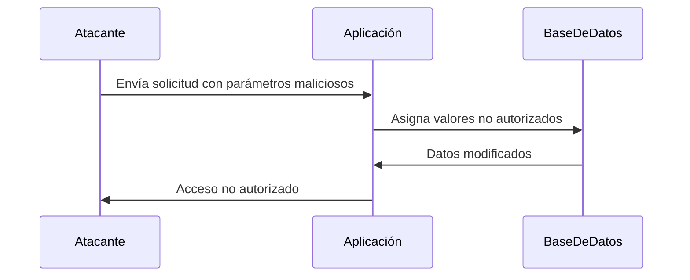

Embellecé y organizá mis apuntes de hacking en Obsidian usando Markdown (encabezados, listas, callouts, tablas, mermaid, bloques de código).  
Simplificá lo confuso, agregá ejemplos de comandos/técnicas. 
lo que este encerrado entre {indicaciones para LLM} son indicaciones para ti sobre lo que tienes que hacer en ese punto.
Respetá  OBLIGATORIAMENTE enlaces e imágenes.  
Objetivo: notas claras, técnicas y atractivas.  

Aqui va el texto:

---

### **¿Qué es un Ataque de Asignación Masiva?**

Es un tipo de ataque en el que un atacante **manipula los parámetros de una solicitud** (por ejemplo, en un formulario web o una API) para asignar valores no autorizados a atributos de un objeto en el servidor. Esto puede permitir al atacante **modificar datos sensibles** o **elevar privilegios**.

---

### **¿Cómo Funciona?**

1. **Asignación Automática**:  
   Muchos frameworks web (como Ruby on Rails, Django, Laravel, etc.) permiten la **asignación automática** de parámetros de solicitud a atributos de un objeto. Esto facilita el desarrollo, pero puede ser peligroso si no se controla adecuadamente.

2. **Manipulación de Parámetros**:  
   El atacante envía una solicitud con parámetros adicionales que no deberían ser modificables por el usuario. Por ejemplo, un parámetro `is_admin=true`.

3. **Impacto**:  
   Si el servidor no valida correctamente los parámetros, el atacante puede modificar atributos sensibles, como roles de usuario, contraseñas, o configuraciones.

---

### **Ejemplo Práctico**

- **Escenario**: Una aplicación web permite a los usuarios registrarse mediante un formulario.
- **Código Vulnerable**:
  ```ruby
  class User < ActiveRecord::Base
    attr_accessible :username, :email, :password
  end
  ```
  - Aquí, `attr_accessible` define qué atributos pueden ser asignados automáticamente.

- **Ataque**:  
  El atacante envía una solicitud con un parámetro adicional `is_admin=true`:
  ```json
  {
    "username": "hacker",
    "email": "hacker@example.com",
    "password": "password123",
    "is_admin": true
  }
  ```
  - Si el servidor no valida los parámetros, el atacante se convierte en administrador.

---

### **¿Por qué es Peligroso?**

- **Elevación de Privilegios**: El atacante puede asignarse roles administrativos.
- **Manipulación de Datos**: Puede modificar datos sensibles, como contraseñas o configuraciones.
- **Exposición de Información**: Puede acceder a información no autorizada.

---

### **¿Cómo Prevenir Ataques de Asignación Masiva?**

1. **Listas Blancas**:  
   Define explícitamente qué atributos pueden ser asignados automáticamente. Por ejemplo, en Ruby on Rails:
   ```ruby
   class User < ActiveRecord::Base
     attr_accessible :username, :email, :password
   end
   ```

2. **Listas Negras**:  
   Define explícitamente qué atributos **no** pueden ser asignados automáticamente. Sin embargo, este enfoque es menos seguro que las listas blancas.

3. **Validación de Parámetros**:  
   Valida y sanitiza todos los parámetros de entrada antes de asignarlos a un objeto.

4. **Uso de DTOs (Data Transfer Objects)**:  
   Usa objetos específicos para transferir datos entre capas, limitando la exposición de atributos sensibles.

5. **Configuración de Frameworks**:  
   Asegúrate de que los frameworks estén configurados para evitar la asignación automática de parámetros no autorizados.

---

### **Resumen**

- **Ataque de Asignación Masiva**: Manipulación de parámetros para asignar valores no autorizados a atributos de un objeto.
- **Impacto**: Elevación de privilegios, manipulación de datos, exposición de información.
- **Prevención**: Listas blancas, validación de parámetros, uso de DTOs, configuración segura de frameworks.

---

### **Diagrama de Ataque de Asignación Masiva**



---

### **Consejo Final**

Nunca confíes en las entradas del usuario. Siempre valida y sanitiza los parámetros antes de asignarlos a un objeto, y usa listas blancas para limitar los atributos que pueden ser modificado

[[OWASP]]