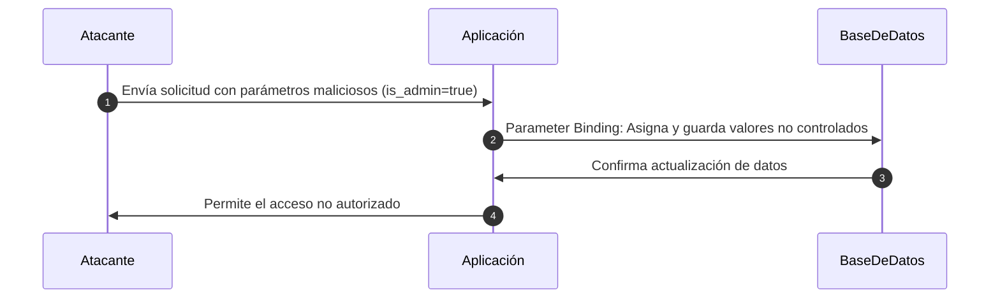

## 🛑 Ataque de Asignación Masiva (Mass Assignment)

> [!danger] ¿Qué es un Ataque de Asignación Masiva?
> Es un tipo de vulnerabilidad donde un atacante **manipula los parámetros de una solicitud** (por ejemplo, enviando campos adicionales en un JSON o formulario) para asignar valores no autorizados a atributos protegidos de un objeto en el servidor. Esto puede llevar a **modificar datos sensibles** o **elevar privilegios** de forma ilegítima.

### ⚙️ ¿Cómo Funciona?

1. **La Asignación Automática (Parameter Binding):**  
   Muchos frameworks modernos (Ruby on Rails, Django, Laravel, Spring) tienen la capacidad de mapear automáticamente los parámetros de una petición HTTP directamente a atributos de un objeto o modelo en la base de datos.
2. **Inyección de Parámetros:**  
   El atacante aprovecha esto e inyecta parámetros extras que la aplicación no esperaba recibir ni modificar. Ej: `is_admin=true`.
3. **El Impacto:**  
   Si el backend no tiene una lista estricta de variables permitidas, actualizará silenciosamente esos atributos críticos, desencadenando riesgos de seguridad.

---

### 💻 Ejemplo Práctico

Imagina una aplicación web de registro y su correspondiente código backend en Ruby on Rails.

**Código Vulnerable:**
```ruby
class User < ActiveRecord::Base
  # attr_accessible permite asignación masiva. Si falta o está mal configurado, es vulnerable
  attr_accessible :username, :email, :password
end
```

**El Ataque:**  
Un usuario ordinario intercepta la petición lógica de registro y añade un campo extra `is_admin`:
```json
{
  "username": "hacker",
  "email": "hacker@example.com",
  "password": "password123",
  "is_admin": true
}
```
> [!error] Resultado
> Como el servidor no valida y descarta los campos adicionales, procesará toda la data y el atacante **nacerá como administrador** en la base de datos.

---

### 🛡️ Medidas de Prevención y Mitigación

Para proteger la aplicación contra estas inyecciones, se recomiendan las siguientes estrategias defensivas:

- ✅ **Uso de Listas Blancas (Allow-listing):** Definir explícitamente y en el código QUÉ atributos pueden ser asignados automáticamente por el cliente. Todo lo que no esté en la lista, se descarta.
- ✅ **Implementar DTOs (Data Transfer Objects):** Usar objetos intermedios para mapear las peticiones antes de pasarlas a la capa de base de datos.
- ✅ **Parametrización Estricta:** Validar y sanitizar absolutamente todos los inputs.
- ❌ **Evitar Listas Negras (Block-listing):** Predecir todos los campos que "no deberían" modificarse es insostenible en el tiempo, es mejor usar listas blancas.

---

### 📊 Diagrama de Flujo del Ataque


```mermaid
sequenceDiagram
    autonumber
    participant Atacante
    participant Aplicación
    participant BaseDeDatos

    Atacante->>Aplicación: Envía solicitud con parámetros maliciosos (is_admin=true)
    Aplicación->>BaseDeDatos: Parameter Binding: Asigna y guarda valores no controlados
    BaseDeDatos->>Aplicación: Confirma actualización de datos
    Aplicación->>Atacante: Permite el acceso no autorizado
```

> [!tip] Consejo de Oro
>  **Nunca confíes en las entradas del usuario.** Siempre valida y sanitiza los parámetros antes de asignarlos, restringiendo firmemente qué propiedades pueden alterarse mediante asignación automática.

[[OWASP]]