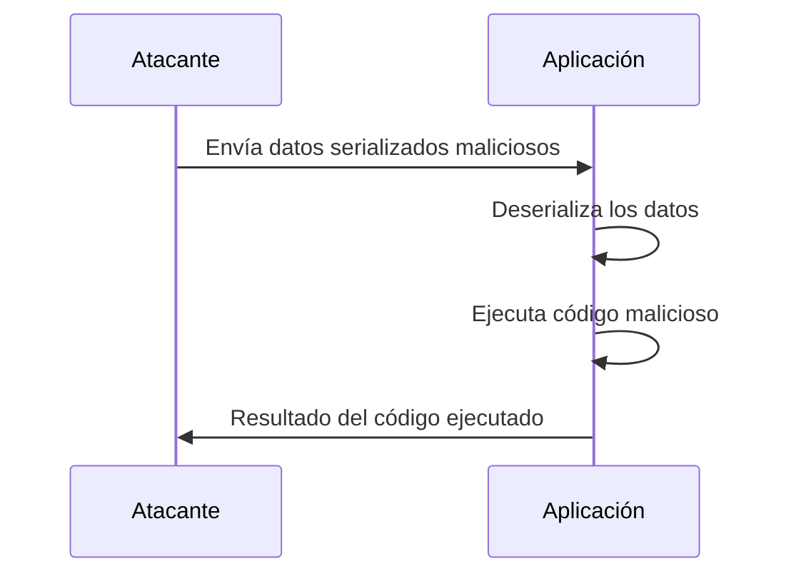

### **¿Qué es la Deserialización?**

La **serialización** es el proceso de convertir un objeto (en memoria) en un formato que puede ser almacenado o transmitido, como JSON, XML o binario. La **deserialización** es el proceso inverso: convertir esos datos de vuelta a un objeto.

---

### **¿Qué es un Ataque de Deserialización?**

Es un tipo de ataque en el que un atacante **manipula datos serializados** para que, al ser deserializados, ejecuten código malicioso o alteren el comportamiento de la aplicación.
 
---

### **¿Cómo funciona?**

1. **Serialización**:  
   La aplicación convierte un objeto en un formato serializado (por ejemplo, JSON).  
   - Ejemplo:  
     ```json
     {"username": "admin", "isAdmin": false}
     ```

2. **Manipulación**:  
   El atacante modifica los datos serializados para incluir código malicioso.  
   - Ejemplo:  
     ```json
     {"username": "admin", "isAdmin": true}
     ```

3. **Deserialización**:  
   La aplicación convierte los datos serializados de vuelta a un objeto. Si no valida los datos, el objeto manipulado puede alterar el comportamiento de la aplicación.  
   - Ejemplo:  
     ```python
     user = deserialize(data)  # Ahora user.isAdmin es True
     ```

---

### **Ejemplo Práctico**

- **Escenario**: Una aplicación web usa cookies serializadas para almacenar información del usuario.
- **Código vulnerable**:
  ```python
  import pickle

  # Serialización
  user_data = {"username": "admin", "isAdmin": False}
  serialized_data = pickle.dumps(user_data)

  # Deserialización
  user = pickle.loads(serialized_data)  # ¡Aquí está el peligro!
  ```
- **Ataque**:  
  El atacante modifica la cookie serializada para incluir código malicioso:
  ```python
  import os
  malicious_data = pickle.dumps({"username": "admin", "isAdmin": True, "__reduce__": lambda: os.system("rm -rf /")})
  ```
  - Al deserializar, se ejecuta `os.system("rm -rf /")`, borrando archivos en el servidor.

---

### **¿Por qué es peligroso?**

- **Ejecución de código arbitrario**: El atacante puede ejecutar comandos en el servidor.
- **Elevación de privilegios**: Puede modificar atributos como `isAdmin` para obtener acceso no autorizado.
- **Manipulación de datos**: Puede alterar datos críticos en la aplicación.

---

### **¿Cómo prevenir Ataques de Deserialización?**

4. **Evitar la deserialización de datos no confiables**:  
   Nunca deserialices datos que provengan de fuentes no confiables (como cookies o entradas de usuario).

5. **Usar formatos seguros**:  
   Prefiere formatos como JSON o XML en lugar de binarios, y valida los datos antes de deserializar.

6. **Firmar y cifrar datos**:  
   Usa firmas digitales y cifrado para asegurar que los datos serializados no hayan sido modificados.

7. **Implementar listas blancas**:  
   Solo permite la deserialización de clases y atributos específicos.

8. **Usar bibliotecas seguras**:  
   Emplea bibliotecas que incluyan protecciones contra deserialización insegura.

---

### **Resumen**

- **Deserialización**: Convertir datos serializados de vuelta a objetos.
- **Ataque**: Manipular datos serializados para ejecutar código malicioso o alterar la aplicación.
- **Prevención**: Evita deserializar datos no confiables, usa formatos seguros y valida los datos.

---

### **Diagrama de Ataque de Deserialización**



---

### **Consejo Final**

Nunca deserialices datos que provengan de fuentes no confiables. Siempre valida y sanitiza los datos antes de usarlos.

[[OWASP]]