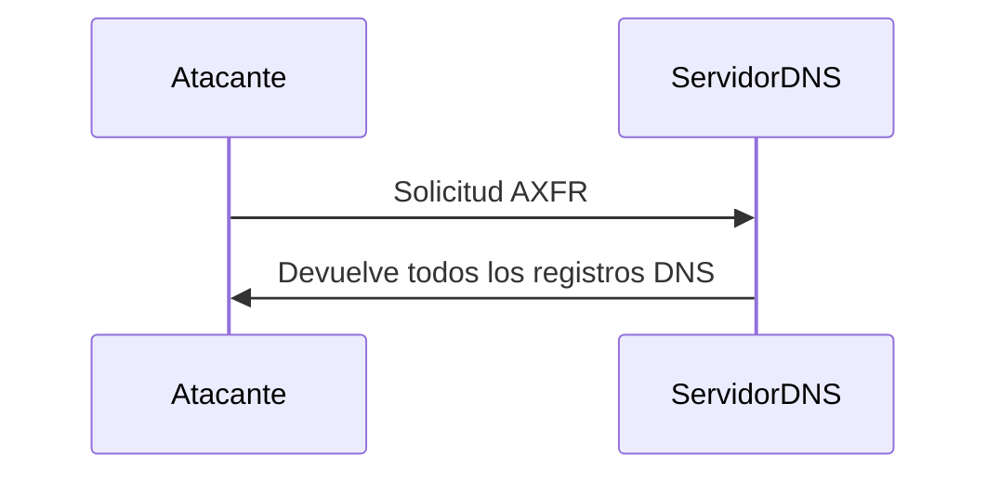

### **¿Qué es una Transferencia de Zona (AXFR)?**

Una **transferencia de zona (AXFR)** es un mecanismo utilizado en el **DNS (Domain Name System)** para replicar la información de una zona DNS desde un servidor primario a uno secundario. Esto permite que los servidores secundarios tengan una copia actualizada de los registros DNS.

---

### **¿Qué es un Ataque de Transferencia de Zona?**

Es un tipo de ataque en el que un atacante **solicita una transferencia de zona completa (AXFR)** a un servidor DNS mal configurado. Si el servidor permite transferencias de zona no autorizadas, el atacante puede obtener **todos los registros DNS** de la zona, lo que puede incluir información sensible como direcciones IP internas, nombres de servidores, etc.

---

### **¿Cómo Funciona?**

1. **Solicitud AXFR**:  
   El atacante usa una herramienta como `dig` para solicitar una transferencia de zona completa.
   ```bash
   dig @ns.vulhub.org vulhub.org AXFR
   ```

2. **Respuesta del Servidor**:  
   Si el servidor DNS está mal configurado y permite transferencias de zona no autorizadas, devolverá todos los registros DNS de la zona.

3. **Información Obtenida**:  
   El atacante recibe una lista completa de todos los registros DNS, lo que puede incluir:
   - Direcciones IP internas.
   - Nombres de servidores.
   - Información de configuración de red.

---

### **Ejemplo Práctico con `dig`**

Usando el archivo `vulhub.db` que proporcionaste, aquí está cómo se vería una transferencia de zona:

#### **Archivo `vulhub.db`**
```plaintext
@   IN  SOA     ns.vulhub.org.  sa.vulhub.org. ( 
    1            ; serial number 
    3600         ; refresh   [1h] 
    600          ; retry     [10m] 
    86400        ; expire    [1d] 
    3600 )       ; min TTL   [1h]

   IN  NS   ns1
   IN  NS   ns2

ns1 IN  A   10.0.0.1
ns2 IN  A   10.0.0.2
www IN  A   10.1.1.1
sa  IN  A   10.1.1.2
cdn IN  A   10.1.1.3
admin IN  A   10.1.1.4
wap IN CNAME   www
static IN CNAME www
git IN A   10.1.1.4
```

#### **Solicitud AXFR con `dig`**
```bash
dig @ns.vulhub.org vulhub.org AXFR
```

#### **Respuesta del Servidor**
```plaintext
; <<>> DiG 9.16.1-Ubuntu <<>> @ns.vulhub.org vulhub.org AXFR
; (1 server found)
;; global options: +cmd
vulhub.org.        3600    IN  SOA ns.vulhub.org. sa.vulhub.org. 1 3600 600 86400 3600
vulhub.org.        3600    IN  NS  ns1.vulhub.org.
vulhub.org.        3600    IN  NS  ns2.vulhub.org.
ns1.vulhub.org.    3600    IN  A   10.0.0.1
ns2.vulhub.org.    3600    IN  A   10.0.0.2
www.vulhub.org.    3600    IN  A   10.1.1.1
sa.vulhub.org.     3600    IN  A   10.1.1.2
cdn.vulhub.org.    3600    IN  A   10.1.1.3
admin.vulhub.org.  3600    IN  A   10.1.1.4
wap.vulhub.org.    3600    IN  CNAME   www.vulhub.org.
static.vulhub.org. 3600    IN  CNAME   www.vulhub.org.
git.vulhub.org.    3600    IN  A   10.1.1.4
vulhub.org.        3600    IN  SOA ns.vulhub.org. sa.vulhub.org. 1 3600 600 86400 3600
```

---

### **¿Por qué es Peligroso?**

- **Exposición de Información**: Revela detalles internos de la red, como direcciones IP y nombres de servidores.
- **Reconocimiento**: Facilita el reconocimiento de la infraestructura para futuros ataques.
- **Ataques Dirigidos**: Permite a los atacantes planificar ataques más específicos y efectivos.

---

### **¿Cómo Prevenir Ataques de Transferencia de Zona?**

1. **Restringir Transferencias de Zona**:  
   Configura los servidores DNS para permitir transferencias de zona solo a servidores secundarios autorizados.

2. **Usar Listas de Control de Acceso (ACLs)**:  
   Define ACLs para limitar las direcciones IP que pueden solicitar transferencias de zona.

3. **Monitorear y Auditar**:  
   Monitorea las solicitudes de transferencia de zona y registra actividades sospechosas.

4. **Configuración Segura**:  
   Asegúrate de que los servidores DNS estén configurados correctamente y actualizados.

---

### **Resumen**

- **Transferencia de Zona (AXFR)**: Mecanismo para replicar registros DNS entre servidores.
- **Ataque de Transferencia de Zona**: Explotación de servidores DNS mal configurados para obtener todos los registros de una zona.
- **Prevención**: Restringir transferencias de zona, usar ACLs, monitorear y auditar.

---

### **Diagrama de Ataque de Transferencia de Zona**



---

### **Consejo Final**

Nunca permitas transferencias de zona no autorizadas. Configura tus servidores DNS de manera segura y monitorea regularmente las solicitudes de transferencia de zona.

[[OWASP]]