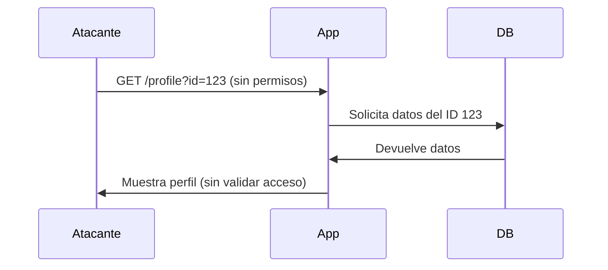

## **¿Qué es un IDOR?**
Un **IDOR** es una vulnerabilidad de seguridad que ocurre cuando una aplicación expone referencias directas a objetos internos (como archivos, registros de base de datos o recursos) sin verificar los permisos del usuario. Esto permite a un atacante **acceder a datos no autorizados** simplemente modificando parámetros (IDs, nombres de archivo, etc.).

---

## **Cómo Identificar la Vulnerabilidad**
1. **Parámetros predecibles** en URLs o APIs:  
   Ej: `https://app.com/user?id=123` → Cambiar `123` por `124` para acceder a otro usuario.

2. **Patrones numéricos/secuenciales**:  
   IDs de documentos, números de factura, nombres de archivo (`report_2023.pdf` → `report_2024.pdf`).

3. **APIs que filtran datos sensibles** al alterar parámetros:  
   Ej: Cambiar `GET /api/invoices/1001` a `1002`.

4. **Mensajes de error reveladores**:  
   Si al modificar un ID la aplicación muestra datos o errores como "No tienes permiso", es una señal.

5. **Ausencia de controles de acceso**:  
   La aplicación no verifica si el usuario actual debe tener acceso al objeto solicitado.

---

## **Ejemplo Práctico**

de SKF-LABS hay un laboratorio en node IDOR que tiene 1500 posibilidades, por lo que use la herramienta [[wfuzz]] para hacer fuzzing de de todas las posibilidades, ir cambiando el pdf id ya que eso es lo que se va a explotar en esta vulnerabilidad

```sh
wfuzz -c -X POST -t 200 -z range,1-1500 -d 'pdf_id=FUZZ' http://localhost:5000/download  
```
### **Escenario vulnerable**
- URL normal:  
  `https://app.com/profile?user_id=456` (perfil legítimo del usuario).
- Ataque IDOR:  
  Cambiar a `user_id=457` para acceder a otro perfil sin autorización.

### **Caso real en APIs**
```http
GET /api/v1/orders/2034 HTTP/1.1
Host: vulnerable-shop.com
```
- Modificar `2034` por `2035` para ver pedidos de otros clientes.

---

## **Tipos de IDOR**
1. **Basado en IDs numéricos**:  
   `user_id=100` → `user_id=101`.

2. **Basado en nombres/ubicaciones**:  
   `/download?file=passwords.txt`.

3. **IDOR en APIs REST**:  
   Manipulación de endpoints como `PUT /api/users/{id}`.

4. **IDOR horizontal/vertical**:  
   - *Horizontal*: Acceso a datos de otro usuario del mismo rol (ej: otro cliente).  
   - *Vertical*: Escalar privilegios (ej: cliente → admin).

---

## **Explotación Avanzada**
### **Técnicas comunes**
- **Burp Suite/OWASP ZAP**: Para interceptar y modificar peticiones.
- **Enumeración**: Probar rangos de IDs (`/invoice?id=100` a `200`).
- **Ofuscación**: Si los IDs están encriptados, buscar patrones o reutilizar tokens.

### **Ejemplo con cookies**:
```http
Cookie: session=abc123; user_id=encrypted_XYZ
```
- Si `encrypted_XYZ` es predecible, se puede generar otro ID válido.

---

## **¿Por qué es Peligroso?**
- **Exposición de datos sensibles**: Información personal, documentos, historiales.
- **Modificación no autorizada**: Editar/eliminar recursos de otros usuarios.
- **Escalación de privilegios**: Acceder a funcionalidades de administrador.

---

## **Prevención**
1. **Controles de acceso**:  
   Verificar permisos en *cada* solicitud (ej: ¿Pertenece `user_id=457` al usuario actual?).

2. **Tokens aleatorios**:  
   Usar UUIDs en lugar de IDs secuenciales:  
   `/profile?token=6ba7b810-9dad-11d1-80b4-00c04fd430c8`.

3. **Listas de control de acceso (ACL)**:  
   Definir qué recursos puede acceder cada rol.

4. **Obfuscación no es seguridad**:  
   No confiar en IDs encriptados si no hay validación.

5. **Monitoreo**:  
   Alertar por accesos anómalos (ej: un usuario accediendo a muchos IDs distintos).

---

## **Herramientas para Detectar IDOR**
- **Burp Suite**: Modificar peticiones en tiempo real.
- **OWASP ZAP**: Escanear parámetros en URLs/APIs.
- **Scripts personalizados**: Automatizar pruebas con Python (ej: enviar peticiones con IDs alterados).

```python
import requests
for id in range(100, 200):
    response = requests.get(f'https://app.com/api/user/{id}')
    if response.status_code == 200:
        print(f"IDOR encontrado en ID {id}")
```

---

## **Resumen**
- **Qué es**: Acceso no autorizado por manipulación de referencias directas.
- **Cómo identificarlo**: Parámetros modificables, errores reveladores, falta de validación.
- **Impacto**: Filtración de datos, escalación de privilegios.
- **Prevención**: Validar permisos, usar tokens aleatorios, monitorear accesos.

---

### **Diagrama de Ataque IDOR**


---

### **Consejo Final**
Implementa **autorización a nivel de objeto** en cada endpoint y registra intentos de acceso sospechosos. ¡No asumas que los usuarios seguirán las reglas! 🔒

--- 

[[OWASP]]