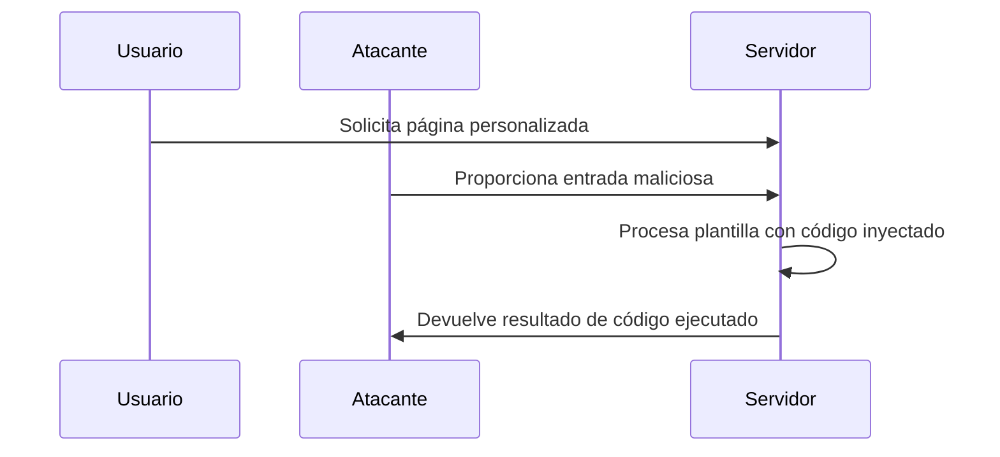

### **¿Qué es SSTI?**

SSTI (Inyección de Plantillas del Lado del Servidor) es un tipo de ataque en el que un atacante inyecta código malicioso en una plantilla del servidor, lo que puede permitir la ejecución de código arbitrario en el servidor.

---

### **¿Cómo funciona?**

1. **El servidor usa plantillas**: La aplicación web utiliza plantillas para generar HTML dinámicamente (por ejemplo, usando Jinja2, Twig, etc.).
2. **El atacante inyecta código**: El atacante proporciona una entrada maliciosa que se interpreta como parte de la plantilla.
3. **El servidor ejecuta el código**: El servidor procesa la plantilla y ejecuta el código inyectado, lo que puede llevar a la ejecución de comandos en el servidor.

---

### **Ejemplo Práctico**

- **Escenario**: Una aplicación web permite a los usuarios personalizar un mensaje de bienvenida usando una plantilla.
- **Ataque**: El atacante ingresa un código malicioso en lugar de un mensaje legítimo:
  ```python
  {{ 7 * 7 }}
  ```
- **Resultado**: El servidor procesa la plantilla y devuelve `49`, mostrando que el código fue ejecutado.

Si el atacante inyecta un código más peligroso, como:
  ```python
  {{ config.items() }}
  ```
- **Resultado**: El servidor podría devolver información sensible de la configuración.

---

### **¿Por qué es peligroso?**

- **Ejecución de código arbitrario**: El atacante puede ejecutar comandos en el servidor, lo que puede llevar a la toma completa del sistema.
- **Exfiltración de datos**: El atacante puede acceder y robar datos sensibles almacenados en el servidor.
- **Manipulación del servidor**: El atacante puede modificar archivos, crear nuevos usuarios, etc.

---

### **¿Cómo prevenir SSTI?**

4. **Validación de Entradas**:
   - Asegúrate de que las entradas de los usuarios sean válidas y estén sanitizadas antes de ser procesadas por las plantillas.

5. **Uso de Sandboxing**:
   - Ejecuta las plantillas en un entorno aislado (sandbox) que limite las acciones que pueden realizar.

6. **Evitar la Evaluación de Código Dinámico**:
   - No permitas que las plantillas evalúen código dinámico proporcionado por los usuarios.

7. **Actualizaciones y Parches**:
   - Mantén tus sistemas y bibliotecas de plantillas actualizadas para evitar vulnerabilidades conocidas.

---

### **Resumen**

- **SSTI**: Ataque donde el atacante inyecta código malicioso en una plantilla del servidor, lo que puede llevar a la ejecución de código arbitrario.
- **Prevención**: Valida entradas, usa sandboxing, evita la evaluación de código dinámico y mantén tus sistemas actualizados.

---

### **Diagrama de SSTI**



---

### **Consejo Final**

Implementa medidas de seguridad como la validación de entradas y el uso de sandboxing para proteger tus aplicaciones contra ataques SSTI.

---

[[OWASP]]