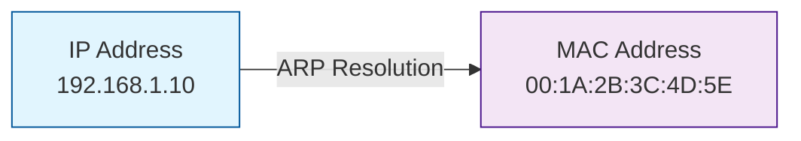
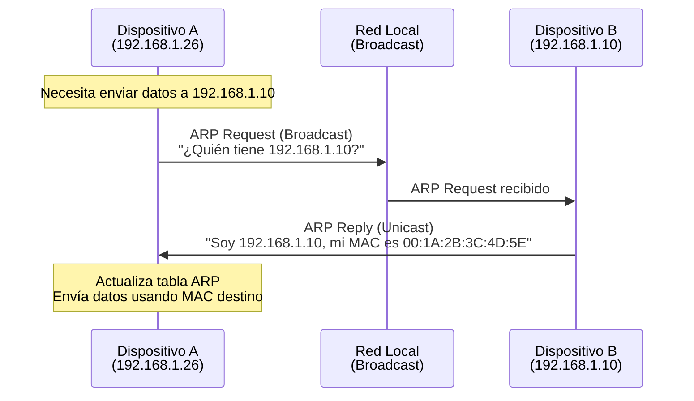
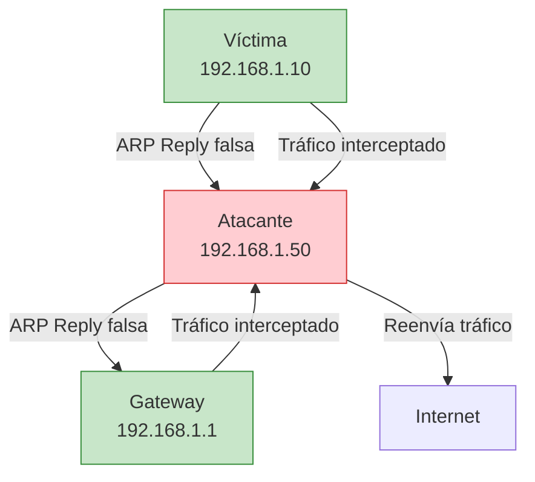

# 🔗 ARP (Address Resolution Protocol)

> [!info] Protocolo fundamental de red
> **ARP (Address Resolution Protocol)** es un protocolo de comunicación utilizado para mapear direcciones IP (capa 3) a direcciones MAC físicas (capa 2) en redes locales. Es esencial para la comunicación entre dispositivos en la misma red.

---

## 📋 Tabla de Contenidos
- [¿Qué es ARP?](#qué-es-arp)
- [Funcionamiento del Protocolo](#funcionamiento-del-protocolo)
- [Tipos de Mensajes ARP](#tipos-de-mensajes-arp)
- [Tabla ARP](#tabla-arp)
- [Vulnerabilidades y Ataques](#vulnerabilidades-y-ataques)
- [Comandos y Herramientas](#comandos-y-herramientas)
- [Medidas de Protección](#medidas-de-protección)

---

## 🧩 ¿Qué es ARP?

ARP opera en la **capa 2 (enlace de datos)** del modelo OSI y es responsable de resolver la diferencia entre direccionamiento lógico y físico en redes Ethernet.

### Conceptos clave:

- **Dirección IP**: Identificador lógico de red (ejemplo: `192.168.1.10`)
- **Dirección MAC**: Identificador físico único del hardware de red (ejemplo: `00:1A:2B:3C:4D:5E`)
- **Resolución**: Proceso de encontrar la MAC correspondiente a una IP específica



---

## ⚙️ Funcionamiento del Protocolo

### Proceso de resolución ARP



### Pasos detallados:

1. **Verificación de tabla ARP local**
   - El dispositivo busca la IP destino en su caché ARP
   - Si no la encuentra, inicia el proceso ARP

2. **ARP Request (Solicitud)**
   - Se envía un mensaje **broadcast** a toda la red
   - Contiene: IP origen, MAC origen, IP destino, MAC destino vacía

3. **ARP Reply (Respuesta)**
   - Solo responde el dispositivo con la IP solicitada
   - Envía su dirección MAC en un mensaje **unicast**

4. **Actualización de tabla ARP**
   - Ambos dispositivos actualizan sus tablas ARP
   - La entrada se almacena temporalmente (TTL típico: 2-20 minutos)

> [!example] Ejemplo práctico
> **Escenario**: PC-A (192.168.1.26) quiere comunicarse con PC-B (192.168.1.10)
> 
> ```
> ARP Request:
> - Origen: 192.168.1.26 (AA:BB:CC:DD:EE:FF)
> - Destino: 192.168.1.10 (00:00:00:00:00:00)
> - Mensaje: "¿Quién tiene 192.168.1.10?"
> 
> ARP Reply:
> - Origen: 192.168.1.10 (11:22:33:44:55:66)
> - Destino: 192.168.1.26 (AA:BB:CC:DD:EE:FF)
> - Mensaje: "192.168.1.10 está en 11:22:33:44:55:66"
> ```

---

## 📝 Tipos de Mensajes ARP

| Tipo | Código | Descripción | Uso |
|------|--------|-------------|-----|
| **ARP Request** | 1 | Solicitud de resolución | Buscar MAC de una IP |
| **ARP Reply** | 2 | Respuesta con información | Proporcionar MAC solicitada |
| **RARP Request** | 3 | Solicitud ARP inversa | Buscar IP de una MAC |
| **RARP Reply** | 4 | Respuesta ARP inversa | Proporcionar IP solicitada |

### Estructura del paquete ARP:

```
+----------+----------+----------+----------+
| Hardware Type (2)   | Protocol Type (2)   |
+----------+----------+----------+----------+
| HW Len(1)| Prot Len | Operation Code (2)  |
+----------+----------+----------+----------+
|        Sender Hardware Address           |
+----------+----------+----------+----------+
|        Sender Protocol Address           |
+----------+----------+----------+----------+
|        Target Hardware Address           |
+----------+----------+----------+----------+
|        Target Protocol Address           |
+----------+----------+----------+----------+
```

---

## 🗂️ Tabla ARP

La **tabla ARP** es una caché local que almacena las asociaciones IP-MAC conocidas para optimizar la comunicación.

### Visualizar tabla ARP:

```bash
# Comando moderno (iproute2)
ip neigh show

# Comando tradicional
arp -a

# Ver tabla ARP con detalles
ip neigh show dev eth0
```

### Estados de entradas ARP:

| Estado | Descripción |
|--------|-------------|
| **REACHABLE** | Entrada válida y activa |
| **STALE** | Entrada antigua, requiere verificación |
| **DELAY** | Verificando disponibilidad |
| **PROBE** | Enviando solicitudes ARP |
| **INCOMPLETE** | Resolución en progreso |
| **FAILED** | Resolución fallida |

> [!tip] Gestión de tabla ARP
> ```bash
> # Limpiar tabla ARP completa
> sudo ip neigh flush all
> 
> # Eliminar entrada específica
> sudo ip neigh del 192.168.1.10 dev eth0
> 
> # Agregar entrada estática
> sudo ip neigh add 192.168.1.10 lladdr 00:11:22:33:44:55 dev eth0
> ```

---

## ⚠️ Vulnerabilidades y Ataques

### 1. ARP Spoofing (Envenenamiento ARP)

El ataque más común que explota la falta de autenticación en ARP.



**Proceso del ataque:**

1. **Reconocimiento**: El atacante identifica víctimas y gateway
2. **Envenenamiento**: Envía ARP replies falsos:
   - A la víctima: "El gateway está en MI MAC"
   - Al gateway: "La víctima está en MI MAC"
3. **Intercepción**: Todo el tráfico pasa por el atacante
4. **Man-in-the-Middle**: Puede leer, modificar o interceptar datos

### 2. ARP Flooding

```bash
# Herramienta de ejemplo: Ettercap
ettercap -T -M arp:remote /192.168.1.10// /192.168.1.1//

# Herramienta de ejemplo: Bettercap
bettercap -iface eth0 -eval "set arp.spoof.targets 192.168.1.10; arp.spoof on"
```

### 3. Técnicas de detección para atacantes

```bash
# Escanear red con arp-scan
arp-scan 192.168.1.0/24

# Monitorear cambios en ARP
arpwatch -i eth0

# Detectar ARP spoofing
arp-scan -l | sort | uniq -d
```

---

## 🛠️ Comandos y Herramientas

### Comandos básicos de diagnóstico:

```bash
# Ver tabla ARP actual
ip neigh

# Hacer ping para generar entrada ARP
ping -c 1 192.168.1.1

# Ver estadísticas ARP
cat /proc/net/arp

# Capturar tráfico ARP
tcpdump -i eth0 arp

# Análisis detallado con Wireshark
wireshark -f "arp" -i eth0
```

### Herramientas de seguridad:

| Herramienta | Propósito | Ejemplo de uso |
|-------------|-----------|----------------|
| **arp-scan** | Descubrimiento de hosts | `arp-scan 192.168.1.0/24` |
| **ettercap** | ARP spoofing/MitM | `ettercap -T -M arp` |
| **bettercap** | Suite de ataques de red | `bettercap -iface eth0` |
| **arpwatch** | Monitoreo de ARP | `arpwatch -i eth0` |
| **arping** | Envío de ARP requests | `arping 192.168.1.1` |

---

## 🛡️ Medidas de Protección

### 1. Entradas ARP estáticas

```bash
# Configurar entradas estáticas para dispositivos críticos
sudo ip neigh add 192.168.1.1 lladdr 00:11:22:33:44:55 dev eth0 nud permanent

# Script para automatizar entradas estáticas
#!/bin/bash
declare -A static_arp=(
    ["192.168.1.1"]="00:11:22:33:44:55"
    ["192.168.1.10"]="aa:bb:cc:dd:ee:ff"
)

for ip in "${!static_arp[@]}"; do
    sudo ip neigh add "$ip" lladdr "${static_arp[$ip]}" dev eth0 nud permanent
done
```

### 2. Monitoreo y alertas

```bash
# Configurar arpwatch para alertas
sudo arpwatch -i eth0 -m root@company.com

# Script de monitoreo personalizado
#!/bin/bash
while true; do
    current_arp=$(ip neigh show | grep "192.168.1.1")
    if [[ "$current_arp" != "$expected_arp" ]]; then
        echo "¡ALERTA! Posible ARP spoofing detectado"
        echo "Esperado: $expected_arp"
        echo "Actual: $current_arp"
    fi
    sleep 30
done
```

### 3. Configuraciones de seguridad

```bash
# Configurar límites ARP en el kernel
echo 1 > /proc/sys/net/ipv4/conf/all/arp_announce
echo 2 > /proc/sys/net/ipv4/conf/all/arp_ignore

# Configuración permanente en /etc/sysctl.conf
net.ipv4.conf.all.arp_announce = 1
net.ipv4.conf.all.arp_ignore = 2
```

> [!warning] Limitaciones importantes
> - **Solo redes locales**: ARP funciona únicamente en el mismo dominio de broadcast
> - **Sin autenticación**: No hay verificación de identidad en el protocolo
> - **Vulnerable por diseño**: La confianza implícita permite ataques
> - **Dependiente de Ethernet**: Específico para redes Ethernet/WiFi

---

## 📊 Comparación con otros protocolos

| Protocolo | Capa OSI | Función | Alcance |
|-----------|----------|---------|---------|
| **ARP** | 2 (Enlace) | IP → MAC | Red local |
| **DHCP** | 7 (Aplicación) | Asignación IP | Red local |
| **DNS** | 7 (Aplicación) | Nombre → IP | Global |
| **ICMP** | 3 (Red) | Diagnóstico | Multi-red |

---

## 🔗 Referencias

- [[glosario]] - Términos y definiciones técnicas
- [[protocolos]] - Otros protocolos de red relacionados

> [!success] Puntos clave para recordar
> - ARP es **fundamental** para la comunicación en redes locales
> - **No tiene autenticación**, lo que lo hace vulnerable a ataques
> - Las **entradas estáticas** y el **monitoreo** son medidas de protección esenciales
> - Es un protocolo de **capa 2** que mapea direcciones IP a MAC
> - Los ataques ARP son la base de muchos ataques **Man-in-the-Middle**