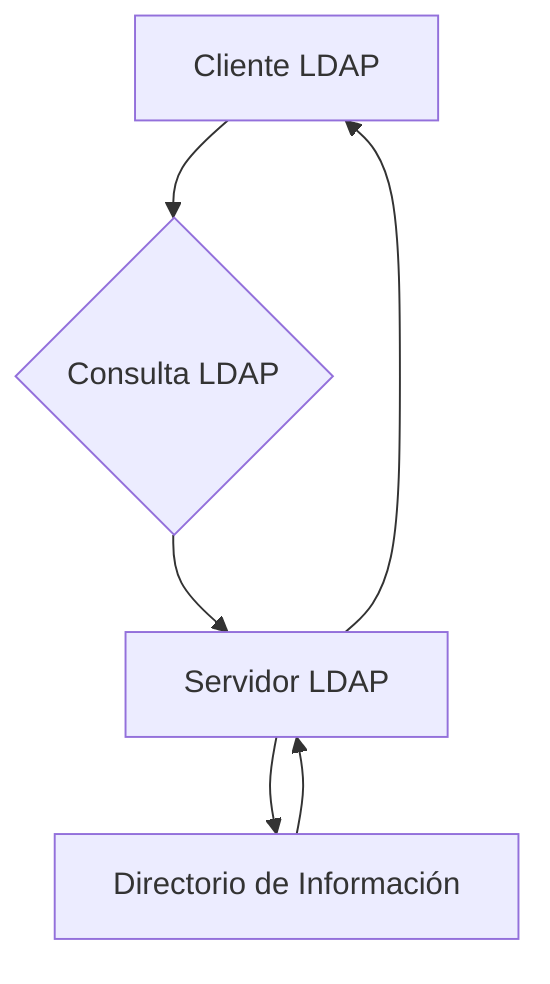

### **¿Qué es LDAP?**

LDAP es un protocolo estándar y ligero que se utiliza para **acceder y gestionar directorios de información**. Un directorio es una base de datos especializada que almacena información organizada jerárquicamente, como usuarios, grupos, dispositivos y otros recursos en una red.

---

### **¿Para qué se usa LDAP?**

LDAP es comúnmente utilizado en:

1. **Autenticación de usuarios**:  
   Verifica credenciales (usuario y contraseña) en sistemas como Active Directory, OpenLDAP, etc.

2. **Gestión de directorios**:  
   Almacena y organiza información jerárquica, como nombres, correos electrónicos, números de teléfono, etc.

3. **Búsquedas rápidas**:  
   Permite buscar información en el directorio de manera eficiente.

---

### **¿Cómo funciona LDAP?**

4. **Estructura de datos**:  
   La información en LDAP se organiza en una estructura jerárquica llamada **DIT (Directory Information Tree)**. Cada entrada en el árbol se llama **DN (Distinguished Name)**.

   - Ejemplo de DN:  
     ```
     cn=Juan Perez,ou=Usuarios,dc=empresa,dc=com
     ```
     - `cn`: Nombre común (Common Name).
     - `ou`: Unidad organizativa (Organizational Unit).
     - `dc`: Componente de dominio (Domain Component).

5. **Operaciones comunes**:  
   - **Búsqueda (`search`)**: Busca entradas en el directorio.
   - **Autenticación (`bind`)**: Verifica credenciales de usuario.
   - **Modificación (`modify`)**: Actualiza entradas en el directorio.
   - **Adición (`add`)**: Añade nuevas entradas al directorio.
   - **Eliminación (`delete`)**: Elimina entradas del directorio.

---

### **Ejemplo de Búsqueda LDAP**

Supongamos que queremos buscar todos los usuarios en la unidad organizativa `Usuarios`:

```ldap
ldapsearch -x -b "ou=Usuarios,dc=empresa,dc=com" "(objectClass=person)"
```

- `-x`: Autenticación simple.
- `-b`: Base de búsqueda (desde dónde empezar).
- `"(objectClass=person)"`: Filtro para buscar solo entradas de tipo "persona".

---

### **¿Por qué es importante LDAP?**

- **Centralización**: Permite gestionar usuarios y recursos desde un solo lugar.
- **Eficiencia**: Optimiza búsquedas y consultas en grandes directorios.
- **Interoperabilidad**: Es un estándar ampliamente adoptado en redes empresariales.

---

### **Vulnerabilidades Comunes en LDAP**

6. **Inyección LDAP**:  
   Si no se validan las entradas del usuario, un atacante puede manipular consultas LDAP.  
   - Ejemplo: `*)(uid=*))(|(uid=*` puede devolver todas las entradas.

7. **Credenciales débiles**:  
   Las contraseñas débiles o predeterminadas pueden ser explotadas.

8. **Acceso no autorizado**:  
   Si los permisos no están bien configurados, un atacante puede acceder a información sensible.

---

### **¿Cómo proteger LDAP?**

9. **Validar entradas**:  
   Asegúrate de que las entradas del usuario estén sanitizadas antes de usarlas en consultas LDAP.

10. **Usar LDAPS**:  
   Usa LDAP sobre SSL/TLS (`LDAPS`) para cifrar la comunicación.

11. **Configurar permisos**:  
   Limita el acceso a las entradas del directorio según los roles y necesidades.

12. **Auditar y monitorear**:  
   Revisa regularmente los registros de acceso y actividad en el directorio.

---

### **Resumen**

- **LDAP**: Protocolo para acceder y gestionar directorios de información.
- **Usos comunes**: Autenticación, gestión de usuarios y búsquedas rápidas.
- **Estructura**: Información organizada en un árbol jerárquico (DIT).
- **Seguridad**: Valida entradas, usa LDAPS y configura permisos adecuados.

---

### **Diagrama de LDAP**



---

### **Consejo Final**

LDAP es una herramienta poderosa para gestionar directorios, pero debe configurarse y protegerse adecuadamente para evitar vulnerabilidades. ¡Esencial en redes empresariales! 😊

[[glosario]] [[protocolos]]