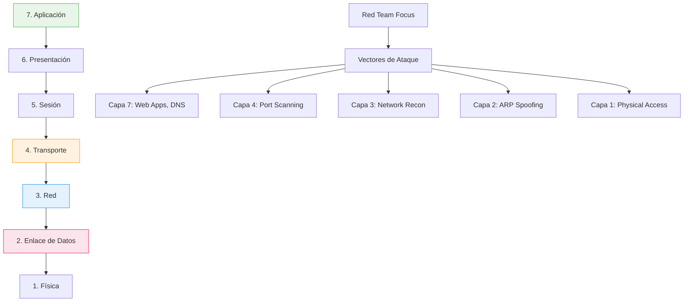
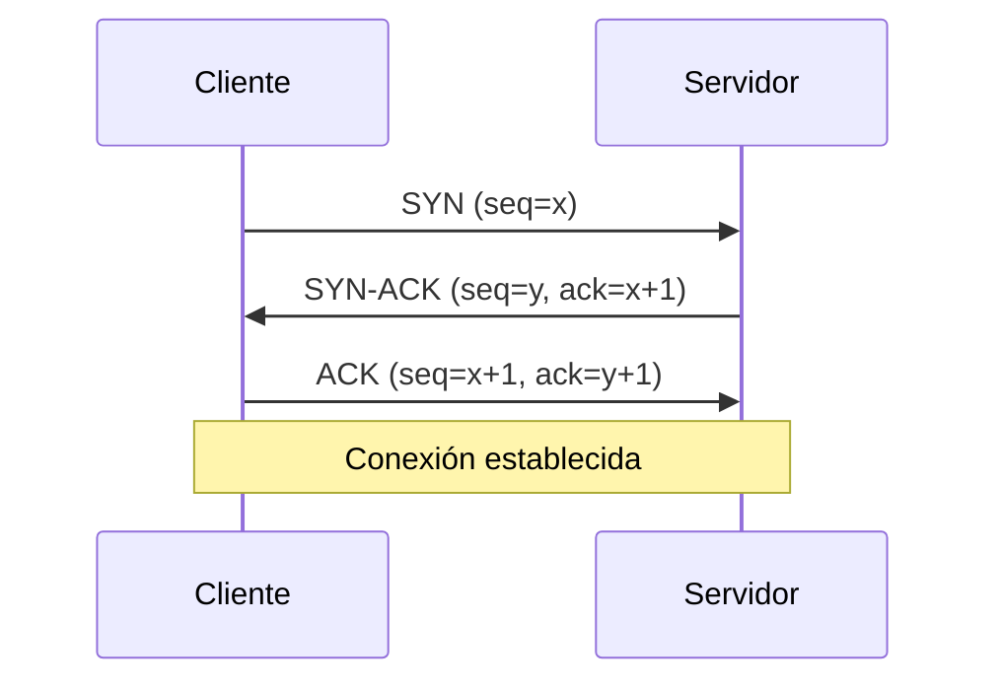
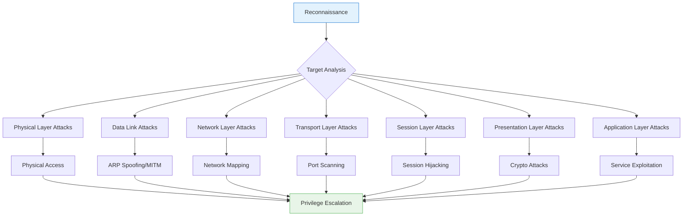
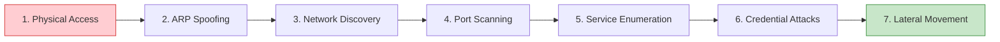

# 📡 Modelo OSI: Guía Completa para Red Team

> [!info] ¿Por qué es crucial para los hackers?
> El **modelo OSI (Open Systems Interconnection)** es un framework conceptual que divide la comunicación de redes en **7 capas interconectadas**. Dominar este modelo te permite identificar vectores de ataque específicos por capa, optimizar herramientas de pentesting y entender dónde y cómo atacar la infraestructura de red.

---

## 📋 Tabla de Contenidos
- [Visión General del Modelo](#visión-general-del-modelo)
- [Las 7 Capas Detalladas](#las-7-capas-detalladas)
- [Flujo de un Ataque por Capas](#flujo-de-un-ataque-por-capas)
- [Herramientas por Capa](#herramientas-por-capa)
- [Casos Prácticos](#casos-prácticos)

---

## 🏗️ Visión General del Modelo



### Importancia estratégica para Red Team:

> [!tip] Ventajas del conocimiento OSI
> - **Identificación precisa de vectores de ataque** por capa
> - **Optimización de herramientas** según el objetivo
> - **Evasión efectiva** entendiendo dónde actúan las defensas
> - **Análisis de tráfico** más eficiente con Wireshark
> - **Escalada de privilegios** aprovechando vulnerabilidades específicas

---

## 🔧 Las 7 Capas Detalladas

### 1️⃣ Capa Física (Physical Layer)

> [!example] Función principal
> Transmisión de **bits puros (1s y 0s)** a través de medios físicos como cables, ondas de radio o pulsos de luz.

#### Características técnicas:
- **Medios**: Cobre (UTP/STP), fibra óptica, aire (RF)
- **Señalización**: Amplitud, frecuencia, modulación
- **Topologías**: Bus, estrella, anillo, malla
- **Sincronización**: Relojes, timing

#### Ejemplos reales:
```bash
# Hardware típico de Capa 1
- Cables Ethernet (RJ45, UTP Cat5e/6)
- Fibra óptica (monomodo/multimodo)
- Antenas Wi-Fi (2.4GHz, 5GHz, 6GHz)
- Repetidores y amplificadores
```

#### Vectores de ataque:

| Ataque | Herramienta | Comando/Técnica |
|--------|-------------|-----------------|
| **Wi-Fi Jamming** | `mdk4` | `mdk4 wlan0 d -t target_mac` |
| **Cable Tapping** | Hardware especializado | Inserción de tap físico |
| **RF Interference** | `wifijammer` | `python wifijammer.py -s SSID` |
| **TEMPEST** | Equipos especializados | Lectura de emisiones EM |

---

### 2️⃣ Capa de Enlace de Datos (Data Link Layer)

> [!example] Función principal
> Gestiona la **comunicación directa entre nodos adyacentes** utilizando direcciones MAC y proporcionando detección de errores.

#### Subcapas:
- **LLC (Logical Link Control)**: Control lógico del enlace
- **MAC (Media Access Control)**: Acceso al medio y direccionamiento

#### Protocolos clave:
- **Ethernet (IEEE 802.3)**
- **Wi-Fi (IEEE 802.11)**
- **ARP (Address Resolution Protocol)**

#### Vectores de ataque:

```bash
# ARP Spoofing
ettercap -T -M arp:remote /192.168.1.1// /192.168.1.10//

# MAC Address Spoofing
macchanger -r wlan0
ifconfig wlan0 hw ether 00:11:22:33:44:55

# Wi-Fi Deauthentication
aireplay-ng --deauth 100 -a TARGET_BSSID -c CLIENT_MAC wlan0

# Frame Sniffing
tcpdump -i eth0 -nn ether host 00:11:22:33:44:55
```

> [!warning] Detección ARP Spoofing
> Los ataques ARP son detectables mediante herramientas como `arpwatch` o analizando inconsistencias en la tabla ARP.

---

### 3️⃣ Capa de Red (Network Layer)

> [!example] Función principal
> **Enrutamiento de paquetes** entre diferentes redes utilizando direcciones IP y determinando el mejor camino.

#### Protocolos esenciales:
- **IPv4/IPv6**: Direccionamiento y enrutamiento
- **ICMP**: Mensajes de control y error
- **OSPF/BGP**: Protocolos de enrutamiento

#### Conceptos clave:
```bash
# Estructura de paquete IP
| Version | IHL | ToS | Total Length |
| Identification | Flags | Fragment Offset |
| TTL | Protocol | Header Checksum |
| Source IP Address |
| Destination IP Address |
| Options | Data |
```

#### Vectores de ataque:

```bash
# Network Reconnaissance
nmap -sn 192.168.1.0/24                    # Ping sweep
nmap -sS -O 192.168.1.100                  # SYN scan + OS detection

# ICMP Attacks
hping3 -1 --flood 192.168.1.100           # ICMP flood
ping -f -s 65507 192.168.1.100            # Ping of death

# IP Spoofing
hping3 -a 192.168.1.50 -S -p 80 192.168.1.100  # Spoof source IP

# Route Manipulation
# Requires privileged access or MITM position
```

---

### 4️⃣ Capa de Transporte (Transport Layer)

> [!example] Función principal
> Proporciona **comunicación confiable de extremo a extremo** entre procesos, gestionando segmentación, control de flujo y detección de errores.

#### Protocolos principales:

| Protocolo | Características | Uso típico |
|-----------|-----------------|------------|
| **TCP** | Confiable, orientado a conexión, 3-way handshake | HTTP(S), SSH, FTP |
| **UDP** | Sin conexión, rápido, sin garantías | DNS, DHCP, streaming |

#### TCP 3-Way Handshake:


#### Vectores de ataque:

```bash
# Port Scanning (diversos tipos)
nmap -sS 192.168.1.100                     # SYN scan (stealth)
nmap -sF 192.168.1.100                     # FIN scan
nmap -sX 192.168.1.100                     # Xmas scan
nmap -sU 192.168.1.100                     # UDP scan

# TCP Hijacking
ettercap -T -M arp:remote /target1// /target2//

# DoS Attacks
hping3 -S --flood -p 80 192.168.1.100     # SYN flood
hping3 -2 --flood -p 53 192.168.1.100     # UDP flood

# Banner Grabbing
telnet 192.168.1.100 22
nc -nv 192.168.1.100 21
```

---

### 5️⃣ Capa de Sesión (Session Layer)

> [!example] Función principal
> Administra y mantiene **sesiones lógicas** entre aplicaciones, controlando el establecimiento, mantenimiento y terminación de comunicaciones.

#### Servicios principales:
- **Establecimiento de sesión**
- **Control de diálogo**
- **Sincronización**
- **Recuperación de sesión**

#### Protocolos y servicios:
```bash
# Ejemplos de protocolos de sesión
- SSH (Secure Shell)
- RPC (Remote Procedure Call)
- NetBIOS (Network Basic Input/Output System)
- SMB (Server Message Block)
- PPTP/L2TP (VPN protocols)
```

#### Vectores de ataque:

```bash
# Session Hijacking
bettercap -iface eth0 -eval "set net.sniff.local true; net.sniff on"

# SMB Enumeration
smbclient -L //192.168.1.100 -U guest
enum4linux 192.168.1.100

# SSH Session Attacks
ssh-keyscan 192.168.1.100
hydra -l admin -P passwords.txt ssh://192.168.1.100

# NetBIOS Enumeration
nbtscan 192.168.1.0/24
nmblookup -A 192.168.1.100
```

---

### 6️⃣ Capa de Presentación (Presentation Layer)

> [!example] Función principal
> **Traducción, cifrado y compresión** de datos para asegurar que la información sea entendible entre sistemas heterogéneos.

#### Funciones clave:
- **Cifrado/Descifrado**: SSL/TLS, IPSec
- **Compresión**: GZIP, DEFLATE
- **Codificación**: UTF-8, Base64, ASN.1
- **Serialización**: JSON, XML, Protocol Buffers

#### Ejemplos de implementación:
```bash
# SSL/TLS (HTTPS)
openssl s_client -connect example.com:443

# Compresión GZIP
curl -H "Accept-Encoding: gzip" http://example.com

# Codificación Base64
echo "secret data" | base64
echo "c2VjcmV0IGRhdGE=" | base64 -d
```

#### Vectores de ataque:

```bash
# SSL/TLS Attacks
sslscan 192.168.1.100:443                  # SSL configuration scan
testssl.sh https://192.168.1.100           # Comprehensive SSL test

# Compression Attacks (CRIME/BREACH)
# Requires specific conditions and tools

# Encoding Manipulation
# Base64 padding attacks, character set confusion

# Certificate Attacks
openssl x509 -in cert.pem -text -noout     # Certificate analysis
```

---

### 7️⃣ Capa de Aplicación (Application Layer)

> [!example] Función principal
> **Interfaz directa con el usuario final**, proporcionando servicios de red como navegación web, correo electrónico, transferencia de archivos, etc.

#### Protocolos críticos:

| Protocolo | Puerto | Función | Vectores de ataque |
|-----------|--------|---------|-------------------|
| **HTTP/HTTPS** | 80/443 | Navegación web | SQL injection, XSS, LFI |
| **SSH** | 22 | Acceso remoto seguro | Brute force, key theft |
| **FTP** | 21 | Transferencia de archivos | Brute force, anonymous access |
| **SMTP** | 25/587 | Envío de correo | Email spoofing, relay abuse |
| **DNS** | 53 | Resolución de nombres | DNS spoofing, cache poisoning |
| **SMB** | 445 | Compartición Windows | EternalBlue, relay attacks |

#### Vectores de ataque principales:

```bash
# Web Application Attacks
sqlmap -u "http://target.com/page.php?id=1" --dbs
gobuster dir -u http://target.com -w /usr/share/wordlists/dirb/common.txt

# DNS Attacks
dnsrecon -d target.com -t axfr               # Zone transfer
dnsenum target.com                           # DNS enumeration

# Service Enumeration
nmap -sC -sV 192.168.1.100                  # Script scan + version detection
nikto -h http://192.168.1.100               # Web vulnerability scan

# Protocol-specific attacks
hydra -l admin -P passwords.txt ftp://192.168.1.100
enum4linux 192.168.1.100                    # SMB enumeration
```

---

## ⚔️ Flujo de un Ataque por Capas



---

## 🛠️ Herramientas por Capa

### Capa 1-2 (Física y Enlace)
```bash
# Wireless Tools
aircrack-ng                    # Wi-Fi cracking suite
airodump-ng                    # 802.11 packet capture
aireplay-ng                    # 802.11 injection attacks
mdk4                          # Wi-Fi testing tool

# Network Sniffing
tcpdump                       # Command-line packet analyzer
wireshark                     # GUI packet analyzer
ettercap                      # Network sniffer/interceptor
```

### Capa 3-4 (Red y Transporte)
```bash
# Network Discovery
nmap                          # Network exploration
masscan                      # High-speed port scanner
zmap                          # Internet-wide scanning

# Traffic Analysis
hping3                        # Custom packet crafting
scapy                         # Python packet manipulation
netcat                        # Network swiss army knife
```

### Capa 5-7 (Sesión, Presentación, Aplicación)
```bash
# Web Testing
gobuster                      # Directory/file brute-forcer
dirb                          # Web content scanner
nikto                         # Web vulnerability scanner
sqlmap                        # SQL injection tool

# Service Testing
hydra                         # Login brute-forcer
medusa                        # Parallel login brute-forcer
enum4linux                    # SMB enumeration
```

---

## 🎯 Casos Prácticos

### Escenario 1: Compromiso de Red Corporativa



#### Comandos paso a paso:

```bash
# 1. Obtener acceso físico a la red
# (Conectar dispositivo o compromiso Wi-Fi)

# 2. ARP Spoofing para MITM
ettercap -T -M arp:remote /192.168.1.1// /192.168.1.0/24//

# 3. Descubrimiento de red
nmap -sn 192.168.1.0/24

# 4. Escaneo de puertos en objetivos
nmap -sS -sV -O 192.168.1.100-200

# 5. Enumeración de servicios específicos
enum4linux 192.168.1.150
smbclient -L //192.168.1.150 -N

# 6. Ataques de credenciales
hydra -L users.txt -P passwords.txt smb://192.168.1.150

# 7. Movimiento lateral
psexec.py domain/user:password@192.168.1.151
```

### Escenario 2: Análisis de Tráfico HTTPS

```bash
# Capturar tráfico en capa 2
tcpdump -i eth0 -w capture.pcap host 192.168.1.100

# Analizar con Wireshark (capa 2-7)
wireshark capture.pcap

# Extraer certificados SSL (capa 6)
openssl s_client -connect target.com:443 -showcerts

# Analizar aplicación web (capa 7)
gobuster dir -u https://target.com -w /usr/share/wordlists/dirb/common.txt
```

---

## 📊 Tabla Resumen: OSI y Red Team

| Capa | Nombre | Protocolos/Tecnologías | Herramientas Clave | Ataques Principales |
|------|--------|------------------------|-------------------|-------------------|
| **7** | Aplicación | HTTP, DNS, SSH, FTP | `gobuster`, `sqlmap`, `nikto` | Web exploits, Service attacks |
| **6** | Presentación | SSL/TLS, GZIP, Base64 | `openssl`, `testssl.sh` | Crypto attacks, Encoding flaws |
| **5** | Sesión | RPC, NetBIOS, SMB | `enum4linux`, `smbclient` | Session hijacking, SMB exploits |
| **4** | Transporte | TCP, UDP | `nmap`, `hping3`, `netcat` | Port scanning, DoS attacks |
| **3** | Red | IP, ICMP, OSPF | `nmap`, `hping3`, `traceroute` | Network recon, ICMP attacks |
| **2** | Enlace | Ethernet, Wi-Fi, ARP | `ettercap`, `aircrack-ng` | ARP spoofing, Wi-Fi attacks |
| **1** | Física | Cables, RF, Fibra | `mdk4`, Hardware tools | Physical access, RF jamming |

---

## 🔗 Referencias

- [[reconocimiento]] - Técnicas y herramientas de reconocimiento
- [[nmap]] - Herramienta fundamental para escaneo de red
- [[gobuster]] - Enumeración de directorios web
- [[netcat]] - Herramienta de red versátil

> [!success] Puntos clave para recordar
> - **Cada capa** tiene vectores de ataque específicos
> - **Las herramientas** operan en diferentes capas del modelo OSI
> - **La combinación** de ataques multicapa es más efectiva
> - **Wireshark** te permite ver la actividad en todas las capas
> - **El conocimiento del OSI** mejora tu eficiencia como pentester