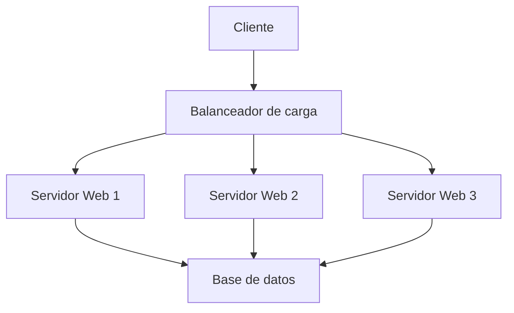
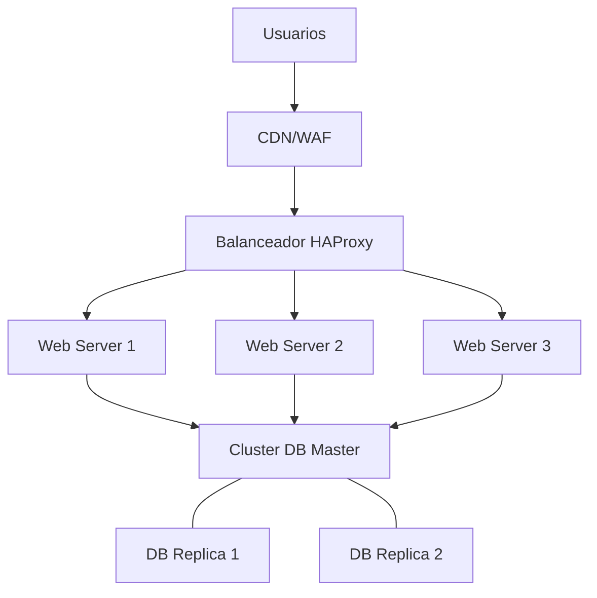

# 🖧 Clústeres: Sistemas Distribuidos de Alta Potencia

> [!info] Definición
> Un **clúster** es un conjunto de computadoras independientes (denominadas **nodos**) que trabajan coordinadamente como si fueran un único sistema, proporcionando mayor rendimiento, disponibilidad o escalabilidad que una máquina individual.

---

## 🔧 Tipos de Clústeres

### 🏭 Clúster de Alto Rendimiento (HPC)
> [!example] High Performance Computing
> Utilizados en entornos científicos, simulaciones complejas y procesamiento masivo de datos donde se requiere gran capacidad de cálculo.

- **Características principales**:
  - Paralelización de tareas computacionales intensivas
  - Interconexiones de alta velocidad (InfiniBand, OmniPath)
  - Optimizado para cálculos científicos y rendering
- **Aplicaciones**: modelado climático, simulaciones físicas, entrenamiento de IA

### 🔁 Clúster de Alta Disponibilidad (HA)
> [!tip] High Availability
> Diseñados para mantener servicios críticos operativos continuamente, incluso ante fallos de hardware o software.

- **Objetivo principal**: Eliminar puntos únicos de fallo
- **Mecanismo**: Redundancia activa y monitorización constante
- **Métodos**:
  - Activo-Pasivo: Un nodo primario con respaldo en espera
  - Activo-Activo: Todos los nodos trabajan simultáneamente

### 📈 Clúster de Balanceo de Carga
> [!example] Load Balancing
> Distribuye peticiones entrantes entre múltiples nodos para optimizar recursos y maximizar rendimiento.



- **Algoritmos comunes**:
  - Round Robin: distribución secuencial
  - Least Connections: envío al nodo menos cargado
  - IP Hash: asignación consistente basada en IP cliente

### 🗃️ Clúster de Almacenamiento
> [!note] Storage Clusters
> Proporcionan sistemas de archivos distribuidos o almacenamiento de objetos a gran escala.

- **Características**:
  - Replicación de datos entre nodos
  - Tolerancia a fallos
  - Escalabilidad horizontal
  - Consistencia de datos

---

## 💬 Ejemplo Práctico: Arquitectura Web Resiliente

> [!example] Caso de uso real
> Una aplicación web con alta demanda (miles de peticiones por segundo) implementada con arquitectura en clúster.



**Componentes**:
- **Capa frontal**: Balanceador de carga HAProxy o Nginx
- **Capa de aplicación**: Múltiples servidores web idénticos
- **Capa de datos**: Clúster de bases de datos en configuración Master-Replica

**Beneficio**: Si cualquier componente falla, el sistema sigue operativo.

---

## 🧱 Componentes Fundamentales de un Clúster

| Componente | Descripción | Ejemplos |
|------------|-------------|----------|
| **Nodos** | Computadoras físicas o virtuales que conforman el clúster | Servidores rack, VMs, instancias cloud |
| **Red interna** | Infraestructura de comunicación entre nodos | LAN dedicada, VLAN, redes InfiniBand |
| **Gestor del clúster** | Software que coordina operaciones | Kubernetes, Pacemaker, SLURM |
| **Sistema de quórum** | Mecanismo para evitar "split-brain" | Corosync, etcd, ZooKeeper |
| **Almacenamiento compartido** | Sistemas de almacenamiento accesibles por todos los nodos | SAN, NAS, sistemas de archivos distribuidos |

> [!warning] Síndrome Split-Brain
> Ocurre cuando un clúster se divide en partes aisladas que no pueden comunicarse entre sí, pero siguen operando independientemente. Puede causar corrupción de datos y comportamientos impredecibles.

---

## 🧰 Herramientas y Tecnologías para Clústeres

### Orquestación y Gestión

```bash
# Ejemplo: Crear un clúster Kubernetes con 3 nodos worker
kubeadm init --control-plane-endpoint="10.0.0.10:6443" --pod-network-cidr=10.244.0.0/16

# En los nodos worker:
kubeadm join 10.0.0.10:6443 --token abcdef.0123456789abcdef \
    --discovery-token-ca-cert-hash sha256:a1b2c3d4...
```

### Alta Disponibilidad

```bash
# Configuración básica de Pacemaker/Corosync
pcs cluster setup --name my_cluster node1.example.com node2.example.com
pcs cluster start --all
pcs resource create virtual_ip ocf:heartbeat:IPaddr2 ip=10.0.0.100 cidr_netmask=24 op monitor interval=10s
```

### Almacenamiento Distribuido

```bash
# Inicialización básica de un clúster Ceph
ceph-deploy new node1 node2 node3
ceph-deploy install node1 node2 node3
ceph-deploy mon create-initial
ceph-deploy osd create --data /dev/sdb node1
```

---

## ✅ Ventajas y ❌ Desventajas

> [!tip] Principales Beneficios
> - **Redundancia**: Eliminación de puntos únicos de fallo
> - **Escalabilidad**: Capacidad de crecer añadiendo más nodos
> - **Disponibilidad**: Servicio continuo incluso durante fallos o mantenimiento
> - **Rendimiento**: Distribución de carga entre múltiples recursos

> [!warning] Consideraciones Importantes
> - **Complejidad técnica**: Requiere conocimientos especializados
> - **Costos elevados**: Infraestructura, licencias y mantenimiento
> - **Overhead de comunicación**: La coordinación entre nodos consume recursos
> - **Dificultad de depuración**: Los problemas pueden ser difíciles de aislar

---

## 📚 Recursos de Aprendizaje

- [Kubernetes Docs](https://kubernetes.io/docs/home/) - La referencia definitiva para orquestación de contenedores
- [Pacemaker](https://clusterlabs.org/pacemaker/) - Framework de alta disponibilidad
- [Ceph Documentation](https://docs.ceph.com/en/latest/) - Sistema de almacenamiento distribuido

> [!note] Relacionado
> [[fundamento de servidores]]
