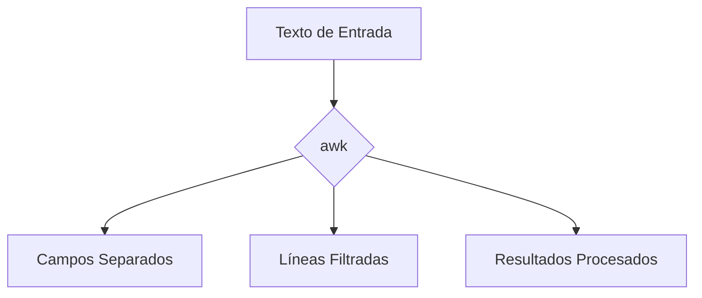

# **Comando `awk`**

---

### **¿Qué es `awk`?**

`awk` es un lenguaje de programación y un comando de Linux que se usa para **procesar y analizar texto**. Es especialmente útil para trabajar con archivos estructurados, como CSV o logs, donde los datos están organizados en campos y registros.

---

### **Sintaxis Básica**

```bash
awk 'patrón { acción }' [archivo(s)]
```

- **`patrón`**: Condición que debe cumplirse para ejecutar la acción (opcional).
- **`acción`**: Comandos que se ejecutan si el patrón coincide (por ejemplo, imprimir, calcular, etc.).
- **`archivo(s)`**: Archivo(s) en los que aplicar el comando. Si no se especifica, `awk` trabaja con la entrada estándar (stdin).

---

### **Usos Comunes**

#### 1. **Imprimir Campos Específicos**
`awk` divide cada línea en campos (por defecto, separados por espacios). Puedes imprimir campos específicos usando `$n`, donde `n` es el número del campo.

- **Ejemplo**: Imprimir el primer y tercer campo de un archivo.
  ```bash
  awk '{ print $1, $3 }' archivo.txt
  ```

---

#### 2. **Cambiar el Separador de Campos**
Usa la opción `-F` para especificar un separador de campos diferente (por ejemplo, una coma).

- **Ejemplo**: Imprimir el segundo campo de un archivo CSV.
  ```bash
  awk -F ',' '{ print $2 }' archivo.csv
  ```

---

#### 3. **Filtrar Líneas con un Patrón**
Puedes usar un patrón para filtrar líneas antes de aplicar una acción.

- **Ejemplo**: Imprimir líneas que contienen la palabra "error".
  ```bash
  awk '/error/ { print }' archivo.log
  ```

---

#### 4. **Realizar Cálculos**
`awk` puede realizar operaciones matemáticas con los campos.

- **Ejemplo**: Sumar los valores del segundo campo.
  ```bash
  awk '{ suma += $2 } END { print suma }' archivo.txt
  ```

---

#### 5. **Imprimir el Número de Línea**
Usa la variable `NR` para imprimir el número de línea.

- **Ejemplo**: Imprimir el número de línea y el primer campo.
  ```bash
  awk '{ print NR, $1 }' archivo.txt
  ```

---

#### 6. **Condiciones con `if`**
Puedes usar condiciones `if` para realizar acciones más complejas.

- **Ejemplo**: Imprimir el primer campo si el segundo es mayor que 10.
  ```bash
  awk '{ if ($2 > 10) print $1 }' archivo.txt
  ```

---

#### 7. **Imprimir el Número de Campos**
Usa la variable `NF` para imprimir el número de campos en cada línea.

- **Ejemplo**: Imprimir el número de campos y la línea.
  ```bash
  awk '{ print NF, $0 }' archivo.txt
  ```

---

#### 8. **Imprimir el Último Campo**
Usa `$NF` para imprimir el último campo de cada línea.

- **Ejemplo**: Imprimir el último campo.
  ```bash
  awk '{ print $NF }' archivo.txt
  ```

---

### **Opciones Adicionales**

| Opción | Descripción                                                                 |
|--------|-----------------------------------------------------------------------------|
| `-F`   | Especifica el separador de campos.                                          |
| `-v`   | Define una variable.                                                        |
| `-f`   | Lee comandos desde un archivo.                                              |

---

### **Ejemplos Avanzados**

1. **Imprimir Líneas con Más de 3 Campos**:
   ```bash
   awk 'NF > 3 { print }' archivo.txt
   ```

2. **Sumar Valores de un Campo**:
   ```bash
   awk '{ suma += $2 } END { print suma }' archivo.txt
   ```

3. **Imprimir Líneas entre Dos Patrones**:
   ```bash
   awk '/inicio/,/fin/' archivo.txt
   ```

4. **Imprimir Campos en Orden Inverso**:
   ```bash
   awk '{ for (i=NF; i>0; i--) printf "%s ", $i; print "" }' archivo.txt
   ```

5. **Contar Líneas que Coinciden con un Patrón**:
   ```bash
   awk '/error/ { count++ } END { print count }' archivo.log
   ```

---

### **Resumen**

- **`awk`**: Comando para procesar y analizar texto, especialmente útil para archivos estructurados.
- **Usos comunes**: Imprimir campos, filtrar líneas, realizar cálculos, usar condiciones.
- **Opciones clave**: `-F`, `-v`, `-f`.

---

### **Diagrama de Funcionamiento de `awk`**



---

### **Consejo Final**

`awk` es una herramienta poderosa para procesar texto. Combínalo con otros comandos como `grep`, `sed` o `tr` para tareas más complejas.

[[unix]]