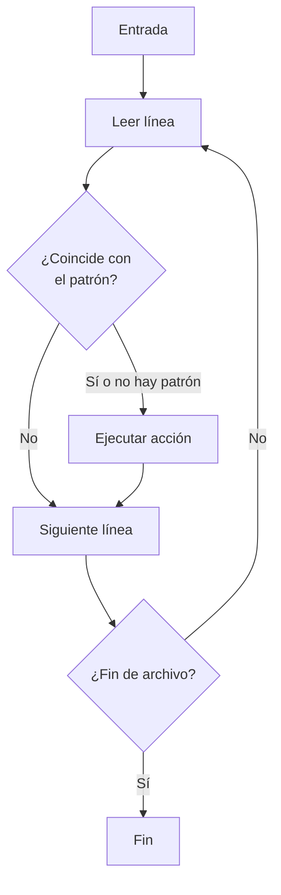
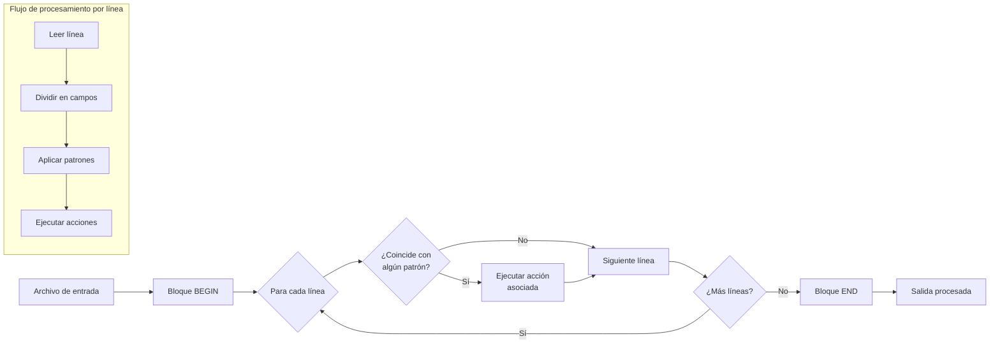

# AWK - Lenguaje de Procesamiento de Texto

## Introducción

> [!info] ¿Qué es AWK?
> **AWK** es un lenguaje de programación versátil diseñado específicamente para el procesamiento y análisis de texto. Actúa tanto como un comando de Linux/Unix como un lenguaje de scripting completo, especializado en manipular datos estructurados en archivos de texto.

AWK destaca por su capacidad para:
- Procesar archivos línea por línea
- Dividir cada línea en campos
- Aplicar operaciones sobre campos específicos
- Generar reportes personalizados

Es una herramienta fundamental en el arsenal de cualquier profesional de ciberseguridad, especialmente útil para:
- Análisis de logs y archivos de registro
- Procesamiento de datos durante pruebas de penetración
- Filtrado y extracción de información sensible
- Automatización de tareas de procesamiento de texto

---

## Sintaxis Básica

```bash
awk 'patrón { acción }' [archivo(s)]
```

### Componentes principales:

- **`patrón`**: Condición opcional que determina cuándo ejecutar la acción
- **`acción`**: Comandos que se ejecutan cuando el patrón coincide (o en cada línea si no hay patrón)
- **`archivo(s)`**: Archivos de entrada (si se omite, lee de stdin)

> [!tip] El modelo de procesamiento de AWK
> AWK trabaja con un modelo de **patrón-acción**. Para cada línea de entrada:
> 1. Verifica si cumple con el patrón
> 2. Si coincide (o no hay patrón), ejecuta la acción
> 3. Continúa con la siguiente línea



---

## Variables Internas Principales

| Variable | Descripción | Ejemplo de uso |
|----------|-------------|----------------|
| `$0` | Línea completa | `awk '{print $0}' archivo.txt` |
| `$1`, `$2`, etc. | Campo 1, campo 2, etc. | `awk '{print $1}' archivo.txt` |
| `$NF` | Último campo de la línea | `awk '{print $NF}' archivo.txt` |
| `NF` | Número de campos en la línea actual | `awk '{print NF}' archivo.txt` |
| `NR` | Número de registro (línea) actual | `awk '{print NR, $0}' archivo.txt` |
| `FS` | Separador de campos (por defecto espacio) | `awk 'BEGIN {FS=":"} {print $1}' /etc/passwd` |
| `RS` | Separador de registros (por defecto nueva línea) | `awk 'BEGIN {RS="\\n\\n"} {print}' archivo.txt` |
| `OFS` | Separador de campos de salida | `awk 'BEGIN {OFS=","} {print $1,$2}' archivo.txt` |
| `ORS` | Separador de registros de salida | `awk 'BEGIN {ORS="\\n\\n"} {print}' archivo.txt` |

---

## Patrones Especiales

| Patrón | Descripción | Ejemplo |
|--------|-------------|---------|
| `BEGIN` | Se ejecuta antes de procesar la entrada | `awk 'BEGIN {print "Iniciando..."} {print $1}' archivo.txt` |
| `END` | Se ejecuta después de procesar toda la entrada | `awk '{sum+=$1} END {print "Total:", sum}' archivo.txt` |
| `/regex/` | Coincide líneas que contienen la expresión regular | `awk '/error/ {print}' logs.txt` |
| `expresión` | Evalúa la expresión (verdadero si es != 0) | `awk '$3 > 100 {print $1, $3}' datos.txt` |
| `patrón1, patrón2` | Rango de líneas entre patrones | `awk '/inicio/,/fin/ {print}' archivo.txt` |

---

## Operaciones Comunes con AWK

### 1. Selección de Campos

> [!example] Extraer información específica
> ```bash
> # Imprimir el primer y tercer campo de cada línea
> awk '{print $1, $3}' archivo.txt
> 
> # Imprimir el primer campo y el último campo
> awk '{print $1, $NF}' archivo.txt
> 
> # Imprimir todos los campos excepto el primero
> awk '{$1=""; print $0}' archivo.txt
> ```

### 2. Cambiar el Separador de Campos

> [!example] Trabajar con diferentes formatos
> ```bash
> # CSV: Separador por comas
> awk -F ',' '{print $2}' datos.csv
> 
> # Archivos de contraseñas: Separador por dos puntos
> awk -F ':' '{print $1, $3}' /etc/passwd
> 
> # Múltiples separadores (espacio o coma)
> awk -F '[, ]' '{print $1, $3}' archivo_mixto.txt
> ```

### 3. Filtrar Datos

> [!example] Filtrado por contenido o condiciones
> ```bash
> # Mostrar líneas que contienen "error"
> awk '/error/ {print $0}' registro.log
> 
> # Mostrar entradas donde el tercer campo es mayor que 1000
> awk '$3 > 1000 {print $1, $3}' datos.txt
> 
> # Filtrar por longitud de línea
> awk 'length($0) > 80 {print "Línea larga:", NR}' codigo.c
> ```

### 4. Cálculos y Estadísticas

> [!example] Operaciones matemáticas con datos
> ```bash
> # Sumar valores de la columna 3
> awk '{sum += $3} END {print "Total:", sum}' datos.txt
> 
> # Calcular promedio de valores
> awk '{sum += $2; count++} END {print "Promedio:", sum/count}' mediciones.txt
> 
> # Encontrar valor máximo
> awk 'BEGIN {max = 0} $3 > max {max = $3; linea = $0} END {print "Máximo:", max, "en línea:", linea}' datos.txt
> ```

---

## Casos Prácticos en Ciberseguridad

### Análisis de Logs de Seguridad

> [!example] Extracción de intentos de acceso fallidos
> ```bash
> # Extraer IPs de intentos fallidos de SSH
> awk '/Failed password/ {print $11}' /var/log/auth.log | sort | uniq -c | sort -nr
> 
> # Contar intentos fallidos por usuario
> awk '/Failed password/ {print $9}' /var/log/auth.log | sort | uniq -c | sort -nr
> ```

### Procesamiento de Archivos de Escáner de Vulnerabilidades

> [!example] Filtrar vulnerabilidades críticas de un reporte Nmap
> ```bash
> # Extraer puertos abiertos con servicios
> awk -F '/' '/open/ && !/filtered/ {print $1 " => " $5}' nmap-scan.txt
> 
> # Extraer CVEs críticos de un reporte
> awk '/CVE/ && /Critical/ {print $2, $3, $NF}' vulnerability-report.txt
> ```

### Manipulación de Salidas de Herramientas

> [!example] Procesamiento de resultados de otras herramientas
> ```bash
> # Convertir salida de netstat a formato CSV
> netstat -tuln | awk 'NR>2 {print $4 "," $1 "," $6}' > puertos.csv
> 
> # Extraer sólo direcciones IP de una salida
> ifconfig | awk '/inet / {print $2}' | awk -F ':' '{print $2}'
> ```

---

## Estructuras de Control

### Condicionales

```bash
# Uso de if-else para clasificar valores
awk '{
  if ($3 > 100) {
    print $0, "Alto"
  } else if ($3 > 50) {
    print $0, "Medio"
  } else {
    print $0, "Bajo"
  }
}' datos.txt
```

### Bucles

```bash
# Recorrer todos los campos de una línea
awk '{
  for (i=1; i<=NF; i++) {
    if (length($i) > 5) {
      print "Campo", i, ":", $i
    }
  }
}' archivo.txt
```

### Funciones Definidas por el Usuario

```bash
# Definir función para convertir a mayúsculas
awk '
function mayusculas(texto) {
  return toupper(texto)
}
{
  print mayusculas($1), $2
}' nombres.txt
```

---

## Ejemplos Avanzados

### Manipulación Compleja de Datos

> [!example] Extraer y procesar datos de múltiples fuentes
> ```bash
> # Unir datos de dos archivos por un campo común (como JOIN en SQL)
> awk 'FNR==NR {usuarios[$1]=$2; next} $3 in usuarios {print $0, usuarios[$3]}' usuarios.txt logs.txt
> ```

### Script AWK Completo

> [!example] Análisis de tráfico web desde logs de Apache
> ```bash
> #!/usr/bin/awk -f
> 
> BEGIN {
>     print "Análisis de logs de Apache"
>     print "-------------------------"
>     FS=" "
>     contador_total = 0
>     errores_404 = 0
> }
> 
> {
>     # Contar peticiones por IP
>     ip_count[$1]++
>     
>     # Contar códigos de estado
>     status = $9
>     codigo[status]++
>     
>     # Contar peticiones por hora
>     split($4, tiempo, ":")
>     hora[substr(tiempo[1], 2)]++
>     
>     # Contar errores 404
>     if (status == 404) {
>         errores_404++
>         url_404[$7]++
>     }
>     
>     contador_total++
> }
> 
> END {
>     # Mostrar IPs más frecuentes
>     print "\nTop 5 IPs por número de peticiones:"
>     for (ip in ip_count) {
>         print ip_count[ip], ip | "sort -rn | head -5"
>     }
>     
>     # Mostrar códigos de estado
>     print "\nCódigos de estado HTTP:"
>     for (c in codigo) {
>         printf "%s: %d (%.2f%%)\n", c, codigo[c], (codigo[c]/contador_total)*100
>     }
>     
>     # Mostrar URLs con más errores 404
>     print "\nTop URLs con error 404:"
>     for (url in url_404) {
>         print url_404[url], url | "sort -rn | head -5"
>     }
>     
>     # Distribución por hora
>     print "\nDistribución de peticiones por hora:"
>     for (h=0; h<24; h++) {
>         hora_str = sprintf("%02d", h)
>         count = hora[hora_str] ? hora[hora_str] : 0
>         printf "%s:00 - %s:59: %d\n", hora_str, hora_str, count
>     }
>     
>     print "\nTotal peticiones analizadas:", contador_total
> }
> ```
> 
> Para ejecutar: `awk -f script.awk access.log`

---

## Técnicas de AWK para Pentesting

### Extracción de Datos Sensibles

```bash
# Buscar posibles contraseñas en archivos de configuración
awk -F '=' '/password|pwd|passwd/ {gsub(/^[ \t]+|[ \t]+$/, "", $2); print $1 "=" $2}' configuracion.ini
```

### Análisis de Tráfico de Red

```bash
# Extraer información de conexiones desde tcpdump
tcpdump -nn -r captura.pcap | awk '/ > / {split($5, ip, "."); if (ip[5] == "80") print $3}'
```

### Procesamiento de Resultados de Fuzzing

```bash
# Analizar respuestas de un fuzzer web
awk '$9 == 200 && $10 > 500 {print $7}' fuzzing-results.txt
```

---

## Buenas Prácticas y Consejos

> [!tip] Optimiza tu trabajo con AWK
> 
> 1. **Usa BEGIN para inicializar variables**
>    ```bash
>    awk 'BEGIN {contador=0} {contador++} END {print contador}'
>    ```
>
> 2. **Combina AWK con otros comandos en pipeline**
>    ```bash
>    cat archivo.log | grep ERROR | awk '{print $1, $4}' | sort | uniq
>    ```
>
> 3. **Guarda scripts complejos en archivos separados**
>    ```bash
>    # script.awk
>    #!/usr/bin/awk -f
>    # Luego ejecuta: awk -f script.awk archivo.txt
>    ```
>
> 4. **Usa redirección para salidas múltiples**
>    ```bash
>    awk '{print $1 > "nombres.txt"; print $2 > "apellidos.txt"}' personas.txt
>    ```

> [!warning] Errores comunes a evitar
>
> 1. **Olvido de comillas**: Las comillas son esenciales para delimitar el programa AWK
>    ```bash
>    # Incorrecto: awk {print $1} archivo.txt
>    # Correcto: awk '{print $1}' archivo.txt
>    ```
>
> 2. **Confusión con el separador de campos**: Por defecto es cualquier espacio en blanco
>    ```bash
>    # Para CSV use: awk -F ',' '{print $1}' archivo.csv
>    ```
>
> 3. **No escapar caracteres especiales**:
>    ```bash
>    # Incorrecto: awk '/algo|otro/' archivo.txt
>    # Correcto: awk '/algo\|otro/' archivo.txt
>    ```

---

## Diagrama de Procesamiento de AWK



---

## Integración con Otras Herramientas

AWK funciona excepcionalmente bien en combinación con otras herramientas de línea de comandos:

### Pipeline con grep, sort y uniq

```bash
# Encontrar las IPs que más intentos fallidos de login han realizado
grep "Failed password" /var/log/auth.log | awk '{print $11}' | sort | uniq -c | sort -nr | head -10
```

### Procesamiento de salida JSON (con jq)

```bash
# Extraer campos específicos de una respuesta JSON
curl -s https://api.ejemplo.com/datos | jq -r '.items[]' | awk '{print $3, $1}'
```

### Integración con scripts de shell

```bash
# Uso en script bash para automatizar tareas
#!/bin/bash

TOTAL=$(awk '{sum+=$5} END {print sum}' datos.txt)
if [ "$TOTAL" -gt 1000 ]; then
    echo "Alerta: Valor total excede el umbral: $TOTAL"
fi
```

---

## Referencias y Recursos Adicionales

- [[unix|Unix/Linux Commands Reference]]
- [[Descriptores|File Descriptors in Unix]]
- [[stder_stdout|Standard Error and Output]]
- [[subnetting|Subnetting Guide]]

> [!info] Para profundizar
> - **The AWK Programming Language** - Libro por Aho, Weinberger & Kernighan
> - **Effective awk Programming** - Arnold Robbins
> - **GAWK: Effective AWK Programming** - Manual de GNU awk