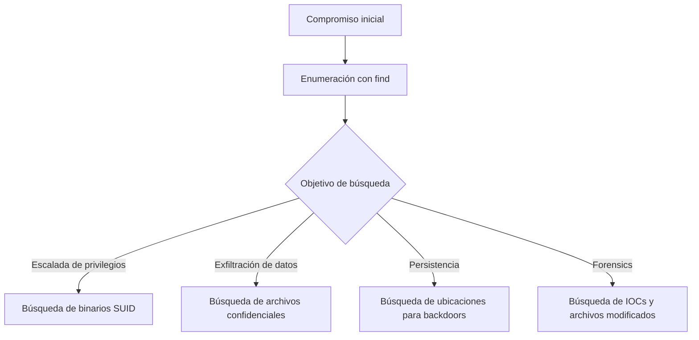
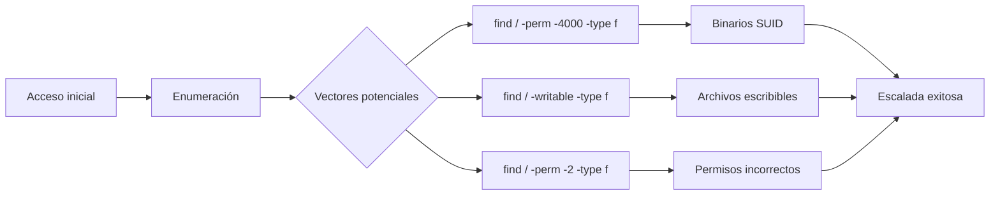

# 🔍 Find: Herramienta de Búsqueda Avanzada

> [!info] Herramienta esencial
> **find** es una poderosa utilidad de línea de comandos en sistemas Unix/Linux que permite buscar archivos y directorios según múltiples criterios. Es considerada una de las herramientas más versátiles para enumeración de sistemas en ciberseguridad.

---

## 📋 Contenidos
- [Introducción](#introducción)
- [Sintaxis y opciones](#sintaxis-y-opciones)
- [Criterios de búsqueda](#criterios-de-búsqueda)
- [Ejemplos prácticos](#ejemplos-prácticos)
- [Casos de uso en ciberseguridad](#casos-de-uso-en-ciberseguridad)
- [Tips y optimización](#tips-y-optimización)

---

## 📝 Introducción

### ¿Qué es find?

**find** es una herramienta de línea de comandos que busca recursivamente archivos en una jerarquía de directorios basándose en múltiples criterios como nombre, tipo, tamaño, permisos, fecha de modificación, propietario y mucho más.

### Contextos de uso en ciberseguridad:

- **Enumeración de sistemas**: Identificar archivos y directorios importantes
- **Búsqueda de vulnerabilidades**: Localizar archivos con permisos incorrectos
- **Forensics**: Encontrar archivos modificados en intervalos específicos
- **Post-explotación**: Identificar información sensible en sistemas comprometidos
- **Auditorías de seguridad**: Verificar configuraciones y permisos de archivos



---

## 🖥️ Sintaxis y opciones

### Sintaxis básica

```bash
find [ruta] [expresión]
```

- **[ruta]**: Directorio desde donde comenzar la búsqueda (por defecto: directorio actual)
- **[expresión]**: Criterios de búsqueda (tipo, nombre, tamaño, etc.)

> [!example] Comando básico
> ```bash
> find /home -name "*.txt"
> ```
> Busca todos los archivos .txt en el directorio /home y sus subdirectorios

### Operadores principales

| Operador | Descripción |
|----------|-------------|
| `-and` o simplemente un espacio | Operador lógico AND (por defecto entre criterios) |
| `-or` | Operador lógico OR |
| `-not` o `!` | Negación lógica |
| `\( ... \)` | Agrupación de expresiones |

---

## 🎯 Criterios de búsqueda

> [!tip] Criterios más utilizados en ciberseguridad
> Estos son los criterios que más usarás en tus evaluaciones de seguridad

### Por nombre y tipo

| Criterio | Descripción | Ejemplo |
|----------|-------------|---------|
| `-name "patrón"` | Búsqueda por nombre (distingue mayúsculas/minúsculas) | `find / -name "passwd"` |
| `-iname "patrón"` | Búsqueda por nombre (no distingue mayúsculas/minúsculas) | `find / -iname "*.conf"` |
| `-type X` | Búsqueda por tipo (f=archivo, d=directorio, l=enlace, etc.) | `find / -type f -name "*.php"` |

### Por permisos y propiedad

| Criterio | Descripción | Ejemplo |
|----------|-------------|---------|
| `-perm modo` | Búsqueda por permisos exactos | `find / -perm 644` |
| `-perm -modo` | Todos los permisos especificados están establecidos | `find / -perm -4000` (SUID) |
| `-perm /modo` | Cualquiera de los permisos especificados está establecido | `find / -perm /2000` (SGID) |
| `-user nombre` | Archivos propiedad de un usuario específico | `find / -user root` |
| `-writable` | Archivos escribibles por el usuario actual | `find / -writable` |

### Por tiempo y tamaño

| Criterio | Descripción | Ejemplo |
|----------|-------------|---------|
| `-mtime n` | Modificado hace n días exactos | `find / -mtime 1` |
| `-mtime +n` | Modificado hace más de n días | `find / -mtime +30` |
| `-mtime -n` | Modificado hace menos de n días | `find / -mtime -7` |
| `-mmin n` | Modificado hace n minutos | `find / -mmin -60` |
| `-size n[cwbkMG]` | Búsqueda por tamaño | `find / -size +10M` |

---

## 💻 Ejemplos prácticos

### 1. Buscar archivos con permisos SUID (útil para escalada de privilegios)

```bash
find / -perm -4000 -type f 2>/dev/null
```

> [!info] Explicación
> - `/`: Busca en todo el sistema
> - `-perm -4000`: Archivos con bit SUID establecido
> - `-type f`: Solo archivos regulares (no directorios ni enlaces)
> - `2>/dev/null`: Redirige errores a /dev/null (oculta mensajes de "permiso denegado")

### 2. Buscar archivos configuración modificados recientemente

```bash
find /etc -type f -mtime -7 2>/dev/null
```

> [!info] Explicación
> - `/etc`: Busca en el directorio de configuración
> - `-type f`: Solo archivos regulares
> - `-mtime -7`: Modificados en los últimos 7 días

### 3. Buscar archivos de backup o temporales (posible filtración de información)

```bash
find / -type f \( -name "*.bak" -o -name "*.tmp" -o -name "*.backup" -o -name "*.swp" \) 2>/dev/null
```

> [!info] Explicación
> - Busca archivos con extensiones comunes de backup
> - `-o` actúa como operador OR
> - `\( ... \)` agrupa condiciones

### 4. Buscar y ejecutar acciones en los archivos encontrados

```bash
find /var/www -name "*.php" -type f -exec grep -l "password" {} \;
```

> [!info] Explicación
> - Busca archivos PHP en el directorio web
> - `-exec grep -l "password" {} \;`: Ejecuta grep en cada archivo encontrado
> - Muestra solo los nombres de archivos que contienen la palabra "password"

### 5. Buscar archivos potencialmente peligrosos con permisos de escritura global

```bash
find / -path "/proc" -prune -o -path "/sys" -prune -o -perm -2 -type f -not -path "/dev/*" -ls 2>/dev/null
```

> [!info] Explicación
> - Busca archivos con permiso de escritura para "otros" (`o+w`)
> - Excluye `/proc`, `/sys` y `/dev` para reducir falsos positivos
> - `-ls` muestra información detallada de cada archivo

---

## 🔐 Casos de uso en ciberseguridad

### Escalada de privilegios



> [!example] Comandos útiles para escalada
> ```bash
> # Buscar archivos de configuración de servicios que sean modificables
> find /etc/systemd -writable -type f 2>/dev/null
> 
> # Buscar tareas cron que sean modificables
> find /etc/cron* -writable -type f 2>/dev/null
> 
> # Buscar binarios con capabilities
> find / -type f -exec getcap {} \; 2>/dev/null | grep -v "= "
> ```

### Exfiltración de datos

```bash
# Buscar archivos con "password", "credential", "secret" en el nombre
find / -type f -name "*pass*" -o -name "*cred*" -o -name "*key*" -o -name "*secret*" 2>/dev/null

# Buscar archivos SSH y de configuración de clientes
find / -name "id_rsa*" -o -name "*.pem" -o -name "*.ppk" 2>/dev/null

# Buscar bases de datos
find / -name "*.db" -o -name "*.sqlite" -o -name "*.sqlite3" 2>/dev/null
```

### Análisis forense

```bash
# Buscar archivos modificados en las últimas 24 horas
find / -type f -mtime -1 2>/dev/null

# Buscar archivos creados después de una fecha específica
find / -type f -newermt "2023-01-01" 2>/dev/null

# Buscar archivos ejecutables no estándar en directorios del sistema
find /bin /sbin /usr/bin /usr/sbin -type f -not -name "*.sh" -not -name "*.pl" -perm -u+x -exec file {} \; | grep -v "ELF"
```

---

## 💡 Tips y optimización

> [!tip] Mejores prácticas
> - Usa siempre `2>/dev/null` para eliminar errores no deseados
> - Combina criterios para búsquedas más precisas
> - Usa `-prune` para excluir directorios y mejorar rendimiento
> - Para búsquedas lentas, considera usar `-xdev` para limitar a un sistema de archivos

### Optimización de rendimiento

```bash
# Versión lenta
find / -name "*.log"

# Versión optimizada
find / -name "*.log" -type f -not -path "/proc/*" -not -path "/sys/*" -not -path "/dev/*" -not -path "/run/*" 2>/dev/null
```

### Uso con otras herramientas

| Combinación | Descripción | Ejemplo |
|-------------|-------------|---------|
| `find + grep` | Buscar por contenido | `find / -type f -name "*.conf" -exec grep -l "password" {} \;` |
| `find + xargs` | Procesar resultados en lote | `find / -type f -name "*.php" -print0 \| xargs -0 grep -l "eval("` |
| `find + tar` | Archivar resultados | `find /home -name "*.jpg" \| tar -czvf fotos.tar.gz -T -` |

### Errores comunes y soluciones

> [!warning] Problemas frecuentes
> 
> **Problema**: Errores de "Permission denied"  
> **Solución**: Agregar `2>/dev/null` al final del comando
> 
> **Problema**: Búsquedas extremadamente lentas  
> **Solución**: Limitar el ámbito (`-not -path "/proc/*"`) o usar `-xdev`
> 
> **Problema**: Resultados inesperados con nombres de archivo con espacios  
> **Solución**: Usar `-print0` con `xargs -0` para manejar correctamente espacios

---

## 📊 Comparativa de uso en diferentes escenarios

| Escenario | Comando find | Alternativa |
|-----------|--------------|-------------|
| Escalada de privilegios | `find / -perm -4000 -type f 2>/dev/null` | LinPEAS, unix-privesc-check |
| Búsqueda de datos sensibles | `find / -name "*pass*" -o -name "*key*" 2>/dev/null` | grep -r "password" /ruta |
| Forensics | `find / -mtime -1 -type f 2>/dev/null` | Herramientas especializadas como Autopsy |
| Enumeración web | `find /var/www -name "*.php" -type f 2>/dev/null` | Herramientas como DirBuster |

---

> [!success] Puntos clave para recordar
> - **find** es extremadamente versátil pero puede ser intensivo en recursos
> - Dominar los criterios de búsqueda es esencial para un uso efectivo
> - La combinación con otras herramientas mediante `-exec` o pipes amplifica su potencial
> - Siempre considerar optimizaciones en sistemas grandes

---

## 📚 Comandos de referencia rápida

```bash
# Buscar por nombre
find / -name "archivo.txt"

# Buscar por tipo y tamaño
find / -type f -size +100M

# Buscar por permisos
find / -perm -o+w

# Buscar y ejecutar
find / -name "*.sh" -exec chmod +x {} \;

# Buscar archivos recientes
find / -mtime -7 -type f
```