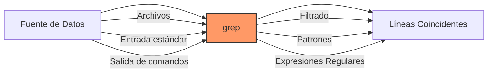
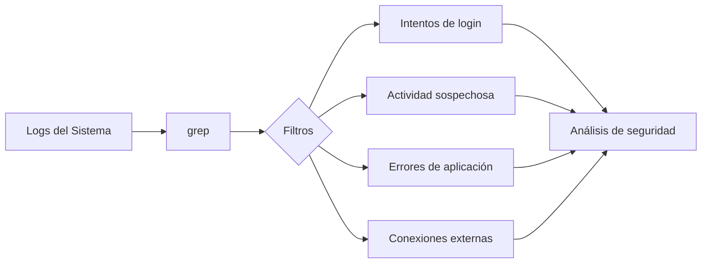

# 🔍 GREP: Herramienta de Búsqueda por Patrones

> [!quote] Origen del nombre
> El comando `grep` (Global Regular Expression Print) deriva de la orden del editor ed: `g/re/p` (global/regular expression/print), siendo uno de los legados más importantes de la filosofía UNIX.

---

## 📋 Tabla de Contenidos
- [¿Qué es grep?](#qué-es-grep)
- [Sintaxis Básica](#sintaxis-básica)
- [Opciones Principales](#opciones-principales)
- [Casos de Uso en Ciberseguridad](#casos-de-uso-en-ciberseguridad)
- [Ejemplos Prácticos](#ejemplos-prácticos)
- [Uso Avanzado con Expresiones Regulares](#uso-avanzado-con-expresiones-regulares)
- [Combinaciones con Otros Comandos](#combinaciones-con-otros-comandos)
- [Tips y Buenas Prácticas](#tips-y-buenas-prácticas)

---

## 📝 ¿Qué es grep?

`grep` es una herramienta de línea de comandos que busca patrones específicos en archivos o en la salida de otros comandos. Forma parte del ecosistema de herramientas UNIX y sigue la filosofía de "hacer una cosa y hacerla bien".

> [!info] Funciones principales
> - Buscar texto en archivos
> - Filtrar salidas de otros comandos
> - Extraer información específica de conjuntos de datos grandes
> - Validar patrones mediante expresiones regulares
> - Analizar logs y archivos de configuración



---

## 🖥️ Sintaxis Básica

```bash
grep [opciones] patrón [archivo(s)]
```

### Componentes principales:

- **`patrón`**: Texto o expresión regular a buscar
- **`archivo(s)`**: Archivos donde buscar (opcional si se recibe entrada por pipe)
- **`opciones`**: Modificadores que alteran el comportamiento de grep

> [!example] Ejemplo básico
> ```bash
> # Buscar la palabra "password" en un archivo
> grep "password" /etc/shadow
> 
> # Buscar "admin" en la salida de otro comando
> cat /etc/passwd | grep "admin"
> ```

---

## ⚙️ Opciones Principales

| Opción | Descripción | Ejemplo de uso en seguridad |
|--------|-------------|------------------------------|
| `-i` | **I**gnora mayúsculas/minúsculas | `grep -i "password" config.php` |
| `-v` | In**v**ierte la coincidencia (muestra líneas que NO coinciden) | `grep -v "^#" sshd_config` (líneas no comentadas) |
| `-n` | Muestra **n**úmero de línea | `grep -n "root" /etc/passwd` |
| `-r` | Búsqueda **r**ecursiva en directorios | `grep -r "API_KEY" /var/www/` |
| `-l` | Muestra solo nombres de archivos con coincidencias (**l**ist) | `grep -l "password" *.php` |
| `-c` | **C**uenta el número de coincidencias | `grep -c "Failed password" /var/log/auth.log` |
| `-w` | Busca **w**ords (palabras completas) | `grep -w "root" /etc/passwd` |
| `-A n` | Muestra n líneas **A**fter (después) de la coincidencia | `grep -A 3 "ERROR" application.log` |
| `-B n` | Muestra n líneas **B**efore (antes) de la coincidencia | `grep -B 2 "login successful" auth.log` |
| `-C n` | Muestra n líneas de **C**ontext (contexto) alrededor | `grep -C 3 "segmentation fault" crash.log` |
| `-E` | Usa **E**xtended regex (expresiones regulares extendidas) | `grep -E '(user\|admin)' users.txt` |
| `-o` | Muestra solo la parte coincidente (**o**nly) | `grep -o "[0-9]\{1,3\}\.[0-9]\{1,3\}\.[0-9]\{1,3\}\.[0-9]\{1,3\}" log.txt` |

> [!tip] Opciones combinadas
> Las opciones se pueden combinar: `grep -rinw "password" /var/www/` busca recursivamente, ignorando mayúsculas/minúsculas, mostrando números de línea y solo palabras completas.

---

## 🔐 Casos de Uso en Ciberseguridad

### 1. Análisis de Logs



### 2. Búsqueda de Información Sensible

> [!warning] Revelación de información sensible
> Una de las aplicaciones más importantes de grep en ciberseguridad es la identificación de información sensible o secretos expuestos en código, logs o archivos de configuración.

### 3. Auditoría de Configuraciones

Examinar archivos de configuración para identificar ajustes inseguros:
- Permisos débiles
- Autenticación deshabilitada
- Configuraciones por defecto

### 4. Análisis de Código

Identificar posibles vulnerabilidades en código fuente:
- Funciones inseguras
- Hardcoding de credenciales
- Comentarios con información sensible

---

## 💻 Ejemplos Prácticos

### Ejemplo 1: Análisis de logs de autenticación

```bash
# Buscar intentos fallidos de login
grep "Failed password" /var/log/auth.log

# Contar intentos fallidos por IP
grep "Failed password" /var/log/auth.log | grep -o "[0-9]\{1,3\}\.[0-9]\{1,3\}\.[0-9]\{1,3\}\.[0-9]\{1,3\}" | sort | uniq -c | sort -nr

# Ver intentos de autenticación exitosos
grep "Accepted password" /var/log/auth.log
```

> [!info] Explicación
> Estos comandos permiten:
> 1. Identificar todos los intentos fallidos de login
> 2. Extraer las IPs, contarlas y ordenarlas por frecuencia (detectando posibles ataques de fuerza bruta)
> 3. Ver los accesos exitosos para verificar si hay accesos no autorizados

### Ejemplo 2: Búsqueda de credenciales en código

```bash
# Buscar posibles credenciales en archivos PHP
grep -r -i -n "password\|usuario\|credential\|api_key" --include="*.php" /var/www/

# Buscar claves SSH inseguras
grep -l "PRIVATE KEY" ~/.ssh/* | xargs grep -L "ENCRYPTED"

# Encontrar contraseñas hardcodeadas en scripts
grep -r -E "(password|pwd|passwd|pass).*['\"][^'\"]+['\"]" --include="*.{py,js,sh}" /path/to/code/
```

> [!info] Explicación
> Estos comandos buscan:
> 1. Referencias a credenciales en archivos PHP de una aplicación web
> 2. Claves SSH privadas que no están protegidas con contraseña
> 3. Contraseñas hardcodeadas en scripts de Python, JavaScript o Shell

### Ejemplo 3: Auditoría de configuraciones

```bash
# Verificar servicios que escuchan en todas las interfaces
grep -n "0.0.0.0" /etc/*/**.conf

# Buscar configuraciones SSH inseguras
grep -v "^#" /etc/ssh/sshd_config | grep -i "password\|root\|permit"

# Encontrar permisos SUID en binarios
find / -perm -4000 -type f 2>/dev/null | xargs ls -la
```

> [!info] Explicación
> Estos comandos permiten:
> 1. Detectar servicios configurados para escuchar en todas las interfaces (potencialmente inseguro)
> 2. Examinar configuraciones de SSH, filtrando comentarios, para identificar ajustes de seguridad críticos
> 3. Encontrar binarios con bit SUID que podrían usarse para escalar privilegios

---

## 🧩 Uso Avanzado con Expresiones Regulares

`grep` alcanza su máximo potencial cuando se combina con expresiones regulares para crear patrones de búsqueda complejos.

### Metacaracteres básicos

| Metacarácter | Descripción | Ejemplo |
|--------------|-------------|---------|
| `.` | Cualquier carácter | `grep "h.la" archivo.txt` |
| `^` | Inicio de línea | `grep "^root" /etc/passwd` |
| `$` | Fin de línea | `grep "bash$" /etc/passwd` |
| `[]` | Conjunto de caracteres | `grep "[0-9]" archivo.txt` |
| `[^]` | Negación de conjunto | `grep "[^0-9]" archivo.txt` |
| `*` | 0 o más repeticiones | `grep "ca*t" archivo.txt` |
| `\` | Escape de metacaracteres | `grep "\." archivo.txt` |

### Patrones útiles en seguridad

```bash
# Direcciones IPv4
grep -E "[0-9]{1,3}\.[0-9]{1,3}\.[0-9]{1,3}\.[0-9]{1,3}" archivo.log

# Correos electrónicos
grep -E "[A-Za-z0-9._%+-]+@[A-Za-z0-9.-]+\.[A-Za-z]{2,}" archivo.txt

# Hashes MD5
grep -E "\b[a-f0-9]{32}\b" archivo.txt

# URLs
grep -E "https?://[a-zA-Z0-9.-]+\.[a-zA-Z]{2,}[/a-zA-Z0-9._~:/?#[\]@!$&'()*+,;=]*" archivo.log
```

> [!tip] Grep extendido
> Usa `grep -E` o `egrep` para expresiones regulares extendidas, que simplifican la sintaxis para patrones complejos.

---

## 🔄 Combinaciones con Otros Comandos

La verdadera potencia de `grep` se manifiesta al combinarlo con otros comandos UNIX:


### Ejemplos de combinaciones poderosas

```bash
# Encontrar archivos modificados hoy que contengan "password"
find . -type f -mtime 0 | xargs grep -l "password"

# Analizar los 10 errores más comunes en un log
grep "ERROR" application.log | cut -d: -f4 | sort | uniq -c | sort -nr | head -10

# Buscar todos los binarios SUID y filtrar los que podrían ser explotables
find / -perm -4000 -type f 2>/dev/null | xargs ls -la | grep -E "(nmap|vim|find|bash|perl|python|ruby|awk|wget|curl)"
```

> [!example] Análisis de tráfico HTTP
> ```bash
> # Extraer todos los User-Agents únicos de logs de Apache
> grep -o '"User-Agent:.*"' access.log | sort | uniq -c | sort -nr
> 
> # Encontrar intentos de SQL injection
> grep -i "select\|union\|insert\|drop" access.log
> ```

---

## 💡 Tips y Buenas Prácticas

### Optimización de búsquedas

> [!tip] Mejorando la eficiencia
> - Limita el alcance de la búsqueda cuando sea posible
> - Usa `-l` para obtener solo nombres de archivos si no necesitas ver las coincidencias
> - En búsquedas recursivas grandes, considera usar `--include` o `--exclude` para filtrar archivos
> - Para búsquedas muy grandes, `ripgrep` (rg) es una alternativa moderna y más rápida

### Evitar errores comunes

1. **Olvidar escapar caracteres especiales**:
   ```bash
   # Incorrecto (el punto es un metacarácter)
   grep "example.com" archivo.txt
   
   # Correcto
   grep "example\.com" archivo.txt
   ```

2. **No usar comillas para patrones con espacios**:
   ```bash
   # Incorrecto
   grep error log archivo.txt
   
   # Correcto
   grep "error log" archivo.txt
   ```

3. **Ignorar el contexto**:
   ```bash
   # Mejor con contexto
   grep -C 3 "error" log.txt
   ```

4. **Olvidar `-r` para búsquedas recursivas**:
   ```bash
   # Para buscar en subdirectorios
   grep -r "patrón" directorio/
   ```

---

> [!success] Resumen de grep
> - **Potente herramienta** para búsqueda y filtrado de texto
> - **Componente esencial** en la filosofía UNIX de herramientas especializadas
> - **Indispensable para análisis de seguridad** y auditorías
> - **Combina con otros comandos** para flujos de trabajo complejos
> - **Dominar expresiones regulares** maximiza su utilidad

