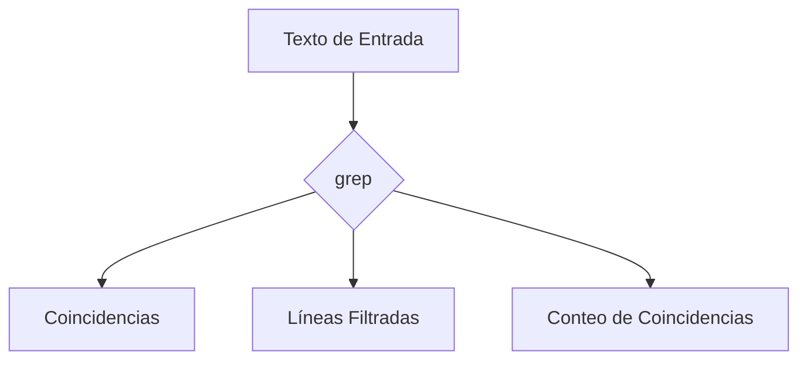

### **¿Qué es `grep`?**

`grep` (Global Regular Expression Print) es un comando de Linux que se usa para **buscar patrones de texto** en archivos o en la salida de otros comandos. Es una herramienta esencial para filtrar y encontrar información rápidamente.

---

### **Sintaxis Básica**

```bash
grep [opciones] patrón [archivo(s)]
```

- **`patrón`**: Texto o expresión regular que quieres buscar.
- **`archivo(s)`**: Archivo(s) en los que buscar. Si no se especifica, `grep` busca en la entrada estándar (stdin).

---

### **Usos Comunes**

#### 1. **Buscar Texto en un Archivo**
Busca un patrón en un archivo específico.

- **Ejemplo**: Buscar la palabra "error" en un archivo de log.
  ```bash
  grep "error" archivo.log
  ```

---

#### 2. **Buscar Texto en Múltiples Archivos**
Busca un patrón en varios archivos.

- **Ejemplo**: Buscar "hola" en todos los archivos `.txt`.
  ```bash
  grep "hola" *.txt
  ```

---

#### 3. **Ignorar Mayúsculas/Minúsculas**
Usa la opción `-i` para hacer la búsqueda insensible a mayúsculas/minúsculas.

- **Ejemplo**: Buscar "Hola" sin importar cómo esté escrito.
  ```bash
  grep -i "hola" archivo.txt
  ```

---

#### 4. **Mostrar Líneas que NO Coinciden**
Usa la opción `-v` para mostrar las líneas que **no** coinciden con el patrón.

- **Ejemplo**: Mostrar líneas que no contienen "error".
  ```bash
  grep -v "error" archivo.log
  ```

---

#### 5. **Mostrar el Número de Línea**
Usa la opción `-n` para mostrar el número de línea junto con la coincidencia.

- **Ejemplo**: Buscar "hola" y mostrar el número de línea.
  ```bash
  grep -n "hola" archivo.txt
  ```

---

#### 6. **Buscar Recursivamente en Directorios**
Usa la opción `-r` para buscar en todos los archivos de un directorio y sus subdirectorios.

- **Ejemplo**: Buscar "config" en todos los archivos del directorio actual.
  ```bash
  grep -r "config" .
  ```

---

#### 7. **Buscar con Expresiones Regulares**
`grep` soporta expresiones regulares para búsquedas más avanzadas.

- **Ejemplo**: Buscar líneas que comienzan con "user".
  ```bash
  grep "^user" archivo.txt
  ```

---

#### 8. **Mostrar un Número Específico de Líneas Alrededor de la Coincidencia**
Usa las opciones `-A`, `-B` o `-C` para mostrar líneas adicionales después, antes o alrededor de la coincidencia.

- **Ejemplo**: Mostrar 2 líneas después de cada coincidencia.
  ```bash
  grep -A 2 "error" archivo.log
  ```

---

### **Opciones Adicionales**

| Opción | Descripción                                                                 |
|--------|-----------------------------------------------------------------------------|
| `-i`   | Ignora mayúsculas/minúsculas.                                               |
| `-v`   | Invierte la búsqueda (muestra líneas que NO coinciden).                     |
| `-n`   | Muestra el número de línea.                                                 |
| `-r`   | Busca recursivamente en directorios.                                        |
| `-c`   | Cuenta el número de coincidencias.                                          |
| `-l`   | Muestra solo los nombres de los archivos con coincidencias.                 |
| `-w`   | Busca palabras completas.                                                   |
| `-A n` | Muestra `n` líneas después de la coincidencia.                              |
| `-B n` | Muestra `n` líneas antes de la coincidencia.                                |
| `-C n` | Muestra `n` líneas alrededor de la coincidencia.                            |

---

### **Ejemplos Avanzados**

1. **Buscar Palabras Completas**:
   ```bash
   grep -w "hola" archivo.txt
   ```

2. **Contar Coincidencias**:
   ```bash
   grep -c "error" archivo.log
   ```

3. **Buscar en la Salida de Otro Comando**:
   ```bash
   ps aux | grep "bash"
   ```

4. **Buscar con Expresiones Regulares**:
   ```bash
   grep "^[A-Z]" archivo.txt  # Líneas que comienzan con mayúscula.
   ```

5. **Mostrar Archivos con Coincidencias**:
   ```bash
   grep -l "config" *.txt
   ```

---

### **Resumen**

- **`grep`**: Comando para buscar patrones de texto en archivos o en la salida de otros comandos.
- **Usos comunes**: Buscar texto, filtrar líneas, usar expresiones regulares.
- **Opciones clave**: `-i`, `-v`, `-n`, `-r`, `-c`, `-w`, `-A`, `-B`, `-C`.

---

### **Diagrama de Funcionamiento de `grep`**



---

### **Consejo Final**

`grep` es una herramienta poderosa para buscar y filtrar texto. Combínalo con otros comandos como `awk`, `sed` o `tr` para tareas más complejas.

[[unix]]