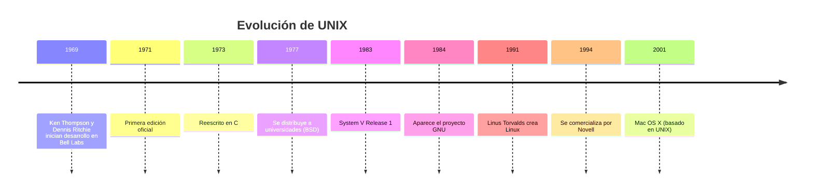
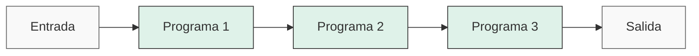
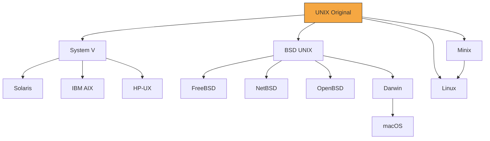

# 🖥️ UNIX: Sistema Operativo Fundamental

> [!quote] Ken Thompson, co-creador de UNIX
> "UNIX es simple. Solo necesita un genio para entender su simplicidad."

---

## 📋 Tabla de Contenidos
- [Historia y Orígenes](#historia-y-orígenes)
- [Filosofía UNIX](#filosofía-unix)
- [Comandos Fundamentales](#comandos-fundamentales)
- [Estructura del Sistema](#estructura-del-sistema)
- [Shell y Scripting](#shell-y-scripting)
- [Impacto y Legado](#impacto-y-legado)
- [Datos Curiosos](#datos-curiosos)

---

## 📜 Historia y Orígenes



UNIX nació en 1969 en los Laboratorios Bell de AT&T, donde Ken Thompson y Dennis Ritchie desarrollaron el sistema después del abandono del proyecto Multics. Inicialmente escrito en ensamblador, Ritchie creó el lenguaje C específicamente para reescribir UNIX en 1973, lo que permitió su portabilidad a diferentes plataformas de hardware.

> [!info] Origen del nombre
> El nombre "UNIX" fue acuñado por Brian Kernighan como un juego de palabras con "MULTICS" (MULTiplexed Information and Computing Service). UNIX es una versión simplificada y "eunuca" (castrada) de MULTICS, de ahí el nombre "UNICS" (UNiplexed Information and Computing Service) que luego se convirtió en "UNIX".

---

## 🧩 Filosofía UNIX

La filosofía UNIX se basa en principios de diseño simples pero poderosos:

1. **Escribe programas que hagan una sola cosa y la hagan bien**
2. **Escribe programas para trabajar juntos**
3. **Escribe programas para manejar flujos de texto**

> [!tip] Principios de diseño UNIX
> - **Simplicidad**: Soluciones simples sobre complejas
> - **Modularidad**: Componentes pequeños e independientes
> - **Composabilidad**: Programas que pueden conectarse
> - **Claridad**: Preferir claridad sobre optimización
> - **Portabilidad**: Funcionar en diferentes plataformas
> - **Transparencia**: Funcionamiento y datos visibles



---

## 🛠️ Comandos Fundamentales

> [!example] La potencia de UNIX reside en sus comandos interconectados
> Los comandos UNIX están diseñados para ser combinados con tuberías (`|`), redirecciones (`>`, `<`), y otros mecanismos para crear flujos de trabajo complejos.

### Navegación y Archivos

| Comando | Descripción | Ejemplo |
|---------|-------------|---------|
| `ls` | Listar archivos y directorios | `ls -la` |
| `cd` | Cambiar directorio | `cd /etc` |
| `pwd` | Mostrar directorio actual | `pwd` |
| `mkdir` | Crear directorio | `mkdir -p dir1/dir2` |
| `rm` | Eliminar archivos/directorios | `rm -rf directorio` |
| `cp` | Copiar archivos/directorios | `cp -r origen destino` |
| `mv` | Mover/renombrar archivos | `mv antiguo nuevo` |
| `touch` | Crear archivo vacío | `touch archivo.txt` |
| `chmod` | Cambiar permisos | `chmod 755 script.sh` |
| `chown` | Cambiar propietario | `chown usuario:grupo archivo` |

### Visualización y Edición

| Comando | Descripción | Ejemplo |
|---------|-------------|---------|
| `cat` | Mostrar contenido | `cat archivo.txt` |
| `less` | Visualizar con paginación | `less archivo.log` |
| `head` | Primeras líneas | `head -n 10 archivo` |
| `tail` | Últimas líneas | `tail -f archivo.log` |
| `grep` | Buscar patrones | `grep -i "texto" archivos/*.txt` |
| `sed` | Editor de flujo | `sed 's/viejo/nuevo/g' archivo` |
| `awk` | Procesamiento de texto | `awk '{print $1}' archivo` |
| `vi/vim` | Editor de texto | `vim config.conf` |

### Sistema y Procesos

| Comando | Descripción | Ejemplo |
|---------|-------------|---------|
| `ps` | Mostrar procesos | `ps aux` |
| `top` | Monitor de procesos | `top` |
| `kill` | Terminar proceso | `kill -9 1234` |
| `df` | Espacio en disco | `df -h` |
| `du` | Uso de disco | `du -sh /var` |
| `free` | Memoria disponible | `free -m` |
| `who` | Usuarios conectados | `who` |
| `uname` | Información del sistema | `uname -a` |

---

## 📂 Estructura del Sistema

UNIX sigue un sistema de archivos jerárquico con un directorio raíz (`/`):

```
/
├── bin/     # Binarios esenciales
├── boot/    # Archivos de arranque
├── dev/     # Dispositivos
├── etc/     # Configuración del sistema
├── home/    # Directorios de usuarios
├── lib/     # Bibliotecas compartidas
├── mnt/     # Puntos de montaje temporales
├── opt/     # Software opcional
├── proc/    # Procesos y sistema (virtual)
├── root/    # Directorio del usuario root
├── sbin/    # Binarios del sistema
├── tmp/     # Archivos temporales
├── usr/     # Programas y datos secundarios
└── var/     # Datos variables (logs, etc.)
```

> [!info] "Todo es un archivo"
> En UNIX, casi todo se trata como un archivo, incluyendo dispositivos hardware, procesos, sockets de red y comunicación entre procesos. Esta abstracción unificada es una de las características más poderosas del diseño UNIX.

---

## 🐚 Shell y Scripting

El shell es la interfaz principal para interactuar con UNIX. Ofrece un lenguaje de scripting completo y potente.

```bash
#!/bin/sh
# Un script simple que muestra la filosofía UNIX

echo "Ejemplo de la filosofía UNIX en acción:"
echo "----------------------------------------"

# 1. Hacer una cosa bien: encontrar archivos
echo "Archivos modificados hoy:"
find /home -type f -mtime 0 | 

# 2. Trabajar con otros programas: filtrar resultados
grep "\.txt$" | 

# 3. Procesar flujos de texto: contar líneas
wc -l
```

### Shells más populares:

- **sh** (Bourne Shell): El shell original de UNIX
- **bash** (Bourne Again Shell): Mejora de sh, estándar en Linux
- **csh/tcsh** (C Shell): Sintaxis similar a C
- **ksh** (Korn Shell): Compatible con sh con características avanzadas
- **zsh** (Z Shell): Shell moderno con muchas características

---

## 🌐 Impacto y Legado



UNIX ha tenido un impacto profundo en la informática:

- **Internet**: La mayoría de servidores de Internet ejecutan sistemas basados en UNIX
- **Desarrollo de Software**: Herramientas de desarrollo y prácticas modernas
- **Sistemas Operativos**: Inspiró a Linux, macOS, Android, iOS, etc.
- **Computación en la Nube**: La infraestructura cloud se basa mayoritariamente en sistemas tipo UNIX
- **Estándares Abiertos**: Promovió estándares como POSIX

> [!note] POSIX
> POSIX (Portable Operating System Interface) es un conjunto de estándares IEEE que define la API, shell y utilidades para asegurar la compatibilidad entre sistemas operativos.

---

## 🧠 Datos Curiosos

> [!tip] ¿Sabías que...?
> 
> - **El primer manual de UNIX** tenía solo 35 páginas
> 
> - **El logo de BSD** es un diablo rojo llamado "BSD Daemon" (Beastie), diseñado por John Lasseter, quien más tarde cofundó Pixar
> 
> - **El creador de UNIX, Ken Thompson**, inventó el lenguaje de programación B, predecesor de C
> 
> - **La mascota de UNIX** en los Laboratorios Bell era un globo aerostático
> 
> - **El comando "grep"** deriva de la orden del editor ed: `g/re/p` (global/regular expression/print)
> 
> - **La primera versión de UNIX** cabía en solo 16KB de memoria
> 
> - **El reloj interno de UNIX** comenzó a contar desde el 1 de enero de 1970 (época UNIX)
> 
> - **UNIX fue el primer sistema operativo** escrito en un lenguaje de alto nivel (C)
> 
> - **Los archivos de dispositivo** en `/dev` fueron una innovación revolucionaria que permitía acceder al hardware como si fueran archivos

---

## 🔄 Herencia y Continuidad

> [!success] El legado continúa
> Aunque el UNIX original ya no se desarrolla activamente, su filosofía, diseño y muchos de sus comandos siguen vivos en:
> 
> - Sistemas certificados UNIX (AIX, Solaris, HP-UX)
> - Linux y sus distribuciones
> - BSD (FreeBSD, OpenBSD, NetBSD)
> - macOS (basado en Darwin/BSD)
> - iOS, Android (kernel Linux)
> - Sistemas embebidos y dispositivos IoT

---

## 📚 Recursos recomendados

- "The UNIX Programming Environment" por Kernighan & Pike
- "UNIX: A History and a Memoir" por Brian Kernighan
- "The Art of UNIX Programming" por Eric S. Raymond
- "UNIX in a Nutshell" por Arnold Robbins

> [!quote] Dennis Ritchie, co-creador de UNIX y C
> "UNIX es básicamente un sistema operativo simple, pero necesitas ser un genio para entender la simplicidad."