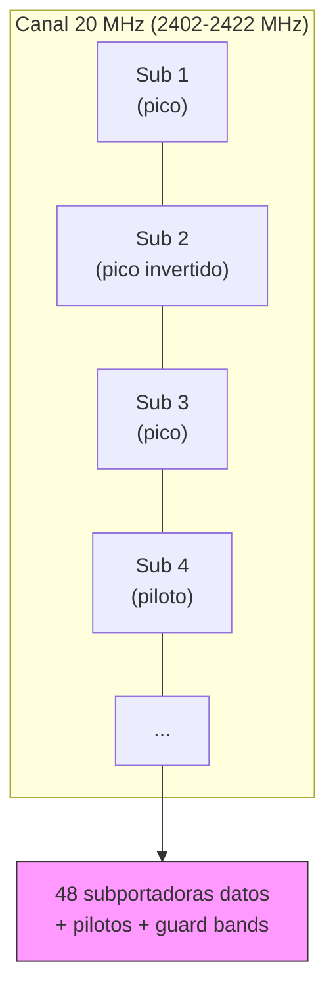

# Canales, ancho de banda, OFDM, subportadoras, beacons, throughput_ (versión didáctica para Obsidian)

> **Elevator pitch:**  
> Entender cómo funciona el espectro Wi-Fi —frecuencias, canales y anchos— te permite diagnosticar rendimiento, planear despliegues y distinguir _velocidad teórica_ (link rate) de _velocidad real_ (throughput). Gran parte de la eficiencia viene de OFDM: dividir un bloque de frecuencia en **muchas subportadoras** que transmiten _paralelamente_ sin interferirse.

---

## Índice

1. [Conceptos clave rápidos](https://chatgpt.com/g/g-p-68d68d8f07ac8191ae7fc96a5ec469fa-redes/c/68d68e69-c334-832a-a8c0-ee79206185d2#conceptos-clave-r%C3%A1pidos)
    
2. [Frecuencia ↔ Canal ↔ Ancho de banda (qué y por qué)](https://chatgpt.com/g/g-p-68d68d8f07ac8191ae7fc96a5ec469fa-redes/c/68d68e69-c334-832a-a8c0-ee79206185d2#frecuencia--canal--ancho-de-banda-qu%C3%A9-y-por-qu%C3%A9)
    
3. [OFDM y subportadoras — cómo funciona (detalle técnico)](https://chatgpt.com/g/g-p-68d68d8f07ac8191ae7fc96a5ec469fa-redes/c/68d68e69-c334-832a-a8c0-ee79206185d2#ofdm-y-subportadoras---c%C3%B3mo-funciona-detalle-t%C3%A9cnico)
    
4. [Primary channel, center channel y bonding (40/80/160)](https://chatgpt.com/g/g-p-68d68d8f07ac8191ae7fc96a5ec469fa-redes/c/68d68e69-c334-832a-a8c0-ee79206185d2#primary-channel-center-channel-y-bonding-4080160)
    
5. [Beacons, asociación y rol del primary channel](https://chatgpt.com/g/g-p-68d68d8f07ac8191ae7fc96a5ec469fa-redes/c/68d68e69-c334-832a-a8c0-ee79206185d2#beacons-asociaci%C3%B3n-y-rol-del-primary-channel)
    
6. [Throughput vs link rate — cálculo y ejemplos](https://chatgpt.com/g/g-p-68d68d8f07ac8191ae7fc96a5ec469fa-redes/c/68d68e69-c334-832a-a8c0-ee79206185d2#throughput-vs-link-rate--c%C3%A1lculo-y-ejemplos)
    
7. [Efectos de cambiar ancho (20 vs 40 vs 80 vs 160)](https://chatgpt.com/g/g-p-68d68d8f07ac8191ae7fc96a5ec469fa-redes/c/68d68e69-c334-832a-a8c0-ee79206185d2#efectos-de-cambiar-ancho-20-vs-40-vs-80-vs-160)
    
8. [Interpretación práctica del scan (ej.: `IPDUV`)](https://chatgpt.com/g/g-p-68d68d8f07ac8191ae7fc96a5ec469fa-redes/c/68d68e69-c334-832a-a8c0-ee79206185d2#interpretaci%C3%B3n-pr%C3%A1ctica-del-scan-ej-ipduv)
    
9. [Comandos útiles y análisis (escaneo y diagnóstico)](https://chatgpt.com/g/g-p-68d68d8f07ac8191ae7fc96a5ec469fa-redes/c/68d68e69-c334-832a-a8c0-ee79206185d2#comandos-%C3%BAtiles-y-an%C3%A1lisis-escaneo-y-diagn%C3%B3stico)
    
10. [Troubleshooting y buenas prácticas](https://chatgpt.com/g/g-p-68d68d8f07ac8191ae7fc96a5ec469fa-redes/c/68d68e69-c334-832a-a8c0-ee79206185d2#troubleshooting-y-buenas-pr%C3%A1cticas)
    
11. [Seguridad y ética (nota importante)](https://chatgpt.com/g/g-p-68d68d8f07ac8191ae7fc96a5ec469fa-redes/c/68d68e69-c334-832a-a8c0-ee79206185d2#seguridad-y-etica-nota-importante)
    
12. [Resumen práctico / Checklist / Autoevaluación](https://chatgpt.com/g/g-p-68d68d8f07ac8191ae7fc96a5ec469fa-redes/c/68d68e69-c334-832a-a8c0-ee79206185d2#resumen-pr%C3%A1ctico--checklist--autoevaluaci%C3%B3n)
    

---

## Conceptos clave rápidos

- **Frecuencia:** “autopista” (ej. 2.4 GHz, 5 GHz, 6 GHz).
    
- **Canal:** carril dentro de esa autopista (ej. canal 1 = 2412 MHz).
    
- **Ancho de banda (20/40/80/160 MHz):** cuántos MHz ocupa el AP → cuántos _subcanales_ (subportadoras) disponibles.
    
- **OFDM:** técnica que divide el ancho en muchas subportadoras ortogonales que transmiten **en paralelo**.
    
- **Subportadora:** mini-canal (p. ej. 64 por 20 MHz en Wi-Fi) que lleva símbolos modulados.
    
- **Beacons:** anuncios periódicos del AP (SSID, capacidades, primary channel, etc.).
    
- **Primary channel:** canal donde se anuncian beacons y control; necesario cuando hay bonding.
    
- **Link rate:** velocidad teórica del enlace (Mbit/s).
    
- **Throughput:** velocidad real de datos útiles (Mbit/s) después de overheads y colisiones.
    

---

## Frecuencia ↔ Canal ↔ Ancho de banda (qué y por qué)

### Frecuencia

- 2.4 GHz: mejor alcance, mayor interferencia, menos canales limpios.
    
- 5 GHz: menor alcance, mayor capacidad y más canales (incluye DFS).
    
- 6 GHz (Wi-Fi 6E): aún más espectro, baja congestión.
    

### Canal

- Cada canal tiene una **frecuencia central** (ej. canal 1 → 2412 MHz).
    
- **20 MHz** significa que el canal ocupa ±10 MHz desde la central (ej. 2402–2422 MHz para ch1).
    

### Ancho de banda

- **20 MHz** = bloque base (p. ej. 64 subportadoras).
    
- **40/80/160 MHz** = concatenación de bloques: más subportadoras → mayor capacidad teórica.
    
- **Resultado práctico:** más ancho → más bits por segundo _siempre que el espectro no esté congestionado_.
    

> [!tip]  
> En 2.4 GHz suele convenir **20 MHz** por la escasez de espectro; en 5 GHz se usan 40/80 cuando el entorno está relativamente libre.

---

## OFDM y subportadoras — cómo funciona (detalle técnico)

### Idea central

- OFDM divide el canal (ej. 20 MHz) en N subportadoras (por ejemplo 64).
    
- Cada subportadora transmite **simultáneamente** un flujo de símbolos modulados (QPSK, 16/64/256-QAM).
    
- En el dominio de la frecuencia cada subportadora aparece como una **forma sinc** con un pico centrado en su frecuencia asignada.
    

### Especificaciones (20 MHz, Wi-Fi típico)

- **64 subportadoras** en total:
    
    - ≈48 subportadoras **datos**
        
    - Varias subportadoras **piloto** (sincronía)
        
    - Bordes / guard bands inactivos
        
- **Separación entre subportadoras:** ≈312.5 kHz (20 MHz / 64).
    
- **Transmisión en paralelo:** el transmisor aplica IFFT para generar la señal compuesta y el receptor aplica FFT para recuperar cada subportadora.
    

### Cálculo simplificado de link rate (ejemplo)

Si: 48 subportadoras, símbolo rate ≈ 250k símbolos/s, modulación 64-QAM (6 bits/símbolo):

```
48 × 250000 × 6 ≈ 72 Mbps (por spatial stream)
```

> [!info]  
> El **throughput** real será menor por: cabeceras MAC/LLC, ACKs, retransmisiones, tiempos muertos (contention/CCA), gestión y cifrado.

---

## Primary channel, center channel y bonding (40/80/160)

### Primary Channel

- Canal donde **se anuncian los beacons** y se hace el control de asociación.
    
- Cuando usas 40/80/160 MHz (bonding), sigues teniendo un primary channel que sirve para el initial tuning de los clientes.
    

### Center Channel

- Indica el centro del bloque cuando hay bonding (ej. 80 MHz centrado en X MHz).
    
- Útil para saber exactamente qué rango ocupa el AP.
    

### Bonding (ejemplos)

- **20 MHz:** un bloque.
    
- **40 MHz:** 2 bloques pegados.
    
- **80 MHz:** 4 bloques → mucho más ancho → más subportadoras → mayor capacidad pero mayor probabilidad de solapamiento.
    

---

## Beacons, asociación y rol del primary channel

- **Beacon:** frame management enviado periódicamente (≈100 ms) que anuncia SSID, supported rates, capabilities (11k/r/v), primary channel, ancho máximo, seguridad, etc.
    
- **Asociación:** el cliente escucha beacons en el primary channel, realiza handshake (auth/assoc), luego data se transmite en todo el bloque definido (p. ej. 80 MHz) si el AP lo soporta.
    
- **Importancia:** si el primary channel está saturado, la asociación/descubrimiento será más afectado que si sólo hay ruido en los laterales.
    

---

## Throughput vs link rate — cálculo y ejemplos

### Terminología

- **Link rate (PHY rate):** velocidad indicada por la capa física, función de MCS, spatial streams, ancho.
    
- **Throughput:** datos útiles que atraviesan la capa IP/TCP en el tiempo.
    

### Ejemplo numérico

- AP: 802.11n, 20 MHz, 1 stream, MCS que equivale a 72 Mbps link rate.
    
- After overhead (MAC headers, interframe spacing, ACKs), throughput real ≈ 30–40 Mbps.
    
- Si interferencia/colisiones aumentan → throughput cae aún más (ej. 15 Mbps).
    

---

## Efectos de cambiar ancho (20 vs 40 vs 80 vs 160)

|Ancho|Subportadoras aprox.|Link rate (1 stream, ejemplo)|Ventaja|Riesgo|
|--:|--:|--:|---|---|
|20 MHz|64 (48 datos)|~72 Mbps|Buena coexistencia en 2.4 GHz|Menor capacidad máxima|
|40 MHz|128|~150 Mbps|Doble capacidad teórica|Pisar canales vecinos (2.4 GHz: malo)|
|80 MHz|256|~433 Mbps|Alto throughput|Mayor probabilidad de interferencia|
|160 MHz|512|>1 Gbps|Muy alta capacidad|Muy sensible al entorno; DFS/compatibilidad|

> [!warning]  
> Más ancho **no garantiza** mejor throughput en entornos congestionados. Puede reducir el throughput agregado por mayor contención.

---

## Interpretación práctica del scan (ej.: `IPDUV`)

> Usamos líneas del scan que pegaste. En tus datos hay varios APs `I.P.D.U.V` e `IPDUV D` en 2412 MHz (canal 1) y otros en 5220 MHz (canal 44) con 40 MHz o 160 MHz.

### Observaciones sobre `IPDUV`

- Entradas con **Primary Channel = 1 (2412 MHz), Width = 20 MHz**: APs en canal 1 ocupan 2402–2422 MHz. Señales fuertes (-43 dBm → muy cerca).
    
- Otras entradas en **canal 44 (5220 MHz)** con 40 MHz → ocupan 5210–5250 MHz; buen uso de 5 GHz si el cliente lo soporta.
    
- Hay también dispositivos anunciando **160 MHz** en 5180–5330 (lo cual cubre un rango grande): si hay muchos APs en ese bloque, quien use 160 MHz puede “secuestrar” mucho espectro y aumentar contención.
    

### Recomendación práctica (con tus datos)

- En 2.4 GHz: elegir **1, 6 o 11** según menor congestión (evitar 8/13 porque solapan más). Fijar **20 MHz**.
    
- En 5 GHz: preferir 40/80 si el bloque está relativamente libre; evitar 160 a menos que controles el entorno.
    

> [!example]  
> Caso: `IPDUV` entrada con -43 dBm en ch1 (20 MHz) → excelente señal; si tu cliente está ese cerca, prioriza 20 MHz en 2.4 GHz y forza band-steering a 5 GHz para otros clientes móviles.

---

## Comandos útiles y análisis (escaneo y diagnóstico)

> [!tip] Estos comandos sirven para _auditoría/diagnóstico legítimo_ y resolución de problemas. Respeta la ley y las políticas de tu red.

### Linux — escaneo y filtrado

```bash
# Escaneo completo (iw)
sudo iw dev wlan0 scan > scan_raw.txt

# Filtrar campos útiles (ejemplo)
sudo iw dev wlan0 scan | egrep -i 'BSS|SSID|signal|freq|primary|center|width' -A6

# Contar APs por canal (si tienes CSV con canal en col 5)
awk -F'|' '{print $5}' scanfile.txt | sort | uniq -c | sort -nr
```

### Herramientas gráficas / captura

- `nmcli device wifi list` — NetworkManager.
    
- `airodump-ng` — escaneo pasivo (requiere modo monitor) — **uso responsable**.
    
- Wireshark — análisis de frames (beacons, association) a partir de .pcap.
    

---

## Troubleshooting y buenas prácticas

### Síntomas ⇢ causas ⇢ acciones

- **Throughput bajo con buena señal:** congestión / solapamiento. → comprobar APs en el mismo canal; reducir ancho a 20 MHz (2.4 GHz) / mover a 5 GHz.
    
- **Roaming con cortes:** no hay 11k/r/v o thresholds inadecuados. → habilitar 802.11k/r/v si APs y clientes lo soportan.
    
- **Altos retries / retransmissions:** interferencia (co-channel, no-wifi). → espectro analyzer / cambiar canal.
    

### Checklist de despliegue

- Documentar: SSID, BSSID, canal, ancho, potencia TX.
    
- En 2.4 GHz: 20 MHz y canales 1/6/11.
    
- En 5 GHz: preferir 40/80 cuando el espectro esté limpio; usar DFS con cuidado.
    
- Ajustar potencia TX para evitar sobrecobertura y hidden nodes.
    
- Habilitar band steering, QoS (WMM), y seguridad (WPA3 o WPA2-Enterprise).
    

> [!tip]  
> **Medir antes y después**: escanear canales y ejecutar `iperf3` (cliente ↔ servidor controlado) para evaluar impacto de cambios.

---

## Seguridad y ética (nota importante)

> Esta sección es un recordatorio: manipular redes ajenas, crackear contraseñas o realizar ataques (deautenticación, MITM, fuerza bruta, etc.) **es ilegal** y peligroso.  
> Lo que aquí hay son conceptos y herramientas para **diagnóstico legítimo, hardening y enseñanza**. Si vas a auditar redes, hazlo **con autorización escrita** del propietario.

---

## Resumen práctico / Checklist / Autoevaluación

### Resumen express

- **20 MHz** = bloque base; contiene 64 subportadoras (≈48 útiles).
    
- **OFDM:** subportadoras ortogonales se superponen en frecuencia pero no se interfieren gracias a diseño sinc/ortogonalidad.
    
- **Más ancho ⇒ mayor capacidad teórica**, pero también mayor probabilidad de interferencia.
    
- **Primary channel** = canal donde AP anuncia beacons; necesario incluso cuando hay bonding.
    
- **Throughput** < link rate por overhead y contención.
    

### Checklist rápido para optimizar Wi-Fi local

-  En 2.4 GHz: fijar 20 MHz; elegir 1/6/11 según menor congestión.
    
-  En 5 GHz: priorizar 40/80 en espectro limpio; evitar 160 salvo controlado.
    
-  Documentar potencia TX y activar 802.11k/r/v para roaming si es necesario.
    
-  Medir con `iw`, `iperf3`, Wireshark antes/después de cambios.
    

### Autoevaluación (intenta responder sin mirar)

1. ¿Por qué 1/6/11 en 2.4 GHz?
    
2. ¿Qué hace la FFT en un receptor OFDM?
    
3. ¿Cuál es la diferencia entre link rate y throughput?
    
4. ¿Qué riesgo tiene configurar 160 MHz en un entorno urbano?
    
5. ¿Qué información importante trae un beacon?
    

6. Porque los bloques de 20 MHz centrados en 1, 6 y 11 no se solapan (en la mayoría de normativas), minimizando interferencia.
    
7. Separar las subportadoras (dominio frecuencia) y recuperar los símbolos enviados en cada subportadora.
    
8. Link rate = velocidad teórica en PHY; throughput = datos útiles observados por la capa superior (IP/TCP) después de overheads.
    
9. Ocupas mucho espectro → alto riesgo de colisiones y degradación del throughput agregado; además posibles restricciones DFS.
    
10. SSID, capacidades (ancho máximo, estándares soportados), primary channel, seguridad, información de roaming (11k/r/v).
    

---

## Diagramas (Mermaid)

### 1) Canal 20 MHz con subportadoras (simplificado)



