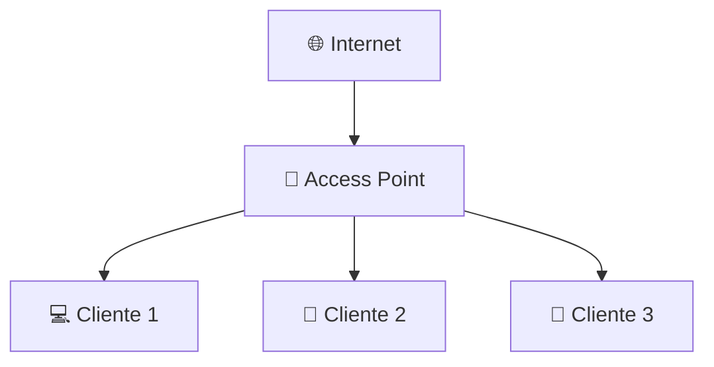
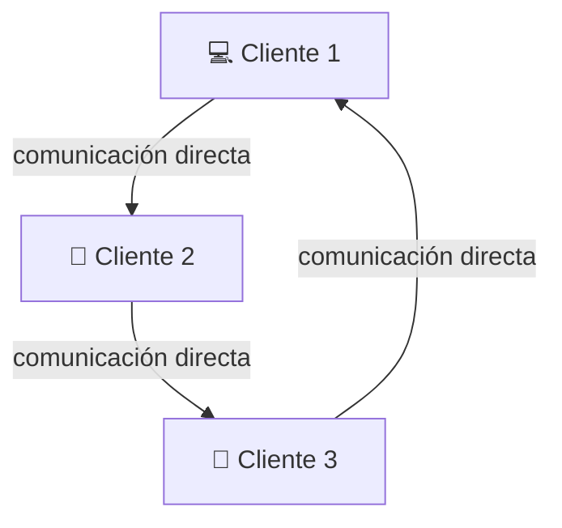

## 🧩 Modos de Funcionamiento Wi-Fi

Las redes inalámbricas pueden operar en **dos modos principales**:

---

### 🏗️ 1. **Modo Infrastructure**

- Es el **más común** (el que usan los routers Wi-Fi hogareños, empresas, escuelas, etc).
    
- Requiere un **Access Point (AP)** que actúa como “centro” de la red.
    
- Todos los dispositivos (**clientes**) se comunican a través del AP.
    
- Permite conexión a Internet, VLANs, control de acceso, etc.
    

#### Características:

- Conecta clientes con una red cableada.
    
- Puede tener seguridad (WPA2, WPA3, etc).
    
- Facilita el control centralizado.
    

---

### 🤝 2. **Modo Ad-Hoc (o IBSS: Independent Basic Service Set)**

- No hay Access Point.
    
- Cada dispositivo se conecta directamente con otro, formando una **red entre iguales (P2P)**.
    
- Ideal para situaciones donde no hay infraestructura, como transferencias rápidas o redes temporales.
    

#### Características:

- No necesita router ni punto de acceso.
    
- Más difícil de administrar.
    
- No escala bien (a muchos nodos les cuesta coordinarse).
    

---

## 📌 Diferencias clave:

|Característica|Modo Infrastructure|Modo Ad-Hoc|
|---|---|---|
|Punto central|Sí (Access Point)|No|
|Comunicación|A través del AP|Directa entre nodos|
|Escalabilidad|Alta|Limitada|
|Seguridad|WPA2/WPA3 típicamente|Poca o nula (salvo configuración manual)|
|Uso común|Hogares, oficinas|Redes temporales, hacking, juegos LAN|
