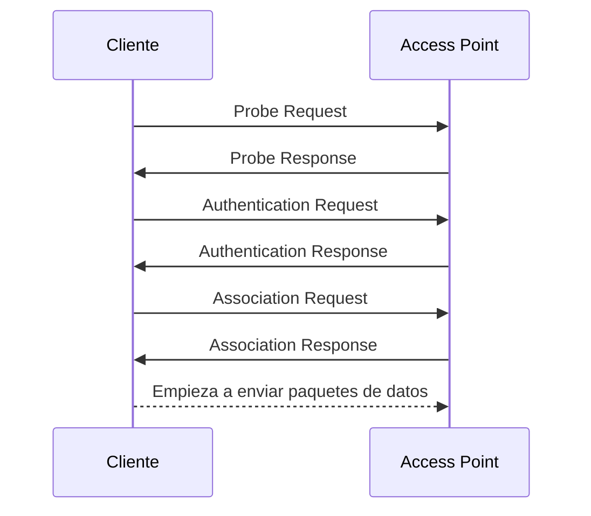
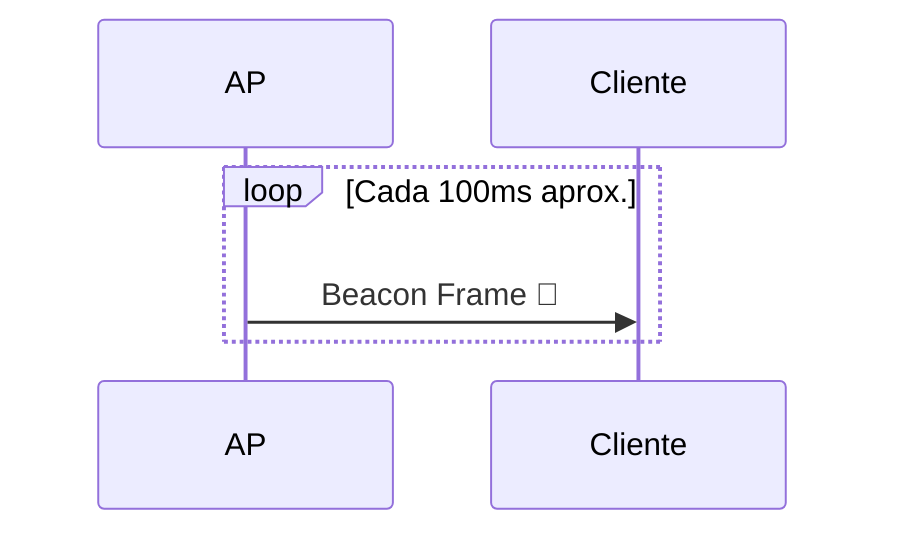
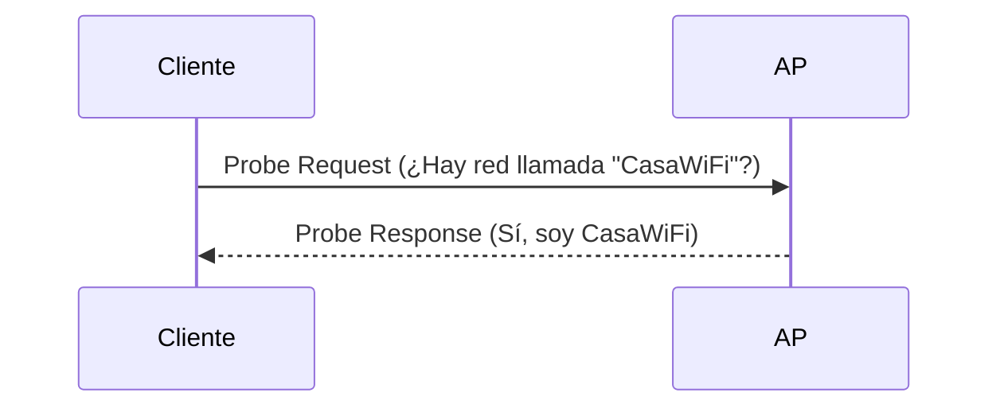
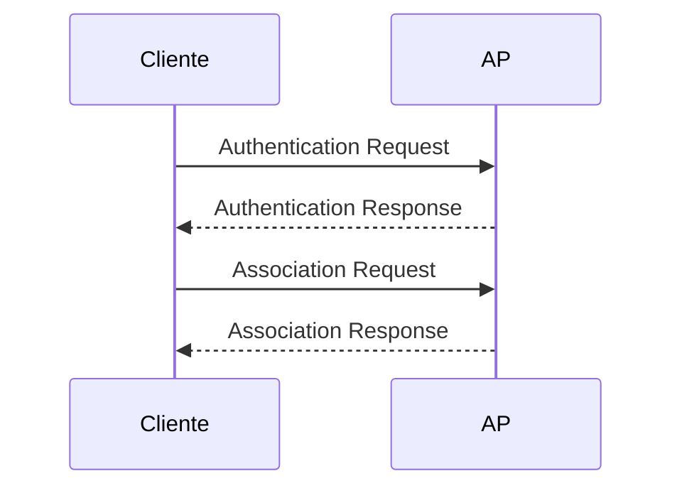
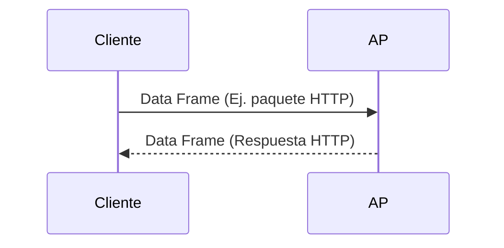
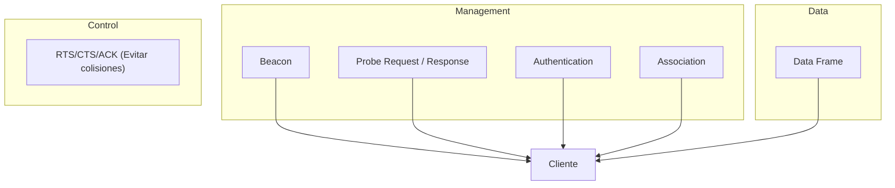

## ✉️ Tipos de paquetes Wi-Fi (IEEE 802.11)

En las redes Wi-Fi, los paquetes (o _frames_) se utilizan para comunicar distintos tipos de información. Existen tres grandes categorías:

---

### 🧩 1. **Paquetes de Gestión (Management Frames)**

Estos controlan la conexión entre dispositivos (autenticación, asociación, etc.).

|Tipo de paquete|Función|
|---|---|
|**Beacon**|Anunciado por el AP. Publicita el SSID, canal, cifrado, etc.|
|**Probe Request**|Enviado por un cliente buscando redes disponibles.|
|**Probe Response**|Enviado por un AP en respuesta a una Probe Request.|
|**Authentication**|Se utiliza para el proceso de autenticación.|
|**Association Request/Response**|Establecen la conexión entre el cliente y el AP.|
|**Deauthentication**|Termina una conexión previamente autenticada.|

---

### 🧩 2. **Paquetes de Control (Control Frames)**

Son usados para el control de acceso al medio (coordinación de cuándo enviar datos).

|Tipo|Función|
|---|---|
|**RTS/CTS**|(Request/Clear To Send) controlan colisiones.|
|**ACK**|Confirmación de que un paquete fue recibido.|
|**PS-Poll**|Cliente en modo ahorro de energía solicita datos.|

---

### 🧩 3. **Paquetes de Datos (Data Frames)**

Llevan los datos reales (navegación web, videos, archivos, etc.).

|Tipo|Función|
|---|---|
|**Data**|Contienen la carga útil del tráfico de red.|
|**Null Data**|Usados para señales de presencia (por ejemplo, en modo sleep).|

---

### 🎯 Ejemplo de secuencia al conectar a una red Wi-Fi:

---

### 🕵️‍♂️ ¿Por qué esto es importante para hacking Wi-Fi?

- **Beacons** y **Probes** se usan en el _reconocimiento_ (por ejemplo, con `airodump-ng`).
    
- **Deauthentication frames** se pueden falsificar para sacar clientes del AP (_ataque deauth_).
    
- **RTS/CTS** y **ACKs** permiten analizar la actividad y eficiencia de una red.
    

---

## 📦 Tipos de paquetes en redes Wi-Fi

En las redes Wi-Fi basadas en el estándar IEEE 802.11, los datos se transmiten en unidades llamadas **frames (tramas)**. Hay 3 tipos principales de tramas:

1. **Tramas de gestión (Management frames)**
    
2. **Tramas de control (Control frames)**
    
3. **Tramas de datos (Data frames)**
    

En este módulo te enfocarás en los más relevantes para análisis de red y pentesting: `beacon`, `probe`, `authentication`, y `data`.

---

### 📡 1. Beacon Frame

Los _beacons_ son enviados periódicamente por un Access Point (AP). Su función es anunciar la presencia de la red inalámbrica.

- Contiene información como:
    
    - SSID (nombre de la red)
        
    - BSSID (MAC del AP)
        
    - Canal
        
    - Seguridad (WPA, WPA2, etc.)
        
    - Timestamp
        
- Los clientes pasivos detectan redes Wi-Fi gracias a los _beacons_.
    

---

### 🔍 2. Probe Request / Probe Response

Este par de tramas se usa en la **búsqueda activa** de redes.

- Un cliente envía un **probe request** para buscar redes.
    
- Un AP contesta con un **probe response** si coincide el SSID.
    

Esto permite que el cliente encuentre redes incluso si el beacon está oculto.

---

### 🔐 3. Authentication & Association

Antes de que un cliente pueda enviar/recibir datos, necesita autenticarse y asociarse al AP.

- **Authentication**: handshake inicial. Puede ser abierta o con clave.
    
- **Association**: el cliente le dice al AP que quiere unirse a la red.
    

---

### 📦 4. Data Frames

Una vez asociado, el cliente puede enviar y recibir datos. Estas tramas contienen la información útil (como navegar por internet, enviar paquetes TCP/IP, etc.).

---

## 🧠 Resumen Visual General

