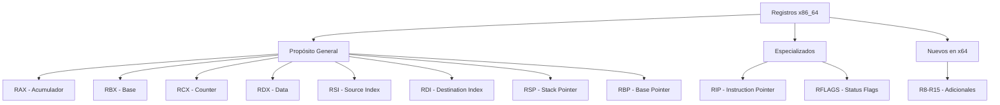
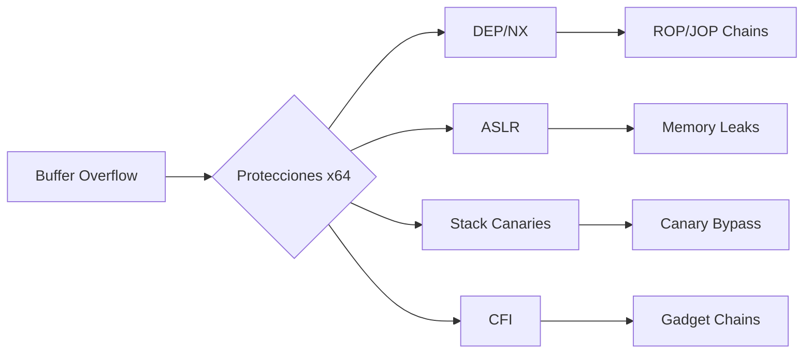
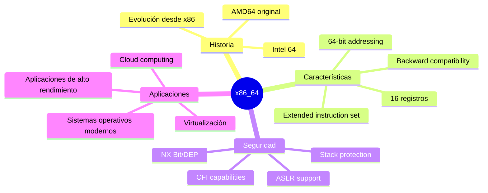

# 🖥️ Arquitectura x86_64

![[Pasted image 20260107094825.png]]

## 📝 Definición

> [!info]
> **x86_64** (también conocida como **AMD64** o **Intel 64**) es una extensión de 64 bits de la arquitectura x86 desarrollada originalmente por AMD. Es la arquitectura de procesador dominante en computadoras personales, servidores y workstations modernas, proporcionando mayor espacio de direccionamiento de memoria y registros adicionales comparado con x86 de 32 bits.

---

## 🏗️ Características Técnicas Fundamentales

### Especificaciones principales

- **Ancho de palabra**: 64 bits
- **Espacio de direccionamiento**: Hasta 256 TB de memoria virtual
- **Registros de propósito general**: 16 (vs 8 en x86)
- **Compatibilidad**: Ejecuta código x86 de 32 bits nativamente
- **Modos de operación**: Modo largo (64-bit), modo de compatibilidad (32-bit), modo legacy (16-bit)

### Tabla comparativa con x86

| Característica | x86 (32-bit) | x86_64 (64-bit) |
|----------------|--------------|------------------|
| **Registros de propósito general** | 8 (EAX, EBX, ECX, EDX, ESI, EDI, EBP, ESP) | 16 (RAX-R15) |
| **Ancho de registros** | 32 bits | 64 bits |
| **Espacio de direcciones** | 4 GB | 256 TB (teórico) |
| **Convenciones de llamada** | stdcall, cdecl, fastcall | System V ABI (Linux), Microsoft x64 (Windows) |
| **Stack pointer** | ESP | RSP |
| **Instruction pointer** | EIP | RIP |

---

## 🧮 Sistema de Registros

### Nomenclatura de registros

| Tamaño | RAX | RBX | RCX | RDX |
|--------|-----|-----|-----|-----|
| **64-bit** | RAX | RBX | RCX | RDX |
| **32-bit** | EAX | EBX | ECX | EDX |
| **16-bit** | AX | BX | CX | DX |
| **8-bit alto** | AH | BH | CH | DH |
| **8-bit bajo** | AL | BL | CL | DL |

---

## 🔧 Modos de Operación

### Modo Largo (Long Mode)
- **Modo nativo de 64 bits**
- Acceso completo a registros de 64 bits
- Espacio de direcciones extendido
- Nuevas convenciones de llamada

### Modo de Compatibilidad
- Ejecuta código x86 de 32 bits sin modificaciones
- Mantiene compatibilidad con aplicaciones legacy
- Transición automática entre modos según el código

### Modo Legacy
- Compatibilidad con código de 16 bits
- Principalmente para BIOS y boot loaders

---

## 📚 Convenciones de Llamada

### System V ABI (Linux/Unix)

| Parámetro | Registro | Ejemplo |
|-----------|----------|---------|
| 1º | RDI | `mov rdi, arg1` |
| 2º | RSI | `mov rsi, arg2` |
| 3º | RDX | `mov rdx, arg3` |
| 4º | RCX | `mov rcx, arg4` |
| 5º | R8 | `mov r8, arg5` |
| 6º | R9 | `mov r9, arg6` |
| 7º+ | Stack | Push en orden reverso |

### Microsoft x64 (Windows)

| Parámetro | Registro | Nota |
|-----------|----------|------|
| 1º | RCX | Enteros y punteros |
| 2º | RDX | Enteros y punteros |
| 3º | R8 | Enteros y punteros |
| 4º | R9 | Enteros y punteros |
| 5º+ | Stack | Shadow space de 32 bytes |

---

## 🛡️ Protecciones de Seguridad en x86_64

### Protecciones incorporadas

- **[[DEP/NX Bit]]**: Prevención de ejecución de datos
- **[[ASLR]]**: Aleatorización del espacio de direcciones
- **Stack Canaries**: Detección de corrupción del stack
- **Control Flow Integrity**: Protección del flujo de control

### Mitigaciones de exploit

---

## 🎯 Aplicaciones en Ciberseguridad

### Desarrollo de exploits
- **[[ROP (Return-Oriented Programming)]]**: Técnica avanzada para bypass de DEP
- **[[JOP (Jump-Oriented Programming)]]**: Alternativa a ROP en x64
- **[[Heap Exploitation]]**: Técnicas específicas para heap en 64-bit

### Análisis de malware
- **Reversing de binarios x64**: Análisis de ejecutables de 64 bits
- **Unpacking**: Técnicas específicas para packers x64
- **[[Dynamic Analysis]]**: Debugging de malware en arquitectura x64

### Forense digital
- **Memory dump analysis**: Análisis de volcados de memoria de sistemas x64
- **Artifact extraction**: Extracción de artefactos específicos de x64
- **Timeline reconstruction**: Reconstrucción temporal en sistemas 64-bit

---

## 📖 Contexto Histórico

> [!quote] Desarrollo histórico
> AMD desarrolló x86_64 en 2003 como respuesta a las limitaciones de memoria de x86. Intel inicialmente desarrolló IA-64 (Itanium), pero eventualmente adoptó la extensión de AMD renombrándola como "Intel 64" en 2004.

### Línea temporal

- **2003**: AMD lanza AMD64 con el procesador Opteron
- **2004**: Intel adopta la arquitectura como "Intel 64"
- **2005**: Windows XP 64-bit Edition
- **2009**: Adopción masiva con Windows 7 x64
- **2010s**: Transición gradual de 32-bit a 64-bit como estándar

---

## 🧭 Mapa Conceptual

---

## 🔗 Conceptos Relacionados

- [[x86 Architecture]]
- [[Assembly Language]]
- [[Buffer Overflow]]
- [[ROP (Return-Oriented Programming)]]
- [[Memory Management]]
- [[Operating System Architecture]]
- [[Exploit Development]]
- [[Reverse Engineering]]

---

## 📊 Impacto en la Industria

### Adopción actual

- **Sistemas desktop**: >95% utilizan x86_64
- **Servidores**: Prácticamente universal
- **Sistemas embebidos**: Creciente adopción
- **Dispositivos móviles**: ARM domina, pero x86_64 presente en tablets

### Ventajas técnicas

- **Rendimiento**: Mayor throughput y eficiencia
- **Escalabilidad**: Soporte para grandes cantidades de RAM
- **Compatibilidad**: Ejecuta código legacy sin penalización significativa
- **Seguridad**: Características de seguridad mejoradas por hardware

---

> [!summary]
> La arquitectura x86_64 representa la evolución natural de x86, proporcionando capacidades expandidas manteniendo compatibilidad hacia atrás. Su dominio en el mercado la convierte en una arquitectura fundamental para profesionales de ciberseguridad, siendo esencial para el desarrollo de exploits, análisis de malware y investigación forense digital.