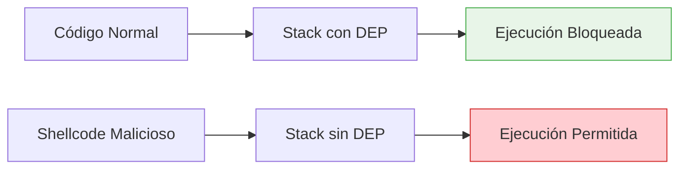

# 🛡️ Manual: Deshabilitar DEP en Windows 7 para Análisis de Vulnerabilidades

---

## 📝 Introducción

Este manual describe cómo deshabilitar **DEP (Data Execution Prevention)** en Windows 7 con fines educativos y de investigación en ciberseguridad. DEP es una característica de seguridad que previene la ejecución de código en áreas de memoria marcadas como no ejecutables, incluyendo el stack.

> [!warning] Advertencia importante
> Deshabilitar DEP reduce significativamente la seguridad del sistema y solo debe realizarse en entornos controlados de laboratorio para el estudio de vulnerabilidades y desarrollo de exploits.

---

## 🎯 ¿Qué es DEP y por qué deshabilitarlo?

### Definición de DEP

**Data Execution Prevention (DEP)** es una tecnología de seguridad que marca ciertas áreas de memoria como no ejecutables, previniendo que el código malicioso se ejecute en el stack o heap.

### Propósito en investigación de seguridad

- **Análisis de Buffer Overflow**: Estudiar cómo funcionan los ataques sin protecciones modernas
- **Desarrollo de exploits**: Crear proof-of-concepts en entornos controlados
- **Educación en seguridad**: Demostrar la importancia de las protecciones modernas
- **Testing de vulnerabilidades**: Validar exploits en condiciones específicas



---

## 📋 Requisitos Previos

### Sistema requerido
- **Windows 7** (32-bit o 64-bit)
- **Privilegios de administrador**
- **Acceso al símbolo del sistema (CMD)**

### Conocimientos previos
- Fundamentos de [[Buffer Overflow]]
- Conceptos básicos de [[Arquitectura x86_64]]
- Manejo de línea de comandos en Windows

> [!note] Ambiente de pruebas
> Realiza este procedimiento únicamente en:
> - Máquinas virtuales dedicadas a laboratorios
> - Sistemas aislados de la red
> - Entornos de investigación controlados

---

## 🔧 Procedimiento Paso a Paso

### Paso 1: Abrir símbolo del sistema como administrador

1. Click en **Inicio**
2. Escribir `cmd`
3. Click derecho en **Símbolo del sistema**
4. Seleccionar **"Ejecutar como administrador"**
5. Confirmar la elevación de privilegios (UAC)

> [!tip] Verificación de privilegios
> En la ventana de CMD debería aparecer: `C:\Windows\system32>`

### Paso 2: Verificar estado actual de DEP

```cmd
bcdedit.exe /enum {current}
```

> [!example] Buscar la línea `nx`
> - `nx OptIn`: DEP habilitado para programas esenciales
> - `nx OptOut`: DEP habilitado para todos excepto excepciones
> - `nx AlwaysOn`: DEP siempre activo (no se puede deshabilitar)
> - `nx AlwaysOff`: DEP deshabilitado

### Paso 3: Deshabilitar DEP

```cmd
bcdedit.exe /set {current} nx AlwaysOff
```

**Explicación del comando:**
- `bcdedit.exe`: Utilidad para modificar la configuración de arranque
- `/set`: Parámetro para establecer un valor
- `{current}`: Entrada de arranque actual
- `nx AlwaysOff`: Deshabilita completamente DEP

> [!info] Mensaje esperado
> Si el comando se ejecuta correctamente, aparecerá:
> ```
> La operación se completó correctamente.
> ```

### Paso 4: Reiniciar el sistema

```cmd
shutdown /r /t 0
```

> [!warning] Reinicio obligatorio
> Los cambios en la configuración de arranque solo toman efecto después de reiniciar el sistema.

---

## ✅ Verificación de la Configuración

### Método 1: Verificar con bcdedit

```cmd
bcdedit.exe /enum {current} | findstr nx
```

**Salida esperada:**
```
nx                  AlwaysOff
```

### Método 2: Verificar desde el Panel de Control

1. **Panel de Control** → **Sistema y seguridad** → **Sistema**
2. Click en **Configuración avanzada del sistema**
3. En **Rendimiento**, click **Configuración**
4. Pestaña **Prevención de ejecución de datos**
5. Debería mostrar: *"Activar DEP solo para programas y servicios esenciales de Windows"*

---

## ⚠️ Errores Comunes y Solución de Problemas

| Error | Causa | Solución |
|-------|-------|----------|
| "Acceso denegado" | CMD sin privilegios admin | Ejecutar CMD como administrador |
| "El sistema no puede encontrar el archivo especificado" | Comando mal escrito | Verificar sintaxis: `bcdedit.exe` |
| "La entrada especificada no existe" | Boot entry incorrecto | Usar `{current}` en lugar de otros identificadores |
| No hay cambios tras reinicio | Hardware no compatible | Verificar que el procesador soporte NX bit |

### Troubleshooting adicional

```cmd
# Ver todas las entradas de arranque
bcdedit.exe /enum

# Verificar si el procesador soporta DEP
wmic cpu get DataExecutionPrevention_Available
```

---

## 🔄 Restaurar DEP (Recomendado)

### Después del análisis, restaurar la protección

```cmd
# Habilitar DEP para programas esenciales (configuración segura)
bcdedit.exe /set {current} nx OptIn

# Habilitar DEP para todos los programas (máxima protección)
bcdedit.exe /set {current} nx AlwaysOn
```

> [!tip] Configuración recomendada
> Para uso normal del sistema, la configuración más segura es `nx AlwaysOn` o `nx OptIn`.

---

## 📊 Estados de DEP y su Seguridad

| Estado | Descripción | Nivel de Seguridad | Uso Recomendado |
|--------|-------------|-------------------|-----------------|
| `AlwaysOn` | DEP activo para todos los programas | ⭐⭐⭐⭐⭐ | Sistemas de producción |
| `OptIn` | DEP solo para programas esenciales | ⭐⭐⭐⭐ | Uso general |
| `OptOut` | DEP activo excepto para excepciones | ⭐⭐⭐ | Compatibilidad con software legacy |
| `AlwaysOff` | DEP completamente deshabilitado | ⭐ | Solo laboratorios de seguridad |

---

## 🧪 Verificación Final

### Checklist de verificación

- [ ] CMD ejecutado como administrador
- [ ] Comando `bcdedit.exe /set {current} nx AlwaysOff` ejecutado exitosamente
- [ ] Sistema reiniciado
- [ ] Configuración verificada con `bcdedit.exe /enum {current}`
- [ ] DEP aparece como `AlwaysOff`

### Test de funcionamiento (opcional)

Para verificar que DEP está realmente deshabilitado, puedes compilar y ejecutar un programa de prueba con stack overflow controlado en tu entorno de laboratorio.

---

## 🔒 Consideraciones de Seguridad

> [!danger] Riesgos de seguridad
> Con DEP deshabilitado, el sistema es vulnerable a:
> - Ataques de buffer overflow que ejecuten shellcode en el stack
> - Malware que explote vulnerabilidades de memoria
> - Exploits que no funcionarían con DEP habilitado
> 
> **Usar solo en entornos aislados y controlados**

> [!note] Recomendación final
> Después de completar tu análisis o investigación, **siempre restaura DEP** a su configuración segura usando `nx OptIn` o `nx AlwaysOn`.

---

## 🔗 Conceptos Relacionados

- [[Windows Security Features]]
- [[Exploit Development]]
- [[Memory Protection]]
- [[Windows Boot Configuration]]

---

> [!summary]
> La deshabilitación de DEP en Windows 7 es una técnica específica para investigación de vulnerabilidades que debe realizarse únicamente en entornos controlados y con propósitos educativos o de investigación legítima en ciberseguridad.