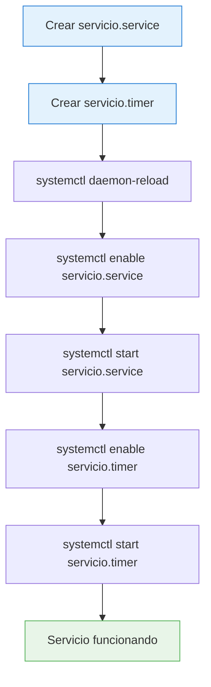

# ⏰ Servicios y Timers de Systemd: Automatización de Tareas

> [!info] Objetivo
> Crear servicios automatizados que se ejecuten periódicamente usando **systemd services** y **timers**. En este ejemplo, configuraremos un servicio que ejecute `apt update` cada 30 segundos.

---

## 📋 Tabla de Contenidos
- [Estructura de Archivos](#estructura-de-archivos)
- [Creación del Service](#creación-del-service)
- [Creación del Timer](#creación-del-timer)
- [Activación y Gestión](#activación-y-gestión)
- [Monitoreo y Troubleshooting](#monitoreo-y-troubleshooting)

---

## 📁 Estructura de Archivos

Los archivos de systemd se ubican en `/etc/systemd/system/` y siguen una nomenclatura específica:

```
/etc/systemd/system/
├── servicio.service     # Define QUÉ ejecutar
└── servicio.timer       # Define CUÁNDO ejecutar
```

> [!tip] Ubicaciones de systemd
> - `/etc/systemd/system/` - Servicios personalizados del administrador
> - `/lib/systemd/system/` - Servicios del sistema (no modificar)
> - `/run/systemd/system/` - Servicios temporales en tiempo de ejecución

---

## 🔧 Creación del Service

### Archivo: `/etc/systemd/system/servicio.service`

```ini
[Unit]
Description=Servicio de Actualizacion

[Service]
Type=oneshot
ExecStart=/usr/bin/apt update
```

### Explicación de parámetros

| Parámetro | Descripción | Valores comunes |
|-----------|-------------|-----------------|
| **`Description`** | Nombre descriptivo del servicio | Texto libre |
| **`Type`** | Tipo de servicio | `oneshot`, `simple`, `forking`, `notify` |
| **`ExecStart`** | Comando a ejecutar | Ruta absoluta al comando |

> [!example] Tipos de servicio más usados
> - **`oneshot`**: Para tareas que terminan rápidamente (scripts, comandos únicos)
> - **`simple`**: Para procesos que permanecen en primer plano
> - **`forking`**: Para demonios que se ejecutan en segundo plano

### Variantes del service con más opciones

```ini
[Unit]
Description=Servicio de Actualizacion Avanzado
After=network.target

[Service]
Type=oneshot
ExecStart=/usr/bin/apt update -y
ExecStartPre=/bin/echo "Iniciando actualización..."
ExecStartPost=/bin/echo "Actualización completada"
User=root
WorkingDirectory=/tmp
StandardOutput=journal
StandardError=journal

[Install]
WantedBy=multi-user.target
```

---

## ⏱️ Creación del Timer

### Archivo: `/etc/systemd/system/servicio.timer`

```ini
[Unit]
Description=Timer de Actualizacion

[Timer]
OnUnitActiveSec=30s
Unit=servicio.service

[Install]
WantedBy=timers.target
```

### Explicación de parámetros del Timer

| Parámetro | Descripción | Ejemplo |
|-----------|-------------|---------|
| **`OnUnitActiveSec`** | Intervalo después de la última ejecución | `30s`, `5m`, `1h`, `1d` |
| **`OnBootSec`** | Tiempo después del arranque | `10m` |
| **`OnCalendar`** | Programación basada en calendario | `daily`, `Mon *-*-* 09:00:00` |
| **`Unit`** | Servicio a activar | `servicio.service` |

### Ejemplos de programación temporal

```ini
# Cada 30 segundos
OnUnitActiveSec=30s

# Cada 5 minutos
OnUnitActiveSec=5m

# Diariamente a las 3:00 AM
OnCalendar=*-*-* 03:00:00

# Cada lunes a las 9:00 AM
OnCalendar=Mon *-*-* 09:00:00

# Cada primer día del mes
OnCalendar=*-*-01 00:00:00
```

---

## 🚀 Activación y Gestión

### Flujo completo de activación



### Comandos paso a paso

#### 1. Recargar configuración de systemd

```bash
# Necesario después de crear/modificar archivos .service o .timer
systemctl daemon-reload
```

#### 2. Habilitar y arrancar el servicio

```bash
# Habilitar servicio para que pueda ser llamado por el timer
systemctl enable servicio.service

# Arrancar servicio (opcional, se puede probar manualmente)
systemctl start servicio.service
```

#### 3. Habilitar y arrancar el timer

```bash
# Habilitar timer para que inicie automáticamente al arrancar el sistema
systemctl enable servicio.timer

# Iniciar el timer
systemctl start servicio.timer
```

---

## 📊 Monitoreo y Troubleshooting

### Comandos de monitoreo

```bash
# Ver estado del timer
systemctl status servicio.timer

# Ver próximas ejecuciones programadas
systemctl list-timers

# Ver logs del servicio
journalctl -u servicio.service

# Ver logs del timer
journalctl -u servicio.timer

# Ver logs en tiempo real
journalctl -u servicio.service -f
```

### Estados típicos

| Estado | Descripción | Acción |
|--------|-------------|--------|
| **active (waiting)** | Timer activo esperando próxima ejecución | ✅ Normal |
| **inactive (dead)** | Timer detenido | Iniciar con `systemctl start` |
| **failed** | Error en la configuración | Revisar logs con `journalctl` |

### Comandos de gestión adicionales

```bash
# Detener timer
systemctl stop servicio.timer

# Deshabilitar timer (no iniciará al arrancar)
systemctl disable servicio.timer

# Recargar configuración sin reiniciar
systemctl reload-or-restart servicio.timer

# Ver configuración efectiva
systemctl show servicio.timer

# Probar ejecución manual del servicio
systemctl start servicio.service
```

---

## 🔍 Verificación y Testing

### Script de verificación completa

```bash
#!/bin/bash
# verificar_servicio.sh

echo "=== Verificación de Servicio y Timer ==="

# Verificar archivos
echo "[1] Verificando archivos..."
ls -la /etc/systemd/system/servicio.*

# Verificar estado del servicio
echo -e "\n[2] Estado del servicio:"
systemctl status servicio.service --no-pager -l

# Verificar estado del timer
echo -e "\n[3] Estado del timer:"
systemctl status servicio.timer --no-pager -l

# Ver próximas ejecuciones
echo -e "\n[4] Próximas ejecuciones:"
systemctl list-timers servicio.timer

# Últimos logs
echo -e "\n[5] Últimos logs del servicio:"
journalctl -u servicio.service --no-pager -l -n 5
```

### Ejemplo de salida esperada

```bash
# systemctl status servicio.timer
● servicio.timer - Timer de Actualizacion
   Loaded: loaded (/etc/systemd/system/servicio.timer; enabled; vendor preset: enabled)
   Active: active (waiting) since Mon 2024-01-15 10:00:00 UTC; 2min ago
  Trigger: Mon 2024-01-15 10:02:30 UTC; 28s left
 Triggers: ● servicio.service

# systemctl list-timers servicio.timer
NEXT                         LEFT     LAST                         PASSED       UNIT            ACTIVATES
Mon 2024-01-15 10:02:30 UTC  28s left Mon 2024-01-15 10:02:00 UTC  2s ago       servicio.timer  servicio.service
```

---

## 🛠️ Casos de Uso Avanzados

### Servicio con manejo de errores

```ini
[Unit]
Description=Servicio con Manejo de Errores
After=network.target

[Service]
Type=oneshot
ExecStart=/usr/bin/apt update
Restart=on-failure
RestartSec=10s
StartLimitBurst=3
StartLimitIntervalSec=300

[Install]
WantedBy=multi-user.target
```

### Timer con múltiples horarios

```ini
[Unit]
Description=Timer con Multiples Horarios

[Timer]
OnCalendar=*-*-* 06:00:00
OnCalendar=*-*-* 18:00:00
Unit=servicio.service
Persistent=true

[Install]
WantedBy=timers.target
```

> [!warning] Consideraciones importantes
> - **Frecuencia alta**: Ejecutar `apt update` cada 30 segundos puede ser excesivo y consumir recursos
> - **Privilegios**: Comandos como `apt` requieren privilegios de root
> - **Red**: Asegúrate de que hay conectividad antes de ejecutar actualizaciones
> - **Logs**: Los servicios frecuentes pueden generar muchos logs

> [!tip] Mejores prácticas
> - Usar intervalos razonables (ej: `OnCalendar=daily` para actualizaciones)
> - Implementar logging apropiado
> - Probar servicios manualmente antes de automatizar
> - Monitorear el consumo de recursos del sistema