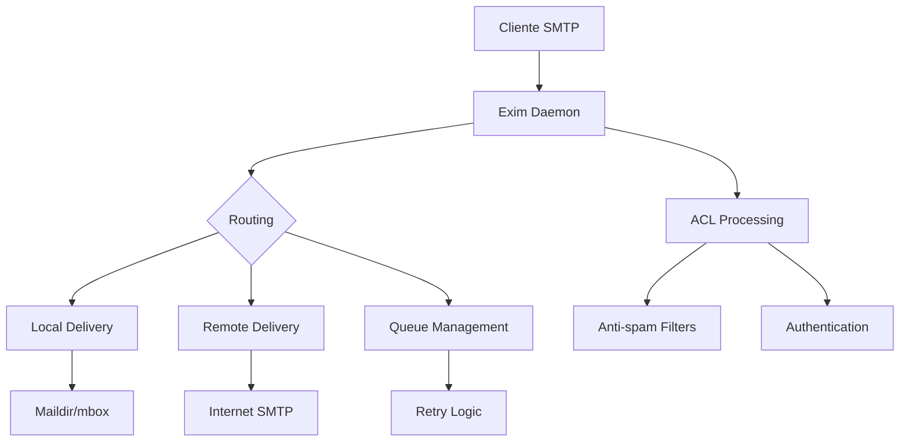

# Exim

## Definición

**Exim** (Exim Internet Mailer) es un **agente de transferencia de correo** (MTA - Mail Transfer Agent) gratuito y de código abierto desarrollado para sistemas Unix-like. Es responsable de enrutar, entregar y recibir mensajes de correo electrónico en servidores de correo.

---

## 🏛️ Historia y Desarrollo

> [!info] Origen
> Exim fue desarrollado por **Philip Hazel** en la Universidad de Cambridge en 1995 como una alternativa moderna a Sendmail, buscando mayor flexibilidad y facilidad de configuración.

### Cronología clave
- **1995**: Lanzamiento inicial en la Universidad de Cambridge
- **1998**: Adopción masiva en distribuciones Linux
- **2004**: Versión 4.x con soporte completo para IPv6
- **Presente**: Una de las implementaciones MTA más utilizadas mundialmente

---

## ⚙️ Características Principales

| Característica | Descripción |
|----------------|-------------|
| **Flexibilidad** | Sistema de configuración altamente personalizable |
| **Seguridad** | Soporte nativo para TLS/SSL y autenticación |
| **Rendimiento** | Optimizado para manejar grandes volúmenes de correo |
| **Compatibilidad** | Soporte para múltiples protocolos (SMTP, POP3, IMAP) |
| **Filtrado** | Sistema avanzado de filtros y reglas |

### Funcionalidades destacadas
- **Enrutamiento inteligente** de mensajes
- **Control de spam** y filtrado de contenido
- **Soporte para múltiples dominios**
- **Integración con bases de datos** (MySQL, PostgreSQL, LDAP)
- **Logs detallados** para auditoría y debugging

---

## 📁 Estructura de Archivos

### Archivos de configuración principales

```bash
/etc/exim4/
├── exim4.conf          # Configuración principal
├── conf.d/             # Directorio de configuración modular
├── domains/            # Configuración por dominio
└── users/              # Configuración por usuario
```

### Archivos de sistema

| Archivo | Propósito |
|---------|-----------|
| `/var/log/exim4/mainlog` | Log principal de actividad |
| `/var/spool/exim4/` | Cola de mensajes |
| `/usr/sbin/exim4` | Binario ejecutable principal |

---

## 🔧 Comandos Básicos

### Gestión del servicio

```bash
# Iniciar/detener/reiniciar Exim
systemctl start exim4
systemctl stop exim4
systemctl restart exim4

# Ver estado del servicio
systemctl status exim4
```

### Comandos de administración

```bash
# Ver cola de mensajes
exim4 -bp

# Procesar cola inmediatamente
exim4 -q

# Enviar mensaje de prueba
exim4 -v usuario@dominio.com

# Ver configuración actual
exim4 -bP

# Testear configuración
exim4 -bV
```

---

## 🛡️ Seguridad

### Características de seguridad

> [!warning] Consideraciones importantes
> Exim requiere configuración cuidadosa para evitar convertirse en un relay abierto que pueda ser abusado para spam.

- **Autenticación SMTP** (SMTP AUTH)
- **Cifrado TLS/SSL** para conexiones seguras
- **Control de acceso** basado en IP y dominios
- **Límites de velocidad** para prevenir spam
- **Integración con antivirus** y filtros anti-spam

### Configuración básica de seguridad

```bash
# Habilitar TLS
tls_on_connect_ports = 465
tls_certificate = /etc/ssl/certs/mail.crt
tls_privatekey = /etc/ssl/private/mail.key

# Restricciones de relay
hostlist relay_from_hosts = 127.0.0.1 : ::1 : 192.168.1.0/24
```

---

## 🔀 Comparación con otros MTA

| MTA | Ventajas | Desventajas |
|-----|----------|-------------|
| **Exim** | Muy configurable, documentación excelente | Curva de aprendizaje pronunciada |
| **[[Sendmail]]** | Maduro y estable | Configuración compleja |
| **[[Postfix]]** | Seguro por diseño, fácil configuración | Menos flexible que Exim |
| **[[Qmail]]** | Muy seguro | Licencia restrictiva |

---

## 📊 Arquitectura del Sistema



---

## 🌐 Casos de Uso Comunes

### Entornos típicos de implementación

1. **Servidores de correo corporativo**
2. **Hosting compartido** con múltiples dominios
3. **Sistemas de alta disponibilidad** con clustering
4. **Gateways de correo** con filtrado avanzado

> [!example] Ejemplo de uso
> Una universidad que gestiona correo para 50,000 usuarios con múltiples departamentos y políticas de seguridad diferenciadas.

---

## 🔗 Conceptos Relacionados

- [[MTA]] - Mail Transfer Agent
- [[SMTP]] - Simple Mail Transfer Protocol
- [[Postfix]] - MTA alternativo
- [[Sendmail]] - MTA clásico de Unix
- [[Dovecot]] - Servidor IMAP/POP3
- [[SpamAssassin]] - Sistema anti-spam
- [[ClamAV]] - Antivirus para servidores de correo

---

## 📚 Recursos Adicionales

> [!summary] Para profundizar
> - [Documentación oficial de Exim](https://www.exim.org/docs.html)
> - [Exim Wiki](https://wiki.exim.org/)
> - Libro: "The Exim SMTP Mail Server Official Guide"