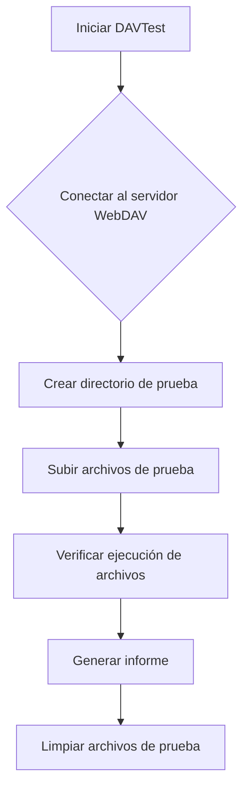

### **¿Qué es DAVTest?**

**DAVTest** es una herramienta de seguridad que se utiliza para **probar y explotar 
servidores WebDAV** (*Web Distributed Authoring and Versioning*). WebDAV es una extensión del protocolo HTTP que permite a los usuarios gestionar archivos en servidores web de manera remota. DAVTest ayuda a identificar vulnerabilidades en servidores WebDAV, como la capacidad de subir archivos maliciosos o ejecutar código remoto.

---

### **¿Para qué se usa DAVTest?**

1. **Pruebas de Penetración**:  
   DAVTest se usa para evaluar la seguridad de servidores WebDAV, identificando posibles vulnerabilidades.

2. **Explotación de Vulnerabilidades**:  
   La herramienta puede subir archivos de prueba al servidor para verificar si es posible ejecutar código o acceder a archivos no autorizados.

3. **Automatización de Pruebas**:  
   DAVTest automatiza el proceso de prueba, lo que facilita la identificación de problemas de seguridad.

---

### **Características Principales**

- **Subida de Archivos**: Prueba la capacidad de subir diferentes tipos de archivos (HTML, PHP, ASP, etc.) al servidor WebDAV.
- **Ejecución de Código**: Verifica si los archivos subidos pueden ser ejecutados en el servidor.
- **Informes Detallados**: Genera informes que resumen los resultados de las pruebas.
- **Fácil de Usar**: Interfaz de línea de comandos sencilla y directa.

---

### **Instalación**

DAVTest está disponible en distribuciones de Linux como Kali Linux. Puedes instalarlo usando:

```bash
sudo apt-get install davtest
```

---

### **Uso Básico**

#### **Sintaxis**
```bash
davtest -url <URL>
```

- **`-url`**: Especifica la URL del servidor WebDAV que deseas probar.

#### **Ejemplo**
```bash
davtest -url http://example.com/webdav
```

---

### **Opciones Adicionales**

| Opción          | Descripción                                                                 |
|-----------------|-----------------------------------------------------------------------------|
| `-auth`         | Especifica credenciales de autenticación (usuario:contraseña).              |
| `-directory`    | Especifica un directorio específico en el servidor WebDAV.                  |
| `-cleanup`      | Elimina los archivos subidos después de la prueba.                          |
| `-randfile`     | Usa nombres de archivo aleatorios para evitar detección.                    |
| `-uploadfile`   | Sube un archivo específico en lugar de los archivos de prueba predeterminados.|

---

### **Ejemplo de Salida**

```plaintext
********************************************************
 Testing DAV connection
OPEN            SUCCEED:                http://example.com/webdav
********************************************************
NOTE    Random string for this session: 5a3b1c
********************************************************
 Creating directory
MKCOL           SUCCEED:                Created http://example.com/webdav/DavTestDir_5a3b1c
********************************************************
 Sending test files
PUT     txt     SUCCEED:        http://example.com/webdav/DavTestDir_5a3b1c/davtest_5a3b1c.txt
PUT     html    SUCCEED:        http://example.com/webdav/DavTestDir_5a3b1c/davtest_5a3b1c.html
PUT     php     SUCCEED:        http://example.com/webdav/DavTestDir_5a3b1c/davtest_5a3b1c.php
********************************************************
 Checking for test file execution
EXEC    html    SUCCEED:        http://example.com/webdav/DavTestDir_5a3b1c/davtest_5a3b1c.html
EXEC    php     SUCCEED:        http://example.com/webdav/DavTestDir_5a3b1c/davtest_5a3b1c.php
********************************************************
 Cleaning up
DELETE  SUCCEED:                http://example.com/webdav/DavTestDir_5a3b1c
```

---

### **Resumen**

- **DAVTest**: Herramienta para probar y explotar servidores WebDAV.
- **Usos comunes**: Pruebas de penetración, explotación de vulnerabilidades, automatización de pruebas.
- **Características clave**: Subida de archivos, ejecución de código, informes detallados.

---

### **Diagrama de Funcionamiento de DAVTest**



---

### **Consejo Final**

Usa DAVTest para identificar y corregir vulnerabilidades en servidores WebDAV antes de que los atacantes puedan explotarlas. ¡Mantén tus servidores seguros! 😊

[[apuntes/herramientas/herramientas]]


[[WebDAV - Enumeración y Explotación]]