# 🔍 Immunity Debugger: Debugger Avanzado para Exploit Development

> [!info] Herramienta esencial de reversing
> **Immunity Debugger** es un debugger potente y especializado para Windows, diseñado específicamente para análisis de malware, ingeniería inversa y desarrollo de exploits. Es ampliamente utilizado por investigadores de seguridad y exploit developers debido a su interfaz gráfica intuitiva y capacidades avanzadas de scripting con Python.

---
## 📋 Tabla de Contenidos
- [Introducción](#introducción)
- [Instalación y Configuración](#instalación-y-configuración)
- [Interfaz y Componentes](#interfaz-y-componentes)
- [Comandos y Funcionalidades](#comandos-y-funcionalidades)
- [Casos de Uso en Ciberseguridad](#casos-de-uso-en-ciberseguridad)
- [Ejemplos Prácticos](#ejemplos-prácticos)
- [Tips y Buenas Prácticas](#tips-y-buenas-prácticas)

---

## 📝 Introducción

### ¿Qué es Immunity Debugger?

Immunity Debugger es un debugger de código nativo para Windows que combina las funcionalidades de un debugger tradicional con capacidades avanzadas de scripting en Python. Fue desarrollado por Immunity Inc. específicamente para investigadores de seguridad, permitiendo análisis dinámico detallado de aplicaciones y desarrollo de exploits.

### ¿Para qué sirve?

- **Análisis dinámico de malware**: Ejecutar y analizar comportamiento de software malicioso
- **Desarrollo de exploits**: Crear y probar exploits para vulnerabilidades de buffer overflow
- **Ingeniería inversa**: Analizar binarios para entender su funcionamiento interno
- **Debugging avanzado**: Depurar aplicaciones con capacidades superiores a debuggers estándar
- **Automatización**: Usar scripts Python para tareas repetitivas de análisis

### Contextos de uso en ciberseguridad


---

## 💾 Instalación y Configuración

### Requisitos del sistema

- **Sistema operativo**: Windows XP/7/8/10 (32-bit o 64-bit)
- **Privilegios**: Administrador requerido para debugging
- **Python**: 2.7.x (incluido en la instalación)
- **Espacio en disco**: ~100 MB mínimo

### Proceso de instalación

```bash
# 1. Descargar desde el sitio oficial de Immunity
# https://www.immunityinc.com/products/debugger/

# 2. Ejecutar el instalador como administrador
# ImmunityDebugger_1_85_setup.exe

# 3. Configurar Python environment (automático)
# 4. Instalar plugins adicionales (opcional)
```

### Configuración inicial recomendada

1. **Configurar directorios de trabajo**:
   - PyCommands: `C:\Program Files\Immunity Inc\Immunity Debugger\PyCommands\`
   - Logs: Directorio personalizado para almacenar resultados

2. **Instalar plugins esenciales**:
   - **mona.py**: Plugin fundamental para exploit development
   - **windbglib.py**: Biblioteca de funciones adicionales
   - **immlib**: Biblioteca principal de Immunity

---

## 🖥️ Interfaz y Componentes

### Ventanas principales

| Ventana | Función | Contenido |
|---------|---------|-----------|
| **CPU** | Vista principal del debugger | Disassembly, registros, dump, stack |
| **Memory Map** | Mapa de memoria del proceso | Direcciones, permisos, módulos |
| **Log** | Información de debugging | Mensajes del sistema y comandos |
| **Modules** | Módulos cargados | DLLs y ejecutables con direcciones |
| **Threads** | Hilos de ejecución | Estado y contexto de threads |

### Barra de herramientas principal

```bash
# Controles de ejecución
F9        # Run/Continue
F7        # Step Into
F8        # Step Over
F4        # Run to Cursor
Ctrl+F2   # Restart
Alt+F2    # Close/Attach to process
```

### Syntax de comandos básicos

```bash
# Comandos en la ventana de comandos (parte inferior)
!command_name           # Ejecutar comando Python
d address               # Dump memory at address
u address               # Unassemble at address
bp address              # Set breakpoint
bc breakpoint_id        # Clear breakpoint
g                       # Continue execution
```

---

## ⚙️ Comandos y Funcionalidades

### Comandos de navegación y análisis

| Comando | Descripción | Ejemplo |
|---------|-------------|---------|
| `d [address]` | Dump memory | `d esp` |
| `u [address]` | Unassemble code | `u eip` |
| `r` | Show registers | `r` |
| `k` | Show call stack | `k` |
| `lm` | List modules | `lm` |
| `bp [address]` | Set breakpoint | `bp 0x401000` |
| `bl` | List breakpoints | `bl` |
| `bc [id]` | Clear breakpoint | `bc 1` |
| `g [address]` | Go to address | `g` |
| `p` | Execute one instruction | `p` |
| `t` | Trace into | `t` |

### Comandos de búsqueda

```bash
# Buscar patrones en memoria
s -a 0x00400000 l?0x100000 "pattern"      # Buscar string ASCII
s -b 0x00400000 l?0x100000 41 42 43       # Buscar bytes hex
s -u 0x00400000 l?0x100000 "unicode"      # Buscar string Unicode

# Buscar instrucciones específicas
a 0x00400000 "jmp esp"                    # Buscar instruction
```

### Scripts Python integrados (PyCommands)

```python
# Ejemplo de comando Python personalizado
def main(args):
    imm = immlib.Debugger()
    # Obtener registros actuales
    regs = imm.getRegs()
    imm.log("EIP: 0x%08x" % regs['EIP'])
    imm.log("ESP: 0x%08x" % regs['ESP'])
    return "Command executed successfully"
```

---

## 🎯 Casos de Uso en Ciberseguridad

### 1. Desarrollo de exploits de Buffer Overflow

Immunity Debugger es la herramienta preferida para desarrollar exploits de stack-based buffer overflow, proporcionando visualización clara del stack y facilidades para encontrar offsets y bad characters.

### 2. Análisis dinámico de malware

Permite ejecutar malware en un entorno controlado para observar su comportamiento, APIs utilizadas, modificaciones al sistema y técnicas de evasión.

### 3. Reversing de aplicaciones

Análisis de aplicaciones comerciales o propietarias para entender algoritmos, encontrar vulnerabilidades o realizar auditorías de seguridad.

### 4. Investigación de vulnerabilidades

Descubrimiento y análisis de nuevas vulnerabilidades en software, desarrollo de proof-of-concepts y validación de parches de seguridad.

---

## 💻 Ejemplos Prácticos

### Ejemplo 1: Análisis básico de Buffer Overflow

```python
# Usando mona.py para encontrar offset en buffer overflow
!mona pattern_create 1000          # Crear patrón único de 1000 caracteres
!mona pattern_offset 0x42306142    # Encontrar offset cuando EIP es sobrescrito

# Encontrar bad characters
!mona bytearray -cpb "\x00\x0a\x0d"  # Crear array excluyendo null, LF, CR
!mona compare -f bytearray.bin -a 0x01002000  # Comparar con memoria

# Encontrar JMP ESP para redirection
!mona jmp -r esp                    # Buscar instrucciones JMP ESP
!mona jmp -r esp -m "module.dll"    # Buscar en módulo específico
```

> [!info] Explicación del workflow
> Este ejemplo muestra el proceso típico para desarrollar un exploit de buffer overflow:
> 1. **Pattern creation**: Genera un patrón único para determinar exactamente dónde se sobrescribe EIP
> 2. **Offset calculation**: Calcula el número exacto de bytes necesarios para controlar EIP
> 3. **Bad character detection**: Identifica caracteres que el programa no puede procesar
> 4. **Return address finding**: Localiza una dirección confiable para redirigir ejecución
> 
> El plugin mona.py automatiza estos procesos tediosos y propensos a errores.

### Ejemplo 2: Análisis de llamadas a APIs en malware

```python
# Script para monitorear llamadas a APIs críticas
def main(args):
    imm = immlib.Debugger()
    
    # APIs críticas para monitorear
    critical_apis = [
        "CreateFileA", "CreateFileW",
        "RegCreateKeyA", "RegCreateKeyW", 
        "CreateProcessA", "CreateProcessW",
        "VirtualAlloc", "WriteProcessMemory"
    ]
    
    # Establecer breakpoints en APIs
    for api in critical_apis:
        try:
            address = imm.getAddress(api)
            if address:
                imm.setBreakpoint(address)
                imm.log("Breakpoint set on %s at 0x%08x" % (api, address))
        except:
            imm.log("Could not find %s" % api)
    
    # Hook para capturar argumentos
    def api_hook(imm):
        regs = imm.getRegs()
        api_name = imm.getDisasmAt(regs['EIP'])
        imm.log("API Call: %s" % api_name)
        # Capturar argumentos desde stack
        stack = imm.getMemory(regs['ESP'], 20)
        imm.log("Stack dump: %s" % stack.encode('hex'))
    
    return "API monitoring enabled"

# Análisis de strings y recursos
!mona strings -s 10                # Buscar strings de al menos 10 caracteres
!mona modules                      # Listar módulos cargados con protecciones
```

> [!info] Explicación del análisis de malware
> Este script automatiza el monitoreo de APIs críticas durante la ejecución de malware:
> 1. **API monitoring**: Establece breakpoints en funciones críticas del sistema
> 2. **Argument capture**: Captura argumentos pasados a las APIs para análisis
> 3. **Behavior analysis**: Permite observar qué hace el malware sin análisis estático
> 4. **String analysis**: Extrae strings que pueden revelar funcionalidad o IoCs
> 
> Es fundamental para entender el comportamiento dinámico de samples de malware.

### Ejemplo 3: Desarrollo de ROP chain para bypass de DEP

```python
# Buscar gadgets ROP usando mona
!mona rop -m "module.dll" -n        # Buscar ROP gadgets sin protecciones ASLR

# Buscar gadgets específicos
!mona rop -m "kernel32.dll" -s "pop eax # ret"  # Buscar POP EAX; RET
!mona rop -m "ntdll.dll" -s "pop ebp # ret"     # Buscar POP EBP; RET

# Generar ROP chain automática
!mona rop -m "msvcr71.dll,user32.dll" -cp nonull  # Chain completa sin null bytes

# Analizar stack pivoting
!mona stackpivot -distance 1000      # Buscar stack pivot gadgets

# Verificar direcciones y protecciones
!mona modules -cm aslr=false,rebase=false  # Módulos sin ASLR/Rebase
!mona noaslr                         # Listar módulos sin ASLR
```

> [!info] Explicación de ROP development
> Este ejemplo muestra el desarrollo de cadenas ROP para bypass de DEP:
> 1. **Gadget discovery**: Busca secuencias de instrucciones útiles terminadas en RET
> 2. **Chain generation**: Crea cadenas de gadgets para ejecutar funciones específicas
> 3. **Protection bypass**: Localiza módulos sin protecciones modernas
> 4. **Stack manipulation**: Encuentra técnicas para controlar el stack pointer
> 
> ROP chains permiten ejecutar código en sistemas con DEP habilitado.

---

## 💡 Tips y Buenas Prácticas

### Optimización del workflow

```mermaid
graph TD
    A[Optimización Immunity] --> B[Configuración]
    A --> C[Plugins]
    A --> D[Scripting]
    A --> E[Análisis]
    
    B --> B1[Directorios de trabajo organizados]
    B --> B2[Símbolos y debugging info]
    B --> B3[Configuración de memoria]
    
    C --> C1[mona.py esencial]
    C --> C2[Scripts personalizados]
    C --> C3[Bibliotecas adicionales]
    
    D --> D1[Automatización de tareas]
    D --> D2[Logging estructurado]
    D --> D3[Análisis batch]
    
    E --> E1[Metodología sistemática]
    E --> E2[Documentación detallada]
    E --> E3[Reproducibilidad]
```



> [!tip] Mejores prácticas para exploit development
> **Configuración esencial:**
> - Instalar siempre el plugin mona.py: `!mona config -set workingfolder c:\mona`
> - Configurar símbolos de Windows para mejor análisis
> - Mantener logs organizados por proyecto o target
> - Usar snapshots de VM para estados reproducibles
> 
> **Metodología de análisis:**
> - Comenzar con análisis estático básico antes de debugging
> - Documentar cada paso del proceso de exploit development
> - Usar breakpoints condicionales para análisis eficiente
> - Automatizar tareas repetitivas con scripts Python

### Configuración avanzada

```python
# Configurar mona para proyecto específico
!mona config -set workingfolder c:\exploits\target_app
!mona config -set author "YourName"
!mona config -set createlogfile 1

# Configurar análisis de heap
!mona heap -h                    # Analizar heap
!mona chunks                     # Mostrar chunks del heap

# Configurar análisis de SEH
!mona seh                       # Buscar SEH overwrite opportunities
!mona sehchain                  # Mostrar cadena SEH actual
```

### Comandos esenciales de mona.py

| Comando | Propósito | Ejemplo |
|---------|-----------|---------|
| `pattern_create` | Crear patrón para offset | `!mona pattern_create 1000` |
| `pattern_offset` | Encontrar offset en patrón | `!mona pattern_offset 0x42306142` |
| `bytearray` | Generar array de bytes | `!mona bytearray -cpb "\x00\x0a"` |
| `compare` | Comparar memoria con array | `!mona compare -f bytearray.bin -a esp` |
| `jmp` | Buscar instrucciones JMP | `!mona jmp -r esp` |
| `rop` | Generar ROP chains | `!mona rop -m "module.dll"` |
| `header` | Analizar headers PE | `!mona header -f "app.exe"` |

### Errores comunes y soluciones

| Error | Causa | Solución |
|-------|-------|----------|
| "Access Denied" | Sin privilegios admin | Ejecutar como administrador |
| "Cannot attach to process" | Proceso ya siendo debugged | Terminar otros debuggers |
| "Python script error" | mona.py no instalado | Descargar e instalar mona.py |
| "Module not found" | ASLR o módulo no cargado | Verificar con `!mona modules` |
| "Bad characters detected" | Shellcode contiene bad chars | Regenerar con `-cpb` exclusions |

### Shortcuts de teclado útiles

```bash
# Navegación
Ctrl+G    # Go to address
F2        # Set/Remove breakpoint
F7        # Step into
F8        # Step over
F9        # Run
Ctrl+F9   # Execute until return

# Análisis
Alt+M     # Memory map window
Alt+L     # Log window
Alt+E     # Modules window
Ctrl+S    # Search in memory
Ctrl+B    # Binary search
```

---

## 📊 Comparación con otros debuggers

| Debugger | Ventajas | Desventajas | Mejor para |
|----------|----------|-------------|------------|
| **Immunity** | Interface intuitiva, mona.py, Python scripting | Solo Windows, no actualizado | Exploit development, Buffer overflow |
| **WinDbg** | Potente, Microsoft official, kernel debugging | Curva de aprendizaje alta | Kernel analysis, crash dumps |
| **x64dbg** | Open source, activamente desarrollado | Menos plugins | General purpose debugging |
| **OllyDbg** | Ligero, simple | Limitado, no soporta x64 | Analysis básico x86 |
| **GDB** | Multiplataforma, extensible | Principalmente Linux | Linux exploitation |

---

## 🔍 Metodología de uso en exploit development

### Flujo típico de desarrollo


### Checklist para exploit development

- [ ] Identificar vulnerabilidad (crash reproducible)
- [ ] Calcular offset exacto hasta EIP overwrite
- [ ] Identificar bad characters
- [ ] Encontrar dirección confiable para redirection
- [ ] Generar shellcode apropiado
- [ ] Probar exploit en entorno controlado
- [ ] Documentar proceso y resultados

---

## 🔗 Recursos y herramientas relacionadas

- **Plugin mona.py**: [Corelan Team mona](https://github.com/corelan/mona)
- **Shellcode generators**: msfvenom, custom generators
- **Pattern generators**: Metasploit pattern_create, mona pattern_create
- [[Buffer Overflow]] - Fundamentos teóricos
- [[Shellcode]] - Código ejecutable para payloads
- [[ROP (Return-Oriented Programming)]] - Técnica avanzada de bypass

---

## 📚 Recursos de aprendizaje

- [Corelan Team Exploit Writing Tutorials](https://www.corelan.be/index.php/articles/)
- [Immunity Debugger Documentation](https://www.immunityinc.com/products/debugger/)
- [Exploit-DB Papers](https://www.exploit-db.com/papers/)

> [!success] Puntos clave para recordar
> - **Immunity Debugger** es fundamental para exploit development en Windows
> - **mona.py** es un plugin imprescindible que automatiza tareas complejas
> - **La metodología sistemática** es crucial para desarrollo exitoso de exploits
> - **La documentación detallada** facilita la reproducibilidad y mejora continua
> - **El entorno controlado** es esencial para investigación segura