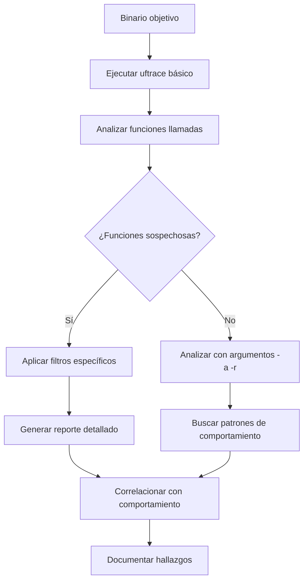

# uftrace - Trazador de Funciones y Profiler

---

## 🔍 Introducción

**uftrace** es un **trazador de funciones dinámico** para programas de espacio de usuario en Linux. Permite rastrear y analizar llamadas a funciones en tiempo real, proporcionando información detallada sobre el flujo de ejecución de aplicaciones.

### ¿Para qué sirve?

- **Análisis de flujo de programa** - Ver qué funciones se ejecutan y en qué orden
- **Profiling de rendimiento** - Identificar cuellos de botella y funciones lentas
- **Debugging avanzado** - Entender comportamientos complejos de aplicaciones
- **Análisis de malware** - Rastrear el comportamiento de binarios sospechosos
- **Ingeniería inversa** - Comprender la lógica interna de programas

### Contextos de uso en ciberseguridad

- **Análisis dinámico de malware** para identificar funcionalidades maliciosas
- **Reverse engineering** de aplicaciones y bibliotecas
- **Vulnerability research** para encontrar bugs en software
- **Forensics** para analizar comportamiento de binarios
- **Exploit development** para entender el flujo de ejecución

---

## ⚙️ Sintaxis y Parámetros

### Sintaxis básica

```bash
uftrace [opciones] comando [argumentos_del_comando]
```

### Parámetros más comunes

| Parámetro | Descripción | Ejemplo |
|-----------|-------------|---------|
| **-t, --time** | Muestra tiempo de ejecución de funciones | `uftrace -t ./programa` |
| **-D, --depth** | Limita la profundidad del trazado | `uftrace -D 5 ./programa` |
| **-F, --filter** | Filtra funciones específicas | `uftrace -F main ./programa` |
| **-N, --notrace** | Excluye funciones del trazado | `uftrace -N printf ./programa` |
| **-a, --auto-args** | Muestra argumentos automáticamente | `uftrace -a ./programa` |
| **-r, --auto-ret** | Muestra valores de retorno | `uftrace -r ./programa` |
| **-S, --sort** | Ordena por criterio específico | `uftrace -S total ./programa` |
| **--flame-graph** | Genera flame graph | `uftrace --flame-graph ./programa` |
| **-d, --data** | Directorio para guardar datos | `uftrace -d /tmp/trace ./programa` |

### Comandos de análisis posteriores

| Comando | Descripción | Ejemplo |
|---------|-------------|---------|
| **replay** | Reproduce trazado guardado | `uftrace replay -d /tmp/trace` |
| **report** | Genera reporte de análisis | `uftrace report -d /tmp/trace` |
| **info** | Información sobre el trazado | `uftrace info -d /tmp/trace` |
| **dump** | Volcado raw de datos | `uftrace dump -d /tmp/trace` |

---

## 🛠️ Casos de Uso Típicos

### 1. Trazado básico de funciones

```bash
uftrace ./mi_programa
```

> [!example] Salida típica
> ```
> # DURATION    TID     FUNCTION
>             [28531] | main() {
>    0.753 us [28531] |   printf();
>    1.430 us [28531] |   malloc();
>    0.234 us [28531] |   strcpy();
>    0.123 us [28531] |   free();
>    3.540 us [28531] | } /* main */
> ```

### 2. Análisis con tiempo y argumentos

```bash
uftrace -t -a -r ./programa
```

### 3. Trazado con filtros específicos

```bash
# Solo trazar funciones que contengan "crypt"
uftrace -F "*crypt*" ./programa_seguro
```

---

## 🔬 Ejemplos Prácticos

### Ejemplo 1: Análisis de malware sospechoso

```bash
# Compilar con información de debug si es posible
gcc -g -pg suspicious.c -o suspicious

# Trazar todas las funciones con argumentos y tiempos
uftrace -t -a -r -d /tmp/malware_trace ./suspicious

# Generar reporte detallado
uftrace report -d /tmp/malware_trace --sort total
```

**¿Qué buscamos?**
- Llamadas a funciones de red (`socket`, `connect`, `send`)
- Funciones de cifrado (`encrypt`, `decrypt`, `md5`, `sha`)
- Acceso a archivos (`open`, `read`, `write`)
- Creación de procesos (`fork`, `exec`, `system`)

### Ejemplo 2: Análisis de binario SUID para privilege escalation

```bash
# Trazar un binario con permisos SUID
uftrace -F "*setuid*,*setgid*,*exec*" /usr/bin/programa_suid

# Guardar trazado para análisis posterior
uftrace -d /tmp/suid_analysis -F "*set*,*exec*,*system*" /usr/bin/programa_suid
```

> [!warning] Precaución con SUID
> Ten cuidado al analizar binarios SUID, ya que pueden ejecutar con privilegios elevados.

### Ejemplo 3: Reverse engineering de algoritmo criptográfico

```bash
# Trazar funciones relacionadas con criptografía
uftrace -F "*crypt*,*hash*,*encrypt*,*decrypt*" -a -r ./crypto_app

# Generar flame graph para visualizar el flujo
uftrace --flame-graph -d /tmp/crypto_trace ./crypto_app
```

---

## 🧭 Flujo de Trabajo en Análisis de Seguridad



---

## 🎯 Análisis Específicos por Tipo de Amenaza

### Detección de backdoors

```bash
# Buscar funciones de red y ejecución de comandos
uftrace -F "*socket*,*connect*,*bind*,*listen*,*exec*,*system*" ./programa
```

### Análisis de rootkits

```bash
# Rastrear modificaciones del sistema
uftrace -F "*write*,*chmod*,*chown*,*mount*,*ptrace*" ./rootkit_suspect
```

### Keyloggers y spyware

```bash
# Detectar captura de entrada y acceso a archivos
uftrace -F "*read*,*keylog*,*input*,*log*" -a ./spyware_suspect
```

---

## 💡 Tips y Buenas Prácticas

### ✅ Optimización del análisis

> [!tip] Mejores prácticas
> - Usa `-D` para limitar profundidad y reducir ruido
> - Combina con `grep` para filtrar salida: `uftrace ./programa | grep "crypto"`
> - Guarda trazados importantes con `-d` para análisis posterior
> - Usa flame graphs para visualizar mejor el flujo de ejecución

### ⚠️ Consideraciones de rendimiento

> [!warning] Impacto en rendimiento
> uftrace puede ralentizar significativamente la ejecución del programa. Para análisis de malware, esto puede ser beneficioso ya que dificulta técnicas de evasión basadas en tiempo.

### 🔍 Combinaciones útiles con otras herramientas

```bash
# Combinar con strace para análisis completo
uftrace ./programa > funciones.log &
strace -o syscalls.log ./programa

# Analizar junto con ltrace
uftrace -F "*lib*" ./programa > uftrace.log
ltrace ./programa > ltrace.log 2>&1
```

---

## 📊 Análisis de Reportes

### Generar reportes detallados

```bash
# Reporte ordenado por tiempo total
uftrace report -d /tmp/trace --sort total

# Reporte con estadísticas por función
uftrace report -d /tmp/trace --stat

# Información del trazado
uftrace info -d /tmp/trace
```

### Visualización con flame graphs

```bash
# Generar flame graph
uftrace record -d /tmp/trace ./programa
uftrace report -d /tmp/trace --flame-graph > flamegraph.svg
```

---

## 🚨 Errores Comunes y Soluciones

| Error | Causa | Solución |
|-------|-------|----------|
| `failed to find 'mcount'` | Binario no compilado con `-pg` | Recompilar con `-g -pg` si es posible |
| `permission denied` | Falta de permisos | Ejecutar como root o ajustar permisos |
| `trace data too large` | Demasiadas funciones trazadas | Usar filtros `-F` o limitar profundidad `-D` |
| `no trace data found` | Directorio de trace vacío | Verificar que el programa se ejecutó correctamente |

---

## 🛡️ Técnicas Avanzadas de Análisis

### Análisis de exploits

```bash
# Rastrear funciones vulnerables comunes
uftrace -F "*strcpy*,*sprintf*,*gets*,*memcpy*" ./vulnerable_app

# Buscar técnicas de Return-to-libc
uftrace -F "*system*,*exec*,*mprotect*" ./exploit_test
```

### Detección de técnicas anti-análisis

```bash
# Buscar técnicas de evasión
uftrace -F "*ptrace*,*gettimeofday*,*clock*,*sleep*" ./evasive_malware
```

---

## 📈 Casos de Uso Avanzados

### Script de análisis automatizado

```bash
#!/bin/bash
# analyze_binary.sh

BINARY=$1
TRACE_DIR="/tmp/analysis_$(date +%s)"

echo "[+] Analizando $BINARY..."

# Trazado completo
uftrace -t -a -r -d $TRACE_DIR $BINARY

# Generar reportes
echo "[+] Generando reportes..."
uftrace report -d $TRACE_DIR --sort total > ${BINARY}_report.txt
uftrace report -d $TRACE_DIR --flame-graph > ${BINARY}_flame.svg

# Buscar funciones sospechosas
echo "[+] Buscando funciones sospechosas..."
uftrace dump -d $TRACE_DIR | grep -E "(crypt|socket|exec|system|ptrace)" > ${BINARY}_suspicious.txt

echo "[+] Análisis completado en $TRACE_DIR"
```

---

## 📚 Herramientas Relacionadas

- **`strace`**: Trazado de llamadas al sistema
- **`ltrace`**: Trazado de llamadas a bibliotecas
- **`gdb`**: Debugger interactivo
- **`valgrind`**: Análisis de memoria y profiling
- **`perf`**: Herramientas de profiling del kernel

---

> [!success] Resumen
> `uftrace` es una herramienta poderosa para análisis dinámico de programas. Su capacidad para rastrear el flujo de funciones lo hace invaluable para reverse engineering, análisis de malware y research de vulnerabilidades. La combinación con otras herramientas de análisis proporciona una visión completa del comportamiento de aplicaciones.