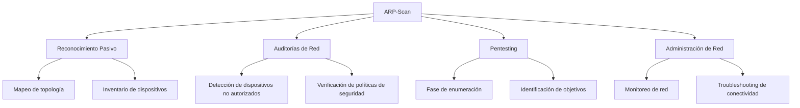
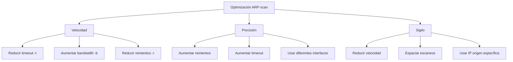

# 🔍 ARP-Scan: Herramienta de Reconocimiento de Red

> [!info] Herramienta esencial de reconocimiento
> **arp-scan** es una utilidad de línea de comandos que utiliza el protocolo [[ARP - Address Resolution Protocol]] para detectar hosts activos en una red local. Es una herramienta fundamental para el reconocimiento de redes en las fases iniciales de un pentesting.

---

## 📋 Tabla de Contenidos
- [Introducción](#introducción)
- [Instalación](#instalación)
- [Sintaxis Básica](#sintaxis-básica)
- [Parámetros y Opciones](#parámetros-y-opciones)
- [Casos de Uso](#casos-de-uso)
- [Ejemplos Prácticos](#ejemplos-prácticos)
- [Tips y Buenas Prácticas](#tips-y-buenas-prácticas)

---

## 📝 Introducción

### ¿Qué es arp-scan?

ARP-scan es una herramienta de código abierto que envía solicitudes ARP a direcciones IP en una red para determinar qué hosts están activos. A diferencia de otras herramientas de escaneo, funciona únicamente en la capa 2 (enlace de datos) del modelo OSI, lo que la hace extremadamente rápida y silenciosa.

### ¿Para qué sirve?

- **Descubrimiento de hosts activos** en la red local
- **Mapeo de dispositivos** conectados a la misma red
- **Identificación de fabricantes** de tarjetas de red mediante OUI (Organizationally Unique Identifier)
- **Detección de direcciones IP duplicadas**
- **Verificación de conectividad** en redes locales

### Contextos de uso en ciberseguridad



> [!note] Ventajas del protocolo ARP
> ARP funciona a nivel de enlace de datos y es necesario para la comunicación en redes Ethernet. Esto significa que:
> - Es difícil de bloquear o filtrar
> - Funciona independientemente de firewalls de capa 3/4
> - Proporciona resultados muy rápidos
> - Es menos detectable que otros métodos de escaneo

---

## 💾 Instalación

### Linux (Debian/Ubuntu)
```bash
sudo apt-get update
sudo apt-get install arp-scan
```

### Linux (Red Hat/CentOS/Fedora)
```bash
sudo yum install arp-scan
# o para versiones más nuevas
sudo dnf install arp-scan
```

### Arch Linux
```bash
sudo pacman -S arp-scan
```

### Verificación de instalación
```bash
arp-scan --version
```

---

## 🖥️ Sintaxis Básica

```bash
arp-scan [opciones] [objetivo]
```

### Formato del objetivo

- **Rango CIDR**: `192.168.1.0/24`
- **Rango con guión**: `192.168.1.1-192.168.1.254`
- **IP específica**: `192.168.1.100`
- **Archivo con IPs**: `-f archivo.txt`
- **Red local automática**: `-l` (detecta automáticamente la red local)

> [!example] Uso básico
> ```bash
> # Escanear toda la red local
> arp-scan -l
> 
> # Escanear una red específica
> arp-scan 192.168.1.0/24
> ```

---

## ⚙️ Parámetros y Opciones

### Opciones principales

| Opción | Descripción | Ejemplo |
|--------|-------------|---------|
| `-l`, `--local` | Escanea todas las redes locales | `arp-scan -l` |
| `-I`, `--interface` | Especifica la interfaz de red | `arp-scan -I eth0 192.168.1.0/24` |
| `-t`, `--timeout` | Tiempo de espera en milisegundos | `arp-scan -t 500 192.168.1.0/24` |
| `-r`, `--retry` | Número de reintentos | `arp-scan -r 3 192.168.1.0/24` |
| `-g`, `--grtt` | Global Request Time To live | `arp-scan -g 500 192.168.1.0/24` |
| `-b`, `--bandwidth` | Ancho de banda en paquetes/segundo | `arp-scan -b 1000 192.168.1.0/24` |
| `-f`, `--file` | Lee objetivos desde archivo | `arp-scan -f targets.txt` |
| `-q`, `--quiet` | Modo silencioso (solo resultados) | `arp-scan -q 192.168.1.0/24` |
| `-x`, `--hex` | Muestra direcciones MAC en hexadecimal | `arp-scan -x 192.168.1.0/24` |
| `-v`, `--verbose` | Salida detallada | `arp-scan -v 192.168.1.0/24` |
| `-D`, `--duplicate` | Muestra solo direcciones IP duplicadas | `arp-scan -D 192.168.1.0/24` |

### Opciones de salida

| Opción | Descripción | Uso |
|--------|-------------|-----|
| `-N`, `--numeric` | Solo direcciones IP (sin resolución DNS) | `arp-scan -N 192.168.1.0/24` |
| `-R`, `--rtt` | Muestra tiempo de respuesta | `arp-scan -R 192.168.1.0/24` |
| `-u`, `--resolve` | Resuelve direcciones IP a nombres | `arp-scan -u 192.168.1.0/24` |
| `-a`, `--arpspa` | Usa dirección IP específica como origen | `arp-scan -a 192.168.1.50 192.168.1.0/24` |

---

## 🎯 Casos de Uso

### 1. Reconocimiento inicial de red

Durante la fase de enumeración de un pentesting, arp-scan es ideal para:
- Identificar hosts activos rápidamente
- Crear un mapa inicial de la red
- Identificar dispositivos de red (routers, switches, IoT)

### 2. Detección de dispositivos no autorizados

En auditorías de seguridad:
- Comparar dispositivos encontrados con inventario oficial
- Detectar dispositivos rogue o no autorizados
- Identificar puntos de acceso wireless no autorizados

### 3. Verificación de configuraciones de red

Para administradores de red:
- Verificar asignaciones de IP estáticas
- Detectar conflictos de IP
- Validar configuraciones DHCP

---

## 💻 Ejemplos Prácticos

### Ejemplo 1: Reconocimiento básico de red local

```bash
# Escanear automáticamente todas las redes locales
arp-scan -l

# Escanear una red específica con información detallada
arp-scan -v 192.168.1.0/24
```

> [!info] Explicación
> El primer comando (`-l`) detecta automáticamente todas las interfaces de red activas y escanea sus respectivas redes. Es útil cuando no conoces la configuración exacta de la red.
> 
> El segundo comando escanea específicamente la red 192.168.1.0/24 con salida verbose (`-v`), mostrando información adicional como:
> - Número de hosts escaneados
> - Tiempo total del escaneo
> - Estadísticas de respuesta
> 
> **Salida típica:**
> ```
> Interface: eth0, datalink type: EN10MB (Ethernet)
> Starting arp-scan 1.9.7 with 256 hosts (http://www.nta-monitor.com/tools/arp-scan/)
> 192.168.1.1     aa:bb:cc:dd:ee:ff       Cisco Systems, Inc.
> 192.168.1.10    11:22:33:44:55:66       Dell Inc.
> 192.168.1.15    77:88:99:aa:bb:cc       Apple, Inc.
> 
> 3 packets received by filter, 0 packets dropped by kernel
> Ending arp-scan 1.9.7: 256 hosts scanned in 2.85 seconds (89.82 hosts/sec). 3 responded
> ```

### Ejemplo 2: Escaneo optimizado para pentesting

```bash
# Escaneo rápido y silencioso para identificar objetivos
arp-scan -q -t 100 -r 2 192.168.1.0/24

# Escaneo con resolución DNS para identificar servicios
arp-scan -u -R 192.168.1.0/24

# Guardar resultados en formato procesable
arp-scan -q 192.168.1.0/24 | awk '{print $1}' | tail -n +3 | head -n -1 > targets.txt
```

> [!info] Explicación
> **Primer comando**: Escaneo optimizado para velocidad
> - `-q`: Modo silencioso (solo muestra hosts encontrados)
> - `-t 100`: Timeout reducido a 100ms para mayor velocidad
> - `-r 2`: Solo 2 reintentos (reduce tiempo total)
> 
> **Segundo comando**: Escaneo con información adicional
> - `-u`: Resuelve IPs a nombres DNS
> - `-R`: Muestra tiempo de respuesta (útil para identificar dispositivos lentos)
> 
> **Tercer comando**: Procesamiento de resultados
> - Extrae solo las direcciones IP
> - Elimina cabeceras y pies del output
> - Guarda en archivo para uso posterior con otras herramientas

### Ejemplo 3: Detección de seguridad y auditoría

```bash
# Detectar direcciones IP duplicadas (problema de configuración)
arp-scan -D 192.168.1.0/24

# Escaneo desde una IP específica (spoofing de origen)
arp-scan -a 192.168.1.100 192.168.1.0/24

# Monitoreo continuo de la red (script de vigilancia)
while true; do
    echo "=== Escaneo $(date) ==="
    arp-scan -q -l | tee -a network_monitoring.log
    sleep 300  # Esperar 5 minutos
done
```

> [!info] Explicación
> **Primer comando**: Detecta conflictos de IP
> - `-D`: Solo muestra IPs que responden desde múltiples MACs
> - Útil para detectar problemas de configuración o ataques de spoofing
> 
> **Segundo comando**: Spoofing de dirección origen
> - `-a 192.168.1.100`: Envía paquetes ARP como si vinieran de esa IP
> - Útil para evadir some tipos de filtering o para pruebas de seguridad
> 
> **Tercer comando**: Monitoreo automatizado
> - Ejecuta escaneos cada 5 minutos
> - Registra resultados con timestamp
> - Útil para detectar dispositivos que se conectan/desconectan

---

## 💡 Tips y Buenas Prácticas

### Optimización del rendimiento



> [!tip] Consejos para optimizar el uso
> **Para redes grandes:**
> - Usa `arp-scan -q -t 50 -r 1` para escaneos muy rápidos
> - Considera dividir la red en subredes más pequeñas
> - Usa bandwidth limiting con `-b` en redes congestionadas
> 
> **Para máxima precisión:**
> - Aumenta reintentos: `-r 5`
> - Usa timeout más largo: `-t 2000`
> - Ejecuta múltiples escaneos y compara resultados
> 
> **Para sigilo:**
> - Reduce la velocidad: `-b 100` (100 paquetes/segundo)
> - Espacía los escaneos en el tiempo
> - Usa diferentes IPs de origen con `-a`

### Errores comunes y soluciones

| Error | Causa | Solución |
|-------|-------|----------|
| `arp-scan: pcap_lookupdev: no suitable device found` | Sin permisos de administrador | Ejecutar con `sudo` |
| `bind: Address already in use` | Conflicto con otra aplicación | Especificar interfaz con `-I` |
| No se detectan hosts conocidos | Timeout muy bajo | Aumentar timeout con `-t` |
| Resultados inconsistentes | Cache ARP del sistema | Limpiar cache: `sudo ip neigh flush all` |
| Error de interfaz no encontrada | Interfaz especificada incorrecta | Verificar con `ip addr show` |

### Integración con otras herramientas

```bash
# Combinar con nmap para escaneo de puertos
arp-scan -q 192.168.1.0/24 | awk '{print $1}' | tail -n +3 | head -n -1 | xargs -I {} nmap -sS {}

# Usar con masscan para escaneos masivos
arp-scan -q -l | awk '{print $1}' | tail -n +3 | head -n -1 > live_hosts.txt
masscan -iL live_hosts.txt -p 22,80,443 --rate 1000

# Combinar con script de análisis
arp-scan -q 192.168.1.0/24 | while read ip mac vendor; do
    if [[ -n "$ip" ]]; then
        echo "Analyzing $ip ($vendor)"
        # Aquí podrías añadir más análisis
    fi
done
```

### Consideraciones de seguridad

> [!warning] Aspectos importantes
> - **Detección**: ARP-scan es detectable en logs de seguridad avanzados
> - **Legalidad**: Solo usar en redes propias o con autorización explícita
> - **Impacto**: En redes muy grandes puede generar tráfico considerable
> - **Limitaciones**: Solo funciona en el mismo segmento de red (broadcast domain)

> [!note] Detección y contramedidas
> Los administradores pueden detectar escaneos ARP mediante:
> - Monitoreo de traffic ARP anómalo
> - Análisis de patrones de solicitud ARP
> - Herramientas como `arpwatch` o `arpalert`
> - IDS/IPS configurados para detectar escaneos

---

## 📊 Comparación con otras herramientas

| Herramienta | Velocidad | Sigilo | Alcance | Información |
|-------------|-----------|--------|---------|-------------|
| **arp-scan** | ⭐⭐⭐⭐⭐ | ⭐⭐⭐⭐ | Red local | MAC + Vendor |
| **nmap -sn** | ⭐⭐⭐ | ⭐⭐⭐ | Multi-red | IP + Puertos |
| **fping** | ⭐⭐⭐⭐ | ⭐⭐⭐⭐⭐ | Multi-red | Solo IP |
| **netdiscover** | ⭐⭐⭐ | ⭐⭐ | Red local | MAC + Vendor |

> [!success] Cuándo usar arp-scan
> - **Reconocimiento inicial** de red local
> - **Escaneos rápidos** de segmentos de red
> - **Identificación de fabricantes** de dispositivos
> - **Detección de duplicados** de IP
> - **Auditorías de red** básicas

---

## 🔗 Referencias adicionales

- Documentación oficial: `man arp-scan`
- Protocolo ARP: RFC 826
- Herramientas complementarias: nmap, netdiscover, arpwatch
- Análisis de tráfico: Wireshark, tcpdump