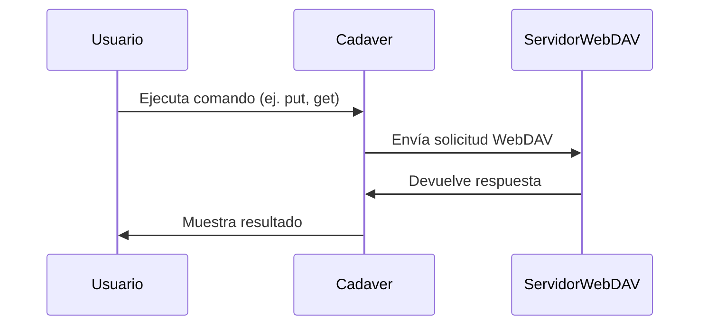

### **¿Qué es Cadaver?**

**Cadaver** es una herramienta de línea de comandos que funciona como un **cliente WebDAV** (Web Distributed Authoring and Versioning). Permite a los usuarios interactuar con servidores WebDAV para realizar operaciones como subir, descargar, eliminar y gestionar archivos de manera remota. Es especialmente útil para pruebas de seguridad y administración de servidores WebDAV.

---

### **¿Para qué se usa Cadaver?**

1. **Administración de Archivos**:  
   Cadaver permite a los usuarios gestionar archivos en un servidor WebDAV, incluyendo subir, descargar, eliminar y mover archivos.

2. **Pruebas de Seguridad**:  
   Los profesionales de seguridad usan Cadaver para probar la configuración y seguridad de servidores WebDAV.

3. **Automatización de Tareas**:  
   Cadaver puede ser usado en scripts para automatizar tareas de gestión de archivos en servidores WebDAV.

---

### **Características Principales**

- **Interfaz de Línea de Comandos**: Fácil de usar y automatizar.
- **Operaciones de Archivos**: Soporta operaciones como `get`, `put`, `delete`, `move`, `copy`, etc.
- **Autenticación**: Soporta autenticación básica y digest.
- **Scripting**: Puede ser usado en scripts para automatizar tareas.

---

### **Instalación**

Cadaver está disponible en la mayoría de las distribuciones de Linux. Puedes instalarlo usando:

```bash
sudo apt-get install cadaver
```

---

### **Uso Básico**

#### **Sintaxis**
```bash
cadaver <URL>
```

- **`URL`**: La URL del servidor WebDAV al que deseas conectarte.

#### **Ejemplo**
```bash
cadaver http://example.com/webdav
```

---

### **Comandos Principales**

| Comando       | Descripción                                                                 |
|---------------|-----------------------------------------------------------------------------|
| `ls`          | Lista los archivos y directorios en el servidor.                            |
| `get`         | Descarga un archivo del servidor.                                           |
| `put`         | Sube un archivo al servidor.                                                |
| `delete`      | Elimina un archivo o directorio en el servidor.                             |
| `move`        | Mueve o renombra un archivo o directorio en el servidor.                    |
| `copy`        | Copia un archivo o directorio en el servidor.                               |
| `mkdir`       | Crea un nuevo directorio en el servidor.                                    |
| `rmdir`       | Elimina un directorio en el servidor.                                       |
| `quit`        | Cierra la sesión y sale de Cadaver.                                         |

---

### **Ejemplo de Uso**

1. **Conectar al Servidor WebDAV**:
   ```bash
   cadaver http://example.com/webdav
   ```

2. **Listar Archivos**:
   ```bash
   dav:/webdav/> ls
   ```

3. **Subir un Archivo**:
   ```bash
   dav:/webdav/> put archivo_local.txt
   ```

4. **Descargar un Archivo**:
   ```bash
   dav:/webdav/> get archivo_remoto.txt
   ```

5. **Eliminar un Archivo**:
   ```bash
   dav:/webdav/> delete archivo_remoto.txt
   ```

6. **Salir**:
   ```bash
   dav:/webdav/> quit
   ```

---

### **Resumen**

- **Cadaver**: Cliente WebDAV de línea de comandos para gestionar archivos en servidores WebDAV.
- **Usos comunes**: Administración de archivos, pruebas de seguridad, automatización de tareas.
- **Características clave**: Interfaz de línea de comandos, operaciones de archivos, soporte de autenticación.

---

### **Diagrama de Funcionamiento de Cadaver**



---

### **Consejo Final**

Cadaver es una herramienta poderosa para gestionar y probar servidores WebDAV. Asegúrate de usarla de manera responsable y siempre con permiso del propietario del servidor.

[[herramientas]]
[[WebDAV - Enumeración y Explotación]]