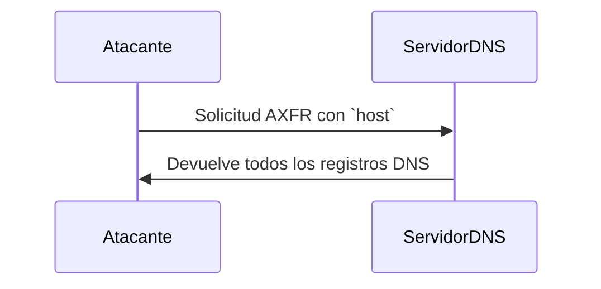

# **Uso del Comando `host` para Transferencia de Zona (AXFR)**

---

### **¿Qué es el Comando `host`?**

`host` es una herramienta de línea de comandos en Linux que se utiliza para realizar **consultas DNS**. Es más sencilla que `dig`, pero igualmente efectiva para tareas básicas como buscar direcciones IP, nombres de dominio y, en este caso, intentar una transferencia de zona.

---

### **Sintaxis Básica**

```bash
host [opciones] nombre [servidor]
```

- **`nombre`**: El dominio o dirección IP que quieres consultar.
- **`servidor`**: El servidor DNS al que deseas enviar la consulta (opcional).

---

### **Uso de `host` para Transferencia de Zona (AXFR)**

Para intentar una transferencia de zona con `host`, usa la opción `-t` seguida de `AXFR` y especifica el servidor DNS.

#### **Sintaxis**
```bash
host -t AXFR dominio servidor_dns
```

- **`dominio`**: El dominio del que deseas obtener la transferencia de zona.
- **`servidor_dns`**: El servidor DNS que gestiona la zona.

---

### **Ejemplo Práctico**

Usando el mismo archivo `vulhub.db` que proporcionaste, aquí está cómo se vería una transferencia de zona con `host`:

#### **Solicitud AXFR con `host`**
```bash
host -t AXFR vulhub.org ns.vulhub.org
```

#### **Respuesta del Servidor**
Si el servidor DNS está mal configurado y permite transferencias de zona no autorizadas, la salida podría ser algo como esto:

```plaintext
Trying "vulhub.org"
Using domain server:
Name: ns.vulhub.org
Address: 10.0.0.1#53
Aliases: 

vulhub.org        3600    IN  SOA ns.vulhub.org. sa.vulhub.org. 1 3600 600 86400 3600
vulhub.org        3600    IN  NS  ns1.vulhub.org.
vulhub.org        3600    IN  NS  ns2.vulhub.org.
ns1.vulhub.org    3600    IN  A   10.0.0.1
ns2.vulhub.org    3600    IN  A   10.0.0.2
www.vulhub.org    3600    IN  A   10.1.1.1
sa.vulhub.org     3600    IN  A   10.1.1.2
cdn.vulhub.org    3600    IN  A   10.1.1.3
admin.vulhub.org  3600    IN  A   10.1.1.4
wap.vulhub.org    3600    IN  CNAME   www.vulhub.org.
static.vulhub.org 3600    IN  CNAME   www.vulhub.org.
git.vulhub.org    3600    IN  A   10.1.1.4
vulhub.org        3600    IN  SOA ns.vulhub.org. sa.vulhub.org. 1 3600 600 86400 3600
```

---

### **Comparación entre `host` y `dig`**

| Característica          | `host`                                      | `dig`                                      |
|-------------------------|---------------------------------------------|-------------------------------------------|
| **Facilidad de Uso**    | Más sencillo y directo.                     | Más potente y flexible.                   |
| **Salida**              | Formato más legible y conciso.              | Formato más detallado y técnico.          |
| **Consultas Avanzadas** | Limitado a consultas básicas.               | Soporta consultas avanzadas y opciones.   |
| **Transferencia de Zona** | Soporta AXFR con `-t AXFR`.                | Soporta AXFR con `AXFR`.                  |

---

### **¿Por qué Usar `host`?**

- **Simplicidad**: Es más fácil de usar para consultas rápidas y sencillas.
- **Legibilidad**: La salida es más concisa y fácil de entender.
- **Rapidez**: Ideal para tareas básicas de consulta DNS.

---

### **Resumen**

- **`host`**: Herramienta sencilla para consultas DNS y transferencias de zona.
- **Uso para AXFR**: `host -t AXFR dominio servidor_dns`.
- **Comparación**: Más simple que `dig`, pero menos potente.

---

### **Diagrama de Uso de `host` para AXFR**



---

### **Consejo Final**

Si buscas una herramienta rápida y sencilla para consultas DNS básicas, `host` es una excelente opción. Para tareas más avanzadas, `dig` es más adecuado.

[[apuntes/herramientas/herramientas]]
[[Ataques de Transferencia de Zona (AXFR)]]