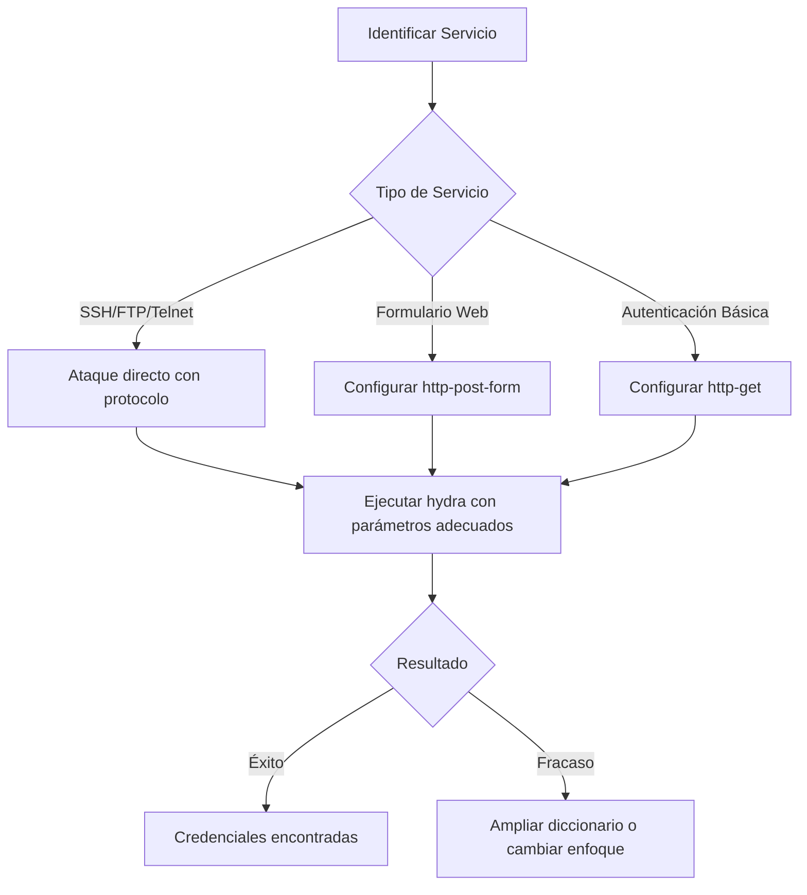
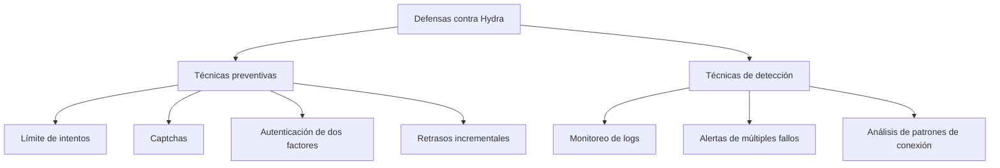

# Hydra - Herramienta de Fuerza Bruta Paralela

## Introducción

> [!info] ¿Qué es Hydra?
> **Hydra** es una de las herramientas de cracking de credenciales más potentes y versátiles disponibles en el mundo del pentesting. Desarrollada por van Hauser para el proyecto THC (The Hacker's Choice), es una herramienta de fuerza bruta paralela que puede atacar múltiples protocolos de red y servicios de autenticación.

Hydra destaca por su:
- **Velocidad**: Capacidad de ejecutar múltiples intentos en paralelo
- **Versatilidad**: Soporta más de 50 protocolos y servicios
- **Eficiencia**: Optimizado para realizar ataques de diccionario rápidos

**Contextos de uso**:
- Pruebas de penetración legales
- Auditorías de seguridad
- Recuperación de credenciales olvidadas
- Evaluación de políticas de contraseñas

> [!warning] Advertencia legal
> El uso de Hydra para intentar acceder a sistemas sin autorización expresa puede ser ilegal. Siempre asegúrate de tener permiso por escrito para realizar pruebas en cualquier sistema.

---

## Instalación

### En distribuciones basadas en Debian:
```bash
sudo apt update
sudo apt install hydra hydra-gtk
```

### En distribuciones basadas en Red Hat:
```bash
sudo dnf install hydra
```

### En Arch Linux:
```bash
sudo pacman -S hydra
```

### Desde código fuente:
```bash
git clone https://github.com/vanhauser-thc/thc-hydra.git
cd thc-hydra
./configure
make
sudo make install
```

---

## Sintaxis Básica

La estructura general de comandos de Hydra es:

```bash
hydra [opciones] [-s PUERTO] OBJETIVO PROTOCOLO
```

Donde:
- **opciones**: Parámetros para configurar el ataque
- **OBJETIVO**: La dirección IP o nombre de host del objetivo
- **PROTOCOLO**: El servicio a atacar (ssh, ftp, http-post-form, etc.)

### Parámetros fundamentales:

| Parámetro | Descripción | Ejemplo |
|-----------|-------------|---------|
| `-l usuario` | Especifica un único nombre de usuario | `-l admin` |
| `-L archivo` | Lista de nombres de usuario | `-L users.txt` |
| `-p contraseña` | Especifica una única contraseña | `-p 123456` |
| `-P archivo` | Lista de contraseñas (diccionario) | `-P rockyou.txt` |
| `-C archivo` | Archivo con combinaciones usuario:contraseña | `-C credenciales.txt` |
| `-t n` | Número de tareas paralelas por objetivo | `-t 16` |
| `-s puerto` | Especifica un puerto personalizado | `-s 2222` |
| `-o archivo` | Guarda los resultados en archivo | `-o resultado.txt` |
| `-v / -V` | Modo verboso (muestra intentos) | `-v` |
| `-f` | Detiene el ataque tras encontrar un acceso válido | `-f` |
| `-M archivo` | Lista de múltiples objetivos | `-M targets.txt` |

---

## Servicios y Protocolos Soportados

Hydra soporta una amplia gama de protocolos, entre los más comunes:

- **SSH**: Secure Shell
- **FTP**: File Transfer Protocol
- **HTTP(S)**: Formularios web, autenticación básica
- **SMB**: Acceso a recursos compartidos Windows
- **MySQL/PostgreSQL/MSSQL**: Bases de datos
- **SMTP/POP3/IMAP**: Servicios de correo
- **Telnet/rlogin**: Acceso remoto
- **VNC**: Virtual Network Computing
- **RDP**: Remote Desktop Protocol

> [!tip] Ver todos los protocolos
> Ejecuta `hydra -h` para ver la lista completa de módulos soportados.

---

## Guía Práctica de Uso

### Preparación para un ataque

1. **Reconocimiento**: Identifica el servicio y su versión
   ```bash
   nmap -sV -p 22 192.168.1.100
   ```

2. **Preparación de diccionarios**:
   - Usuarios: Lista de posibles nombres de usuario
   - Contraseñas: Diccionario de contraseñas probables

3. **Ajuste de parámetros**: Determina la velocidad y agresividad del ataque

### Estructura de ataques según servicio



---

## Ejemplos Prácticos

### Ejemplo 1: Ataque SSH contra un usuario específico

```bash
hydra -l admin -P /usr/share/wordlists/rockyou.txt ssh://192.168.1.100 -t 4
```

> [!example] Explicación
> Este comando intenta acceder mediante SSH a la IP 192.168.1.100 utilizando el usuario "admin" y probando contraseñas desde el diccionario rockyou.txt. El parámetro `-t 4` limita a 4 conexiones paralelas para evitar bloqueos.

### Ejemplo 2: Ataque a formulario web de login

```bash
hydra -l admin -P /usr/share/wordlists/passwords.txt 192.168.1.100 http-post-form "/login.php:username=^USER^&password=^PASS^:Login failed"
```

> [!example] Explicación
> Ataca un formulario web POST en "/login.php" reemplazando ^USER^ con "admin" y ^PASS^ con cada palabra del diccionario. El mensaje "Login failed" es el texto que indica un intento fallido.

### Ejemplo 3: Ataque a múltiples usuarios FTP

```bash
hydra -L users.txt -P passwords.txt ftp://192.168.1.100 -V
```

> [!example] Explicación
> Realiza un ataque de diccionario contra el servicio FTP usando listas de usuarios y contraseñas. La opción `-V` (verboso) muestra cada intento en tiempo real.

### Ejemplo 4: Ataque contra servidor SMTP

```bash
hydra -l admin@dominio.com -P wordlist.txt smtp://mail.servidor.com -v
```

> [!example] Explicación
> Intenta encontrar la contraseña del correo admin@dominio.com probando cada entrada del diccionario wordlist.txt contra el servidor SMTP especificado.

### Ejemplo 5: Ataque a RDP con límite de tiempo

```bash
hydra -l administrador -P passwords.txt rdp://192.168.1.100 -t 1 -W 30
```

> [!example] Explicación
> Ataque al servicio RDP con un solo hilo (`-t 1`) y un tiempo de espera máximo de 30 segundos (`-W 30`), lo que es útil para servicios que pueden bloquearse con muchas conexiones.

---

## Técnicas Avanzadas

### Combinación de usuarios y contraseñas en un archivo

```bash
hydra -C combinaciones.txt ssh://192.168.1.100
```

> [!note] Formato del archivo
> El archivo debe contener pares usuario:contraseña por línea:
> ```
> usuario1:contraseña1
> usuario2:contraseña2
> ```

### Uso de módulos específicos de HTTP

#### Autenticación Básica HTTP
```bash
hydra -l admin -P passlist.txt http-get://192.168.1.100/admin/
```

#### Formulario POST con parámetros complejos
```bash
hydra -l admin -P passlist.txt 192.168.1.100 http-post-form "/login.php:usuario=^USER^&password=^PASS^&submit=Login:F=Acceso denegado:H=Cookie: session=abcdef"
```

> [!tip] Sintaxis HTTP-POST-FORM
> `/ruta:datos_post:mensaje_error[:código_H][:código_h]`
> - `/ruta`: URL relativa del formulario
> - `datos_post`: Parámetros POST con ^USER^ y ^PASS^
> - `mensaje_error`: Texto que indica login fallido
> - `código_H`: Headers adicionales (opcional)
> - `código_h`: Headers que deben estar en la respuesta para considerar éxito

### Ataque a múltiples objetivos
```bash
hydra -M targets.txt -l admin -P passlist.txt ssh
```

---

## Evasión de Defensas

### Limitación de velocidad para evitar bloqueos

```bash
hydra -l admin -P passlist.txt -t 1 -W 5 -f -w 30 ssh://192.168.1.100
```

> [!note] Parámetros para evitar detección
> - `-t 1`: Una sola tarea (conexión)
> - `-W 5`: Tiempo máximo de conexión (5 segundos)
> - `-f`: Detener al encontrar un par válido
> - `-w 30`: Tiempo de espera entre intentos (30 segundos)

### Uso de proxies para ocultar origen
```bash
hydra -l admin -P passlist.txt ssh://192.168.1.100 -s 22 -x 5:15:a -t 1 -w 20 -o resultado.txt -e nsr
```

> [!tip] Proxy con Tor
> ```bash
> proxychains hydra -l admin -P passlist.txt ssh://192.168.1.100
> ```

---

## Buenas Prácticas y Tips

> [!tip] Consejos para un uso efectivo
> 
> 1. **Empieza lento**: Comienza con pocos hilos (`-t 4` o menos) y aumenta progresivamente
> 2. **Usa diccionarios específicos**: Personaliza tus diccionarios según el objetivo
> 3. **Verifica manualmente**: Confirma los falsos positivos intentando conectarte
> 4. **Documenta todo**: Guarda siempre los resultados con `-o`
> 5. **Respeta los límites**: En pruebas autorizadas, acuerda límites de recursos y tiempo

> [!warning] Errores comunes a evitar
> 
> - **Exceso de paralelismo**: Demasiados hilos pueden causar problemas de red o bloqueos
> - **Ignorar logs**: Los ataques quedan registrados; considéralo en pruebas autorizadas
> - **No verificar sintaxis**: Especialmente en ataques a formularios web
> - **Diccionarios inadecuados**: Usar listas genéricas cuando existen específicas para el objetivo
> - **Atacar sin reconocimiento previo**: Es crucial conocer el servicio antes de atacarlo

## Monitoreo de Progreso

Para ataques largos, usa la opción `-I` para verificar el progreso y poder reanudar un ataque interrumpido:

```bash
# Iniciar con capacidad de restauración
hydra -I -l admin -P huge_wordlist.txt ssh://192.168.1.100

# Si se interrumpe, reanudar con:
hydra -R
```

---

## Limitaciones y Defensas

### Limitaciones de Hydra
- Ineficaz contra sistemas con protección anti-fuerza bruta
- Puede ser detectado fácilmente por IDS/IPS
- Requiere diccionarios efectivos para ser útil

### Técnicas de defensa


> [!info] Contramedidas comunes
> - **Rate limiting**: Límites de intentos de login
> - **Tiempo de espera progresivo**: Cada intento fallido aumenta el tiempo de espera
> - **Bloqueo de cuentas**: Bloqueo temporal tras varios intentos fallidos
> - **Captchas**: Verificación humana tras intentos sospechosos
> - **2FA**: La autenticación de dos factores hace inútiles los ataques de contraseñas

---

## Herramientas Complementarias

| Herramienta | Descripción | Uso complementario |
|-------------|-------------|-------------------|
| **Nmap** | Escáner de puertos y servicios | Reconocimiento previo |
| **Burp Suite** | Proxy de interceptación web | Analizar formularios web |
| **Wireshark** | Analizador de paquetes | Examinar protocolos |
| **CeWL** | Generador de wordlists | Crear diccionarios específicos |
| **John the Ripper** | Cracker de contraseñas | Generar variaciones de contraseñas |
| **hashcat** | Cracker de hashes | Complemento para contraseñas hasheadas |

---

## Recursos y Referencias

> [!info] Enlaces útiles
> - [GitHub oficial de THC-Hydra](https://github.com/vanhauser-thc/thc-hydra)
> - [Wiki de Hydra](https://en.kali.tools/?p=220)
> - [OWASP Testing Guide: Brute Force Testing](https://owasp.org/www-project-web-security-testing-guide/latest/4-Web_Application_Security_Testing/04-Authentication_Testing/04-Testing_for_Brute_Force)

---

## Conclusión

Hydra es una herramienta poderosa que demuestra la importancia de implementar medidas robustas de protección contra ataques de fuerza bruta. Su versatilidad, velocidad y soporte para múltiples protocolos la convierten en una de las primeras opciones para pruebas de penetración de credenciales.

Al utilizar Hydra, siempre recuerda:
1. Mantener un enfoque ético y legal
2. Documentar tus acciones
3. Utilizar los recursos de manera responsable
4. Recomendar contramedidas efectivas

La mejor defensa contra herramientas como Hydra es una política de contraseñas robusta, autenticación multifactor y un monitoreo activo de eventos de seguridad.