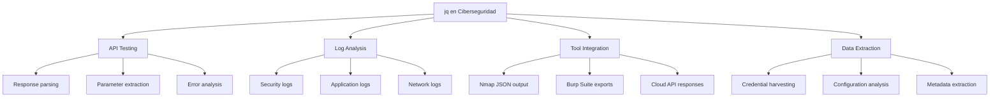

# 🔍 jq - Procesador de JSON en Línea de Comandos

> [!info] Herramienta esencial para manejo de datos JSON
> **jq** es un procesador de JSON ligero y flexible que permite filtrar, transformar, mapear y extraer datos de estructuras JSON desde la línea de comandos. Es indispensable en pentesting moderno para analizar APIs, logs estructurados y respuestas de servicios web.

---

## 📋 Tabla de Contenidos
- [Introducción](#introducción)
- [Instalación](#instalación)
- [Sintaxis Básica](#sintaxis-básica)
- [Filtros y Operadores Fundamentales](#filtros-y-operadores-fundamentales)
- [Casos de Uso en Ciberseguridad](#casos-de-uso-en-ciberseguridad)
- [Ejemplos Prácticos](#ejemplos-prácticos)
- [Tips y Buenas Prácticas](#tips-y-buenas-prácticas)

---

## 📝 Introducción

### ¿Qué es jq?

jq es un procesador de JSON que actúa como `sed` para datos JSON. Permite consultar, filtrar y transformar datos JSON estructurados de manera eficiente desde la línea de comandos, convirtiéndolo en una herramienta fundamental para el análisis de APIs y servicios web modernos.

### ¿Para qué sirve?

- **Análisis de APIs REST**: Extraer información específica de respuestas JSON
- **Procesamiento de logs**: Filtrar y analizar logs estructurados en formato JSON
- **Automatización de pentesting**: Procesar respuestas de herramientas que generan JSON
- **Análisis de configuraciones**: Examinar archivos de configuración JSON complejos
- **Data mining**: Extraer patrones e información relevante de grandes conjuntos de datos

### Contextos de uso en ciberseguridad



---

## 💾 Instalación

### Verificar instalación existente

```bash
jq --version
```

### Instalación en diferentes sistemas

```bash
# Ubuntu/Debian
sudo apt update && sudo apt install jq

# CentOS/RHEL/Fedora
sudo yum install jq
# o en versiones nuevas
sudo dnf install jq

# macOS (usando Homebrew)
brew install jq

# Arch Linux
sudo pacman -S jq

# Windows (usando Chocolatey)
choco install jq
```

---

## 🖥️ Sintaxis Básica

### Formato general

```bash
jq [opciones] filtro [archivo.json]
```

### Uso básico con pipes

```bash
# Desde archivo
jq '.field' data.json

# Desde comando
curl -s https://api.github.com/users/octocat | jq '.name'

# Desde variable
echo '{"name": "John", "age": 30}' | jq '.name'
```

### Opciones principales

| Opción | Descripción | Ejemplo |
|--------|-------------|---------|
| `-r, --raw-output` | Output sin comillas (texto plano) | `jq -r '.name'` |
| `-c, --compact-output` | Output compacto (una línea) | `jq -c '.'` |
| `-n, --null-input` | No leer input, usar null | `jq -n '{name: "test"}'` |
| `-e, --exit-status` | Exit code basado en output | `jq -e '.error'` |
| `-s, --slurp` | Leer todo el input como array | `jq -s '.'` |
| `-S, --sort-keys` | Ordenar keys alfabéticamente | `jq -S '.'` |

---

## 🔧 Filtros y Operadores Fundamentales

### Filtros básicos

| Filtro | Descripción | Ejemplo |
|--------|-------------|---------|
| `.` | Identidad (todo el JSON) | `jq '.'` |
| `.field` | Acceder a campo | `jq '.name'` |
| `.field1.field2` | Acceso anidado | `jq '.user.email'` |
| `.[0]` | Primer elemento de array | `jq '.[0]'` |
| `.[]` | Todos los elementos de array | `jq '.[]'` |
| `.[2:5]` | Slice de array | `jq '.[2:5]'` |

### Operadores de selección

```bash
# Selección condicional
jq '.users[] | select(.active == true)'

# Filtrar por tipo
jq '.data[] | select(type == "string")'

# Filtrar por existencia de campo
jq '.items[] | select(has("id"))'

# Filtrar por múltiples condiciones
jq '.users[] | select(.age > 18 and .role == "admin")'
```

### Operadores de transformación

```bash
# Map - transformar elementos
jq '.users | map(.name)'

# Group by - agrupar elementos
jq '.users | group_by(.department)'

# Sort by - ordenar elementos
jq '.users | sort_by(.age)'

# Unique - elementos únicos
jq '.tags | unique'
```

---

## 🎯 Casos de Uso en Ciberseguridad

### 1. Análisis de APIs y servicios web

jq es fundamental para procesar respuestas JSON de APIs durante pentesting, permitiendo extraer información específica como tokens, credenciales, o datos sensibles.

### 2. Procesamiento de logs de seguridad

Muchos sistemas modernos generan logs en formato JSON. jq permite filtrar eventos específicos, extraer IoCs y analizar patrones de actividad maliciosa.

### 3. Integración con herramientas de pentesting

Herramientas como nmap, nuclei, y burp suite pueden generar output en JSON que requiere procesamiento para automatizar workflows de pentesting.

### 4. Análisis de configuraciones y metadatos

Extraer información sensible de archivos de configuración JSON, manifiestos de aplicaciones, y metadatos de servicios cloud.

---

## 💻 Ejemplos Prácticos

### Ejemplo 1: Análisis de respuesta de API con información sensible

```bash
# Simular respuesta de API de usuario
api_response='{
  "users": [
    {
      "id": 1,
      "username": "admin",
      "email": "admin@company.com",
      "role": "administrator",
      "last_login": "2024-01-15T10:30:00Z",
      "api_key": "sk-1234567890abcdef",
      "permissions": ["read", "write", "delete"],
      "active": true
    },
    {
      "id": 2,
      "username": "user1",
      "email": "user1@company.com",
      "role": "user",
      "last_login": "2024-01-14T15:45:00Z",
      "api_key": "sk-0987654321fedcba",
      "permissions": ["read"],
      "active": true
    }
  ],
  "total": 2,
  "api_version": "v1.2.3"
}'

# Extraer solo usuarios administradores con sus API keys
echo "$api_response" | jq '.users[] | select(.role == "administrator") | {username, api_key, permissions}'

# Extraer todas las API keys para uso posterior
echo "$api_response" | jq -r '.users[].api_key'

# Buscar usuarios con permisos de escritura o eliminación
echo "$api_response" | jq '.users[] | select(.permissions | contains(["write"]) or contains(["delete"]))'

# Crear reporte de seguridad formateado
echo "$api_response" | jq '{
  total_users: .total,
  admin_count: [.users[] | select(.role == "administrator")] | length,
  privileged_users: [.users[] | select(.permissions | contains(["write", "delete"]))] | map(.username),
  api_keys: .users | map(.api_key)
}'
```

> [!info] Explicación
> Este ejemplo demuestra análisis de APIs para extracción de información sensible:
> 1. **Filtro por rol**: `select(.role == "administrator")` identifica usuarios privilegiados
> 2. **Extracción de credenciales**: `-r '.users[].api_key'` obtiene API keys en formato texto plano
> 3. **Búsqueda por permisos**: `contains(["write"])` encuentra usuarios con permisos específicos
> 4. **Reporte estructurado**: Combina múltiples consultas en un JSON de resumen
> 
> Útil para identificar cuentas privilegiadas y credenciales que podrían ser explotadas.

### Ejemplo 2: Procesamiento de logs de seguridad JSON

```bash
# Simular logs de seguridad en formato JSON
security_logs='[
  {
    "timestamp": "2024-01-15T10:30:15Z",
    "level": "WARNING",
    "source_ip": "192.168.1.100",
    "user": "admin",
    "action": "login_attempt",
    "success": false,
    "details": {"reason": "invalid_password", "attempts": 3}
  },
  {
    "timestamp": "2024-01-15T10:31:20Z",
    "level": "INFO",
    "source_ip": "10.0.0.50",
    "user": "user1",
    "action": "file_access",
    "success": true,
    "details": {"file": "/etc/passwd", "method": "read"}
  },
  {
    "timestamp": "2024-01-15T10:32:45Z",
    "level": "CRITICAL",
    "source_ip": "192.168.1.100",
    "user": "admin",
    "action": "privilege_escalation",
    "success": true,
    "details": {"method": "sudo", "target_user": "root"}
  }
]'

# Filtrar eventos críticos y de advertencia
echo "$security_logs" | jq '.[] | select(.level == "CRITICAL" or .level == "WARNING")'

# Identificar intentos de login fallidos
echo "$security_logs" | jq '.[] | select(.action == "login_attempt" and .success == false)'

# Agrupar eventos por IP de origen
echo "$security_logs" | jq 'group_by(.source_ip) | map({ip: .[0].source_ip, events: length, actions: map(.action)})'

# Extraer IoCs (Indicators of Compromise)
echo "$security_logs" | jq '{
  suspicious_ips: [.[] | select(.level == "CRITICAL") | .source_ip] | unique,
  failed_logins: [.[] | select(.action == "login_attempt" and .success == false)],
  privilege_escalations: [.[] | select(.action == "privilege_escalation")]
}'

# Timeline de eventos críticos para análisis forense
echo "$security_logs" | jq '.[] | select(.level == "CRITICAL") | {timestamp, user, action, details}' | jq -s 'sort_by(.timestamp)'
```

> [!info] Explicación
> Este ejemplo muestra análisis de logs de seguridad:
> 1. **Filtro por severidad**: Identifica eventos críticos y de advertencia
> 2. **Detección de ataques**: Busca patrones específicos como login fallidos
> 3. **Agrupación por IP**: Ayuda a identificar fuentes de ataques
> 4. **Extracción de IoCs**: Recopila indicadores de compromiso para hunting
> 5. **Timeline forense**: Ordena eventos críticos cronológicamente
> 
> Esencial para análisis de logs de seguridad y respuesta a incidentes.

### Ejemplo 3: Integración con herramientas de pentesting (Nmap JSON output)

```bash
# Simular output JSON de nmap
nmap_json='{
  "nmaprun": {
    "hosts": [
      {
        "address": {"addr": "192.168.1.10", "addrtype": "ipv4"},
        "hostnames": [{"name": "web-server.local", "type": "PTR"}],
        "ports": {
          "port": [
            {"portid": "22", "protocol": "tcp", "state": {"state": "open"}, "service": {"name": "ssh", "version": "OpenSSH 7.4"}},
            {"portid": "80", "protocol": "tcp", "state": {"state": "open"}, "service": {"name": "http", "version": "Apache 2.4.41"}},
            {"portid": "443", "protocol": "tcp", "state": {"state": "open"}, "service": {"name": "https", "version": "Apache 2.4.41"}},
            {"portid": "3306", "protocol": "tcp", "state": {"state": "open"}, "service": {"name": "mysql", "version": "MySQL 5.7.32"}}
          ]
        }
      },
      {
        "address": {"addr": "192.168.1.20", "addrtype": "ipv4"},
        "hostnames": [{"name": "db-server.local", "type": "PTR"}],
        "ports": {
          "port": [
            {"portid": "22", "protocol": "tcp", "state": {"state": "open"}, "service": {"name": "ssh", "version": "OpenSSH 8.0"}},
            {"portid": "5432", "protocol": "tcp", "state": {"state": "open"}, "service": {"name": "postgresql", "version": "PostgreSQL 12.5"}}
          ]
        }
      }
    ]
  }
}'

# Extraer todas las IPs con puertos abiertos
echo "$nmap_json" | jq -r '.nmaprun.hosts[].address.addr'

# Crear lista de objetivos con servicios web
echo "$nmap_json" | jq '.nmaprun.hosts[] | select(.ports.port[] | .service.name | test("http|https")) | .address.addr'

# Identificar servicios de base de datos expuestos
echo "$nmap_json" | jq '.nmaprun.hosts[] | select(.ports.port[] | .service.name | test("mysql|postgresql|mongodb")) | {
  ip: .address.addr,
  hostname: .hostnames[0].name,
  db_services: [.ports.port[] | select(.service.name | test("mysql|postgresql|mongodb")) | {port: .portid, service: .service.name, version: .service.version}]
}'

# Generar comandos de hydra para ataques de fuerza bruta
echo "$nmap_json" | jq -r '.nmaprun.hosts[] | .address.addr as $ip | .ports.port[] | select(.service.name | test("ssh|ftp|mysql")) | "hydra -L users.txt -P passwords.txt \($ip) \(.service.name)"'

# Crear reporte de vulnerabilidades potenciales
echo "$nmap_json" | jq '{
  total_hosts: .nmaprun.hosts | length,
  web_servers: [.nmaprun.hosts[] | select(.ports.port[] | .service.name | test("http|https")) | .address.addr],
  database_servers: [.nmaprun.hosts[] | select(.ports.port[] | .service.name | test("mysql|postgresql|mongodb")) | {ip: .address.addr, services: [.ports.port[] | select(.service.name | test("mysql|postgresql|mongodb")) | .service.name]}],
  ssh_servers: [.nmaprun.hosts[] | select(.ports.port[] | .service.name == "ssh") | {ip: .address.addr, version: [.ports.port[] | select(.service.name == "ssh") | .service.version][0]}]
}'
```

> [!info] Explicación
> Este ejemplo muestra procesamiento de output de nmap para automatización:
> 1. **Extracción de objetivos**: Lista IPs para ataques posteriores
> 2. **Filtro por servicios**: Identifica servicios web y bases de datos específicos
> 3. **Identificación de vectores**: Encuentra servicios potencialmente vulnerables
> 4. **Generación de comandos**: Crea comandos de hydra automáticamente
> 5. **Reporte estructurado**: Organiza información para análisis de vulnerabilidades
> 
> Facilita la automatización de workflows de pentesting basados en resultados de nmap.

---

## 💡 Tips y Buenas Prácticas

### Optimización y rendimiento

```mermaid
graph TD
    A[Optimización jq] --> B[Performance]
    A --> C[Legibilidad]
    A --> D[Debugging]
    
    B --> B1[Filtrar temprano]
    B --> B2[Usar select() eficientemente]
    B --> B3[Evitar iteraciones innecesarias]
    
    C --> C1[Comentarios en filtros complejos]
    C --> C2[Variables para reutilización]
    C --> C3[Funciones personalizadas]
    
    D --> D1[Usar . para ver estructura]
    D --> D2[Probar filtros paso a paso]
    D --> D3[Validar tipos de datos]
```

> [!tip] Mejores prácticas para pentesting
> **Optimización de rendimiento:**
> - Filtrar datos lo antes posible en la pipeline: `jq '.users[] | select(.active) | .name'`
> - Usar `-c` para output compacto cuando proceses muchos datos
> - Combinar con `head` o `tail` para limitar resultados: `jq '.[]' | head -10`
> 
> **Debugging y desarrollo:**
> - Usar `jq '.'` primero para ver la estructura completa del JSON
> - Construir filtros complejos paso a paso
> - Usar `type` para verificar tipos de datos: `jq '.field | type'`

### Patrones útiles para ciberseguridad

```bash
# Extraer credenciales de respuestas de API
jq -r '.[] | select(has("password") or has("api_key") or has("token")) | to_entries[]'

# Buscar URLs y endpoints en JSON
jq -r '.. | strings | select(test("https?://"))'

# Extraer información de headers HTTP
jq -r '.headers | to_entries[] | select(.key | test("auth|token|session"; "i")) | "\(.key): \(.value)"'

# Encontrar diferencias entre dos archivos JSON
jq -n --argjson a "$(cat file1.json)" --argjson b "$(cat file2.json)" \
  '$a - $b | if . == {} then "No differences" else . end'

# Crear wordlist desde JSON
jq -r '.. | strings | select(length > 3)' data.json | sort | uniq > wordlist.txt
```

### Funciones personalizadas y variables

```bash
# Definir funciones reutilizables
jq -n '
def is_suspicious_ip: test("^(10\\.|192\\.168\\.|172\\.(1[6-9]|2[0-9]|3[0-1])\\.)") | not;
def extract_domains: match("https?://([^/]+)"; "g") | .captures[0].string;

# Usar variables para datos complejos
jq --arg threshold "100" '.items[] | select(.score > ($threshold | tonumber))'

# Funciones para análisis de seguridad
jq -n '
def is_valid_email: test("^[A-Za-z0-9._%+-]+@[A-Za-z0-9.-]+\\.[A-Za-z]{2,}$");
def extract_ips: match("\\b(?:[0-9]{1,3}\\.){3}[0-9]{1,3}\\b"; "g") | .string;
'
```

### Manejo de errores y casos edge

```bash
# Manejo seguro de campos que pueden no existir
jq '.field // "default_value"'

# Verificar si un campo existe antes de accederlo
jq 'if has("field") then .field else "N/A" end'

# Convertir tipos de manera segura
jq '.number | tonumber catch 0'

# Filtrar valores null o vacíos
jq '.[] | select(. != null and . != "")'

# Validar estructura JSON antes de procesar
jq -e 'type == "object" and has("required_field")' file.json && echo "Valid JSON structure"
```

### Errores comunes y soluciones

| Error | Causa | Solución |
|-------|-------|----------|
| `Cannot index string with string` | Intentar acceder a campo en string | Verificar tipo: `jq 'type'` |
| `Cannot iterate over null` | Array es null | Usar `// []`: `jq '(.array // [])[]'` |
| `Invalid JSON` | JSON malformado | Validar con `jq .` primero |
| `Broken pipe` | Output muy grande | Usar `head` o filtrar más |
| `compile error` | Sintaxis incorrecta | Verificar filtro paso a paso |

---

## 📊 Integración con herramientas de pentesting

### Con curl para análisis de APIs

```bash
# Pipeline completa de análisis de API
curl -s https://api.target.com/users | jq '.[] | select(.role == "admin")' | jq -r '.username'

# Extraer tokens de autenticación
curl -s -X POST -d '{"user":"admin","pass":"test"}' https://api.target.com/login | jq -r '.token'

# Análisis de errores de API
curl -s https://api.target.com/invalid | jq -e '.error' > /dev/null && echo "API returned error"
```

### Con herramientas de escaneo

```bash
# Procesar output de nuclei
nuclei -t vulnerabilities/ -json | jq '.info.severity' | sort | uniq -c

# Analizar resultados de subfinder
subfinder -d target.com -json | jq -r '.host' | sort | uniq

# Combinar con ffuf para fuzzing
ffuf -w wordlist.txt -u https://target.com/FUZZ -of json | jq '.results[] | select(.status == 200)'
```

---

## 🔗 Comandos de referencia rápida

```bash
# Básicos
jq '.'                                    # Pretty print JSON
jq -r '.field'                           # Raw output (sin comillas)
jq '.field1.field2'                     # Acceso anidado
jq '.array[0]'                          # Primer elemento
jq '.array[]'                           # Todos los elementos

# Filtros
jq '.[] | select(.active == true)'      # Filtrar por condición
jq '.[] | select(has("field"))'         # Filtrar por existencia de campo
jq 'map(.name)'                         # Transformar array
jq 'sort_by(.age)'                      # Ordenar por campo

# Útiles para pentesting
jq -r '.. | strings | select(test("password|key|token"))'  # Buscar credenciales
jq '.[] | {name, value} | @base64'      # Codificar en base64
jq 'group_by(.type) | map({type: .[0].type, count: length})'  # Agrupar y contar
```

---

## 🛡️ Consideraciones de seguridad

> [!warning] Uso responsable
> - No procesar archivos JSON muy grandes sin filtrar primero (riesgo de DoS)
> - Ser cuidadoso con `-r` cuando manejes datos que puedan contener comandos
> - Validar input JSON antes de procesamiento automatizado
> - No exponer credenciales extraídas en logs o outputs visibles

> [!note] Para Blue Team
> **Detectar uso malicioso de jq:**
> - Monitorear uso frecuente de jq en scripts automatizados
> - Alertar sobre extracción masiva de credenciales o tokens
> - Supervisar procesamiento de logs de seguridad con patrones sospechosos
> - Detectar análisis automatizado de APIs internas

---

## 📚 Recursos adicionales

- Manual oficial: [jq manual](https://stedolan.github.io/jq/manual/)
- Playground online: [jqplay.org](https://jqplay.org)
- Tutorial interactivo: `man jq` o `jq --help`
- JSON samples para práctica: [jsonplaceholder.typicode.com](https://jsonplaceholder.typicode.com)

> [!success] Puntos clave para recordar
> - **jq es esencial** para cualquier pentesting moderno que involucre APIs
> - **Dominar filtros básicos** cubre 80% de casos de uso comunes
> - **Combinar con otras herramientas** maximiza su potencial
> - **Practicar con datos reales** mejora significativamente la eficiencia
> - **Usar funciones y variables** para casos complejos o repetitivos