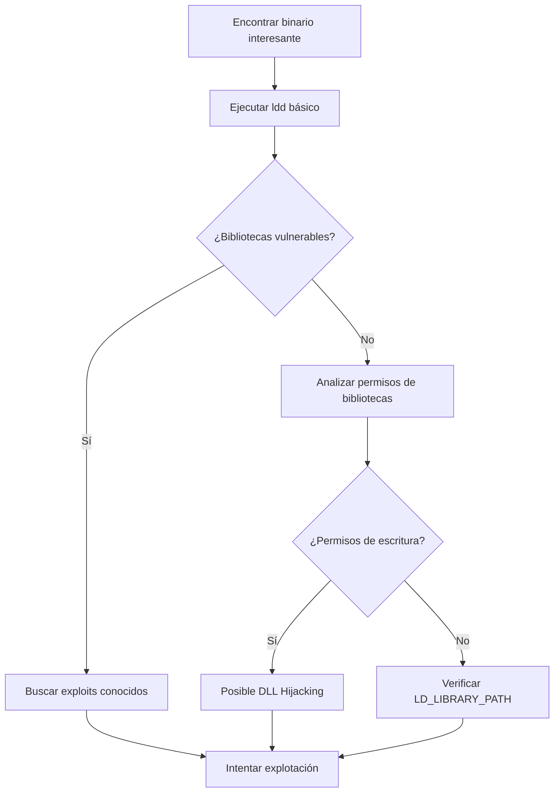

# ldd - Analizador de Dependencias Dinámicas

---

## 🔍 Introducción

**ldd** (List Dynamic Dependencies) es una herramienta de línea de comandos en Linux que muestra las **bibliotecas compartidas** (shared libraries) que necesita un programa ejecutable para funcionar.

### ¿Para qué sirve?

- **Analizar dependencias** de binarios ejecutables
- **Identificar bibliotecas faltantes** que causan errores de ejecución
- **Auditar seguridad** de aplicaciones (detectar bibliotecas vulnerables)
- **Ingeniería inversa** y análisis de malware
- **Troubleshooting** de problemas de compatibilidad

### Contextos de uso en ciberseguridad

- **Análisis de malware** para identificar funcionalidades
- **Privilege escalation** mediante bibliotecas vulnerables
- **Binary exploitation** y desarrollo de exploits
- **Forensics** para entender el comportamiento de binarios
- **Pentesting** de aplicaciones y servicios

---

## ⚙️ Sintaxis y Parámetros

### Sintaxis básica

```bash
ldd [opciones] archivo_ejecutable
```

### Parámetros más comunes

| Parámetro | Descripción | Ejemplo |
|-----------|-------------|---------|
| **-v, --verbose** | Información detallada sobre versiones | `ldd -v /bin/ls` |
| **-d, --data-relocs** | Realiza reubicaciones de datos | `ldd -d /usr/bin/passwd` |
| **-r, --function-relocs** | Realiza reubicaciones de funciones | `ldd -r /bin/bash` |
| **-u, --unused** | Muestra dependencias no utilizadas | `ldd -u /usr/bin/ssh` |
| **--help** | Muestra ayuda | `ldd --help` |
| **--version** | Muestra versión de ldd | `ldd --version` |

---

## 🛠️ Casos de Uso Típicos

### 1. Análisis básico de dependencias

```bash
ldd /bin/ls
```

> [!example] Salida típica
> ```
> linux-vdso.so.1 (0x00007fff8e9f3000)
> libselinux.so.1 => /lib/x86_64-linux-gnu/libselinux.so.1 (0x00007f8b0e123000)
> libc.so.6 => /lib/x86_64-linux-gnu/libc.so.6 (0x00007f8b0df32000)
> libpcre2-8.so.0 => /lib/x86_64-linux-gnu/libpcre2-8.so.0 (0x00007f8b0dea1000)
> /lib64/ld-linux-x86-64.so.2 (0x00007f8b0e16d000)
> ```

### 2. Verificar bibliotecas faltantes

```bash
ldd /usr/local/bin/mi_programa
```

> [!warning] Biblioteca faltante
> Si aparece algo como:
> ```
> libmissing.so.1 => not found
> ```
> Indica que falta una dependencia crítica.

### 3. Análisis detallado con información de versiones

```bash
ldd -v /usr/bin/ssh
```

---

## 🔬 Ejemplos Prácticos

### Ejemplo 1: Auditoría de seguridad básica

```bash
# Analizar dependencias de un binario SUID
ldd /usr/bin/passwd
```

**¿Qué buscamos?**
- Bibliotecas con versiones conocidamente vulnerables
- Dependencias en directorios no seguros
- Bibliotecas con permisos incorrectos

### Ejemplo 2: Análisis de malware sospechoso

```bash
# Analizar un binario sospechoso
ldd /tmp/suspicious_binary

# Versión detallada para más información
ldd -v /tmp/suspicious_binary
```

> [!tip] En análisis de malware
> Buscar bibliotecas relacionadas con:
> - Networking (libcurl, libssl)
> - Criptografía (libcrypto, libgcrypt)
> - Compresión (libz, libbz2)

### Ejemplo 3: Debugging de problemas de ejecución

```bash
# Verificar por qué un programa no inicia
ldd /opt/custom_app/bin/app

# Verificar relocalizaciones problemáticas
ldd -r /opt/custom_app/bin/app
```

---

## 🧭 Flujo de Trabajo en Pentesting



---

## 💡 Tips y Buenas Prácticas

### ✅ Consejos de uso

> [!tip] Optimización del análisis
> - Usa `ldd -v` para obtener información completa de versiones
> - Combina con `strings` para análisis más profundo
> - Verifica permisos de bibliotecas encontradas con `ls -la`

### ⚠️ Precauciones importantes

> [!warning] Seguridad crítica
> **NUNCA ejecutes `ldd` en binarios no confiables directamente**, ya que puede ejecutar código malicioso. Usa `objdump -p` como alternativa segura.

```bash
# Alternativa segura para binarios sospechosos
objdump -p /path/to/suspicious_binary | grep NEEDED
```

### 🔍 Combinaciones útiles con otras herramientas

```bash
# Análisis completo de un binario
ldd /bin/target                    # Dependencias
file /bin/target                   # Tipo de archivo
strings /bin/target | head -20     # Strings interesantes
ls -la /bin/target                 # Permisos y propietario
```

---

## 🚨 Errores Comunes

| Error | Causa | Solución |
|-------|-------|----------|
| `not a dynamic executable` | Archivo estático o no ejecutable | Verificar que sea un binario dinámico |
| `No such file or directory` | Ruta incorrecta | Verificar la ruta del archivo |
| `libX.so => not found` | Biblioteca faltante | Instalar biblioteca o configurar LD_LIBRARY_PATH |

---

## 🛡️ Aplicaciones en Ciberseguridad

### Análisis de vulnerabilidades

```bash
# Buscar bibliotecas con versiones específicas
ldd /usr/bin/vulnerable_app | grep -E "(ssl|crypto|curl)"

# Verificar si usa bibliotecas en ubicaciones no estándar
ldd /suspicious/binary | grep -v "/lib\|/usr/lib"
```

### Privilege Escalation

> [!info] Técnica: LD_PRELOAD
> Si un binario SUID carga bibliotecas desde directorios escribibles, podemos aprovechar `LD_PRELOAD` para escalar privilegios.

```bash
# Verificar bibliotecas cargadas por binario SUID
ldd /usr/bin/suid_binary

# Buscar oportunidades de LD_PRELOAD
find /usr/lib -writable 2>/dev/null
```

---

## 📚 Herramientas Relacionadas

- **`objdump`**: Alternativa más segura para análisis de dependencias
- **`readelf`**: Información detallada de archivos ELF
- **`nm`**: Lista símbolos de binarios
- **`strace`**: Traza llamadas al sistema y bibliotecas

---

> [!success] Resumen
> `ldd` es una herramienta fundamental para el análisis de binarios en Linux. Su uso correcto puede revelar vectores de ataque, dependencias vulnerables y oportunidades de escalada de privilegios.