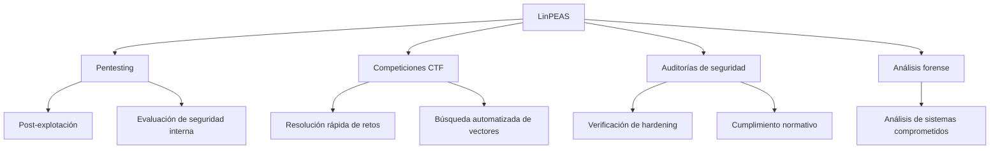
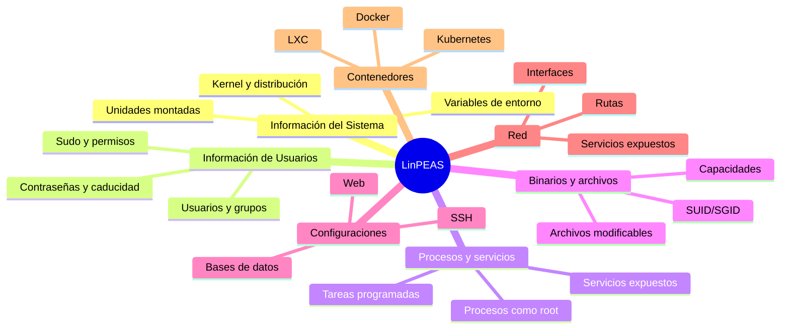

# 🔍 LinPEAS: Linux Privilege Escalation Awesome Script

> [!info] Herramienta esencial
> **LinPEAS** es una potente herramienta de enumeración post-explotación para sistemas Linux, diseñada para detectar posibles vectores de escalada de privilegios de manera exhaustiva y automatizada.

---

## 📋 Tabla de Contenidos
- [Introducción](#introducción)
- [Instalación y Obtención](#instalación-y-obtención)
- [Sintaxis y Opciones](#sintaxis-y-opciones)
- [Secciones y Verificaciones](#secciones-y-verificaciones)
- [Ejemplos Prácticos](#ejemplos-prácticos)
- [Tips y Buenas Prácticas](#tips-y-buenas-prácticas)
- [Comparativa con otras herramientas](#comparativa-con-otras-herramientas)

---

## 📝 Introducción

### ¿Qué es LinPEAS?

LinPEAS forma parte del proyecto PEASS-ng (Privilege Escalation Awesome Scripts Suite - Nueva Generación) desarrollado por Carlos Polop. Es un script bash que realiza numerosas verificaciones automáticas para identificar configuraciones inseguras, vectores de escalada de privilegios y vulnerabilidades en sistemas Linux.

### ¿Para qué sirve?

- Detectar múltiples vectores de escalada de privilegios
- Automatizar la fase de enumeración en pentesting
- Identificar malas configuraciones de seguridad
- Recopilar información detallada del sistema
- Descubrir credenciales almacenadas inseguramente
- Encontrar binarios y servicios vulnerables

### Contextos de uso



> [!note] Características destacadas
> - Salida colorizada para fácil interpretación
> - Ejecución en memoria sin dejar rastros en disco
> - Verificaciones exhaustivas (más de 80 categorías)
> - Actualización frecuente con nuevos vectores
> - Detección automática de CVEs conocidos

---

## 💾 Instalación y Obtención

### Repositorio oficial
LinPEAS es parte del proyecto PEASS-ng disponible en GitHub: [https://github.com/carlospolop/PEASS-ng](https://github.com/carlospolop/PEASS-ng)

### Métodos de obtención

```bash
# Descargar directamente usando curl
curl -L https://github.com/carlospolop/PEASS-ng/releases/latest/download/linpeas.sh -o linpeas.sh

# Alternativa con wget
wget https://github.com/carlospolop/PEASS-ng/releases/latest/download/linpeas.sh

# Dar permisos de ejecución
chmod +x linpeas.sh
```

### Ejecución sin descargar

> [!tip] Ejecución en memoria
> LinPEAS puede ejecutarse directamente sin necesidad de guardarlo en disco:

```bash
# Ejecución directa con curl
curl -L https://github.com/carlospolop/PEASS-ng/releases/latest/download/linpeas.sh | sh

# Ejecución directa con wget
wget -q -O - https://github.com/carlospolop/PEASS-ng/releases/latest/download/linpeas.sh | sh
```

### Versiones disponibles

| Versión | Descripción | Cuándo usar |
|---------|-------------|-------------|
| **linpeas.sh** | Versión completa | Uso general, máxima detección |
| **linpeas_fat.sh** | Con binarios estáticos incluidos | Sistemas con utilidades limitadas |
| **linpeas_base.sh** | Versión ligera | Sistemas con restricciones de tamaño |

---

## ⚙️ Sintaxis y Opciones

### Sintaxis básica

```bash
./linpeas.sh [opciones]
```

### Opciones principales

| Opción | Descripción | Ejemplo |
|--------|-------------|---------|
| `-a` | Ejecutar todas las verificaciones (puede llevar tiempo) | `./linpeas.sh -a` |
| `-s` | Modo sigiloso (menos ruido en logs) | `./linpeas.sh -s` |
| `-P` | Evitar paletas de colores | `./linpeas.sh -P` |
| `-p` | Usar paleta de colores alternativa | `./linpeas.sh -p` |
| `-h` | Mostrar ayuda | `./linpeas.sh -h` |
| `-k` | Palabra clave para buscar (regex) | `./linpeas.sh -k password` |
| `-r` | Recarga paleta de colores | `./linpeas.sh -r` |
| `-e` | Especificar tipos de verificación | `./linpeas.sh -e software,procmon` |
| `-t` | Ejecutar sección específica | `./linpeas.sh -t system` |
| `-w` | Guardar resultados en archivo | `./linpeas.sh -a -w report.txt` |

> [!example] Ejemplos de ejecución básica
> ```bash
> # Ejecución estándar
> ./linpeas.sh
> 
> # Ejecución exhaustiva con todos los checks
> ./linpeas.sh -a
> 
> # Ejecución sigilosa sin colores
> ./linpeas.sh -s -P
> 
> # Guardar resultados en archivo
> ./linpeas.sh -a > resultados_linpeas.txt
> ```

---

## 🔍 Secciones y Verificaciones

LinPEAS organiza sus verificaciones en secciones claramente diferenciadas y utiliza un código de colores para resaltar los hallazgos según su importancia.

### Código de colores

- **Rojo**: Hallazgos de alta importancia (posibles vectores de escalada)
- **Amarillo**: Información interesante para investigar
- **Verde**: Información general del sistema
- **Azul**: Información de contenedores
- **Magenta**: Información de servicios

### Principales secciones



### Verificaciones destacadas

LinPEAS realiza más de 80 tipos diferentes de verificaciones, incluyendo:

1. **Configuración del sistema**
   - Versión de kernel y posibles exploits
   - Variables de entorno peligrosas
   - Montajes inseguros (NFS, /proc, /dev)

2. **Usuarios y permisos**
   - Usuarios en grupos privilegiados
   - Configuraciones sudo explotables
   - Permisos de directorios home

3. **Archivos y binarios sensibles**
   - Binarios SUID/SGID
   - Binarios con capacidades especiales
   - Archivos con permisos débiles
   - Binarios explotables (usando GTFOBins)

4. **Credenciales y secretos**
   - Archivos de historia, configuración y logs
   - Claves SSH/GPG
   - Contraseñas en texto plano
   - Archivos de configuración con credenciales

5. **Servicios y procesos**
   - Servicios vulnerables
   - Tareas cron inseguras
   - Puertos internos abiertos
   - Procesos con rutas writables

---

## 💻 Ejemplos Prácticos

### Ejemplo 1: Enumeración rápida para CTF

```bash
# Ejecutar LinPEAS y buscar resultados críticos
./linpeas.sh | grep -E "CVE|VULNERABLE|PRIVESC|EXPLOIT"
```

> [!info] Explicación
> Este comando ejecuta LinPEAS con configuración predeterminada y filtra la salida para mostrar solo las líneas que contengan palabras clave relacionadas con vulnerabilidades y escalada de privilegios. Es ideal para:
> - Competiciones CTF donde el tiempo es limitado
> - Identificación rápida de vectores obvios
> - Reducir la cantidad de información a analizar
>
> El filtrado con grep permite enfocarse inmediatamente en los hallazgos más críticos, aunque deberías revisar el informe completo después para no perder información valiosa.

### Ejemplo 2: Ejecución completa en un pentesting profesional

```bash
# Ejecutar LinPEAS completo y guardar resultados detallados
./linpeas.sh -a > cliente_servidor1_linpeas.txt

# Alternativamente, usar la opción integrada de guardar
./linpeas.sh -a -w /tmp/cliente_servidor1_linpeas.txt
```

> [!info] Explicación
> Este enfoque ejecuta LinPEAS con todas las verificaciones habilitadas (`-a`) y guarda la salida completa en un archivo para análisis posterior:
> 1. La opción `-a` activa TODAS las verificaciones, incluyendo las más lentas y ruidosas
> 2. Se guarda el resultado en un archivo con un nombre descriptivo que incluye el cliente y servidor
> 3. La segunda variante usa la opción integrada `-w` para guardar el archivo
>
> Este método es ideal para pentesting profesional donde:
> - Necesitas documentación completa para el informe
> - Tienes tiempo para un análisis exhaustivo
> - Requieres evidencia de todos los hallazgos

### Ejemplo 3: Ejecución sigilosa para evitar detección

```bash
# Ejecución en memoria con modo sigiloso
curl -s https://github.com/carlospolop/PEASS-ng/releases/latest/download/linpeas.sh | sh -s -- -s -P -k "password|key|token|secret"
```

> [!info] Explicación
> Este comando está diseñado para minimizar la detección en un sistema objetivo:
> 1. Ejecuta LinPEAS directamente en memoria sin escribir en disco
> 2. Usa el modo sigiloso (`-s`) que reduce algunas comprobaciones ruidosas
> 3. Desactiva los colores (`-P`) para evitar caracteres extraños en logs
> 4. Usa `-k` para buscar específicamente palabras clave relacionadas con credenciales
>
> Este enfoque es útil en:
> - Entornos con monitorización activa
> - Sistemas de producción donde minimizar el impacto es crucial
> - Escenarios de Red Team donde la evasión es prioritaria

### Ejemplo 4: Análisis específico de contenedores

```bash
# Enfocarse solo en contenedores y Docker
./linpeas.sh -t container

# Analizar solo ciertas áreas de interés
./linpeas.sh -e container,root_check,suid
```

> [!info] Explicación
> Estos comandos realizan verificaciones específicas:
> 1. El primer comando usa `-t container` para enfocarse solo en vulnerabilidades relacionadas con contenedores
> 2. El segundo comando utiliza `-e` para especificar múltiples áreas de interés: contenedores, verificaciones de root y binarios SUID
>
> Este enfoque es especialmente útil cuando:
> - Ya conoces el área potencial de vulnerabilidad
> - Necesitas verificaciones específicas para confirmar una hipótesis
> - Quieres reducir el tiempo de ejecución centrándote en lo relevante
> - Trabajas en un entorno basado en contenedores (Docker, Kubernetes, etc.)

---

## 💡 Tips y Buenas Prácticas

### Optimización del uso

```mermaid
graph TD
    A[Optimizar uso de LinPEAS] --> B[Ejecutar modo adecuado]
    A --> C[Gestionar la salida]
    A --> D[Análisis post-ejecución]
    A --> E[Combinar con otras herramientas]
    
    B --> B1[Uso estándar: ./linpeas.sh]
    B --> B2[Completo: ./linpeas.sh -a]
    B --> B3[Sigiloso: ./linpeas.sh -s]
    
    C --> C1[Redirección: > archivo.txt]
    C --> C2[Guardar integrado: -w archivo.txt]
    C --> C3[Filtrar: | grep]
    
    D --> D1[Buscar términos clave]
    D --> D2[Revisar hallazgos rojos primero]
    D --> D3[Correlacionar con contexto]
    
    E --> E1[LSE para verificación cruzada]
    E --> E2[pspy para monitoreo de procesos]
    E --> E3[Verificación manual de hallazgos]
```

> [!tip] Consejos para maximizar eficiencia
> - **Adapta la ejecución al contexto**: Usa modo sigiloso en entornos sensibles, completo en pruebas exhaustivas
> - **Siempre guarda la salida**: Los resultados son extensos y fáciles de perder
> - **Filtra por colores**: Busca términos como "33m" (amarillo) o "31m" (rojo) en la salida guardada
> - **Verifica manualmente los hallazgos**: LinPEAS detecta potenciales vectores, pero requieren verificación
> - **Combina con herramientas específicas**: Usa `pspy` para procesos, `GTFOBins` para explotar binarios
> - **Correlaciona resultados**: Un mismo vector puede aparecer en diferentes secciones

### Casos de uso específicos

| Escenario | Enfoque recomendado | Comando |
|-----------|---------------------|---------|
| CTF con tiempo limitado | Ejecución rápida y filtrado | `./linpeas.sh | grep -i "pwn\|root\|sudo\|suid"` |
| Pentesting profesional | Ejecución completa con documentación | `./linpeas.sh -a -w cliente_$(hostname)_$(date +%F).txt` |
| Entorno monitorizado | Ejecución sigilosa en memoria | `curl -s [...]/linpeas.sh | sh -s -- -s -P` |
| Análisis post-compromiso | Enfoque en credenciales y persistencia | `./linpeas.sh -e creds,root_check,prop_vuln` |
| Entorno containerizado | Verificaciones específicas de contenedores | `./linpeas.sh -t container -e docker` |

### Errores comunes y soluciones

| Error | Problema | Solución |
|-------|----------|----------|
| No se ve colorizado | Terminal no soporta colores o transferencia incorrecta | Usar `-P` para desactivar colores o `-p` para paleta alternativa |
| Script termina abruptamente | Protecciones antivirus o de monitoreo | Usar versión ligera o ejecutar por secciones con `-e` |
| Falsos positivos | Detección de configuraciones que no son explotables | Verificar manualmente los hallazgos importantes |
| No se detectan CVEs conocidas | Versión desactualizada de LinPEAS | Descargar la última versión del repositorio |
| Comando no encontrado | Sistema objetivo con shell limitado | Probar con versión `linpeas_fat.sh` que incluye binarios |
| Demasiada información | Difícil identificar vectores útiles | Usar grep para filtrar o ejecutar secciones específicas |

---

## 📊 Comparativa con otras herramientas

| Herramienta | Ventajas | Desventajas | Mejor para |
|-------------|----------|-------------|------------|
| **LinPEAS** | Exhaustivo, actualizado frecuentemente, colorizado | Puede ser ruidoso, gran cantidad de información | Enumeración completa, detección de vectores no obvios |
| **LSE** | Más ligero, organizado por niveles | Menos detallado que LinPEAS | Sistemas con recursos limitados, enumeración inicial |
| **linux-exploit-suggester** | Enfocado en vulnerabilidades de kernel | Solo kernel, no analiza configuraciones | Identificar vulnerabilidades específicas de kernel |
| **pspy** | Monitoreo de procesos en tiempo real | Solo procesos, no enumeración general | Análisis de tareas programadas y procesos |
| **Lineum** | Simple, bien establecido | Menos actualizado | Enumeración básica |

> [!success] Cuándo elegir LinPEAS
> - Cuando necesites una **enumeración exhaustiva**
> - En **pentesting profesional** donde la detección completa es crucial
> - Para detectar **vectores no obvios** de escalada
> - Cuando trabajas en un **entorno con recursos suficientes**
> - Para buscar **múltiples vectores** simultáneamente

---

## 🔍 Resumen de vectores principales detectados

LinPEAS es especialmente efectivo encontrando:

1. **Binarios SUID/SGID** y capacidades que pueden ser explotados
2. **Versiones vulnerables de kernel** susceptibles a exploits conocidos
3. **Archivos con permisos inseguros** en directorios sensibles
4. **Tareas cron** con scripts modificables
5. **Configuraciones sudo** explotables
6. **Credenciales almacenadas** en archivos de configuración, historiales, etc.
7. **Contenedores y entornos virtualizados** mal configurados
8. **Servicios** ejecutándose como root con configuraciones débiles
9. **Montajes NFS** con opciones inseguras
10. **Variables de entorno** que pueden ser abusadas

> [!warning] Importante
> LinPEAS es una herramienta de **detección**, no de explotación. Los vectores identificados requieren análisis y explotación manual adicional.

---

## 🔗 Recursos adicionales

- [Repositorio oficial PEASS-ng](https://github.com/carlospolop/PEASS-ng)
- [HackTricks - Linux Privilege Escalation](https://book.hacktricks.xyz/linux-hardening/privilege-escalation)
- [GTFOBins](https://gtfobins.github.io/) - Para explotar binarios identificados
- [Guía de Carlos Polop sobre escalada de privilegios](https://github.com/carlospolop/hacktricks/tree/master/linux-unix/privilege-escalation)
- [Awesome Privilege Escalation](https://github.com/m0nad/awesome-privilege-escalation) - Recursos complementarios