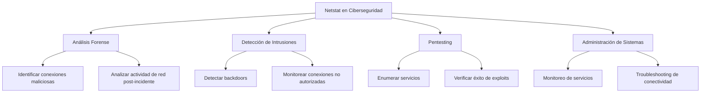
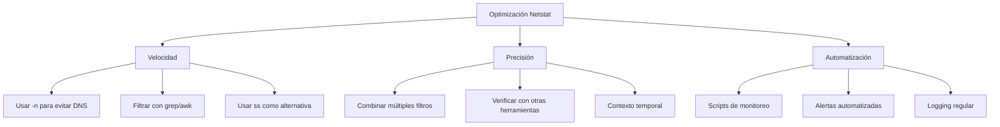

# 🌐 Netstat: Monitor de Conexiones de Red

> [!info] Herramienta fundamental de networking
> **Netstat** (Network Statistics) es una utilidad de línea de comandos que muestra las conexiones de red activas, tablas de enrutamiento, estadísticas de interfaces y conexiones de sockets en sistemas Unix/Linux y Windows. Es esencial para el análisis de red y la detección de actividad sospechosa.

---

## 📋 Tabla de Contenidos
- [Introducción](#introducción)
- [Sintaxis Básica](#sintaxis-básica)
- [Parámetros y Opciones](#parámetros-y-opciones)
- [Casos de Uso en Ciberseguridad](#casos-de-uso-en-ciberseguridad)
- [Ejemplos Prácticos](#ejemplos-prácticos)
- [Tips y Buenas Prácticas](#tips-y-buenas-prácticas)

---

## 📝 Introducción

### ¿Qué es Netstat?

Netstat es una herramienta de diagnóstico de red que proporciona información detallada sobre:
- Conexiones de red activas (TCP/UDP)
- Puertos en escucha
- Tablas de enrutamiento
- Estadísticas de protocolos de red
- Información de procesos asociados a conexiones

### ¿Para qué sirve?

- **Monitoreo de conexiones**: Ver qué aplicaciones están conectadas a la red
- **Análisis de puertos**: Identificar servicios en ejecución y puertos abiertos
- **Detección de malware**: Encontrar conexiones sospechosas o no autorizadas
- **Troubleshooting de red**: Diagnosticar problemas de conectividad
- **Auditoría de seguridad**: Verificar servicios expuestos y conexiones externas

### Contextos de uso en ciberseguridad



---

## 🖥️ Sintaxis Básica

### Formato general

```bash
netstat [opciones]
```

### Uso básico

```bash
# Mostrar todas las conexiones
netstat -a

# Mostrar conexiones TCP
netstat -t

# Mostrar conexiones UDP
netstat -u

# Mostrar puertos en escucha
netstat -l
```

> [!example] Comando básico más útil
> ```bash
> netstat -tulpn
> ```
> Este comando muestra conexiones TCP y UDP, puertos en escucha, con información de procesos y sin resolución DNS.

---

## ⚙️ Parámetros y Opciones

### Opciones principales

| Opción | Descripción | Ejemplo |
|--------|-------------|---------|
| `-a`, `--all` | Mostrar todas las conexiones y puertos en escucha | `netstat -a` |
| `-t`, `--tcp` | Mostrar solo conexiones TCP | `netstat -t` |
| `-u`, `--udp` | Mostrar solo conexiones UDP | `netstat -u` |
| `-l`, `--listening` | Mostrar solo puertos en escucha | `netstat -l` |
| `-p`, `--programs` | Mostrar PID y nombre del proceso | `netstat -p` |
| `-n`, `--numeric` | Mostrar direcciones numéricas (no resolver DNS) | `netstat -n` |
| `-r`, `--route` | Mostrar tabla de enrutamiento | `netstat -r` |
| `-i`, `--interfaces` | Mostrar estadísticas de interfaces | `netstat -i` |
| `-s`, `--statistics` | Mostrar estadísticas de protocolos | `netstat -s` |
| `-c`, `--continuous` | Actualización continua | `netstat -c` |

### Opciones de filtrado

| Opción | Descripción | Uso |
|--------|-------------|-----|
| `-4` | Solo IPv4 | `netstat -4` |
| `-6` | Solo IPv6 | `netstat -6` |
| `--tcp` | Solo protocolo TCP | `netstat --tcp` |
| `--udp` | Solo protocolo UDP | `netstat --udp` |

### Estados de conexión TCP

| Estado | Descripción |
|--------|-------------|
| **LISTEN** | Puerto esperando conexiones entrantes |
| **ESTABLISHED** | Conexión activa establecida |
| **SYN_SENT** | Intentando establecer conexión |
| **SYN_RECV** | Recibió solicitud de conexión |
| **FIN_WAIT1** | Cerrando conexión (paso 1) |
| **FIN_WAIT2** | Cerrando conexión (paso 2) |
| **TIME_WAIT** | Esperando que se complete el cierre |
| **CLOSE** | Conexión cerrada |
| **CLOSE_WAIT** | Esperando cierre de aplicación local |

---

## 🔐 Casos de Uso en Ciberseguridad

### 1. Detección de backdoors y malware

Netstat es fundamental para identificar conexiones sospechosas que pueden indicar la presencia de malware o backdoors.

### 2. Enumeración de servicios

Durante un pentest, netstat ayuda a identificar servicios en ejecución y posibles vectores de ataque.

### 3. Análisis forense

En investigaciones de seguridad, netstat puede revelar evidencia de actividad maliciosa o conexiones no autorizadas.

### 4. Monitoreo de red

Para administradores, netstat es útil para monitorear el estado de la red y detectar anomalías.

---

## 💻 Ejemplos Prácticos

### Ejemplo 1: Análisis completo de conexiones de red

```bash
# Mostrar todas las conexiones con información de procesos
netstat -tulpn
```

> [!info] Explicación
> Este comando es uno de los más útiles para ciberseguridad:
> - `-t`: Muestra conexiones TCP
> - `-u`: Muestra conexiones UDP
> - `-l`: Incluye puertos en escucha
> - `-p`: Muestra el PID y nombre del proceso asociado
> - `-n`: Muestra direcciones IP numéricas (evita resolución DNS lenta)
> 
> **Salida típica:**
> ```
> Proto Recv-Q Send-Q Local Address           Foreign Address         State       PID/Program name
> tcp        0      0 0.0.0.0:22              0.0.0.0:*               LISTEN      1234/sshd
> tcp        0      0 127.0.0.1:3306          0.0.0.0:*               LISTEN      5678/mysqld
> tcp        0      0 192.168.1.100:22        192.168.1.50:54321      ESTABLISHED 9012/sshd
> udp        0      0 0.0.0.0:53              0.0.0.0:*                           3456/named
> ```

### Ejemplo 2: Detección de conexiones sospechosas

```bash
# Buscar conexiones establecidas hacia el exterior
netstat -tupln | grep ESTABLISHED

# Filtrar conexiones hacia IPs externas (no locales)
netstat -tupln | grep ESTABLISHED | grep -v "127.0.0.1\|192.168\|10\.\|172\."

# Mostrar solo conexiones en puertos no estándar
netstat -tupln | awk '$4 !~ /:22$|:80$|:443$|:53$/ {print}'
```

> [!info] Explicación
> Estos comandos ayudan a identificar actividad potencialmente sospechosa:
> 1. **Primer comando**: Muestra todas las conexiones establecidas activamente
> 2. **Segundo comando**: Filtra conexiones hacia IPs externas (excluyendo localhost y redes privadas)
> 3. **Tercer comando**: Muestra conexiones en puertos que no son los estándar (SSH, HTTP, HTTPS, DNS)
> 
> **Señales de alerta:**
> - Conexiones hacia IPs desconocidas
> - Procesos no reconocidos con conexiones externas
> - Puertos inusuales en escucha
> - Conexiones en horarios anómalos

### Ejemplo 3: Monitoreo de servicios específicos y troubleshooting

```bash
# Verificar qué proceso está usando un puerto específico
netstat -tulpn | grep ":80 "

# Mostrar todas las conexiones de un proceso específico
netstat -tulpn | grep "apache2"

# Monitorear cambios en conexiones en tiempo real
watch -n 2 "netstat -tulpn | grep ESTABLISHED"

# Buscar puertos duplicados o conflictos
netstat -tulpn | sort -k4 | uniq -d -f3
```

> [!info] Explicación
> Estos comandos son útiles para administración y troubleshooting:
> 1. **Puerto específico**: Identifica qué proceso está usando el puerto 80
> 2. **Proceso específico**: Muestra todas las conexiones de Apache
> 3. **Monitoreo en tiempo real**: Actualiza cada 2 segundos las conexiones establecidas
> 4. **Conflictos de puerto**: Detecta si múltiples procesos intentan usar el mismo puerto
> 
> **Casos de uso:**
> - Verificar si un servicio web está corriendo
> - Diagnosticar problemas de conectividad
> - Monitorear actividad de red en tiempo real
> - Detectar conflictos de configuración

---

## 🔍 Análisis Avanzado con Netstat

### Script de análisis automatizado

```bash
#!/bin/bash
# netstat_security_check.sh

echo "=== Análisis de Seguridad de Red ==="
echo

# 1. Servicios en escucha
echo "[1] Servicios en escucha:"
netstat -tulpn | grep LISTEN | sort -k4
echo

# 2. Conexiones externas activas
echo "[2] Conexiones hacia IPs externas:"
netstat -tupln | grep ESTABLISHED | grep -v "127.0.0.1\|192.168\|10\.\|172\." | head -10
echo

# 3. Puertos en escucha no estándar
echo "[3] Puertos no estándar en escucha:"
netstat -tulpn | grep LISTEN | awk '$4 !~ /:22$|:80$|:443$|:53$|:25$|:110$|:143$|:993$|:995$/ {print}' | head -10
echo

# 4. Procesos con más conexiones
echo "[4] Procesos con más conexiones:"
netstat -tupln | grep -v "LISTEN" | awk '{print $7}' | cut -d'/' -f2 | sort | uniq -c | sort -nr | head -5
echo

# 5. Conexiones por estado
echo "[5] Conexiones por estado:"
netstat -t | awk 'NR>2 {print $6}' | sort | uniq -c | sort -nr
```

### Combinación con otras herramientas

```bash
# Combinar netstat con ss (más moderno)
ss -tulpn  # Equivalente más rápido a netstat -tulpn

# Combinar con lsof para más detalles
lsof -i -n | grep LISTEN

# Usar con awk para análisis específico
netstat -tupln | awk '$6 == "ESTABLISHED" {print $5}' | cut -d':' -f1 | sort | uniq -c

# Integrar con nmap para verificación
for port in $(netstat -tln | awk 'NR>2 && $6=="LISTEN" {split($4,a,":"); print a[length(a)]}'); do
    echo "Puerto $port:"
    nmap -sV -p $port localhost
done
```

---

## 💡 Tips y Buenas Prácticas

### Optimización de uso



> [!tip] Mejores prácticas
> **Para análisis de seguridad:**
> - Siempre usar `-n` para evitar resolución DNS lenta
> - Combinar con herramientas como `lsof` y `ss` para verificación cruzada
> - Establecer líneas base del tráfico normal
> - Automatizar el monitoreo con scripts
> - Documentar conexiones legítimas para reducir falsos positivos
> 
> **Para troubleshooting:**
> - Usar `-c` para monitoreo continuo
> - Combinar con `tcpdump` para análisis de paquetes
> - Verificar tanto IPv4 como IPv6
> - Considerar el contexto temporal de las conexiones

### Alternativas modernas

| Herramienta | Ventaja | Cuándo usar |
|-------------|---------|-------------|
| **ss** | Más rápido, más información | Sistemas modernos Linux |
| **lsof** | Más detalles de archivos/procesos | Análisis profundo |
| **nmap** | Escaneo desde perspectiva externa | Verificación de servicios |
| **wireshark/tcpdump** | Análisis de paquetes | Investigación detallada |

### Errores comunes y soluciones

| Error | Causa | Solución |
|-------|-------|----------|
| Salida lenta | Resolución DNS | Usar `-n` |
| Información incompleta | Permisos insuficientes | Ejecutar como root/sudo |
| Comando no encontrado | Netstat no instalado | `apt install net-tools` |
| Salida truncada | Demasiados resultados | Usar grep/awk para filtrar |
| No muestra procesos | Sin privilegios | Usar `sudo netstat -p` |

### Comandos de referencia rápida

```bash
# Los 5 comandos más útiles
netstat -tulpn                    # Vista completa
netstat -tulpn | grep LISTEN      # Solo servicios en escucha
netstat -tupln | grep ESTABLISHED # Solo conexiones activas
netstat -i                        # Estadísticas de interfaces
netstat -r                        # Tabla de enrutamiento

# Análisis específico
netstat -tupln | grep ":443 "     # ¿Quién usa HTTPS?
netstat -tupln | grep "apache"    # Conexiones de Apache
netstat -s | grep -i error        # Errores de red
```

---

## 📊 Interpretación de resultados

### Campos de salida importantes

```
Proto Recv-Q Send-Q Local Address    Foreign Address  State      PID/Program
tcp   0      0      192.168.1.1:22   192.168.1.2:1234 ESTABLISHED 1234/sshd
```

| Campo | Descripción |
|-------|-------------|
| **Proto** | Protocolo (TCP/UDP) |
| **Recv-Q** | Datos en cola de recepción |
| **Send-Q** | Datos en cola de envío |
| **Local Address** | IP:Puerto local |
| **Foreign Address** | IP:Puerto remoto |
| **State** | Estado de la conexión |
| **PID/Program** | ID de proceso/programa |

> [!warning] Señales de alerta
> - **Recv-Q/Send-Q altos**: Posible congestión o ataque DoS
> - **Conexiones ESTABLISHED inesperadas**: Posible compromiso
> - **Puertos en LISTEN no reconocidos**: Posible backdoor
> - **Procesos desconocidos con conexiones externas**: Posible malware
> - **Gran cantidad de conexiones TIME_WAIT**: Posible ataque o mal funcionamiento

---

## 🔗 Recursos adicionales

- Manual oficial: `man netstat`
- Alternativa moderna: `ss` command
- Herramientas complementarias: `lsof`, `nmap`, `tcpdump`
- Monitoreo avanzado: `iftop`, `nethogs`, `ntopng`

> [!success] Resumen ejecutivo
> - **Netstat** es fundamental para análisis de red y seguridad
> - **`netstat -tulpn`** es el comando más útil para la mayoría de casos
> - **Combínalo** con otras herramientas para análisis completo
> - **Automatiza** el monitoreo para detección proactiva
> - **Documenta** el tráfico normal para identificar anomalías