# 🔐 OpenSSL: Herramienta Criptográfica Multifunción

> [!info] Herramienta esencial
> **OpenSSL** es una biblioteca y conjunto de herramientas de línea de comandos que implementa los protocolos SSL/TLS y diversos algoritmos criptográficos. Es un proyecto de código abierto fundamental para la seguridad de las comunicaciones en Internet.

---

## 📋 Tabla de Contenidos
- [Introducción](#introducción)
- [Funcionalidades principales](#funcionalidades-principales)
- [Sintaxis y uso básico](#sintaxis-y-uso-básico)
- [Trabajo con certificados](#trabajo-con-certificados)
- [Cifrado y hash](#cifrado-y-hash)
- [Testing de configuraciones SSL/TLS](#testing-de-configuraciones-ssltls)
- [Ejemplos prácticos](#ejemplos-prácticos)
- [Tips y buenas prácticas](#tips-y-buenas-prácticas)

---

## 📝 Introducción

### ¿Qué es OpenSSL?

OpenSSL es una implementación robusta y completa de los protocolos SSL (Secure Sockets Layer) y TLS (Transport Layer Security), así como una biblioteca criptográfica de propósito general. Proporciona herramientas para:

- Crear y gestionar certificados digitales
- Establecer conexiones seguras
- Cifrar y descifrar datos
- Generar claves criptográficas
- Crear y verificar firmas digitales
- Calcular hashes criptográficos

### Contextos de uso en ciberseguridad

```mermaid
graph TD
    A[OpenSSL] --> B[Infraestructura PKI]
    A --> C[Análisis de seguridad]
    A --> D[Protección de datos]
    A --> E[Pruebas de penetración]
    
    B --> B1[Creación de CA]
    B --> B2[Gestión de certificados]
    B --> B3[Validación de certificados]
    
    C --> C1[Auditoría de configuraciones SSL/TLS]
    C --> C2[Testing de cifrados soportados]
    C --> C3[Verificación de vulnerabilidades]
    
    D --> D1[Cifrado de archivos]
    D --> D2[Generación de passwords]
    D --> D3[Comunicaciones seguras]
    
    E --> E1[Bypass de controles SSL]
    E --> E2[Creación de certificados falsos]
    E --> E3[Descifrado de tráfico]
```



---

## 🔧 Funcionalidades principales

OpenSSL se organiza en tres componentes principales:

1. **Herramientas de línea de comandos**:
   - `openssl` - Interfaz principal para todas las operaciones

2. **Librerías principales**:
   - `libcrypto` - Implementación de algoritmos criptográficos
   - `libssl` - Implementación de protocolos SSL/TLS

3. **Subcomandos principales**:

| Categoría | Subcomandos | Descripción |
|-----------|-------------|-------------|
| Certificados | `x509`, `req`, `ca` | Gestión de certificados X.509 |
| Claves | `genrsa`, `rsa`, `genpkey` | Gestión de claves públicas/privadas |
| Cifrado | `enc`, `dgst` | Cifrado y hash de datos |
| Conexiones | `s_client`, `s_server` | Testing de conexiones SSL/TLS |
| Verificación | `verify`, `crl` | Validación de certificados |
| Información | `ciphers`, `version` | Información sobre OpenSSL |

---

## 🖥️ Sintaxis y uso básico

### Estructura general de comandos

```
openssl [subcomando] [opciones] [argumentos]
```

### Ver información de OpenSSL

```bash
# Ver versión instalada
openssl version -a

# Mostrar lista de cifrados disponibles
openssl ciphers -v

# Ver comandos disponibles
openssl help
```

### Sintaxis para subcomandos comunes

```bash
# Generar un hash
openssl dgst -[algoritmo] [archivo]

# Cifrar un archivo
openssl enc -[cifrado] -e -in [archivo_original] -out [archivo_cifrado]

# Descifrar un archivo
openssl enc -[cifrado] -d -in [archivo_cifrado] -out [archivo_original]

# Conectar a servidor SSL/TLS
openssl s_client -connect [host]:[puerto]
```

> [!tip] Ayuda integrada
> Puedes obtener ayuda específica de cualquier subcomando con:
> ```bash
> openssl [subcomando] -help
> ```

---

## 📜 Trabajo con certificados

### Ciclo de vida de un certificado


### Creación de una Autoridad Certificadora (CA)

```bash
# 1. Generar clave privada RSA para la CA
openssl genrsa -aes256 -out ca.key 4096

# 2. Crear certificado autofirmado de la CA
openssl req -x509 -new -nodes -key ca.key -sha256 -days 3650 -out ca.crt
```

### Generar y firmar certificados de servidor

```bash
# 1. Generar clave privada para el servidor
openssl genrsa -out server.key 2048

# 2. Crear solicitud de firma de certificado (CSR)
openssl req -new -key server.key -out server.csr

# 3. Firmar CSR con la CA
openssl x509 -req -in server.csr -CA ca.crt -CAkey ca.key -CAcreateserial -out server.crt -days 365 -sha256
```

### Verificar certificados

```bash
# Ver contenido de un certificado
openssl x509 -in cert.crt -text -noout

# Verificar cadena de confianza
openssl verify -CAfile ca.crt cert.crt

# Comprobar fecha de expiración
openssl x509 -enddate -noout -in cert.crt
```

---

## 🔏 Cifrado y hash

### Algoritmos de hash soportados

```bash
# Ver algoritmos de hash disponibles
openssl list -digest-algorithms
```

| Algoritmo | Seguridad | Uso recomendado |
|-----------|-----------|-----------------|
| MD5 | ❌ Obsoleto | Solo para verificación de integridad no crítica |
| SHA-1 | ⚠️ Vulnerable | No usar para nuevos sistemas |
| SHA-256 | ✅ Seguro | Uso general recomendado |
| SHA-512 | ✅ Muy seguro | Datos críticos o alta seguridad |

### Cálculo de hashes

```bash
# Calcular SHA-256 de un archivo
openssl dgst -sha256 archivo.txt

# Calcular varios hashes
openssl dgst -sha256 -sha512 -md5 archivo.txt
```

### Cifrado de archivos

```bash
# Cifrar archivo con AES-256-CBC
openssl enc -aes-256-cbc -salt -in secreto.txt -out secreto.enc

# Descifrar archivo
openssl enc -aes-256-cbc -d -in secreto.enc -out secreto_recuperado.txt
```

### Generación de contraseñas y datos aleatorios

```bash
# Generar contraseña hash para autenticación
openssl passwd -6 -salt xyz  # Genera hash SHA-512 (compatible con /etc/shadow)

# Generar datos aleatorios
openssl rand -base64 32  # 32 bytes en formato base64
```

---

## 🌐 Testing de configuraciones SSL/TLS

### Analizar servidor remoto

```bash
# Conectar a servidor HTTPS
openssl s_client -connect ejemplo.com:443

# Mostrar solo certificado
openssl s_client -connect ejemplo.com:443 -showcerts

# Comprobar soporte para TLS 1.2
openssl s_client -connect ejemplo.com:443 -tls1_2
```

### Verificar cipher suites

```bash
# Ver cifrados aceptados por un servidor
openssl s_client -connect ejemplo.com:443 -cipher "ALL" 2>&1 | grep "Cipher is"

# Probar con cifrado específico
openssl s_client -connect ejemplo.com:443 -cipher 'AES256-SHA'
```

### Implementar servidor SSL para pruebas

```bash
# Crear servidor SSL de prueba en puerto 4433
openssl s_server -cert server.crt -key server.key -accept 4433
```

---

## 💻 Ejemplos prácticos

### Ejemplo 1: Extraer información de certificados de un sitio web

```bash
# Obtener y analizar certificado de servidor web
openssl s_client -connect google.com:443 -servername google.com </dev/null | openssl x509 -text -noout
```

> [!info] Explicación
> Este comando realiza dos acciones:
> 1. Establece conexión SSL con google.com y obtiene su certificado
> 2. Extrae y muestra información detallada del certificado (emisor, fechas, algoritmos, etc.)
>
> El parámetro `-servername` es importante para sitios que usan SNI (Server Name Indication).

### Ejemplo 2: Comprobar vulnerabilidades en configuración TLS

```bash
# Verificar si un servidor es vulnerable a Heartbleed
openssl s_client -connect vulnerable-server.com:443 -tlsextdebug 2>&1 | grep 'server extension "heartbeat" (id=15)'

# Comprobar si un servidor acepta SSLv3 (POODLE)
openssl s_client -connect vulnerable-server.com:443 -ssl3
```

> [!info] Explicación
> - El primer comando verifica si el servidor admite la extensión "heartbeat", necesaria para la vulnerabilidad Heartbleed
> - El segundo comando intenta establecer una conexión usando el protocolo obsoleto SSLv3
> - Si las conexiones se establecen con éxito, los servidores podrían ser vulnerables

### Ejemplo 3: Creación de una PKI completa para entorno de desarrollo

```bash
# 1. Crear directorio de trabajo
mkdir -p pki/{certs,private,csr,crl,newcerts}
touch pki/index.txt
echo 1000 > pki/serial

# 2. Generar clave y certificado CA
openssl genrsa -aes256 -out pki/private/ca.key 4096
openssl req -x509 -new -nodes -key pki/private/ca.key \
    -sha256 -days 3650 -out pki/certs/ca.crt \
    -subj "/C=ES/ST=Madrid/L=Madrid/O=MiOrganizacion/OU=Seguridad/CN=Mi CA Interna"

# 3. Generar clave y CSR para servidor
openssl genrsa -out pki/private/server.key 2048
openssl req -new -key pki/private/server.key \
    -out pki/csr/server.csr \
    -subj "/C=ES/ST=Madrid/L=Madrid/O=MiOrganizacion/OU=Desarrollo/CN=desarrollo.local"

# 4. Firmar certificado servidor
openssl ca -batch -config openssl.cnf \
    -in pki/csr/server.csr \
    -out pki/certs/server.crt \
    -cert pki/certs/ca.crt \
    -keyfile pki/private/ca.key
```

> [!info] Explicación
> Este ejemplo muestra el flujo completo para crear una infraestructura de clave pública (PKI):
> 1. Preparar estructura de directorios y archivos necesarios
> 2. Crear una autoridad certificadora (CA)
> 3. Generar una solicitud de certificado para un servidor
> 4. Firmar el certificado con la CA
>
> Nota: Este ejemplo requiere un archivo openssl.cnf adecuado.

### Ejemplo 4: Generar hash de contraseña para escalada de privilegios

```bash
# Generar hash de contraseña compatible con /etc/passwd
openssl passwd -1 -salt xyz MiContraseña

# Añadir usuario root al /etc/passwd (en sistemas vulnerables)
echo "hacker:$HASH:0:0:Hacker:/root:/bin/bash" >> /etc/passwd
```

> [!warning] Solo para entornos controlados
> Este ejemplo se proporciona únicamente con fines educativos para entender cómo los atacantes pueden abusar de permisos incorrectos en /etc/passwd.

---

## 💡 Tips y buenas prácticas

### Optimización y seguridad

> [!tip] Mejores prácticas
> - Usa siempre rutas absolutas a los archivos para evitar confusiones
> - Protege las claves privadas con frases de contraseña fuertes
> - Limita los permisos de archivos de claves privadas (`chmod 600`)
> - Mantén OpenSSL actualizado para evitar vulnerabilidades conocidas
> - Usa algoritmos modernos (RSA 2048+, ECDSA, AES-256, SHA-256/512)
> - Evita compartir claves privadas entre diferentes servicios

### Configuración de certificados de alta seguridad

```bash
# Generar clave EC (más rápida y segura que RSA para igual nivel de seguridad)
openssl ecparam -genkey -name secp384r1 -out ec-key.pem

# Generar clave RSA con tamaño seguro
openssl genrsa -aes256 -out key.pem 4096
```

### Errores comunes y soluciones

| Error | Problema | Solución |
|-------|----------|----------|
| `unable to write 'random state'` | Permisos insuficientes en directorio actual | Ejecutar en directorio con permisos de escritura |
| `error:0906D06C:PEM routines:PEM_read_bio:no start line` | Formato de archivo incorrecto | Verificar que el archivo esté en formato PEM correcto |
| `error:0B080074:x509 certificate routines:X509_check_private_key:key values mismatch` | La clave privada no corresponde al certificado | Usar la clave privada correcta para el certificado |
| `verify error:num=19:self signed certificate in certificate chain` | Cadena de certificados no confiable | Añadir CA a almacén de confianza o usar `-CAfile` |
| `error:1408F10B:SSL routines:ssl3_get_record:wrong version number` | Versión SSL/TLS incompatible | Especificar versión correcta o verificar soporte en servidor |

### Automatización con scripts

```bash
#!/bin/bash
# Script para monitorear fechas de expiración de certificados

DOMAINS="ejemplo.com:443 ejemplo2.com:443 ejemplo3.com:443"
DAYS_WARNING=30

for domain in $DOMAINS; do
    echo "Verificando $domain..."
    exp_date=$(openssl s_client -connect $domain -servername ${domain%:*} 2>/dev/null </dev/null | 
               openssl x509 -noout -enddate | 
               cut -d= -f2)
    
    exp_epoch=$(date -d "$exp_date" +%s)
    now_epoch=$(date +%s)
    days_left=$(( (exp_epoch - now_epoch) / 86400 ))
    
    echo "$domain expira en $days_left días ($exp_date)"
    
    if [ $days_left -lt $DAYS_WARNING ]; then
        echo "⚠️ ADVERTENCIA: Certificado próximo a expirar!"
    fi
done
```

---

## 📊 Comparativa de operaciones comunes

| Operación | Comando OpenSSL | Alternativa |
|-----------|-----------------|-------------|
| Ver certificado | `openssl x509 -text -in cert.crt -noout` | `certutil` (Windows), navegador web |
| Convertir formatos | `openssl x509 -inform PEM -outform DER` | `keytool` (Java) |
| Conectar a servidor | `openssl s_client -connect host:puerto` | `nmap --script ssl-*` |
| Generar hash | `openssl dgst -sha256 archivo` | `sha256sum` |
| Verificar certificados | `openssl verify -CAfile ca.crt cert.crt` | `certutil -verify` (Windows) |

---

> [!success] Recursos adicionales
> - [Documentación oficial de OpenSSL](https://www.openssl.org/docs/)
> - [OpenSSL Cookbook](https://www.feistyduck.com/library/openssl-cookbook/) - Guía práctica
> - [OpenSSL Cheat Sheet](https://www.thesslstore.com/blog/openssl-commands-cheat-sheet/)
> 
> OpenSSL es una herramienta extremadamente versátil para profesionales de seguridad. Su dominio permite desde operaciones simples de cifrado hasta el análisis forense de configuraciones SSL/TLS complejas.