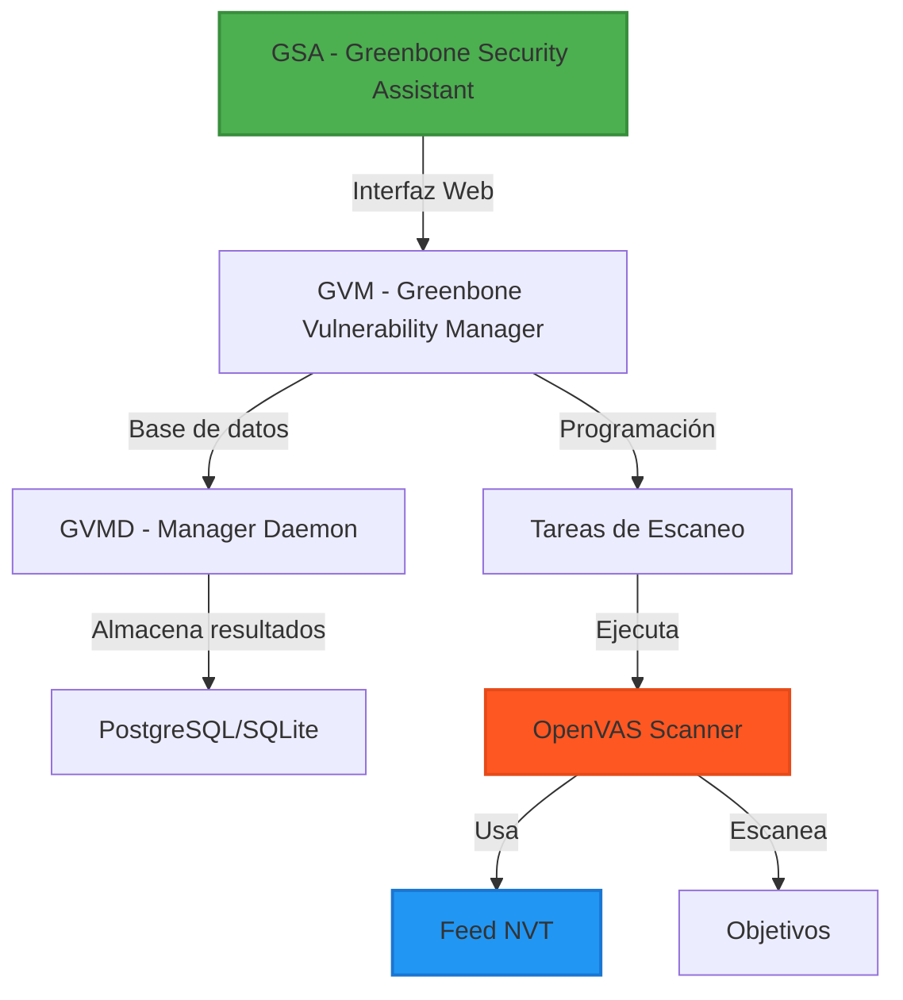
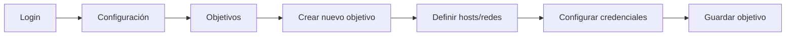
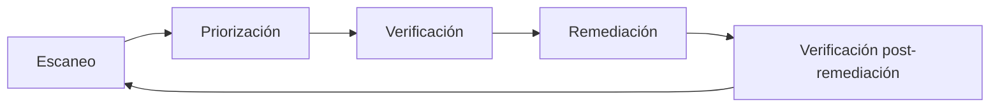

# 🛡️ OpenVAS: Open Vulnerability Assessment System

> [!info] Definición
> **OpenVAS** (Open Vulnerability Assessment System) es una suite completa de herramientas de escaneo de vulnerabilidades de código abierto. Forma parte del framework **Greenbone Vulnerability Management (GVM)** y permite detectar, evaluar y gestionar vulnerabilidades en sistemas, redes y aplicaciones.

## 📋 Características principales

- **Escáner de vulnerabilidades** completo y de código abierto
- Más de **50,000 tests de vulnerabilidad** (NVTs) actualizados regularmente
- **Interfaz web** intuitiva para gestión de escaneos
- Generación de **informes detallados** en múltiples formatos
- **Verificación activa** de vulnerabilidades (no solo basado en versiones)
- Compatible con **autenticación** para escaneos internos profundos

---

## 🏗️ Arquitectura de OpenVAS/GVM


```mermaid
graph TD
    A[GSA - Greenbone Security Assistant] -->|Interfaz Web| B[GVM - Greenbone Vulnerability Manager]
    B -->|Base de datos| C[GVMD - Manager Daemon]
    B -->|Programación| D[Tareas de Escaneo]
    C -->|Almacena resultados| E[PostgreSQL/SQLite]
    D -->|Ejecuta| F[OpenVAS Scanner]
    F -->|Usa| G[Feed NVT]
    F -->|Escanea| H[Objetivos]
    
    style A fill:#4CAF50,stroke:#388E3C,stroke-width:2px
    style F fill:#FF5722,stroke:#E64A19,stroke-width:2px
    style G fill:#2196F3,stroke:#1976D2,stroke-width:2px
```

> [!note] Evolución
> OpenVAS comenzó como un fork de Nessus cuando este dejó de ser open source. Actualmente forma parte del ecosistema Greenbone, donde se le conoce como **Greenbone Vulnerability Manager (GVM)**.

---

## 🔧 Instalación y configuración

### Instalación en Kali Linux

OpenVAS (ahora GVM) viene preinstalado en Kali Linux, pero puede requerir configuración:

```bash
# Actualizar repositorios
sudo apt update

# Instalar GVM si no está presente
sudo apt install gvm

# Configurar GVM
sudo gvm-setup

# Iniciar los servicios
sudo gvm-start
```

> [!warning] Tiempo de instalación
> La instalación inicial puede tardar entre 10-30 minutos dependiendo de la velocidad de internet, ya que descarga y compila una gran cantidad de NVTs (Network Vulnerability Tests).

### Instalación mediante Docker (recomendado para entornos de producción)

```bash
# Descargar la imagen docker oficial de Greenbone
docker pull greenbone/gvm

# Ejecutar el contenedor
docker run -d -p 443:443 --name openvas greenbone/gvm

# Crear volumen para persistencia de datos (opcional)
docker volume create openvas-data
docker run -d -p 443:443 -v openvas-data:/data --name openvas greenbone/gvm
```

### Acceso a la interfaz web

Una vez instalado:

1. Abra un navegador y vaya a `https://localhost` o `https://127.0.0.1`
2. Acepte la advertencia de certificado (es autofirmado)
3. Credenciales por defecto:
   - Usuario: `admin`
   - Contraseña: `admin` (en Kali) o la generada durante la instalación

> [!danger] Seguridad
> Cambie inmediatamente la contraseña por defecto si va a utilizar OpenVAS en un entorno de producción.

---

## 📊 Uso básico de OpenVAS

### 1. Creación de objetivos de escaneo


```mermaid
flowchart LR
    A[Login] --> B[Configuración]
    B --> C[Objetivos]
    C --> D[Crear nuevo objetivo]
    D --> E[Definir hosts/redes]
    E --> F[Configurar credenciales]
    F --> G[Guardar objetivo]
```

Pasos detallados:

1. Vaya a **Configuración > Objetivos**
2. Haga clic en el ícono de estrella (🟊) para crear un nuevo objetivo
3. Complete el formulario:
   - **Nombre**: Identificador descriptivo del objetivo
   - **Hosts**: IPs o rangos (ej. `192.168.1.1-20`, `10.0.0.0/24`)
   - **Puerto** (opcional): Puertos específicos a escanear
   - **Credenciales** (opcional): Para escaneos autenticados

### 2. Configuración de un escaneo

1. Vaya a **Escaneos > Tareas**
2. Haga clic en el ícono de estrella (🟊) para crear una nueva tarea
3. Complete el formulario:
   - **Nombre**: Nombre descriptivo del escaneo
   - **Escáner**: OpenVAS Default
   - **Objetivo**: Seleccione el objetivo creado anteriormente
   - **Configuración de escaneo**: Elija entre:
     - **Full and Fast**: Balance entre velocidad y profundidad
     - **Full and Deep**: Más exhaustivo pero lento
     - **Full and Very Deep**: Completo y muy lento
     - **Host Discovery**: Solo descubrimiento de hosts activos

### 3. Ejecución y monitoreo de escaneos

1. En la lista de tareas, haga clic en el botón ▶️ (Play)
2. Monitoree el progreso en la misma pantalla
3. Espere a que el escaneo finalice

> [!tip] Ejecución periódica
> Para escaneos recurrentes, configure la opción "Programación" al crear la tarea (diario, semanal o mensual).

### 4. Análisis de resultados

1. Una vez finalizado, haga clic en la tarea para ver resultados
2. Explore las vulnerabilidades clasificadas por severidad:
   - **Alto (rojo)**: Vulnerabilidades críticas
   - **Medio (naranja)**: Vulnerabilidades importantes
   - **Bajo (amarillo)**: Vulnerabilidades menores
   - **Registro (azul)**: Información sin riesgo directo

### 5. Generación de informes

1. Seleccione la tarea completada
2. Haga clic en el botón "Informes"
3. Elija el informe deseado
4. Seleccione el formato (PDF, HTML, CSV, XML)
5. Configure opciones adicionales (filtros, contenido)
6. Genere y descargue el informe

---

## 🎯 Casos de uso prácticos

### Ejemplo 1: Escaneo básico de un segmento de red

Escenario: Evaluación rápida de vulnerabilidades en la red corporativa interna.

```bash
# Desde la línea de comandos (CLI)
sudo gvm-cli --gmp-username admin --gmp-password admin \
  socket --xml "<create_task><name>Red-Interna</name><target id='33333333-4444-5555-6666-777777777777'/><config id='daba56c8-73ec-11df-a475-002264764cea'/></create_task>"
```

En la interfaz web:

1. **Crear objetivo**:
   - Nombre: `Red-Interna-192.168`
   - Hosts: `192.168.10.0/24`
   - Puerto: `T:1-65535`
   - Credenciales: Ninguna (escaneo no autenticado)

2. **Crear tarea**:
   - Nombre: `Escaneo-Trimestral-Q1`
   - Objetivo: `Red-Interna-192.168`
   - Configuración: `Full and Fast`
   - Programación: `No repetir`

3. **Ejecutar y analizar**:
   - Iniciar tarea
   - Revisar resultados cuando finalice
   - Generar informe ejecutivo PDF

### Ejemplo 2: Escaneo autenticado de servidores críticos

Escenario: Evaluación profunda de servidores críticos con credenciales administrativas.

1. **Crear credenciales**:
   - Vaya a **Configuración > Credenciales**
   - Añada nuevas credenciales:
     - Nombre: `Windows-Admin`
     - Tipo: `SMB/CIFS`
     - Usuario: `administrador`
     - Contraseña: `contraseña_segura`

2. **Crear objetivo con autenticación**:
   - Nombre: `Servidores-Windows`
   - Hosts: `192.168.1.10, 192.168.1.11, 192.168.1.12`
   - Credenciales: Seleccione `Windows-Admin`

3. **Crear tarea de escaneo profundo**:
   - Nombre: `Auditoria-Mensual-Servidores`
   - Objetivo: `Servidores-Windows`
   - Configuración: `Full and Deep`

4. **Analizar resultados**:
   - Tras finalizar, filtre por severidad alta y media
   - Exporte un informe detallado en formato HTML y PDF

```bash
# Exportar resultados del escaneo desde CLI
gvm-cli --gmp-username admin --gmp-password admin socket \
  --xml "<get_reports report_id='a1b2c3d4-e5f6-g7h8-i9j0' format_id='c402cc3e-b531-11e1-9163-406186ea4fc5'/>"
```

### Ejemplo 3: Escaneo diferencial para verificar remediaciones

Escenario: Verificar si las vulnerabilidades detectadas previamente han sido corregidas.

1. **Crear objetivo**:
   - Igual que el objetivo original

2. **Crear tarea de escaneo**:
   - Nombre: `Verificacion-Remediaciones-Mayo`
   - Objetivo: El mismo que el escaneo anterior
   - Configuración: La misma que el escaneo anterior

3. **Configurar comparación**:
   - En la sección avanzada de la tarea, habilitar comparación
   - Seleccionar el informe anterior como referencia

4. **Analizar diferencias**:
   - Revisar las vulnerabilidades que permanecen
   - Verificar las que han sido corregidas
   - Generar informe diferencial

---

## 🛠️ Configuraciones avanzadas

### Escaneo autenticado

> [!tip] Ventaja
> Los escaneos autenticados proporcionan resultados mucho más precisos y detallados, ya que pueden evaluar la configuración interna y el estado real de parches.

**Tipos de credenciales soportadas:**
- SSH para sistemas Linux/Unix
- SMB/CIFS para sistemas Windows
- SNMP para dispositivos de red
- ESXi para entornos VMware
- Credenciales de aplicación (MySQL, PostgreSQL, etc.)

**Configuración de SSH:**

1. Generar un par de claves (si usa clave privada):
   ```bash
   ssh-keygen -t rsa -b 4096 -f openvas_key
   ```

2. En la interfaz web:
   - Vaya a **Configuración > Credenciales**
   - Cree credenciales SSH
   - Suba la clave privada o configure usuario/contraseña
   - Asigne las credenciales al crear/editar un objetivo

### Personalización de escaneos

**Crear configuración personalizada:**

1. Vaya a **Configuración > Configs**
2. Duplique una configuración existente
3. Modifique según necesidades:
   - Habilite/deshabilite familias de NVTs
   - Ajuste tiempos de espera
   - Configure opciones de escaneo específicas

**Filtrado de puertos:**
- Especifique puertos al crear el objetivo
- Formatos: `T:22,80,443` (TCP) o `U:53,161` (UDP)
- Rangos: `T:1-1024` (primeros 1024 puertos TCP)

### Integración con otras herramientas

**Exportación a formato compatible con Jira/Trello:**
1. Genere informe en formato CSV
2. Use scripts de conversión para formato de importación

**API para automatización:**
```python
import gvm
from gvm.protocols.latest import Gmp
from gvm.transforms import EtreeTransform
from gvm.connections import UnixSocketConnection

# Conexión a OpenVAS
connection = UnixSocketConnection()
transform = EtreeTransform()
with Gmp(connection, transform=transform) as gmp:
    # Login
    gmp.authenticate('admin', 'admin')
    
    # Crear tarea de escaneo
    response = gmp.create_target(
        name="API-Target", 
        hosts=["192.168.1.100"],
        port_list_id="33d0cd82-57c6-11e1-8ed1-406186ea4fc5"
    )
    target_id = response.get('id')
    
    # Crear y lanzar tarea
    response = gmp.create_task(
        name="API-Task",
        config_id="daba56c8-73ec-11df-a475-002264764cea",
        target_id=target_id,
        scanner_id="08b69003-5fc2-4037-a479-93b440211c73"
    )
    task_id = response.get('id')
    
    # Iniciar tarea
    gmp.start_task(task_id)
```

---

## 🚨 Solución de problemas comunes

### Problemas de instalación

> [!warning] Feed Sync Error
> Si aparecen errores relacionados con la sincronización de feeds:

```bash
# Reiniciar sincronización manualmente
sudo greenbone-nvt-sync
sudo greenbone-feed-sync --type CERT
sudo greenbone-feed-sync --type SCAP
sudo greenbone-feed-sync --type GVMD_DATA
```

### Escaneos lentos o que fallan

**Problema**: Escaneos que tardan demasiado o fallan sin terminar.

**Soluciones**:
1. Reducir el alcance (menos hosts o puertos)
2. Verificar conectividad de red
3. Ajustar tiempos de espera:
   ```bash
   # Aumentar timeout por host
   sudo gvmd --modify-setting 76374a7a-0569-11e6-b6da-28d24461215b --value 3600
   ```

### Falsos positivos

**Problema**: Resultados incorrectos o no aplicables.

**Soluciones**:
1. Utilizar escaneos autenticados
2. Verificar manualmente las vulnerabilidades críticas
3. Crear excepciones:
   - Seleccione el resultado incorrecto
   - Use la opción "Crear excepción"
   - Documente el motivo de la excepción

### Problemas de rendimiento

**Problema**: Sistema lento durante escaneos intensivos.

**Soluciones**:
1. Aumentar recursos del sistema:
   ```bash
   # Ajustar máximo de hosts escaneados simultáneamente
   sudo gvmd --modify-setting 0ccb9f66-c669-452a-bb38-04c0226fae6a --value 10
   ```
2. Programar escaneos en horarios de baja actividad
3. Dividir objetivos grandes en múltiples tareas más pequeñas

---

## 💡 Mejores prácticas

### Optimización de escaneos

> [!tip] Para escaneos más eficientes
> 
> 1. **Segmente los objetivos** por criticidad y tipo
> 2. Use **escaneos progresivos**:
>    - Primero "Host Discovery"
>    - Luego "Fast Scan" en hosts activos
>    - Finalmente "Deep Scan" en sistemas críticos
> 3. **Reutilice resultados** previos para escaneos incrementales

### Gestión de vulnerabilidades

**Ciclo de vida recomendado**:


```mermaid
graph LR
    A[Escaneo] --> B[Priorización]
    B --> C[Verificación]
    C --> D[Remediación]
    D --> E[Verificación post-remediación]
    E --> A
```

1. **Priorizar** por impacto y criticidad del activo
2. **Establecer SLAs** según severidad:
   - Crítica: 7 días
   - Alta: 14 días
   - Media: 30 días
   - Baja: 90 días
3. **Monitorizar** progreso de remediación
4. **Escanear** nuevamente para verificar correcciones

### Seguridad del propio OpenVAS

1. **Cambie contraseñas por defecto**
2. **Limite el acceso** a la interfaz web
3. **Use HTTPS** con certificado válido
4. **Actualice regularmente** el sistema y feeds
5. **Separe** el escáner de la red corporativa

```bash
# Cambiar contraseña desde CLI
sudo gvmd --user=admin --new-password=NuevaContraseñaSegura
```

### Planificación de escaneos

1. **Documente y comunique** ventanas de escaneo
2. **Notifique** a los equipos de operaciones/seguridad
3. **Limite el impacto** en producción (horarios adecuados)
4. **Planifique escaneos recurrentes**:
   - Activos críticos: Mensual
   - Activos estándar: Trimestral
   - Sistemas de desarrollo: Según ciclo de desarrollo

---

## 📘 Recursos adicionales

- [Documentación oficial de Greenbone](https://docs.greenbone.net/)
- [Comunidad OpenVAS en GitHub](https://github.com/greenbone)
- [Lista de NVTs actualizados](https://www.greenbone.net/en/feed-status/)
- [Guía de API GVM](https://greenbone.github.io/python-gvm/)

> [!note] Relacionado con
> [[Nessus]], [[Vulnerability Management]], [[OWASP Top 10]], [[Security Assessment]]